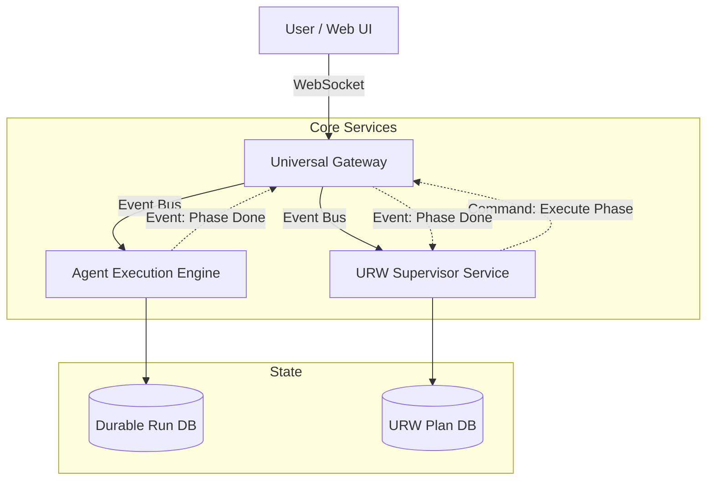

# 012: URW Harness & Durability in a Gateway Architecture

**Date:** 2026-01-23
**Status:** Analysis Complete
**Author:** Antigravity

## 1. Executive Summary

This document analyzes the "Massive Request" orchestration layer (URW) and the "Crash Recovery" layer (Durability) of the Universal Agent. It synthesizes how these critical systems would integrate into the proposed **Clawdbot Gateway Architecture**.

**Key Conclusion:** The **URW Harness** acts as a "Meta-Client" or "Supervisor" that sits *above* the Gateway. It should not be merged into the core agent logic. Instead, it should consume the Gateway's API to execute phases, ensuring that long-running tasks are decoupled from the transient nature of individual "Turns" or "Sessions". The **Durability Layer** must be split: "Run State" belongs to the Gateway (for retries/leases), while "Plan State" belongs to URW (for task dependencies).

---

## 2. Component Analysis

### 2.1 The Two State Systems
Our investigation revealed two distinct state management systems that must remain separate but synchronized.

| Feature | **URW State** (`urw/state.py`) | **Execution State** (`durable/state.py`) |
| :--- | :--- | :--- |
| **Scope** | **Project / Mission** | **Atomic Run / Turn** |
| **Entities** | Tasks, Phases, Artifacts, Dependencies | Runs, Steps, Tokens, Leases |
| **Persistence** | SQLite (`urw/state.db`) + File System | SQLite (`durable/runs.db`) |
| **Goal** | "Did we finish Phase 1?" | "Did the LLM output a valid tool call?" |
| **Failure Mode** | "Approaches failed, need re-planning" | "Process crashed, need retry" |

### 2.2 The URW Harness (`src/universal_agent/urw/`)
The URW Harness is an **Orchestrator**. It doesn't just "chat"; it:
1.  **Interviews** the user to create a `Plan`.
2.  **Decomposes** constraints into `Phases`.
3.  **Manages Context** by toggling workspaces (`HarnessSessionManager`) and injecting context (`harness_helpers.py`).
4.  **Verifies** results using a specialized `CompositeEvaluator`.

It currently invokes `AgentLoopInterface` (the execution engine) directly.

---

## 3. Integration Strategy: The "Supervisor" Pattern

In the proposed Gateway Architecture, we should NOT embed URW inside the core `Agent` logic. Doing so would make the Agent too complex and stateful.

Instead, we treat **URW as a Client application** (just like the Web UI or Terminal), but one that is automated.

### 3.1 The Flow
1.  **User -> Gateway**: "Analyze the last 5 years of detailed financial reports for Apple."
2.  **Gateway -> Router**: Detects "Massive Request".
3.  **Router -> URW Service**: Hands off control to the URW Supervisor.
4.  **URW Supervisor**:
    *   Starts a Planning Session (via Gateway).
    *   Generates a Plan (Phase 1: Gather, Phase 2: Analyze, Phase 3: Report).
    *   **Phase 1 Execution**:
        *   URW sends a command to Gateway: "Execute Phase 1 in `workspace/phase_1`".
        *   Gateway spawns an Agent.
        *   Agent runs, emits events (Thinking, Tool Calls).
        *   URW *subscribes* to these events to monitor progress.
    *   **Phase 1 Completion**:
        *   URW verifies artifacts.
        *   If success, URW proceeds to Phase 2.

### 3.2 Architectural Diagram (Conceptual)

---

## 4. Durability & Crash Recovery

The "Durability" requirement applies to both layers, but differently.

### 4.1 Low-Level ("Lease") Durability (`durable/`)
*   **Responsibility:** Ensure that if an Agent Worker crashes mid-step (e.g., OOM), the job is picked up by another worker.
*   **Mechanism:** The `acquire_run_lease` / `heartbeat_run_lease` logic in `durable/state.py` is perfect for the **Gateway's Worker Pool**.
*   **Integration:** The Gateway will use this library to manage its worker slots.

### 4.2 High-Level ("Checkpoint") Durability (`urw/`)
*   **Responsibility:** Ensure that if the entire System restarts, we validly resume from "Phase 3" without re-doing "Phase 1".
*   **Mechanism:** `URWStateManager` correctly persists the `Plan` and `TaskStatus`.
*   **Integration:** The URW Service will load this state on startup. It acts as the "Project Manager" that remembers where the team left off.

---

## 5. Migration Roadmap Impact

The existence of URW confirms the need for a **Gateway** that supports **headless clients**. Refactoring `main.py` should proceed as follows:

1.  **Step 1:** Extract `UniversalAgent` into a library that can be called *without* a UI loop. (Already mostly done in `agent_core.py`).
2.  **Step 2:** Build the `Gateway` that exposes an API (e.g., `POST /agent/run`).
3.  **Step 3:** Refactor `URW` to call the `Gateway` API instead of importing `process_turn` directly.
    *   *Current:* `adapter.py` imports `process_turn`.
    *   *Future:* `adapter.py` calls `gateway_client.submit_task()`.

This separation ensures that `URW` can scale independently (e.g., running multiple massive projects in parallel) while the Gateway manages the compute resources.
