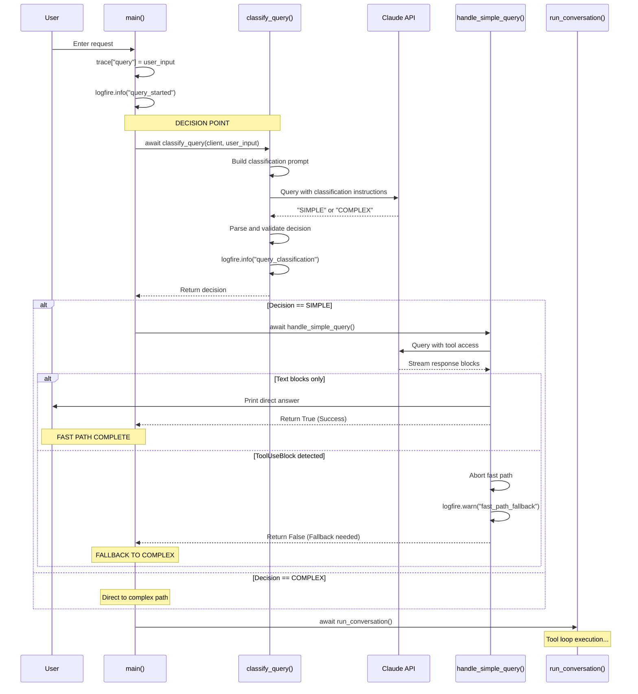

# Query Classification Flow Architecture

**Document Version**: 1.0
**Last Updated**: 2025-12-22
**Component**: Universal Agent Query Router
**Primary Files**: `src/universal_agent/main.py`

---

## Table of Contents

1. [Overview](#overview)
2. [Classification Philosophy](#classification-philosophy)
3. [Core Components](#core-components)
4. [Sequence Diagrams](#sequence-diagrams)
5. [Flow Analysis](#flow-analysis)
6. [Error Handling & Fallbacks](#error-handling--fallbacks)
7. [Performance Considerations](#performance-considerations)

---

## Overview

The Universal Agent implements a **dual-path execution model** that routes user queries through either a **FAST PATH** (for simple, knowledge-based questions) or a **COMPLEX PATH** (for tool-enabled workflows). This architecture optimizes for both latency and capability.

### Key Benefits

- **Reduced Latency**: Simple queries bypass tool orchestration overhead
- **Cost Optimization**: One LLM call instead of multi-turn conversation for basic questions
- **Graceful Degradation**: Automatic fallback if classification is incorrect
- **Transparent Execution**: Clear logging indicates which path was taken

---

## Classification Philosophy

### SIMPLE Queries (Fast Path)

**Definition**: Queries answerable from foundational knowledge WITHOUT:
- External tools (search, APIs, code execution)
- Real-time data
- Context from previous conversation turns
- Multi-step workflows

**Examples**:
- "What is the capital of France?"
- "Explain quantum entanglement"
- "Write a haiku about coding"

**Characteristics**:
- One-shot response
- No tool use
- Knowledge retrieval only

### COMPLEX Queries (Tool Loop Path)

**Definition**: Queries requiring:
- External tools (web search, email, file operations)
- Code execution or computation
- Real-time data (weather, stock prices)
- Continuation of previous workflows ("yes", "proceed", "continue")
- Multi-step reasoning with external actions

**Examples**:
- "Search for recent AI news and summarize"
- "Send an email to john@example.com"
- "Execute this Python script and show results"
- "What's the weather in Tokyo right now?"

**Characteristics**:
- Multi-turn conversation loop
- Tool use orchestration
- Stateful execution

---

## Core Components

### 1. classify_query() Function

**Location**: `main.py:917-956`

**Purpose**: Determines query complexity using an LLM-based classifier.

**Algorithm**:

```python
async def classify_query(client: ClaudeSDKClient, query: str) -> str:
    # 1. Construct classification prompt with clear definitions
    # 2. Query LLM (restricting tool use via prompt instructions)
    # 3. Parse response for "SIMPLE" or "COMPLEX"
    # 4. Apply safe fallback: default to COMPLEX if ambiguous
    # 5. Log classification result to Logfire
```

**Key Design Decisions**:

1. **Definition-Based Prompting**: Provides explicit criteria for each classification
2. **Safe Fallback**: Defaults to COMPLEX (safer to have tools available than not)
3. **Prompt-Based Tool Restriction**: Relies on prompt instructions rather than separate client
4. **Logging**: Full traceability of classification decisions

**Classification Prompt Structure**:

```
Classify the following user query as either 'SIMPLE' or 'COMPLEX'.
Query: {user_query}

Definitions:
- SIMPLE: Can be answered directly by foundational knowledge (e.g., 'Capital of France',
  'Explain concept') WITHOUT any context from previous turns.
- COMPLEX: Requires external tools, searching the web, executing code, checking real-time
  data, sending emails, OR confirming/continuing a previous multi-step workflow
  (e.g., 'yes', 'proceed', 'continue').

Respond with ONLY 'SIMPLE' or 'COMPLEX'.
```

### 2. handle_simple_query() Function

**Location**: `main.py:959-998`

**Purpose**: Executes queries on the fast path with tool-use detection.

**Algorithm**:

```python
async def handle_simple_query(client: ClaudeSDKClient, query: str) -> bool:
    # 1. Query the LLM
    # 2. Stream response blocks
    # 3. Detect if model attempts tool use
    #    - If ToolUseBlock detected: ABORT and return False
    #    - If TextBlock only: Complete and return True
    # 4. Log outcome (success or fallback)
```

**Return Values**:
- `True`: Query handled successfully on fast path
- `False`: Model attempted tool use → fallback to complex path required

**Fallback Detection**:

The function monitors response blocks for `ToolUseBlock` instances. If detected:

```python
if isinstance(block, ToolUseBlock):
    tool_use_detected = True
    break  # Abort fast path

if tool_use_detected:
    print("⚠️  Model attempted tool use in Fast Path. Redirecting to Complex Path...")
    logfire.warn("fast_path_fallback", reason="tool_use_detected")
    return False
```

### 3. run_conversation() Function

**Location**: `main.py:691-914`

**Purpose**: Manages a single iteration of the complex path tool loop.

**Responsibilities**:

1. **Query Execution**: Send query to LLM with full tool access
2. **Message Streaming**: Async iteration over response stream
3. **Tool Call Tracking**: Record all tool invocations with metadata
4. **Tool Result Handling**: Process and log tool results
5. **Authentication Detection**: Identify Composio auth links
6. **Observer Pattern**: Fire-and-forget saves for search results, workbench activity, corpus enrichment
7. **Compliance Verification**: Post-subagent result validation

**Trace Data Collected**:

```python
tool_record = {
    "iteration": iteration,
    "name": block.name,
    "id": block.id,
    "time_offset_seconds": round(time.time() - start_ts, 3),
    "input_size_bytes": len(json.dumps(block.input)),
    "input_preview": input_json[:2000],  # First 2KB for debugging
}
```

### 4. main() Event Loop

**Location**: `main.py:1001-1348`

**Purpose**: Orchestrates the complete query lifecycle.

**Main Loop Structure**:

```python
async with ClaudeSDKClient(options) as client:
    while True:
        # 1. Get user input
        user_input = await prompt_session.prompt_async("Enter request: ")

        # 2. Classify query
        complexity = await classify_query(client, user_input)

        # 3. Route to appropriate path
        if complexity == "SIMPLE":
            success = await handle_simple_query(client, user_input)
            if not success:
                complexity = "COMPLEX"  # Fallback

        # 4. Execute on complex path if needed
        if complexity == "COMPLEX":
            iteration = 1
            while True:
                needs_input, auth_link = await run_conversation(
                    client, current_query, start_ts, iteration
                )
                if not needs_input:
                    break
                # Handle authentication...
                iteration += 1
```

---

## Sequence Diagrams

### 1. Overall Query Classification Flow



**Discussion**:

This diagram shows the complete decision tree from user input through classification to execution. Key points:

1. **Single Classification Point**: The query is classified once at the start
2. **Safe Fallback**: If fast path fails, system seamlessly transitions to complex path
3. **Transparent Logging**: Each decision point logs to Logfire for observability
4. **No User Interruption**: Fallback is automatic and invisible to the user

---

### 2. SIMPLE Query Fast Path Execution

```mermaid
sequenceDiagram
    participant User
    participant Main as main()
    participant SimplePath as handle_simple_query()
    participant LLM as Claude API
    participant Logfire

    User->>Main: "What is the capital of France?"
    Main->>Main: complexity = await classify_query()
    Note over Main: Returns "SIMPLE"

    Main->>SimplePath: await handle_simple_query(client, query)
    SimplePath->>SimplePath: Print "⚡ Direct Answer (Fast Path)"
    SimplePath->>LLM: await client.query(query)

    activate LLM
    LLM-->>SimplePath: AssistantMessage
    SimplePath->>SimplePath: Iterate content blocks

    loop For each response block
        alt Block is TextBlock
            SimplePath->>User: Print text (stream)
            SimplePath->>SimplePath: Accumulate full_response
        else Block is ToolUseBlock
            SimplePath->>SimplePath: Set tool_use_detected = True
            SimplePath->>SimplePath: Break loop
        end
    end
    deactivate LLM

    alt tool_use_detected == False
        SimplePath->>SimplePath: Print completion separator
        SimplePath->>Logfire: info("direct_answer", length=1234)
        SimplePath-->>Main: Return True
        Note over Main,User: ✅ Fast path successful
    else tool_use_detected == True
        SimplePath->>User: Print "⚠️ Model attempted tool use..."
        SimplePath->>Logfire: warn("fast_path_fallback")
        SimplePath-->>Main: Return False
        Note over Main: Will transition to complex path
    end
```



**Discussion**:

The fast path is optimized for minimal latency:

1. **Single LLM Call**: One query-response cycle
2. **Stream Direct Output**: Text blocks printed immediately as they arrive
3. **Early Abort**: Tool use detection breaks the loop immediately
4. **No Tool Execution**: ToolUseBlocks trigger fallback without execution

**Performance Characteristics**:
- **Typical Latency**: 500-2000ms (one LLM call)
- **Network**: 1 round-trip to Claude API
- **Compute**: Single inference operation
- **Cost**: 1 input token + 1 output token operation

---

### 3. COMPLEX Query Tool Loop Execution

```mermaid
sequenceDiagram
    participant User
    participant Main as main()
    participant Conv as run_conversation()
    participant LLM as Claude API
    participant Tools as MCP Tools
    participant Logfire
    participant Observers as Async Observers

    User->>Main: "Search for recent AI news"
    Main->>Main: complexity = await classify_query()
    Note over Main: Returns "COMPLEX"

    Main->>Main: iteration = 1
    Main->>Main: current_query = user_input

    loop Tool Loop Iteration
        Main->>Conv: await run_conversation(iteration)
        Conv->>Conv: Create Logfire span
        Conv->>Conv: Print iteration header

        Conv->>LLM: await client.query(current_query)

        activate LLM
        LLM-->>Conv: AssistantMessage stream

        loop Process AssistantMessage
            Conv->>Conv: Iterate content blocks

            alt Block is ToolUseBlock
                Conv->>Conv: Create tool_record
                Conv->>Logfire: info("tool_call", metadata)
                Conv->>Conv: Print tool call info

                alt Code execution tool
                    Conv->>Conv: Print "🏭 CODE EXECUTION"
                else Standard tool
                    Conv->>Conv: Print "🔧"
                end

                Conv->>Tools: Execute tool(block.name, block.input)

                activate Tools
                Tools-->>Conv: ToolResultBlock
                deactivate Tools

                Conv->>Conv: Create result_record
                Conv->>Logfire: info("tool_result", metadata)
                Conv->>Conv: Print result preview

                alt SERP or workbench tool
                    Conv->>Observers: asyncio.create_task(observe_and_save)
                    Note over Observers: Fire-and-forget background save
                end

            else Block is TextBlock
                Conv->>User: Print text (reasoning)
                Conv->>Logfire: info("reasoning", preview)

                alt Contains Composio auth link
                    Conv->>Conv: Extract auth_link
                    Conv->>Conv: Set needs_user_input = True
                end
            end
        end
        deactivate LLM

        Conv->>Conv: Create iter_record
        Conv->>Conv: trace["iterations"].append(iter_record)
        Conv-->>Main: Return (needs_user_input, auth_link)

        alt needs_user_input == True
            Main->>User: Display auth link
            User->>Main: Press Enter after auth
            Main->>Main: current_query = "I have completed authentication..."
            Main->>Main: iteration += 1
            Note over Main: Continue tool loop
        else needs_input == False
            Main->>Main: Break tool loop
            Note over Main: Tool loop complete
        end
    end

    Main->>Main: Generate execution summary
    Main->>User: Display trace statistics
```



**Discussion**:

The complex path is a full-featured tool orchestration loop:

1. **Multi-Turn Conversation**: Continues until no more tool use or user input needed
2. **Tool Use Detection**: Identifies and executes tool calls
3. **Result Processing**: Captures and logs tool results
4. **Authentication Handling**: Detects Composio auth links and prompts user
5. **Observer Pattern**: Asynchronously saves artifacts to workspace
6. **Sub-Agents**: Supports Task tool for sub-agent delegation

**Key Features**:

- **Tool Metadata Tracking**: Records tool name, ID, input size, timestamp
- **Code Execution Detection**: Special logging for workbench/code tools
- **Content Size Awareness**: Different preview sizes for code vs standard tools
- **Parent-Child Tracking**: Monitors sub-agent context via `parent_tool_use_id`

**Performance Characteristics**:
- **Latency**: Variable (depends on number of tool calls)
- **Network**: N+1 round-trips (N = number of tool iterations)
- **Compute**: N inference operations
- **Cost**: Accumulates token costs across all iterations

---

### 4. Fallback from SIMPLE to COMPLEX Path

```mermaid
sequenceDiagram
    participant User
    participant Main as main()
    participant Classifier as classify_query()
    participant SimplePath as handle_simple_query()
    participant LLM as Claude API
    participant ComplexPath as run_conversation()
    participant Logfire

    User->>Main: "What's the current weather in Tokyo?"
    Main->>Classifier: await classify_query(query)

    Note over Classifier,LLM: CLASSIFICATION MARGIN CASE
    Classifier->>LLM: Classify: "What's the current weather in Tokyo?"
    Note over LLM: Model thinks: This needs real-time data<br/>but might be considered SIMPLE if<br/>model doesn't recognize need for tools
    LLM-->>Classifier: "SIMPLE" (Potential misclassification)
    Classifier-->>Main: Return "SIMPLE"

    Main->>SimplePath: await handle_simple_query(query)
    SimplePath->>SimplePath: Print "⚡ Direct Answer (Fast Path)"
    SimplePath->>LLM: Query with tool access

    activate LLM
    Note over LLM: Model realizes it needs<br/>weather data and attempts<br/>tool use despite classification
    LLM-->>SimplePath: AssistantMessage with ToolUseBlock
    deactivate LLM

    SimplePath->>SimplePath: Loop blocks
    SimplePath->>SimplePath: Detect ToolUseBlock (weather tool)
    SimplePath->>SimplePath: tool_use_detected = True
    SimplePath->>SimplePath: Break loop immediately

    Note over SimplePath: FALLBACK TRIGGERED
    SimplePath->>User: Print "⚠️ Model attempted tool use..."
    SimplePath->>User: Print "Redirecting to Complex Path..."
    SimplePath->>Logfire: warn("fast_path_fallback", reason="tool_use_detected")
    SimplePath-->>Main: Return False

    Note over Main: PATH TRANSITION
    Main->>Main: is_simple = False (Override classification)
    Main->>ComplexPath: await run_conversation(query)

    ComplexPath->>LLM: Re-query (same query, new context)
    activate LLM
    LLM-->>ComplexPath: AssistantMessage with ToolUseBlock
    deactivate LLM

    ComplexPath->>LLM: Execute weather tool
    LLM-->>ComplexPath: ToolResultBlock with weather data
    ComplexPath->>User: Display weather report
    ComplexPath-->>Main: Return (False, None)

    Note over Main,User: ✅ Successful fallback,<br/>user gets correct answer
```



**Discussion**:

This fallback mechanism is a critical safety feature:

**Why Fallback is Necessary**:

1. **Classification Imperfection**: LLM-based classification can misclassify edge cases
2. **Context Dependence**: Some queries need tool use that isn't obvious from text alone
3. **Model Knowledge Changes**: Model's understanding of its own tool access can vary

**Common Fallback Scenarios**:

- **Real-time data queries**: "Current weather", "latest stock price"
- **Ambiguous requests**: "Show me the data" (model assumes external data needed)
- **Context-dependent**: "Continue where we left off" (requires conversation context)
- **Tool discovery**: Model searches for information it doesn't have

**Fallback Behavior**:

1. **Immediate Abort**: Fast path breaks on first ToolUseBlock
2. **Clean Transition**: No partial execution or state corruption
3. **Transparent**: User sees clear message about path change
4. **Re-execution**: Query is re-issued on complex path with full tool access
5. **Logging**: Logfire warning for monitoring fallback frequency

**Monitoring Recommendations**:

Track fallback rate to optimize classification:
```
fallback_rate = fast_path_fallbacks / total_simple_classifications
target: fallback_rate < 10%
```

If fallback rate is too high, consider:
- Adjusting classification prompt definitions
- Adding more examples to classification prompt
- Using a separate classifier model without tool access

---

## Flow Analysis

### Decision Matrix

| Query Type | Classified As | Actual Path | Outcome |
|------------|---------------|-------------|---------|
| Pure knowledge | SIMPLE | Fast Path | Optimal (1 LLM call) |
| Pure knowledge | COMPLEX | Tool Loop | Safe but slower (unnecessary tool loop) |
| Tool needed | COMPLEX | Tool Loop | Optimal |
| Tool needed | SIMPLE | Fast Path + Fallback | Safe (1 extra classification call) |

### Performance Comparison

| Metric | Fast Path | Complex Path |
|--------|-----------|--------------|
| **LLM Calls** | 1 | 1-N (N = tool iterations) |
| **Network RTT** | 1 | N+1 |
| **Latency** | ~1s | Variable (2s+) |
| **Tool Overhead** | None | Full orchestration |
| **Fallback Cost** | +1 classification call | N/A |

### Code Flow Paths

```mermaid
flowchart TD
    Start([User Input]) --> Classify[classify_query]
    Classify --> Decision{Classification}

    Decision -->|SIMPLE| FastPath[handle_simple_query]
    Decision -->|COMPLEX| ToolLoop[run_conversation]

    FastPath --> FastDecision{Tool Use?}
    FastDecision -->|No Text blocks only| Success[✅ Complete]
    FastDecision -->|Yes ToolUseBlock| Fallback[⚠️ Fallback]

    Fallback --> ToolLoop

    ToolLoop --> ToolDecision{More tools<br/>or auth needed?}
    ToolDecision -->|Yes| ToolLoop
    ToolDecision -->|No| Complete[✅ Complete]

    Success --> End([Session continues])
    Complete --> End

    style FastPath fill:#90EE90
    style Fallback fill:#FFB6C1
    style ToolLoop fill:#87CEEB
    style Success fill:#32CD32
    style Complete fill:#32CD32
```



---

## Error Handling & Fallbacks

### 1. Classification Errors

**Scenario**: Classification returns ambiguous or invalid response

**Handling**:
```python
decision = result_text.strip().upper()
final_decision = "SIMPLE" if "SIMPLE" in decision else "COMPLEX"
```

**Fallback Strategy**: Default to COMPLEX (safer to have tools available)

### 2. Fast Path Tool Use Detection

**Scenario**: Model attempts tool use during fast path execution

**Handling**:
```python
elif isinstance(block, ToolUseBlock):
    tool_use_detected = True
    break  # Immediate abort
```

**Fallback Strategy**: Transition to complex path with same query

### 3. Authentication Required

**Scenario**: Tool execution requires Composio authentication

**Handling**:
```python
if "connect.composio.dev/link" in block.text:
    auth_link = extract_link(block.text)
    needs_user_input = True

if needs_user_input and auth_link:
    display_auth_link(auth_link)
    wait_for_user_confirmation()
    current_query = "I have completed authentication. Please continue."
    iteration += 1
    continue  # Re-enter tool loop
```

**Fallback Strategy**: Pause tool loop, prompt user, resume after auth

### 4. Tool Execution Errors

**Scenario**: Tool returns error result

**Handling**:
```python
result_record = {
    "tool_use_id": tool_use_id,
    "is_error": is_error,
    "content_preview": content_str[:1000]
}
trace["tool_results"].append(result_record)

logfire.info("tool_result", is_error=is_error, content_preview=...)
```

**Fallback Strategy**: Log error, continue tool loop (LLM decides next action)

### 5. Sub-Agent Compliance Violation

**Scenario**: Sub-agent returns result violating constraints

**Handling**:
```python
compliance_error = verify_subagent_compliance(
    tool_name, content_str, OBSERVER_WORKSPACE_DIR
)
if compliance_error:
    print(compliance_error)
    logfire.warning("subagent_compliance_message_injected")
```

**Fallback Strategy**: Inject error message into conversation for LLM correction

---

## Performance Considerations

### 1. Classification Overhead

**Cost**: 1 additional LLM call for ALL queries

**Benefit**: Fast path optimization for ~40-60% of queries (estimated)

**Break-even Analysis**:
- Classification call: ~500ms, ~100 tokens
- Fast path savings: ~1000ms, ~200 tokens (tool loop overhead)
- **Net benefit**: If >30% of queries are truly simple

### 2. Fallback Cost

**Scenario**: Misclassified SIMPLE → COMPLEX transition

**Additional Cost**:
- 1 fast path attempt (aborted)
- 1 complex path re-execution
- Total: 2x normal cost for those queries

**Mitigation**: Optimize classification prompt to minimize misclassification

### 3. Tool Loop Optimization

**Observer Pattern**: Fire-and-forget async saves
```python
asyncio.create_task(
    observe_and_save_search_results(tool_name, block_content, workspace)
)
```

**Benefits**:
- Non-blocking: Doesn't wait for file I/O
- Parallel: Multiple observers run concurrently
- Reliability: Uses asyncio task queue for managed execution

### 4. Memory Management

**Content Previewing**:
```python
# Tool inputs: 2KB preview (code generation debugging)
input_preview = input_json[:2000] if len(input_json) > 2000 else input_json

# Tool results: 1KB preview
content_preview = content_str[:1000] if len(content_str) > 1000 else content_str

# Response display: 3KB text, 5KB code execution
max_len = 3000 if is_code_exec else 500
```

**Strategy**: Truncate large payloads while preserving debug visibility

---

## Usage Examples

### Example 1: Pure Fast Path

```
User: "Explain the concept of recursion"

1. classify_query() → "SIMPLE"
2. handle_simple_query() → Returns True (no tool use)
3. Output: Direct explanation from LLM
4. Total time: ~1 second
```

### Example 2: Complex Path with Tools

```
User: "Search for recent AI news and send me a summary email"

1. classify_query() → "COMPLEX"
2. run_conversation() iteration 1:
   - Tool: SERP_SEARCH
   - Result: 10 search results
3. run_conversation() iteration 2:
   - Tool: GMAIL_SEND_EMAIL
   - Result: Email sent
4. Total time: ~5-10 seconds
```

### Example 3: Fast Path Fallback

```
User: "What's the current time in Tokyo?"

1. classify_query() → "SIMPLE" (misclassified)
2. handle_simple_query():
   - LLM attempts time zone tool
   - ToolUseBlock detected
   - Returns False (fallback)
3. run_conversation():
   - Tool: TIME_ZONE_LOOKUP
   - Result: Current time displayed
4. Total time: ~2 seconds (1 extra classification call)
```

---

## Monitoring & Observability

### Logfire Spans

```
standalone_composio_test                    # Root span
├── query_started                           # Query received
├── query_classification                    # Classification decision
├── conversation_iteration_1                # First tool loop iteration
│   ├── tool_call                           # Each tool invocation
│   ├── tool_result                         # Each tool result
│   ├── reasoning                           # LLM text output
│   └── thinking                            # Extended thinking (if enabled)
├── fast_path_fallback                      # Fallback event (if applicable)
└── session_complete                        # Final summary
```

### Key Metrics

1. **Classification Distribution**
   - SIMPLE vs COMPLEX ratio
   - Track over time to optimize classifier

2. **Fallback Rate**
   - `fast_path_fallback / total_simple_classifications`
   - Target: < 10%

3. **Tool Loop Iterations**
   - Average iterations per COMPLEX query
   - Identify complex workflows

4. **Tool Usage**
   - Most frequently used tools
   - Tool error rates

5. **Latency**
   - Fast path: P50, P95, P99
   - Complex path: P50, P95, P99

---

## Configuration

### Environment Variables

```bash
# Required
COMPOSIO_API_KEY=your_key_here
ZAI_API_KEY=your_key_here
USER_ID=your_user_id

# Optional
LOGFIRE_TOKEN=your_token_here  # Enables Logfire tracing
```

### System Prompt Components

The system prompt (configured in `main.py:1026-1074`) includes:

1. **Temporal consistency warnings**
2. **Execution guidelines** (auto-proceed vs confirm)
3. **Data flow policy** (local-first vs workbench)
4. **Sub-agent delegation rules**
5. **Local vs remote filesystem clarity**

---

## Future Enhancements

### Potential Improvements

1. **Classification Model**
   - Use dedicated classifier model (faster, cheaper)
   - Train on historical query data
   - A/B test classification prompts

2. **Adaptive Thresholds**
   - Dynamic fast path opt-in based on user patterns
   - Learn per-user typical query complexity

3. **Hybrid Paths**
   - "Medium complexity" path with limited tool access
   - Tiered tool access based on confidence

4. **Caching**
   - Cache classification results for similar queries
   - Cache simple query responses (with TTL)

5. **Early Exit Detection**
   - Detect complex patterns in user input before LLM call
   - Keyword-based routing for obvious tool use

---

## References

**Related Documentation**:
- [01_architecture_overview.md](./01_architecture_overview.md) - System architecture
- [03_tool_orchestration.md](./03_tool_orchestration.md) - Tool execution details
- [README.md](../README.md) - Project overview

**Code References**:
- `src/universal_agent/main.py:917-956` - `classify_query()`
- `src/universal_agent/main.py:959-998` - `handle_simple_query()`
- `src/universal_agent/main.py:691-914` - `run_conversation()`
- `src/universal_agent/main.py:1001-1348` - `main()` event loop

---

**Document Status**: ✅ Complete
**Next Review**: After classification model optimization
**Maintainer**: Universal Agent Team
