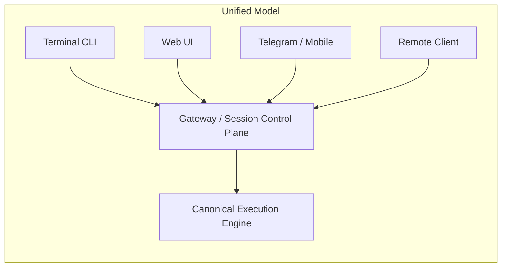
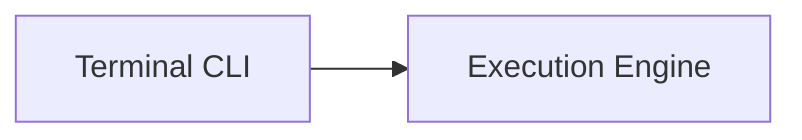
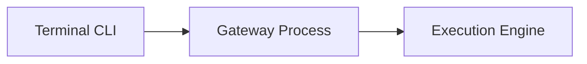
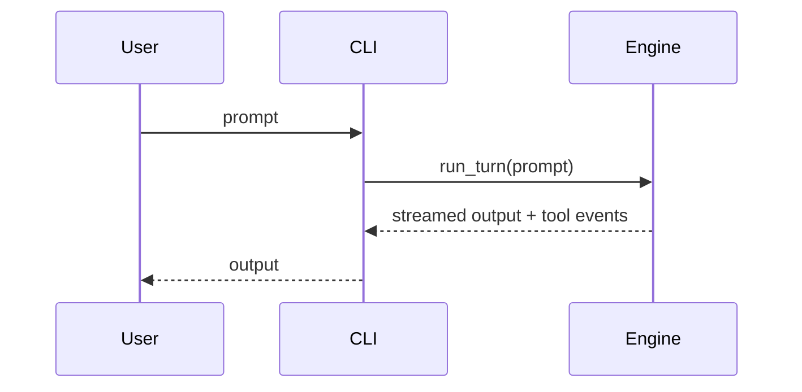
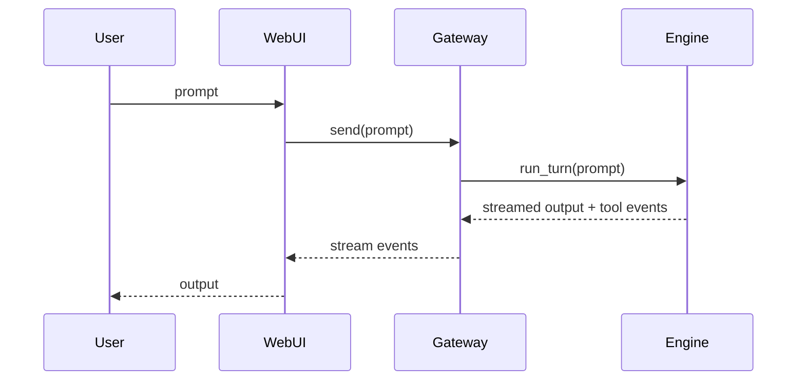

# 16. Execution Engine + Gateway Model (Why, What, How)

## 1. Why this document exists

We have two strong but divergent paths:

- **Terminal / CLI flow**: reliable, tool-compliant, and the most trusted behavior.
- **Web UI / API flow**: intended to be feature-complete, but currently inconsistent in behavior and stability.

The core confusion is **what the system's "source of truth" should be** and **how multiple interfaces (terminal, web UI, mobile) can coexist without drift**.

This document explains the execution engine + gateway model, clarifies process boundaries, and records a recommendation that preserves the trusted CLI behavior while enabling multi-client access (web UI, Telegram, remote).

**Current issue we are facing:** the CLI path behaves reliably, while the web UI/API path can time out or diverge (tool-call behavior, output location, or session handling). This divergence makes it hard to reason about correctness across interfaces.

**Desired outcome:** align all interfaces on a single execution engine (the CLI path) while using a gateway as the shared control plane so terminal, web UI, and remote clients behave the same way.

---

## 2. Problem we are solving

We are solving **architectural divergence**:

- Different entry points (CLI, web UI, harness) execute **different code paths**.
- This causes inconsistent tool-call compliance, file path behavior, and runtime stability.
- Debugging becomes ambiguous because "the same prompt" can yield different behavior depending on the entry point.

We need **one canonical execution engine** that all clients use, so behavior is consistent across terminal, web UI, and remote clients.

---

## 3. Key definitions

### 3.1 Execution engine (canonical)

The **execution engine** is the *single* code path that:

- Receives user input
- Runs the model loop
- Orchestrates tools and guardrails
- Writes outputs to workspace
- Emits events

In our system, the best candidate is the **current CLI / `process_turn` path**, because it is stable and already handles tools and guardrails well.

### 3.2 Gateway (control plane)

The **gateway** is a durable process that:

- Hosts the execution engine
- Manages sessions and workspace isolation
- Accepts input from multiple clients
- Streams events back to clients

The gateway is **not the model** and **not the UI**. It is the *control plane* and session manager.

### 3.3 Clients (entry surfaces)

Clients include:

- Terminal CLI (local)
- Web UI (browser)
- Mobile chat (Telegram, etc.)
- Remote API clients

Clients are **interfaces**, not engines. They submit input to the gateway and render streamed output.

---

## 4. How the models compare

### 4.1 Current (divergent) model

Today, different entry points can run different code paths:

- CLI uses the trusted local engine.
- Web UI runs a separate AgentBridge path.
- Harness introduces another variant.

This produces inconsistent behavior and increases maintenance overhead.

```mermaid
flowchart LR
  subgraph Current State (Divergent)
    CLI[Terminal CLI] --> EngineCLI[CLI Engine Path]
    WebUI[Web UI] --> EngineWeb[API/AgentBridge Path]
    Harness[URW Harness] --> EngineHarness[Harness Path]
  end
```

**Consequence:** same prompt ≠ same behavior.

### 4.2 Proposed (unified) model

We keep **one execution engine** and put a **gateway in front of it** so every client uses the same engine.



**Result:** same prompt → same engine → same behavior.

---

## 5. How the terminal fits in this model

We want to preserve the CLI reliability while enabling multi-client access.
That yields **two operational modes**:

### Mode A — Direct CLI (local-only fast path)

- CLI directly invokes the execution engine
- No gateway involved
- Best for dev/debug and local speed

**Process model:** one process (CLI + engine inside it).



### Mode B — Gateway + CLI client (unified multi-client)

- Gateway hosts the engine
- CLI becomes a client over a local transport (WS/IPC)
- Web UI and other clients use the same gateway

**Process model:** two processes (gateway+engine, plus CLI client).



**Key point:** You still keep the CLI *experience*, but it becomes a client to the same engine as the web UI.

---

## 6. Example flow comparison

### CLI direct (Mode A)



### Web UI via gateway (Mode B)



Both use the **same engine**, but the UI and transport differ.

---

## 7. What the gateway actually does

The gateway is not a second model loop. It should:

- Manage session lifecycle and workspace isolation
- Enforce path safety (workspace-scoped files)
- Stream events to clients
- Provide a stable protocol (WS/HTTP)

The gateway **should not** implement a separate agent run loop.

---

## 8. Recommendation (summary)

**Adopt the unified model:**

1) **Canonical execution engine = CLI path**  
   Keep the CLI engine as the single source of truth.

2) **Gateway hosts that engine**  
   The gateway is the control plane and session manager.

3) **All clients become gateway clients**  
   Terminal, web UI, and remote clients all talk to the same gateway.

4) **Keep direct CLI mode for dev**  
   Use direct CLI when you want minimal overhead or local debugging.

This matches the Clawdbot pattern while preserving our trusted CLI behavior.

---

## 9. Implementation notes (high-level)

Minimal changes to reach the target:

1) Web UI backend should call the same engine path the CLI uses (no separate AgentBridge loop).
2) Add a pre-tool guard: file paths must resolve inside the session workspace.
3) Add a single smoke test: run the same prompt from CLI, Web UI, and harness; verify identical output behavior.

---

## 10. Decision checklist (for other reviewers)

- [ ] Do we agree the CLI execution path is the most stable engine today?
- [ ] Can the gateway host that engine without changing its semantics?
- [ ] Are we comfortable treating all UIs as clients (not engines)?
- [ ] Do we want to keep a direct CLI mode for local debugging?

If the answer is "yes" to these, then the unified model is the right architecture.
