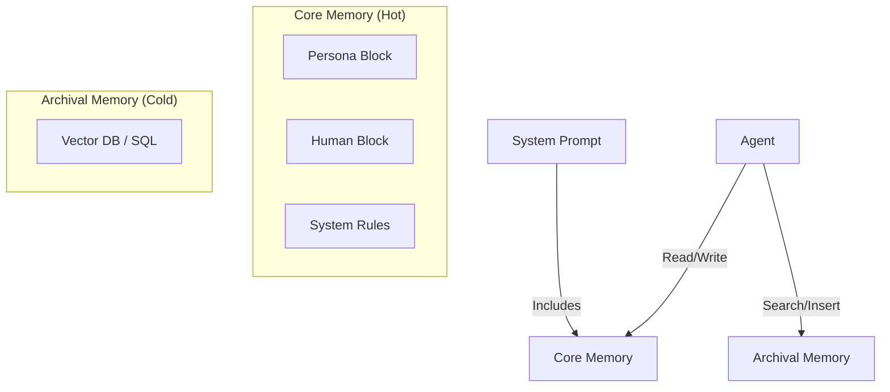
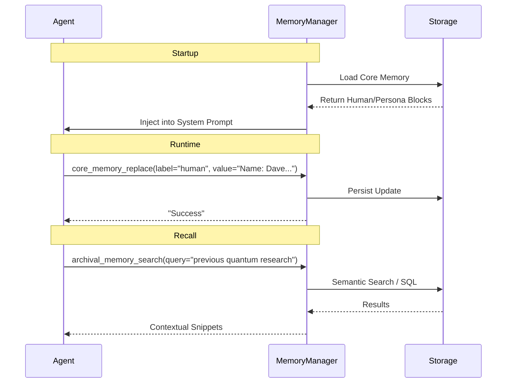

# Memory System Architecture

The Universal Agent implements a **Letta (formerly MemGPT)** inspired memory architecture. This allows the agent to maintain a consistent persona and long-term facts across different sessions.

## Memory Hierarchy

### 1. Core Memory (Hot State)
*   **Location**: Directly inside the System Prompt (Context Window).
*   **Capacity**: Limited (approx 2000 chars).
*   **Purpose**: Immediate consistency. Who am I? Who is the user? What are the active constraints?
*   **Editing**: The agent can use `core_memory_replace` to update these blocks in real-time.
    *   *Example*: "User said they live in Chicago" -> Agent updates `Human` block.

### 2. Archival Memory (Cold Storage)
*   **Location**: `Memory_System/data/` (SQLite/JSON).
*   **Capacity**: Unlimited.
*   **Purpose**: Storing facts, report summaries, and previous task outcomes.
*   **Access**: The agent must explicitly *search* this memory using `archival_memory_search`.

## The Memory Lifecycle

## Adding New Memory Types
Developers can extend the schema in `Memory_System/manager.py`. Adding a new "Core Block" (e.g., `TaskState`) involves:
1.  Defining the default block in `_load_or_initialize_state`.
2.  The `MemoryManager` will automatically inject it into the prompt.
