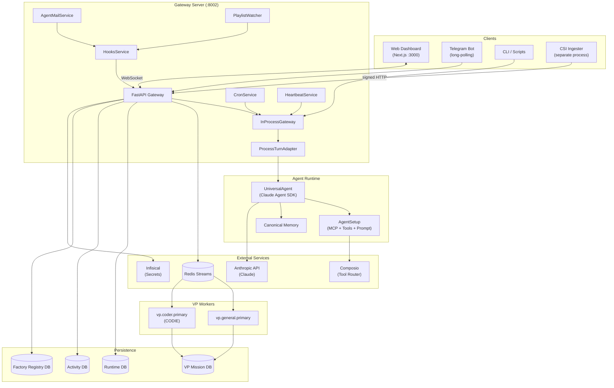
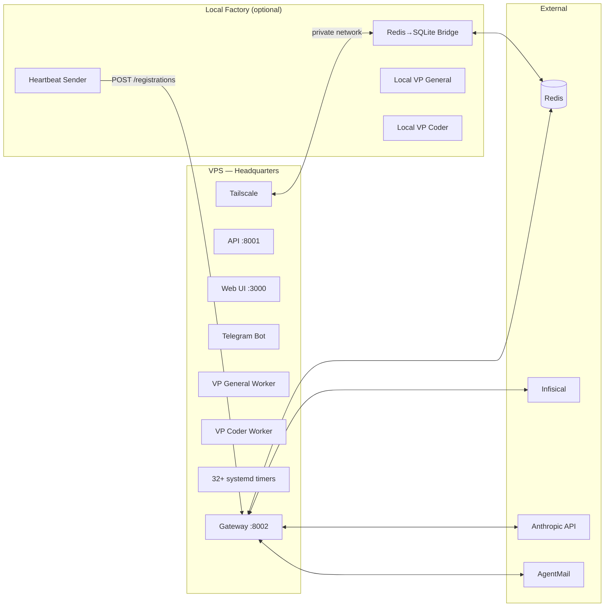
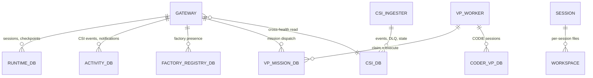

# 01. System Architecture Overview

**Last verified against source code:** 2026-03-06

## What This System Is

Universal Agent (UA) is a production AI agent system built on the Claude Agent SDK. It runs as a set of long-running services on a VPS, with an optional local factory worker for distributed execution. The primary agent persona is **Simone**, a senior staff engineer who operates autonomously across multiple interfaces.

## High-Level Architecture



## Runtime Services

The system runs as **6+ systemd services** on VPS:

| Service | Port | Purpose |
|---------|------|---------|
| `universal-agent-gateway` | 8002 | FastAPI gateway — sessions, WebSocket streaming, ops API, delegation bus |
| `universal-agent-api` | 8001 | Lightweight API server — dashboard auth, session ownership |
| `universal-agent-webui` | 3000 | Next.js dashboard — chat, sessions, events, corporation view |
| `universal-agent-telegram` | — | Telegram bot — long-polling mode, interactive agent access |
| `universal-agent-vp-worker@vp.general.primary` | — | VP general worker — executes delegated general tasks |
| `universal-agent-vp-worker@vp.coder.primary` | — | VP coder worker — executes delegated coding tasks |

Optional local factory services add distributed execution capability.

## Core Component Map

```
src/universal_agent/
├── gateway_server.py      # FastAPI gateway (712KB) — the central hub
├── gateway.py             # InProcessGateway + ExternalGateway abstractions
├── execution_engine.py    # ProcessTurnAdapter — bridges CLI engine to event-driven gateway
├── agent_core.py          # UniversalAgent — Claude SDK client, tool routing, event emission
├── agent_setup.py         # AgentSetup — unified MCP/tool/prompt initialization
├── main.py                # CLI entry point + process_turn() execution engine
├── heartbeat_service.py   # Autonomous agent loop (proactive actions, monitoring)
├── hooks_service.py       # Webhook ingress dispatcher (YouTube, external triggers)
├── cron_service.py        # Scheduled task execution (briefings, reports)
│
├── runtime_bootstrap.py   # Bootstrap pipeline: secrets → env aliases → runtime policy
├── infisical_loader.py    # Infisical-first secret loading (SDK → REST → dotenv fallback)
├── runtime_role.py        # FactoryRuntimePolicy — shapes behavior per deployment role
├── feature_flags.py       # Feature toggles (heartbeat, cron, memory, VP, etc.)
│
├── delegation/            # Cross-machine delegation (Redis bus + factory heartbeat)
│   ├── redis_bus.py       # Redis Streams transport layer
│   ├── redis_vp_bridge.py # Inbound: Redis → VP SQLite mission queue
│   ├── redis_vp_result_bridge.py  # Outbound: VP results → Redis
│   ├── heartbeat.py       # Factory→HQ registration heartbeat
│   ├── factory_registry.py # SQLite-backed factory presence registry
│   ├── system_handlers.py # System missions (update, pause, resume)
│   └── bridge_main.py     # Standalone bridge entry point
│
├── vp/                    # VP (Virtual Primary) worker system
│   ├── worker_loop.py     # Mission claim-execute-finalize loop
│   ├── worker_main.py     # Worker service entry point
│   ├── coder_runtime.py   # CODIE coder VP runtime (session/lease management)
│   ├── dispatcher.py      # Mission dispatch from Simone to VP workers
│   └── profiles.py        # VP identity profiles
│
├── services/              # Background service integrations
│   ├── agentmail_service.py       # Simone's email inbox (WebSocket listener)
│   ├── youtube_playlist_watcher.py # YouTube playlist polling
│   ├── gws_mcp_bridge.py         # Google Workspace CLI MCP bridge
│   ├── gws_event_listener.py     # Gmail event polling
│   ├── todoist_service.py         # Todoist task management
│   ├── telegram_send.py           # Shared Telegram send utility
│   └── tutorial_telegram_notifier.py # Tutorial pipeline notifications
│
├── durable/               # Persistence layer
│   ├── db.py              # SQLite connection management (runtime, VP, activity DBs)
│   ├── migrations.py      # Schema migrations
│   ├── state.py           # Session/mission/event CRUD operations
│   └── tool_gateway.py    # Tool name validation and repair
│
├── bot/                   # Telegram bot
│   ├── main.py            # Bot entry point (long-polling)
│   ├── agent_adapter.py   # Telegram → Gateway session bridge
│   └── task_manager.py    # Sequential task execution queue
│
├── memory/                # Agent memory system
│   ├── canonical_memory.py # Primary memory store (JSON + vector)
│   └── paths.py           # Shared memory workspace resolution
│
├── api/                   # Dashboard API server
│   └── server.py          # Session ownership, auth, file serving
│
├── signals_ingest.py      # CSI analytics event ingestion
├── prompt_builder.py      # System prompt construction
├── prompt_assets.py       # Skills discovery, tool knowledge injection
├── session_policy.py      # Per-session execution policy
└── identity/              # User identity resolution and allowlists
```

## Web UI Component Map

```
web-ui/
├── app/
│   ├── dashboard/
│   │   ├── chat/          # Interactive chat with WebSocket streaming
│   │   ├── sessions/      # Session browser and management
│   │   ├── events/        # Activity feed (CSI events, notifications)
│   │   ├── corporation/   # Factory fleet view (registrations, timers, health)
│   │   ├── csi/           # CSI analytics dashboard
│   │   ├── approvals/     # Mission approval queue
│   │   ├── tutorials/     # YouTube tutorial pipeline status
│   │   ├── skills/        # Installed skills browser
│   │   └── settings/      # Configuration panel
│   ├── api/dashboard/     # Next.js API routes (auth proxy, gateway proxy)
│   └── webhooks/          # Webhook ingress relay
├── lib/
│   ├── dashboardAuth.ts   # Cookie-based dashboard authentication
│   └── sessionDirectory.ts # Session discovery and listing
└── components/            # Shared UI components (Tailwind + shadcn/ui)
```

## External Dependencies

| Dependency | Purpose | Integration Point |
|-----------|---------|------------------|
| **Claude Agent SDK** | LLM execution, tool calling, conversation management | `agent_core.py`, `agent_setup.py` |
| **Composio** | External tool router (Google, GitHub, etc.) | `agent_setup.py` |
| **Redis** | Cross-machine mission transport (Streams) | `delegation/redis_bus.py` |
| **Infisical** | Secret management (Infisical-first, fail-closed on VPS) | `infisical_loader.py` |
| **Tailscale** | Private network for VPS access, SSH, staging | deploy scripts |
| **Pydantic Logfire** | Observability and tracing | `agent_core.py`, `gateway_server.py` |
| **AgentMail** | Simone's email inbox (send/receive/WebSocket) | `services/agentmail_service.py` |
| **Telegram Bot API** | Interactive bot + notification delivery | `bot/`, `services/telegram_send.py` |

## Deployment Topology



## Data Store Relationships



## Data Stores

| Store | Path | Purpose |
|-------|------|---------|
| Runtime DB | `AGENT_RUN_WORKSPACES/runtime_state.db` | Sessions, checkpoints, run queue |
| Coder VP DB | `AGENT_RUN_WORKSPACES/coder_vp_state.db` | CODIE session/lease isolation |
| VP Mission DB | `AGENT_RUN_WORKSPACES/vp_missions.db` | VP mission queue and results |
| Activity DB | `AGENT_RUN_WORKSPACES/activity_events.db` | CSI events, notifications |
| Factory Registry DB | `AGENT_RUN_WORKSPACES/factory_registry.db` | Factory presence tracking |
| CSI DB | Configured via `CSI_DB_PATH` | CSI events, delivery state, DLQ |
| Session Workspaces | `AGENT_RUN_WORKSPACES/<session_id>/` | Per-session files and artifacts |

## Key Architectural Decisions

1. **Gateway as session authority** — The gateway owns session metadata. The API server and dashboard defer to it.
2. **Redis for transport, SQLite for state** — Cross-machine delegation uses Redis Streams; local execution uses SQLite mission queues.
3. **Infisical-first secrets** — VPS runs fail-closed; local allows dotenv fallback.
4. **Factory role shapes runtime** — `FactoryRuntimePolicy` determines which features are enabled per deployment role (HQ, LOCAL_WORKER, STANDALONE).
5. **Purpose-separated transports** — No generic message bus. WebSocket for session streaming, Redis for delegation, HTTP for webhooks.
6. **CSI as separate process** — CSI Ingester runs independently and delivers to UA via signed HTTP, not in-process.
