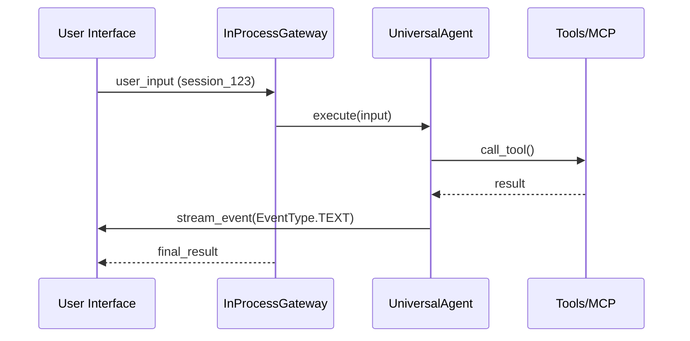

# Core Classes

This document details the primary classes that form the backbone of the Universal Agent. Understanding these is crucial for any developer looking to modify or extend the system.

## 1. `UniversalAgent` (Brain)

- **Location**: `src/universal_agent/agent_core.py`
- **Purpose**: The central processing unit. It encapsulates the Claude Agent SDK and manages the interaction loop between the LLM and the tools.

### Responsibilities: UniversalAgent

- **Initialization**: Sets up the Claude SDK client with appropriate hooks (guardrails, logging).
- **Turn Management**: Processes a single turn of conversation, handling tool calls, tool results, and thoughts.
- **Event Emission**: Streams `AgentEvent` objects (text, tool calls, thinking) to the caller.
- **Tool Routing**: Uses the `AgentDefinition` to expose available MCP tools to the LLM.

```python
# Example instantiation
agent = UniversalAgent(
    name="Primary",
    workspace_dir="./workspace",
    system_prompt="Custom prompt..."
)
```

---

## 2. `HeartbeatService` (Autonomic Loop)

- **Location**: `src/universal_agent/heartbeat_service.py`
- **Purpose**: Provides autonomous capability. It triggers the agent to check its status, progress on long-running tasks, or respond to system events without user input.

### Responsibilities: HeartbeatService

- **Scheduling**: Runs on a configurable interval (e.g., every 5 minutes).
- **Context injection**: Injects "heartbeat events" (like "It is now 3 PM, you have 2 pending tasks") into the agent's context.
- **Visibility Control**: Decides whether heartbeat "thoughts" should be visible to the user or hidden.

---

## 3. `InProcessGateway` (Transmitter)

- **Location**: `src/universal_agent/gateway.py`
- **Purpose**: Acts as an intermediary between the UI (Telegram, Web, CLI) and the `UniversalAgent`.

### Responsibilities: InProcessGateway

- **Session Management**: Maps `session_id` to specific workspace directories and agent instances.
- **Request Routing**: Validates incoming user inputs and initiates `execute()` calls on the underlying agent.
- **Concurrency**: Manages locks to ensure only one turn is processed per session at a time.



---

## 4. `DurableExecutionEngine` (Health & Safety)

- **Location**: `src/universal_agent/execution_engine.py` (and `durable/` package)
- **Purpose**: Ensures the agent runs reliably.

### Responsibilities: DurableExecutionEngine

- **Checkpointing**: Saves the conversation state to disk after every turn.
- **Error Recovery**: Catching `HarnessError` and attempting restarts.
- **Budgeting**: Monitoring token usage or execution time to prevent run-away loops.
