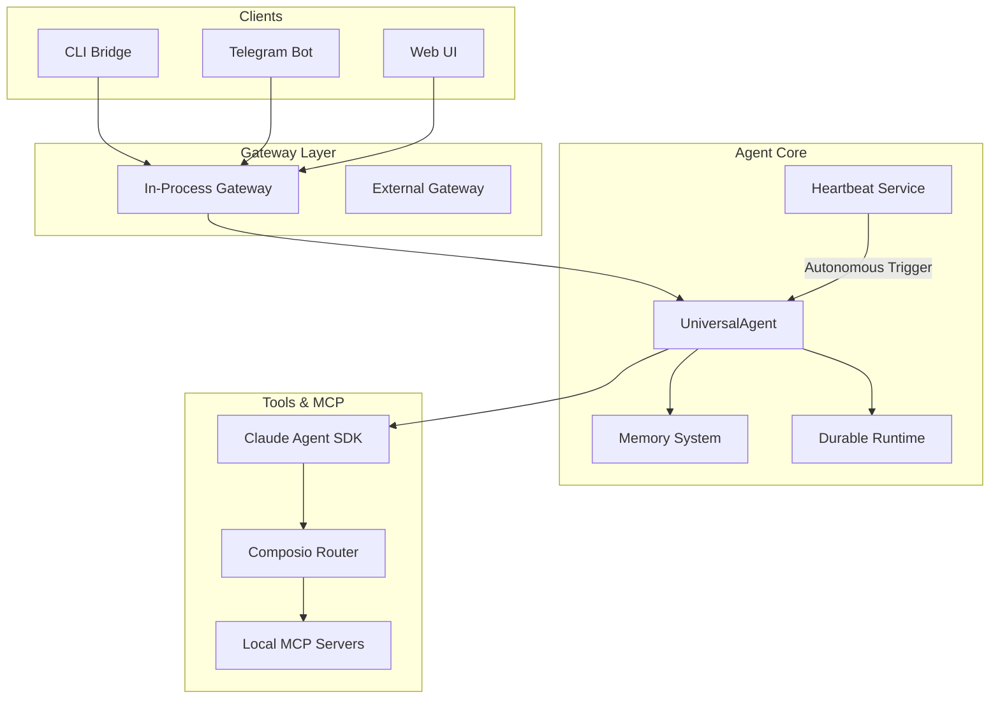

# System Overview

Welcome to the **Universal Agent** technical documentation. This project is a powerful, autonomous AI agent built on the **Claude Agent SDK** and the **Composio Tool Router**, designed for production-grade durability and extensibility.

## 1. High-Level Architecture

The Universal Agent is designed as a modular system where the "brain" (Agent Core) is decoupled from the "transmitters" (Gateways) and "autonomic functions" (Heartbeat Service).

### Component Diagram

## 2. Core Philosophy

The project adheres to several key design principles:

1. **Durable Execution**: Using checkpointing and state persistence to ensure the agent can recover from failures or restarts without losing conversation context.
2. **Autonomous Heartbeat**: An internal loop that allows the agent to think, observe, and act even when no user is actively chatting.
3. **Tiered Memory**: A sophisticated memory architecture combining SQLite (for core/persona), Vector databases (for semantic retrieval), and Markdown (for human-readable logs).
4. **Interface Agnostic**: The `InProcessGateway` allows the same agent logic to be exposed via CLI, Web, or Telegram with minimal effort.

## 3. Technology Stack

- **Language**: Python 3.12+
- **Agent Framework**: Claude Agent SDK (Anthropics)
- **Tooling Platform**: Composio & FastMCP
- **Observability**: Pydantic Logfire
- **Storage**: SQLite for state; ChromaDB/LanceDB for vector memory.
- **Async Runtime**: `asyncio` with `nest-asyncio` support.

## 4. Directory Layout

- `src/universal_agent/main.py`: Main coordinator and entry point.
- `src/universal_agent/agent_core.py`: The `UniversalAgent` logic.
- `src/universal_agent/heartbeat_service.py`: Autonomic loop logic.
- `src/universal_agent/memory/`: Vector and local memory backends.
- `src/universal_agent/gateway.py`: Communication adapters for various interfaces.
- `src/universal_agent/durable/`: State persistence and checkpointing.
- `src/universal_agent/urw/`: Universal Reasoning Workflow (Orchestrator).
