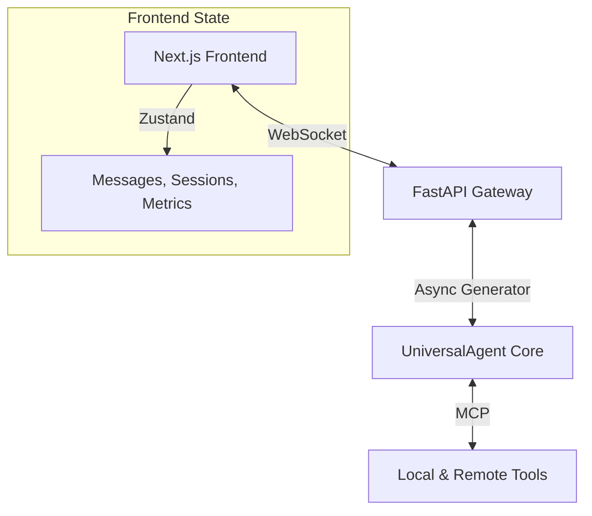

# UI Architecture

The Universal Agent features a modern, responsive Web UI built with **Next.js** and **Tailwind CSS**. It communicates with the backend via **WebSockets** for real-time streaming and event processing.

## 1. System Topology

## 2. Frontend Architecture (Next.js)

### State Management (`Zustand`)

The UI uses a global Zustand store to manage:

- **Messages**: The chat history and streaming buffers.
- **Sessions**: Active and archived session metadata.
- **Metrics**: Real-time tracking of token usage, iteration counts, and elapsed time.
- **Work Products**: Registry of artifacts (HTML, PDF, Images) generated during a run.

### WebSocket Manager

A dedicated `WebSocketManager` handles the lifecycle of the connection:

- **Reconnection**: Implements exponential backoff to handle network flickers.
- **Event Dispatching**: Maps raw JSON events from the server to specific store actions (e.g., `onText`, `onToolCall`).

---

## 3. Communication Protocol

The backend streams events as JSON objects. The frontend reacts to these events to update the UI without needing page reloads.

### Core Event Types

| Event | Purpose |
| --- | --- |
| `text` | Streams the assistant's response. |
| `tool_call` | Renders a "terminal card" for an active tool execution. |
| `tool_result` | Updates the tool card with the result summary/output. |
| `thinking` | Displays internal reasoning turns (Clawd-parity). |
| `work_product` | Adds a new artifact to the preview sidebar. |
| `approval` | Pauses execution and displays the "Mission Approval" modal. |

---

## 4. Workflows

### Query Execution

1. User submits text via `ChatInput`.
2. WebSocket sends `{"type": "query", "text": "..."}`.
3. Backend starts an async generator and streams events.
4. UI updates metrics and messages in real-time.

### Approval Mechanism

When the agent transitions between major phases (e.g., Planning -> Execution in URW), it emits an `approval` event.

- The UI renders a modal containing the proposed plan and task list.
- Execution is **paused** on the backend until the user clicks "Approve" (sending a return `approval` event) or provides feedback.

---

## 5. Development Notes

- **Location**: `web-ui/`
- **Frontend Stack**: Next.js 14, TypeScript, Tailwind, Lucide React icons.
- **Backend API**: FastAPI with `WebsocketEndpoint`.
