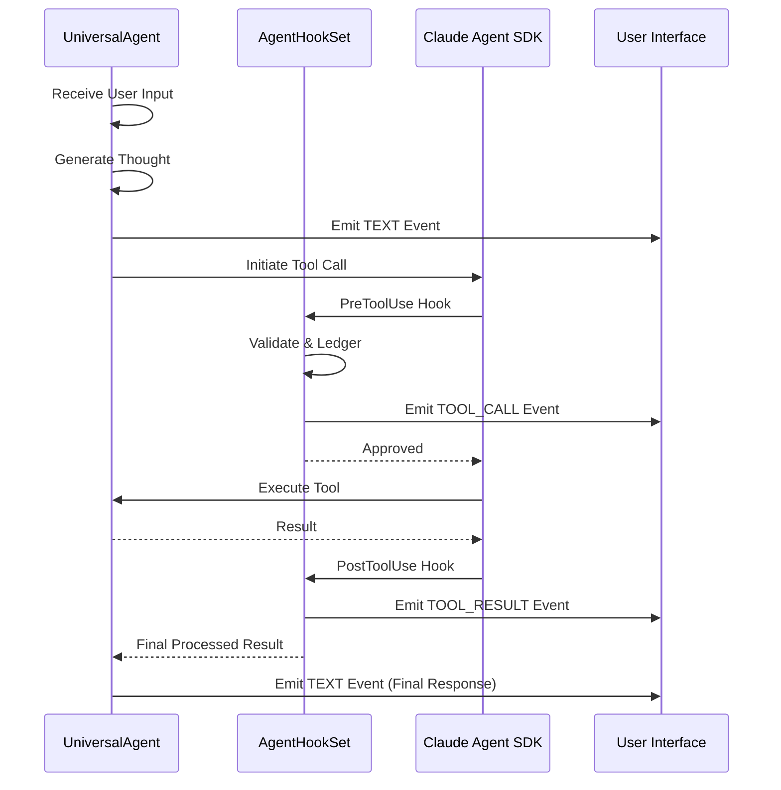

# Event Streaming Flow

The Universal Agent uses an asynchronous event bus to provide real-time feedback to the UI (Web, CLI, or Telegram). This ensures the user sees the agent's progress immediately.

## 1. Flow Diagram

The following diagram shows how a single "turn" of thought and action is transformed into a stream of events.

## 2. Event Types (`agent_core.py`)

| Event Type | Data Payload | Trigger |
| --- | --- | --- |
| `TEXT` | `text`, `author` | Generated by the LLM or Heartbeat. |
| `TOOL_CALL` | `id`, `name`, `input` | Emitted during `PreToolUse` hook. |
| `TOOL_RESULT` | `id`, `is_error`, `content` | Emitted during `PostToolUse` hook. |
| `THINKING` | `thought_id`, `state` | Indicates the agent is "pondering" (Clawd-parity). |
| `STATUS` | `message`, `level` | Operational updates (e.g., "Initializing MCP"). |

## 3. Implementation Details

### Context-Local Callbacks

Events use `ContextVar` to store the callback function. This allows multiple concurrent agent sessions to run in the same process without cross-talk. When the `InProcessGateway` starts an execution, it calls `set_event_callback()` for that specific async task.

### Deduction & Filtering

The `hooks.py` module uses internal sets (`_EMITTED_TOOL_CALL_IDS_VAR`) to ensure that even if a tool is called multiple times in a complex loop, the UI only receives the event once per distinct logic unit.
