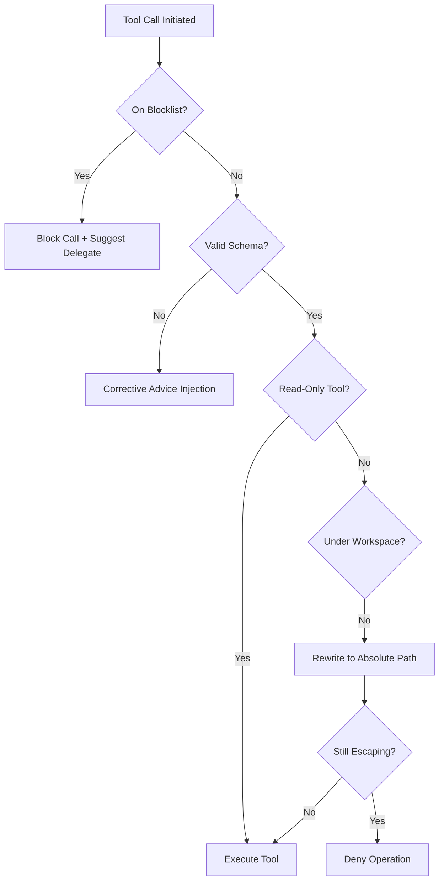

# Resource Guardrails

To ensure safety and reliability, the Universal Agent implements multiple layers of guardrails that prevent it from damaging the host system or accessing unauthorized data.

## 1. The Guardrail Decision Tree

## 2. Protected Domains

### Workspace Enforcement (`workspace_guard.py`)

The agent is largely confined to the `AGENT_RUN_WORKSPACES/` directory.

- **Read Operations**: Tools like `list_dir` or `view_file` are allowed to read from anywhere in the repository for context.
- **Write Operations**: Tools that modify files (e.g., `write_text_file`, `sh`) are strictly validated. Any attempt to write outside the session workspace or the `UA_ARTIFACTS_DIR` is blocked or rewritten.

### SDK Bypassing (`hooks.py`)

A specialized hook `on_pre_bash_block_composio_sdk` monitors Bash commands. It prevents the agent from attempting to import the `composio` SDK directly in Python scripts run via Bash. This forces the agent to use the pre-authenticated and logged MCP tools instead, providing a clear audit trail.

### Disallowed Tools (`constants.py`)

Certain tools that are too dangerous for general use (or are redundant) are hard-blocked for the "Primary Agent" but may be allowed for specialized "Sub-agents" (like a Research Specialist) who operate in controlled environments.

## 3. Corrective Schema Advice

When an agent makes a mistake in calling a tool (e.g., missing a parameter), the `on_post_tool_use_validation` hook detects the error and injects **Corrective Advice** back into the conversation. This allows the agent to fix its own mistake immediately rather than continuing to fail.

## 4. Implementation Files

- `src/universal_agent/guardrails/`: Core logic for path and schema validation.
- `src/universal_agent/hooks.py`: Central integration point for all guardrail checks.
