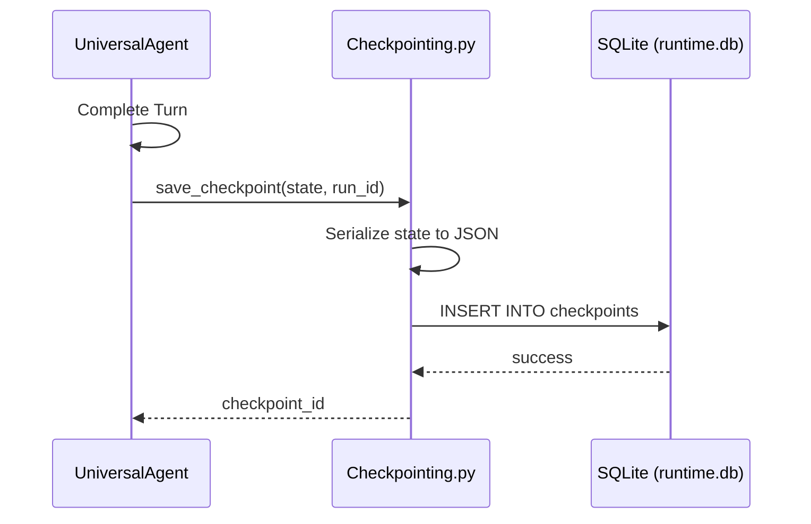

# Durable Execution

The **Durable Execution** subsystem ensures the Universal Agent is resilient to restarts, crashes, and long-running task interruptions.

## 1. Concept: Checkpointing

After every significant "turn" or iteration, the agent's state is serialized and saved to a persistent SQLite database (`runtime.db`). This allows the agent to "resume" exactly where it left off.

### What is saved?

- **Conversation History**: The full transcript of messages.
- **Variables**: Internal state variables, plans, and task statuses.
- **Corpus Cache**: Pre-processed research data for sub-agents to avoid redundant crawling.
- **Cursors**: Pagination markers for long-running tool outputs.

## 2. Checkpointing Flow

## 3. Failure Recovery

When the agent starts, it checks for the most recent checkpoint for the current `run_id`.

- If a checkpoint exists, the `InProcessGateway` or `Orchestrator` calls `resume()`.
- The history is reloaded, and the agent continues execution.

## 4. Worker Pool (`worker_pool.py`)

To handle intensive tasks without blocking the main event loop, the durable system manages a pool of background workers.

- **Isolation**: Each worker operates in its own context.
- **Persistence**: Task progress is tracked in the durable database, allowing the orchestrator to monitor background job completion across restarts.

## 5. Implementation Files

- `src/universal_agent/durable/db.py`: Database schema and connection management.
- `src/universal_agent/durable/checkpointing.py`: Logic for saving and loading state snapshots.
- `src/universal_agent/durable/worker_pool.py`: Background task management.
