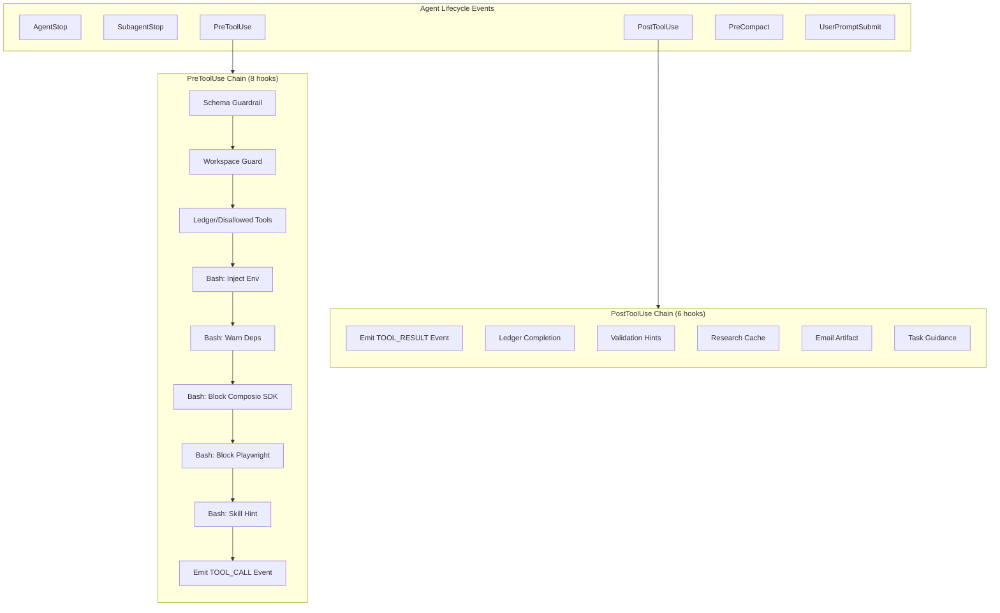
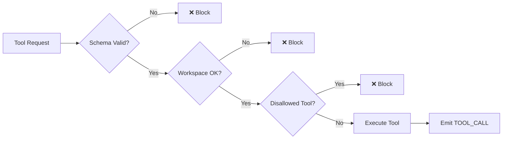
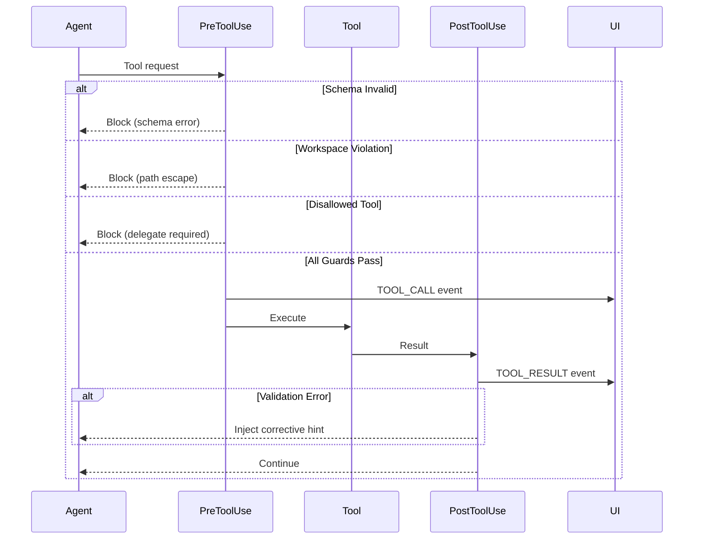

# Hook System Architecture

The Universal Agent uses the Claude Agent SDK's hook system to intercept, validate, and augment tool calls during agent execution. This document provides a comprehensive reference for all hooks used in the project.

---

## Overview

Hooks are registered callbacks that fire at specific points in the agent lifecycle. They enable:

- **Guardrails**: Block or modify dangerous/invalid operations
- **Observability**: Emit events for UI streaming and logging
- **Skill Hints**: Inject helpful guidance based on context
- **Security**: Enforce workspace boundaries and tool restrictions



---

## Hook Registration

Hooks are defined in `src/universal_agent/hooks.py` in the `AgentHookSet` class. The `build_hooks()` method returns the hook dictionary:

```python
{
    "AgentStop": [...],
    "SubagentStop": [...],
    "PreToolUse": [...],  # 8 hooks in priority order
    "PreCompact": [...],
    "PostToolUse": [...],  # 6 hooks
    "UserPromptSubmit": [...],
}
```

---

## Hook Categories

### 1. AgentStop / SubagentStop

**Purpose**: Lifecycle events triggered when the agent or subagent completes.

| Hook | File:Line | Description |
|------|-----------|-------------|
| `on_agent_stop` | [hooks.py:326](file:///home/kjdragan/lrepos/universal_agent/src/universal_agent/hooks.py#L326-L328) | Logs agent completion via Logfire |
| `on_subagent_stop` | [hooks.py:330](file:///home/kjdragan/lrepos/universal_agent/src/universal_agent/hooks.py#L330-L331) | Placeholder for subagent cleanup |

---

### 2. PreToolUse Hooks

These fire **before** a tool executes. They can:

- **Block** the tool (`decision: "block"`)
- **Modify** the tool input (`tool_input: {...}`)
- **Inject** system messages (`systemMessage: "..."`)



#### 2.1 Schema Guardrail

| | |
|---|---|
| **Hook** | `on_pre_tool_use_schema_guardrail` |
| **Location** | [hooks.py:333-342](file:///home/kjdragan/lrepos/universal_agent/src/universal_agent/hooks.py#L333-L342) |
| **Matcher** | `*` (all tools) |
| **Action** | Validates tool input against expected schema. Blocks malformed requests. |

#### 2.2 Workspace Guard

| | |
|---|---|
| **Hook** | `on_pre_tool_use_workspace_guard` |
| **Location** | [hooks.py:348-478](file:///home/kjdragan/lrepos/universal_agent/src/universal_agent/hooks.py#L348-L478) |
| **Matcher** | `*` |
| **Action** | Enforces write operations stay within session workspace. |

**Key behaviors:**

- Read-only tools (`Read`, `View`, `ListDir`, etc.) are allowed anywhere
- Write tools are restricted to:
  - Session workspace (`AGENT_RUN_WORKSPACES/session_xxx/`)
  - Artifacts directory (`UA_ARTIFACTS_DIR`)
  - Memory directory (`/memory/`) - for heartbeat system

#### 2.3 Ledger / Disallowed Tools

| | |
|---|---|
| **Hook** | `on_pre_tool_use_ledger` |
| **Location** | [hooks.py:480-520](file:///home/kjdragan/lrepos/universal_agent/src/universal_agent/hooks.py#L480-L520) |
| **Matcher** | `*` |
| **Action** | Blocks `DISALLOWED_TOOLS` for primary agent (forces delegation to subagents). |

**Disallowed tools** include `WebSearch`, `TaskOutput`, etc. These require delegation to specialized subagents.

#### 2.4 Bash: Inject Workspace Env

| | |
|---|---|
| **Hook** | `on_pre_bash_inject_workspace_env` |
| **Location** | [hooks.py:659-699](file:///home/kjdragan/lrepos/universal_agent/src/universal_agent/hooks.py#L659-L699) |
| **Matcher** | `Bash` |
| **Action** | Prefixes Bash commands with `CURRENT_SESSION_WORKSPACE` and `UA_ARTIFACTS_DIR` exports. |

#### 2.5 Bash: Warn Dependency Installs

| | |
|---|---|
| **Hook** | `on_pre_bash_warn_dependency_installs` |
| **Location** | [hooks.py:701-723](file:///home/kjdragan/lrepos/universal_agent/src/universal_agent/hooks.py#L701-L723) |
| **Matcher** | `Bash` |
| **Action** | Warns when `pip install` or `uv add` is detected; suggests PEP 723 inline deps. |

#### 2.6 Bash: Block Composio SDK

| | |
|---|---|
| **Hook** | `on_pre_bash_block_composio_sdk` |
| **Location** | [hooks.py:538-584](file:///home/kjdragan/lrepos/universal_agent/src/universal_agent/hooks.py#L538-L584) |
| **Matcher** | `Bash` |
| **Action** | Blocks direct Composio SDK usage; enforces MCP tool path. |

#### 2.7 Bash: Block Playwright Non-HTML

| | |
|---|---|
| **Hook** | `on_pre_bash_block_playwright_non_html` |
| **Location** | [hooks.py:586-617](file:///home/kjdragan/lrepos/universal_agent/src/universal_agent/hooks.py#L586-L617) |
| **Matcher** | `Bash` |
| **Action** | Blocks Playwright PDF conversion unless input is explicitly HTML. |

#### 2.8 Bash: Skill Hint

| | |
|---|---|
| **Hook** | `on_pre_bash_skill_hint` |
| **Location** | [hooks.py:619-654](file:///home/kjdragan/lrepos/universal_agent/src/universal_agent/hooks.py#L619-L654) |
| **Matcher** | `Bash` |
| **Action** | Suggests relevant skills when PDF/DOCX/PPTX patterns detected. |

#### 2.9 Emit TOOL_CALL Event

| | |
|---|---|
| **Hook** | `on_pre_tool_use_emit_event` |
| **Location** | [hooks.py:522-532](file:///home/kjdragan/lrepos/universal_agent/src/universal_agent/hooks.py#L522-L532) |
| **Matcher** | `*` |
| **Action** | Emits `TOOL_CALL` event for UI streaming (after all guards pass). |

---

### 3. PostToolUse Hooks

These fire **after** a tool executes. They provide observability and corrective feedback.

#### 3.1 Emit TOOL_RESULT Event

| | |
|---|---|
| **Hook** | `on_post_tool_use_emit_event` |
| **Location** | [hooks.py:725-739](file:///home/kjdragan/lrepos/universal_agent/src/universal_agent/hooks.py#L725-L739) |
| **Action** | Emits `TOOL_RESULT` event with content preview for UI. |

#### 3.2 Validation Hints

| | |
|---|---|
| **Hook** | `on_post_tool_use_validation` |
| **Location** | [hooks.py:746-792](file:///home/kjdragan/lrepos/universal_agent/src/universal_agent/hooks.py#L746-L792) |
| **Action** | Detects schema/validation errors and injects corrective advice. |

---

### 4. PreCompact Hook

| | |
|---|---|
| **Hook** | `on_pre_compact_capture` |
| **Location** | [hooks.py:344-346](file:///home/kjdragan/lrepos/universal_agent/src/universal_agent/hooks.py#L344-L346) |
| **Action** | Captures context before conversation compaction for logging. |

---

## Event Emission Helpers

The hooks module also provides helper functions for emitting events:

| Function | Purpose |
|----------|---------|
| `emit_tool_call_event()` | Emit `TOOL_CALL` with deduplication |
| `emit_tool_result_event()` | Emit `TOOL_RESULT` with content preview |
| `emit_text_event()` | Emit `TEXT` for assistant responses |
| `emit_thinking_event()` | Emit `THINKING` for extended thinking |
| `emit_status_event()` | Emit `STATUS` for activity log |

---

## Hook Decision Flow



---

## Configuration

The `AgentHookSet` class accepts these parameters:

| Parameter | Type | Description |
|-----------|------|-------------|
| `run_id` | `str` | Unique run identifier |
| `tool_ledger` | `Any` | Optional ledger for durable tool tracking |
| `runtime_db_conn` | `Any` | SQLite connection for durable state |
| `enable_skills` | `bool` | Enable skill hint injection |
| `active_workspace` | `str` | Session workspace path |

---

## See Also

- [Event Streaming Flow](file:///home/kjdragan/lrepos/universal_agent/OFFICIAL_PROJECT_DOCUMENTATION/02_Flows/Event_Streaming_Flow.md)
- [Guardrails Reference](file:///home/kjdragan/lrepos/universal_agent/src/universal_agent/guardrails/)
