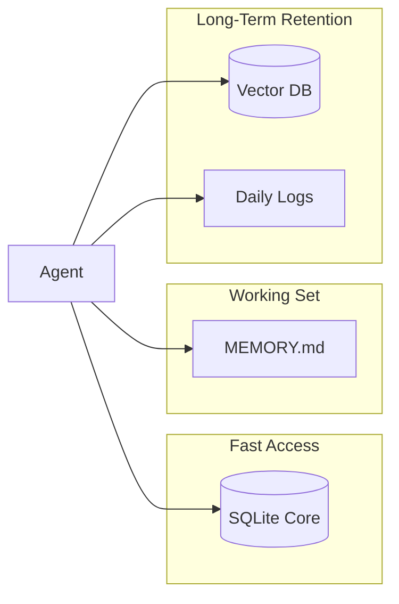

# Memory System

The Universal Agent employs a **Tiered Memory Architecture** to balance fast-access state, semantic retrieval, and long-term human-readable archives.

## 1. Memory Tiers

| Tier | Storage Mechanism | Use Case |
| --- | --- | --- |
| **Core Memory** | SQLite (`agent_core.db`) | Immediate persona, user preferences, and constant variables. |
| **Active Context** | Markdown (`MEMORY.md`) | A human-readable record of recent turns and summaries. |
| **Vector Memory** | ChromaDB / LanceDB | Semantic search for historical context and cross-session knowledge. |
| **Archival Memory** | Markdown Daily Files | Long-term logs organized by date (e.g., `2024-02-05.md`). |

## 2. Tiering Diagram

## 3. Implementation Details

### Core Memory (SQLite)

Stored in the `agent_core.db` within the `Memory_System_Data` directory. This is used for "hard-coded" memory blocks like `persona` and `human`.

- **Primary Class**: `MemoryManager` in `Memory_System/manager.py` (exposed via `agent_core.py`).

### Vector Memory

Allows the agent to performing semantic lookups. When `memory_index_mode` is set to `vector`, the agent automatically indexes new memory entries.

- **Backends**: Supports `chromadb` (default) and `lancedb` (for high-performance environments with AVX2).
- **Embeddings**: Configurable between `SentenceTransformers` (local) and `OpenAI`.
- **Search Logic**: Uses cosine similarity to find the most relevant past memories based on the current context.

### Memory Store (`memory_store.py`)

The central coordinator for saving memories.

1. **Append**: Writes the full entry to a daily markdown file.
2. **Summarize**: Generates a short summary of the interaction.
3. **Index**: Updates the `index.json` and recent benchmarks in `MEMORY.md`.
4. **Vectorize**: (Async) Generates embeddings and upserts to the vector database.

## 4. Configuration

Memory behavior is controlled via environment variables:

- `UA_MEMORY_INDEX`: Set to `vector`, `json`, `fts`, or `off`.
- `UA_MEMORY_BACKEND`: Select `chromadb` or `lancedb`.
- `UA_EMBEDDING_PROVIDER`: Select `sentence-transformers` or `openai`.
