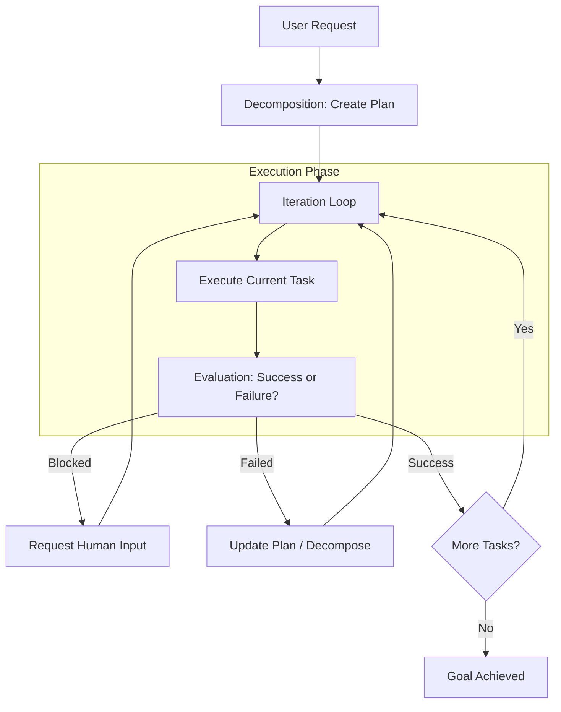

# Universal Reasoning Workflow (URW)

The **URW (Universal Reasoning Workflow)** is the orchestrator for complex, multi-step tasks. It replaces simple chat interactions with a structured, goal-oriented execution plan.

## 1. The Workflow Lifecycle

## 2. Key Components

### The Plan (`plan_manager.py`)

A list of atomic **Tasks** that need to be completed. Each task has:

- **Objective**: What needs to be done.
- **Dependency**: Which tasks must precede it.
- **Status**: `pending`, `running`, `completed`, or `failed`.

### The Orchestrator (`orchestrator.py`)

The "Project Manager" of the agent. It:

1. Provides context for the current phase.
2. Monitors execution progress.
3. Decides when to transition between phases.

### The Evaluator (`evaluator.py`)

Critically assesses the agent's work. It looks at artifacts produced and determining if the evidence satisfies the task objective.

## 3. Durable State in URW

URW heavily relies on the **Durable Subsystem**. The entire state of the plan and the evidence collected is checkpointed. This allows a long-running research project (lasting hours or days) to survive system restarts.

## 4. Implementation Files

- `src/universal_agent/urw/orchestrator.py`: The main execution loop.
- `src/universal_agent/urw/phase_planner.py`: Logic for breaking down goals into phases.
- `src/universal_agent/urw/evaluator.py`: Logic for validating task completion.
