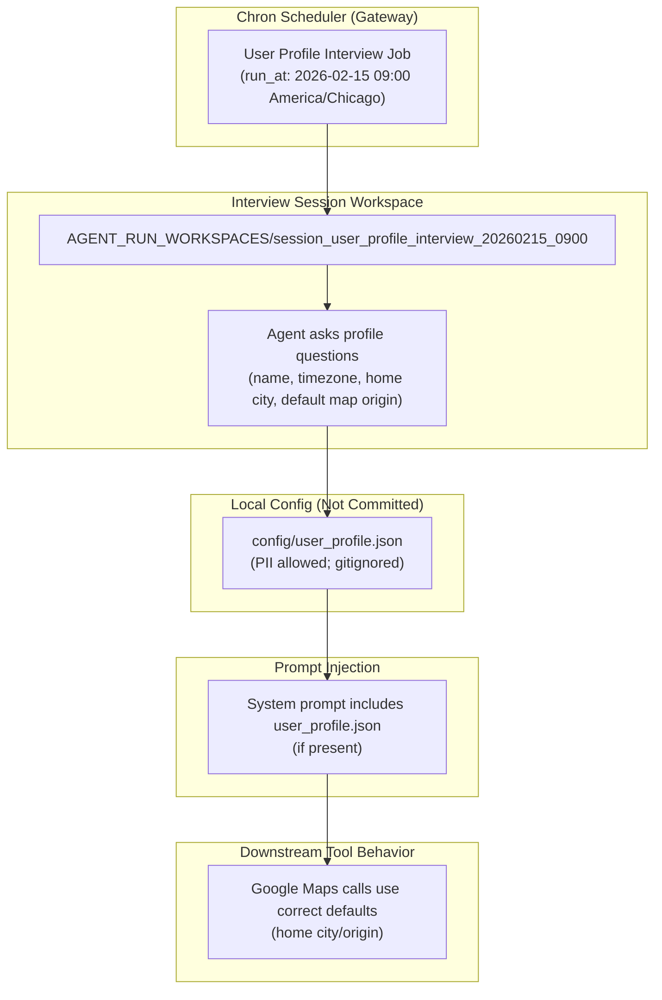

# User Profile Interview And Memory Persistence (2026-02-14)

## Why This Exists

Two recurring UX issues:
1. **Tool defaults are wrong** (example: Google Maps searches anchored to San Francisco when the user did not specify a location).
2. **Long runs can lose memory continuity** when a session is abandoned without a clean shutdown (browser closed, machine sleeps, etc.).

This document captures the concrete changes made on **February 14, 2026** to address both.

## Implemented Changes

### 1) Local User Profile Config (PII-Aware)

We added a machine-local config location for user profile data:
- `config/user_profile.json` (ignored by git)
- Optional: `config/user_profile.md` (ignored by git)

The system prompt now includes this profile (if present) so the agent can:
- Use your preferred name.
- Choose the correct timezone and home location.
- Pick sensible defaults for tools like Google Maps.

Important:
- The profile may contain sensitive PII (including address). The prompt instructs the agent **not** to reveal it unless explicitly asked.

### 2) Memory Sync After Each Query (Gateway Path)

We added a best-effort session memory sync at the end of every gateway `run_query()`:
- After a query finishes and `transcript.md` exists, the gateway indexes the transcript into session memory immediately.
- This reduces reliance on “session close” to persist searchable session memory.

Limitations:
- If the process is killed mid-run before `trace.json`/`transcript.md` are written, we still cannot recover that partial run without further incremental checkpointing.

### 3) Scheduled User Interview (Chron Job)

A one-shot Chron job is scheduled to seed a user-profile interview session on:
- **February 15, 2026 at 9:00 AM America/Chicago** (configured as `run_at="tomorrow 9:00am"`, timezone explicit).

The job creates a deterministic session workspace so you can attach in the Web UI:
- Session ID / workspace name: `session_user_profile_interview_20260215_0900`

## Mermaid Overview

## Operational Notes

- The interview job only “seeds” the session (it cannot force a real-time interactive Q&A if you are not in the UI at that exact moment).
- To complete the interview, open the Web UI and attach to:
  - `session_user_profile_interview_20260215_0900`

