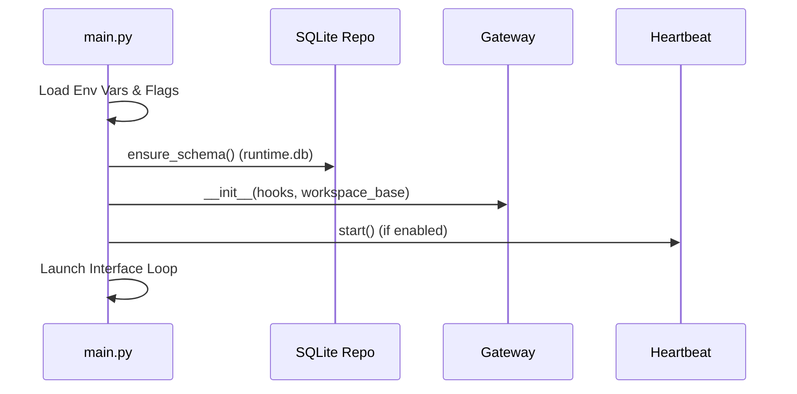

# Running the Agent

The Universal Agent can be executed through multiple interfaces. Each interface communicates with the `InProcessGateway` to manage sessions.

## 1. CLI Mode (Interactive Terminal)

The CLI is the primary development and testing interface. It supports rich formatting, streaming output, and direct access to session logs.

### Basic command

```bash
./START_HERE/START.sh
```

### Options

- `--session-id <id>`: Resume an existing conversation.
- `--force-complex`: Force the agent to use the Universal Reasoning Workflow (URW) orchestrator for the current request.

---

## 2. Web UI (Gradio)

The project includes a modern, interactive Web UI built with **Gradio**. This provides a visual workspace for managing artifacts, research reports, and conversations.

### Launching

```bash
uv run python -m universal_agent.api.gradio_app
```

## 2b. Gateway Mode (Recommended Local Dev Stack)

This starts the production-like local stack:
- gateway (`:8002`)
- API server (`:8001`)
- Web UI (`:3000`)

Launch:
```bash
./start_gateway.sh
```

If you want VPS YouTube Composio events mirrored into your local stack automatically, use:
```bash
./start_local_dev_with_youtube_forwarding.sh
```

### Features

- **Conversation Threading**: Clean chat interface with streaming responses.
- **Artifact Preview**: Visual preview of generated markdown reports, PDF edits, and images.
- **Heartbeat Monitor**: Real-time visibility into autonomous agent thoughts.

---

## 3. Telegram Mode

The Universal Agent can run as a persistent assistant on Telegram.

### Launching

```bash
uv run python -m universal_agent.bot.main
```

Current runtime mode:
- Telegram bot runs via long polling from `src/universal_agent/bot/main.py`.
- Configure with `TELEGRAM_BOT_TOKEN` and `TELEGRAM_ALLOWED_USER_IDS`.
- Optional timeout override: `UA_TELEGRAM_TASK_TIMEOUT_SECONDS`.

### Features

- **Durable Sessions**: Conversations persist across bot restarts.
- **Global Memory**: Knowledge learned in one chat is accessible in others via the Vector Memory system.
- **File Support**: The agent can process documents uploaded by the user.

---

## 4. Initialization Sequence

Regardless of the interface, the internal startup process follows this flow:



---

## 5. Session Workspaces

Every run creates a dedicated workspace directory in `AGENT_RUN_WORKSPACES/session_<id>`.

- `MEMORY.md`: Core memory log.
- `trace.json`: Low-level SDK logs.
- `run.log`: Console output for that session.
- `artifacts/`: Files produced by tools (images, reports, etc.).

---

## 6. Mirror Remote Workspaces Locally (Debug `app.clearspringcg.com`)

If your remote deployment is running on a VPS, you can continuously mirror remote
`AGENT_RUN_WORKSPACES` and remote durable `artifacts` into this local repo while your computer is on.

### Recommended control model (simple toggle)

Keep automation OFF by default, and only enable while actively debugging:

```bash
scripts/remote_workspace_sync_control.sh off
scripts/remote_workspace_sync_control.sh status
```

Run a manual one-time sync only when you ask for it:

```bash
scripts/remote_workspace_sync_control.sh sync-now
```

Temporarily enable periodic sync while debugging:

```bash
scripts/remote_workspace_sync_control.sh on --interval 600
scripts/remote_workspace_sync_control.sh toggle
scripts/remote_workspace_sync_control.sh off
```

Web UI toggle behavior:
- In the dashboard `Config` panel, use `Remote To Local Debug Sync`.
- Default state is OFF when unset.
- Local timer jobs only sync when this toggle is ON (if timer was enabled with `remote_workspace_sync_control.sh on`).
- If local machine is offline or token/network checks fail, cycle is skipped.

### One-time sync

```bash
scripts/sync_remote_workspaces.sh --once \
  --host root@srv1360701.taildcc090.ts.net \
  --remote-dir /opt/universal_agent/AGENT_RUN_WORKSPACES \
  --remote-artifacts-dir /opt/universal_agent/artifacts \
  --local-dir /home/kjdragan/lrepos/universal_agent/AGENT_RUN_WORKSPACES/remote_vps_workspaces \
  --local-artifacts-dir /home/kjdragan/lrepos/universal_agent/artifacts/remote_vps_artifacts \
  --manifest-file /home/kjdragan/lrepos/universal_agent/AGENT_RUN_WORKSPACES/remote_vps_sync_state/synced_workspaces.txt
```

### Continuous sync in current terminal

```bash
scripts/sync_remote_workspaces.sh \
  --host root@srv1360701.taildcc090.ts.net \
  --remote-dir /opt/universal_agent/AGENT_RUN_WORKSPACES \
  --remote-artifacts-dir /opt/universal_agent/artifacts \
  --local-dir /home/kjdragan/lrepos/universal_agent/AGENT_RUN_WORKSPACES/remote_vps_workspaces \
  --local-artifacts-dir /home/kjdragan/lrepos/universal_agent/artifacts/remote_vps_artifacts \
  --manifest-file /home/kjdragan/lrepos/universal_agent/AGENT_RUN_WORKSPACES/remote_vps_sync_state/synced_workspaces.txt \
  --interval 30
```

Behavior note:
- By default, the script skips any workspace ID already recorded in the manifest.
- This means if you clear local mirrored folders later, old remote workspaces will not re-download unless you run with `--no-skip-synced`.
- By default, all session activities (`session_*`, including web UI/API and hooks, plus Telegram `tg_*`) are completion-gated: sync waits for a remote `sync_ready.json` terminal marker and a short age buffer (`UA_REMOTE_SYNC_READY_MIN_AGE_SECONDS`, default `45`).
- In completion-gated mode, durable artifacts sync only runs in cycles where at least one newly terminal workspace was mirrored. This avoids pulling in-progress outputs.

### Auto-sync when computer is running (user systemd timer)

```bash
scripts/install_remote_workspace_sync_timer.sh \
  --host root@srv1360701.taildcc090.ts.net \
  --remote-dir /opt/universal_agent/AGENT_RUN_WORKSPACES \
  --remote-artifacts-dir /opt/universal_agent/artifacts \
  --local-dir /home/kjdragan/lrepos/universal_agent/AGENT_RUN_WORKSPACES/remote_vps_workspaces \
  --local-artifacts-dir /home/kjdragan/lrepos/universal_agent/artifacts/remote_vps_artifacts \
  --manifest-file /home/kjdragan/lrepos/universal_agent/AGENT_RUN_WORKSPACES/remote_vps_sync_state/synced_workspaces.txt \
  --interval 30
```

Optional remote cleanup (explicitly destructive):

```bash
scripts/install_remote_workspace_sync_timer.sh \
  --host root@srv1360701.taildcc090.ts.net \
  --remote-dir /opt/universal_agent/AGENT_RUN_WORKSPACES \
  --local-dir /home/kjdragan/lrepos/universal_agent/AGENT_RUN_WORKSPACES/remote_vps_workspaces \
  --manifest-file /home/kjdragan/lrepos/universal_agent/AGENT_RUN_WORKSPACES/remote_vps_sync_state/synced_workspaces.txt \
  --interval 30 \
  --prune-remote-when-local-missing \
  --prune-min-age-seconds 300 \
  --allow-remote-delete
```

Prune safety:
- `--prune-remote-when-local-missing` only deletes remote directories older than 300s by default.
- Set `--prune-min-age-seconds 0` only if you intentionally want immediate pruning.

SSH auth mode for sync/deploy tools:
- `UA_SSH_AUTH_MODE=keys` (default): pass `-i` key as before.
- `UA_SSH_AUTH_MODE=tailscale_ssh`: skip key injection and rely on tailnet SSH policy.

## 7. Tailnet-Only Staging Checks (VPS Runtime)

Phase B staging setup script:

```bash
cd /opt/universal_agent
bash scripts/configure_tailnet_staging.sh --ensure
```

Verification:

```bash
cd /opt/universal_agent
bash scripts/configure_tailnet_staging.sh --verify-only
tailscale serve status
```

## 8. Source-of-Truth Discipline

For any diagnosis or acceptance statement, explicitly tag which runtime lane produced the evidence:
1. Local runtime (`localhost` stack).
2. VPS runtime (tailnet/private path).
3. Public smoke (`app.clearspringcg.com` / `api.clearspringcg.com`).

Do not mix evidence from multiple lanes in one conclusion unless you explicitly compare lanes.

Check timer status:

```bash
systemctl --user status ua-remote-workspace-sync.timer --no-pager
journalctl --user -u ua-remote-workspace-sync.service -n 80 --no-pager
```

Uninstall timer:

```bash
scripts/install_remote_workspace_sync_timer.sh --uninstall
```
