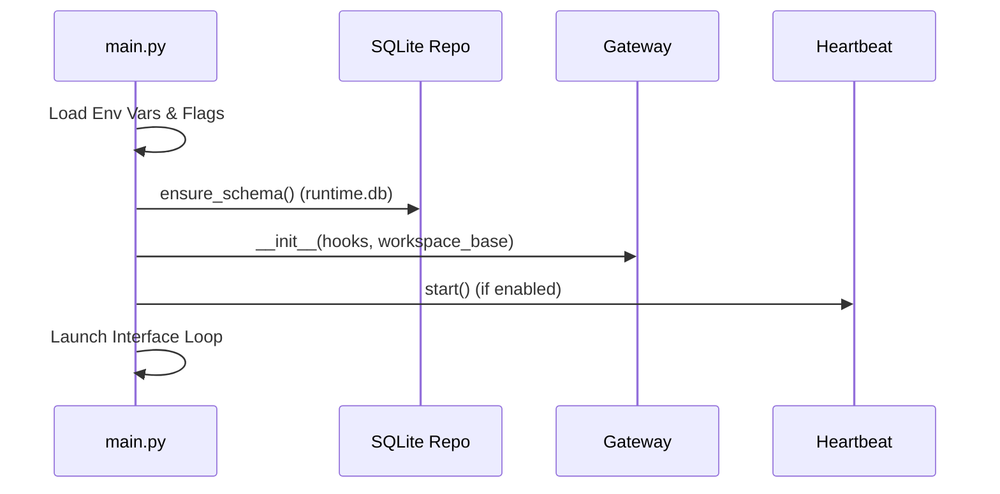

# Running the Agent

The Universal Agent can be executed through multiple interfaces. Each interface communicates with the `InProcessGateway` to manage sessions.

## 1. CLI Mode (Interactive Terminal)

The CLI is the primary development and testing interface. It supports rich formatting, streaming output, and direct access to session logs.

### Basic command

```bash
./START_HERE/START.sh
```

### Options

- `--session-id <id>`: Resume an existing conversation.
- `--force-complex`: Force the agent to use the Universal Reasoning Workflow (URW) orchestrator for the current request.

---

## 2. Web UI (Gradio)

The project includes a modern, interactive Web UI built with **Gradio**. This provides a visual workspace for managing artifacts, research reports, and conversations.

### Launching

```bash
uv run python -m universal_agent.api.gradio_app
```

### Features

- **Conversation Threading**: Clean chat interface with streaming responses.
- **Artifact Preview**: Visual preview of generated markdown reports, PDF edits, and images.
- **Heartbeat Monitor**: Real-time visibility into autonomous agent thoughts.

---

## 3. Telegram Mode

The Universal Agent can run as a persistent assistant on Telegram.

### Launching

```bash
uv run python -m universal_agent.bot.telegram_bot
```

### Features

- **Durable Sessions**: Conversations persist across bot restarts.
- **Global Memory**: Knowledge learned in one chat is accessible in others via the Vector Memory system.
- **File Support**: The agent can process documents uploaded by the user.

---

## 4. Initialization Sequence

Regardless of the interface, the internal startup process follows this flow:



---

## 5. Session Workspaces

Every run creates a dedicated workspace directory in `AGENT_RUN_WORKSPACES/session_<id>`.

- `MEMORY.md`: Core memory log.
- `trace.json`: Low-level SDK logs.
- `run.log`: Console output for that session.
- `artifacts/`: Files produced by tools (images, reports, etc.).
