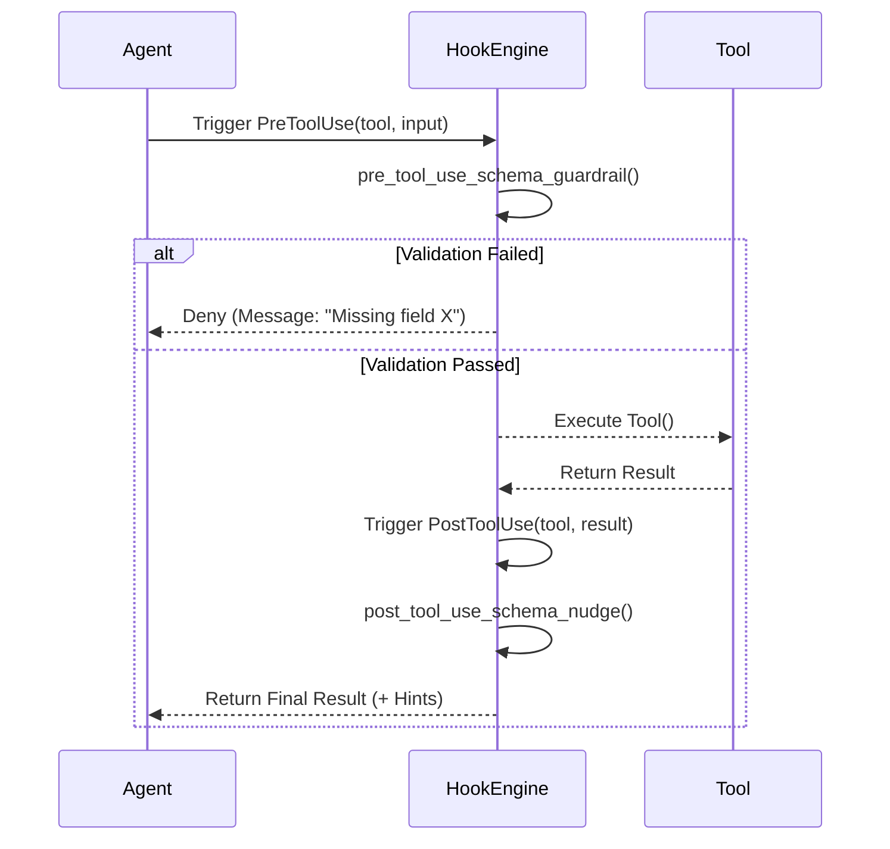

# Hooks Architecture

**Document Version**: 2.0
**Last Updated**: 2026-01-06
**Status**: ACTIVE
**Related Files:**
- `src/universal_agent/agent_core.py` (HookMatcher, EventType)
- `src/universal_agent/main.py` (Hook definitions and registration)
- `src/universal_agent/guardrails/tool_schema.py` (Schema validation hooks)
- `src/universal_agent/prompt_assets.py` (Skill discovery hooks)

---

## Overview

The Hooks Architecture provides a structured way to intercept and modify the agent's behavior at critical lifecycle events. It uses a **Middleware Pattern** where hooks can inspect, block, or modify actions before and after they occur.

## Hook Types

| Hook Type | Trigger Point | Purpose |
|-----------|---------------|---------|
| **PreToolUse** | Before a tool is executed | Validation, Safety, Schema Enforcement, Idempotency |
| **PostToolUse** | After a tool execution | Tool Ledger recording, Failure Analysis, Error Recovery hints |
| **SubagentStop** | When a sub-agent session ends | Verification of artifacts, cleanup, next-step guidance |
| **UserPromptSubmit** | Before user prompt is processed | Skill injection, JIT knowledge retrieval |
| **AgentStop** | When the main agent stops | Harness loop control, Durable state checkpointing |

## Core Hooks Catalog

### 1. Safety & Validation Hooks
**Location**: `src/universal_agent/guardrails/tool_schema.py`

- **`pre_tool_use_schema_guardrail`**
  - **Trigger**: All tools (`*`)
  - **Action**: Validates tool input against defined schema (required fields, content length).
  - **Outcome**: 
    - **Valid**: Proceeds.
    - **Invalid**: Blocks execution, returns `deny` with actionable error message and example.

- **`post_tool_use_schema_nudge`**
  - **Trigger**: All tools (`*`)
  - **Action**: Inspects tool results for "validation error" or missing field errors.
  - **Outcome**: Injects a system message hint with the correct schema example.

### 2. Ledger & Idempotency Hooks
**Location**: `src/universal_agent/main.py`

- **`check_bash_side_effects`** (PreToolUse)
  - **Trigger**: `execute_bash_command`
  - **Action**: Checks if command creates files (e.g., `touch`, `echo >`).
  - **Outcome**: Logs intent for idempotency tracking.

- **`record_tool_use`** (PostToolUse)
  - **Trigger**: all tools
  - **Action**: Records execution details (input, output, duration, status) to `ToolLedger` database.
  - **Outcome**: Persistent audit trail.

### 3. Workflow Control Hooks
**Location**: `src/universal_agent/main.py`

- **`on_subagent_stop`** (SubagentStop)
  - **Trigger**: Sub-agent completion
  - **Action**: Verifies if expected artifacts (reports, tasks) are present.
  - **Outcome**: Returns validation message to main agent (e.g., "Report found" vs "Retry required").

- **`on_agent_stop`** (AgentStop)
  - **Trigger**: Main agent termination
  - **Action**: Checks durability signals (Harness loop).
  - **Outcome**: Triggers restart if "Promise" not met (Ralph Wiggum pattern).

### 4. Skill Injection Hooks
**Location**: `src/universal_agent/main.py`

- **`skill_discovery_hook`** (UserPromptSubmit)
  - **Trigger**: User query submission
  - **Action**: Scans query for keywords matching available skills.
  - **Outcome**: Injects relevant skill documentation into context window (JIT Learning).

## Data Flow



## Configuration

Hooks represent the "Operating System" logic of the agent. They are registered in the `AgentDefinition` in `main.py`:

```python
agent_def = AgentDefinition(
    # ...
    hooks={
        "PreToolUse": [
            HookMatcher(matcher="*", hooks=[pre_tool_use_schema_guardrail]),
            HookMatcher(matcher="execute_bash_command", hooks=[check_bash_side_effects]),
        ],
        "PostToolUse": [
            HookMatcher(matcher="*", hooks=[post_tool_use_schema_nudge, record_tool_use]),
        ],
        "UserPromptSubmit": [
            HookMatcher(matcher="*", hooks=[skill_discovery_hook]),
        ],
        "SubagentStop": [
            HookMatcher(matcher=None, hooks=[on_subagent_stop]),
        ],
        "AgentStop": [
            HookMatcher(matcher=None, hooks=[on_agent_stop]),
        ]
    }
)
```
