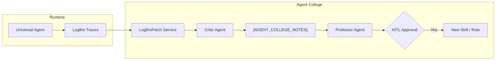

# Agent College Architecture & User Guide

> **Purpose**: Enable the Universal Agent to autonomously learn from its execution history and improve its capabilities through self-correction and skill creation.

## Overview

Agent College is a self-improvement subsystem that:
1. **Observes** the agent's execution traces via Logfire
2. **Analyzes** failures and successes
3. **Proposes** corrections and new skills
4. **Graduates** approved changes into production (Human-in-the-Loop)



---

## Components

### 1. LogfireFetch Service
**Location**: `AgentCollege/logfire_fetch/`

A FastAPI microservice that:
- Queries historical traces from Logfire (`GET /traces/recent`)
- Receives real-time alerts via webhook (`POST /webhook/alert`)
- Connects alerts to the Critic Agent

**Key Files**:
| File | Purpose |
|------|---------|
| `main.py` | FastAPI app, endpoints, Critic integration |
| `logfire_reader.py` | `LogfireQueryClient` wrapper for SQL queries |
| `models.py` | Pydantic schemas (`TraceItem`, `FailureItem`) |
| `config.py` | Environment settings (`LOGFIRE_READ_TOKEN`) |

### 2. Agent College Package
**Location**: `src/universal_agent/agent_college/`

| Module | Role |
|--------|------|
| `critic.py` | Receives failure alerts, writes "Correction Proposals" to Sandbox |
| `scribe.py` | Analyzes successful traces, writes "Fact Proposals" to Sandbox |
| `professor.py` | Reviews Sandbox, proposes Skill creation (HITL gated) |
| `integration.py` | Initializes `[AGENT_COLLEGE_NOTES]` memory block on agent boot |
| `common.py` | Shared constants (`AGENT_COLLEGE_NOTES_BLOCK`) |

### 3. The Sandbox (`[AGENT_COLLEGE_NOTES]`)
A dedicated Core Memory block where all "Proposals" are staged:
- **Safe**: Does NOT directly affect agent behavior
- **Reviewable**: Professor reads this to surface graduation candidates
- **Human-Gated**: Nothing leaves the Sandbox without user approval

---

## How It Works

### The Self-Correction Loop (Critic)
1. Logfire detects an error trace
2. Logfire sends a webhook to `POST /webhook/alert`
3. `LogfireFetch` receives the payload and calls `CriticAgent.propose_correction()`
4. Critic appends a note to `[AGENT_COLLEGE_NOTES]`:
   ```
   [CRITIC 2025-12-27T00:17:27] Trace test_trace_123: Tool X failed with error Y
   ```

### The Skill Graduation Loop (Professor)
1. User (or scheduled trigger) invokes the Professor
2. Professor reads `[AGENT_COLLEGE_NOTES]`
3. Professor surfaces a proposal: *"I recommend creating a skill for PDF handling"*
4. **User approves** → Professor runs `init_skill.py` to scaffold the skill
5. Skill becomes available via `discover_skills()` in `main.py`

---

## Running Agent College

### Prerequisites
```bash
# Ensure LOGFIRE_READ_TOKEN is in .env
grep LOGFIRE_READ_TOKEN .env
```

### Start LogfireFetch Service
```bash
cd /home/kjdragan/lrepos/universal_agent
uv run uvicorn AgentCollege.logfire_fetch.main:app --port 8000
```

### Run the Agent (Sandbox Auto-Initialized)
```bash
PYTHONPATH=src uv run python -m universal_agent.main
```
On boot, you should see:
```
🧠 Injected Core Memory Context (XXX chars)
```
The `[AGENT_COLLEGE_NOTES]` block is now part of the agent's context.

### Test the Webhook
```bash
curl -X POST -H "Content-Type: application/json" \
  -d '{"trace_id": "test", "error": "example failure"}' \
  http://localhost:8000/webhook/alert
```
Expected response: `{"status": "proposed_to_sandbox", ...}`

---

## Configuration

| Variable | Location | Description |
|----------|----------|-------------|
| `LOGFIRE_READ_TOKEN` | `.env` | Token for querying Logfire history |
| `PROFESSOR_CHECK_INTERVAL` | (Future) | Periodic trigger interval for Professor |

---

## Future Enhancements

1. **Periodic Professor Runs**: Configurable cron-like trigger
2. **Logfire Evals Integration**: Use `logfire.testing` for skill validation
3. **Auto-Graduation**: Confidence-based auto-approval for low-risk rules
4. **Scribe Session Summaries**: End-of-session fact extraction

---

## Related Documentation

- [034_LETTA_MEMORY_SYSTEM_MANUAL.md](file:///home/kjdragan/lrepos/universal_agent/Project_Documentation/034_LETTA_MEMORY_SYSTEM_MANUAL.md) - Core Memory architecture
- [028_CLAUDE_SKILLS_INTEGRATION.md](file:///home/kjdragan/lrepos/universal_agent/Project_Documentation/028_CLAUDE_SKILLS_INTEGRATION.md) - Skill creation patterns
- [AgentCollege/ARCHITECTURE.md](file:///home/kjdragan/lrepos/universal_agent/AgentCollege/ARCHITECTURE.md) - Design notes
