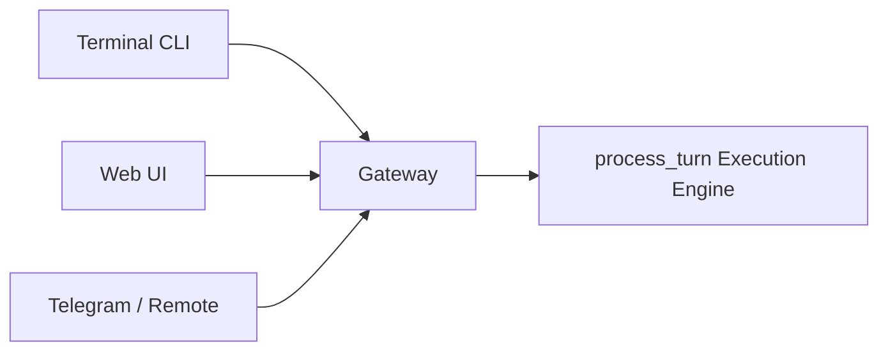

# 17. Execution Engine + Gateway Development Plan (Outline)

This document is a **planning shell** intended to guide another AI coder. It reflects the current issue (divergent CLI vs web UI behavior) and proposes a practical, incremental path toward a unified execution engine + gateway model. It is **not** the only possible approach, but it is the most direct route based on our current codebase.

---

## 1. Problem recap (from current state)

We have **multiple execution paths**:

- **CLI / terminal path** (stable, trusted)
- **Web UI / AgentBridge path** (timeouts, divergent behavior)
- **Harness path** (complex, optional gateway fallback)

This divergence causes:
- inconsistent tool usage,
- inconsistent output locations,
- difficulty debugging and validating behavior.

**Goal:** move all interfaces (CLI, Web UI, remote clients) to the *same* execution engine, with a gateway acting as the control plane.

---

## 2. Target architecture (summary)

- **Canonical execution engine** = CLI `process_turn` path.
- **Gateway** = stable session manager + event hub.
- **Clients** (CLI, Web UI, remote) only send input and receive events.



---

## 3. Proposed development plan (outline)

### Phase 0 — Verify current baseline
**Purpose:** capture today’s behavior so improvements are measurable.

**Suggested steps:**
1. Run the same prompt in CLI, Web UI, and harness.
2. Record tool call count, output path, time-to-first-token, and completion status.
3. Save logs and compare.

**Suggested artifacts:**
- A minimal script or checklist for repeatable comparisons.

---

### Phase 1 — Route Web UI through the canonical engine
**Purpose:** eliminate the “second engine” path in the web backend.

**Code touchpoints:**
- `src/universal_agent/api/agent_bridge.py`
- `src/universal_agent/api/server.py`
- `src/universal_agent/main.py` (`process_turn`)

**Recommended change (high level):**
Replace the Web UI’s direct `UniversalAgent.run_query(...)` path with a call into the same `process_turn(...)` path used by CLI/harness.

**Illustrative snippet (conceptual, not exact signature):**
```python
# agent_bridge.py (conceptual)
from universal_agent.main import process_turn, ClaudeSDKClient

async def execute_query(self, query: str):
    client = ClaudeSDKClient()  # same client used by CLI path
    result = await process_turn(
        client=client,
        user_input=query,
        workspace_dir=self.current_agent.workspace_dir,
        force_complex=False,
    )
    # emit events based on result / trace
```

**Goal:** Web UI runs the **same logic** as CLI.

---

### Phase 2 — Enforce workspace‑scoped paths
**Purpose:** ensure that tools only read/write inside the session workspace.

**Code touchpoints:**
- `src/universal_agent/hooks.py`
- `src/universal_agent/guardrails/*` (new or existing guardrail)

**Illustrative guardrail snippet:**
```python
def enforce_workspace_path(file_path: str, workspace_root: Path) -> Path:
    resolved = Path(file_path).expanduser().resolve()
    root = workspace_root.resolve()
    if root not in resolved.parents and resolved != root:
        raise ValueError("Path must stay inside session workspace")
    return resolved
```

**Goal:** prevent cross-workspace writes and stop the web UI from writing into repo root.

---

### Phase 3 — Standardize session lifecycle in gateway
**Purpose:** ensure consistent session creation/resume across all clients.

**Code touchpoints:**
- `src/universal_agent/gateway.py`
- `src/universal_agent/api/agent_bridge.py`

**Recommended change (high level):**
Make gateway session creation/resume the *only* session entry point, and have the CLI invoke the same gateway in “local mode.”

**Illustrative snippet:**
```python
# cli entry path (conceptual)
gateway = InProcessGateway()
session = await gateway.create_session(user_id="user_cli")
result = await gateway.run_query(session, GatewayRequest(user_input=prompt))
```

---

### Phase 4 — Event parity + UI verification
**Purpose:** ensure Web UI shows the same events/outputs as CLI.

**Checklist:**
- tool_call/tool_result events appear in Web UI
- work_products are reported with correct session paths
- errors map cleanly into UI event stream

---

### Phase 5 — Regression test (single prompt, 3 entry points)
**Purpose:** verify “same prompt → same behavior.”

**Suggested test target:**
Run the 013 summary prompt via CLI, Web UI, and harness; compare:
- tool call count
- output file location
- completion status

---

## 4. Suggested doc addendum (for other reviewers)

If another AI coder reviews this plan, they should focus on:
- Whether `process_turn` is the correct canonical engine.
- Whether gateway session management is the right single entry point.
- Whether any tool or guardrail policies must move to the gateway layer.

---

## 5. Optional enhancements (nice to have)

- Add a small **session‑warmup** step to reduce `initialize` timeouts.
- Add a **token usage UI feed** from a single source (gateway trace).
- Add a **“local-only fast path”** flag for CLI debugging.

