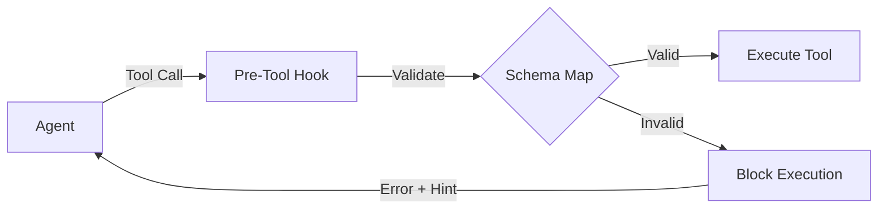

# Tool Schema Guardrails

**Document Version**: 2.0
**Last Updated**: 2026-01-06
**Status**: ACTIVE
**Related Files:**
- `src/universal_agent/guardrails/tool_schema.py`
- `src/universal_agent/agent_core.py` (Integration)

---

## Overview

Tool Schema Guardrails provide a safety layer that validates tool inputs *before* they reach the execution layer. This prevents "garbage in, garbage out" errors and provides immediate, actionable feedback to the agent when it constructs malformed tool calls.

## Architecture

The system uses a **Pre-Tool-Use Hook** (`pre_tool_use_schema_guardrail`) that intercepts every tool call.

## Defined Schemas

The following tools have enforced schemas defined in `src/universal_agent/guardrails/tool_schema.py`:

### Native Tools

| Tool | Required Fields | Min Length | Validator Notes |
|------|-----------------|------------|-----------------|
| `write` | `file_path`, `content` | `content` (>10 chars) | Native Claude SDK tool replacement for `write_local_file`. Prevents empty writes. |

### Local Toolkit (Legacy/Compat)

| Tool | Required Fields | Min Length | Notes |
|------|-----------------|------------|-------|
| `write_local_file` | `path`, `content` | `content` (>10 chars) | **Deprecated**. Kept for error handling if model hallucinates old tool. |
| `read_local_file` | `path` | - | **Deprecated**. Replaced by native `Read`. |
| `list_directory` | `path` | - | |
| `upload_to_composio` | `path`, `tool_slug`, `toolkit_slug` | - | One-step S3 upload wrapper |

### Composio Tools (Curated)

| Tool | Required Fields | Examples/Notes |
|------|-----------------|----------------|
| `gmail_send_email` | `subject`, `body`, (`recipient_email` OR `to`) | Enforces checking ONE OF recipient fields |
| `composio_search_web` | `query` | |
| `composio_search_news` | `query` | |
| `composio_multi_execute_tool` | `tools` | Complex structure validation |

## Validation Logic

1. **Required Fields**: Checks if all fields in `required` tuple are present in `tool_input`.
2. **Conditional Requirements**: Checks `required_any` groups (at least one field from group must exist).
3. **Content Length**: Enforces minimum string length (e.g., `content` > 10 chars) to prevent empty file creation loops.
4. **Empty Strings**: Treats empty strings as missing values for required fields.

## Error Handling

When validation fails:
1. **Blocks Execution**: The tool is NOT executed.
2. **Returns System Message**:
   > `⚠️ Invalid {tool_name} call. Missing required fields: {missing_fields}. Example: {schema_example}`
3. **Logs Warning**: Structured log with `tool_validation_failed` event.

This immediate feedback loop allows the agent to self-correct in the very next turn without wasting an execution cycle or causing side effects.
