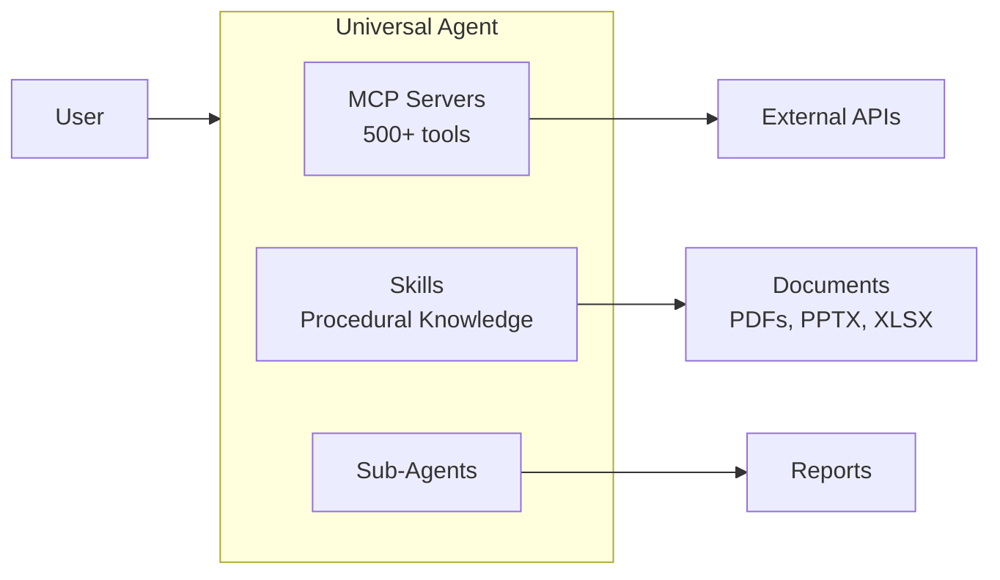

# Claude Skills Integration

**Date:** December 25, 2025
**Status:** ACTIVE
**Related Files:**
- `.claude/skills/` - Installed skills directory
- `src/universal_agent/main.py` - Agent system prompt (skills awareness)

---

## Overview

**Claude Skills** are model-invoked knowledge modules that extend Claude's capabilities through structured instructions, scripts, and resources. Skills are stored in `.claude/skills/` and automatically loaded based on task relevance.



---

## Key Concepts

| Concept | Description |
|---------|-------------|
| **Model-Invoked** | Claude autonomously decides when to use skills based on task + description |
| **Progressive Disclosure** | Only skill metadata loaded initially; full instructions on invocation |
| **Composable** | Multiple skills can work together on complex tasks |

---

## Skill File Structure

```
skill-name/
├── SKILL.md           # Required: YAML frontmatter + markdown instructions
├── scripts/           # Optional: Python/Bash scripts
├── references/        # Optional: Documentation to load into context
└── assets/            # Optional: Templates, icons, fonts
```

### SKILL.md Format

```yaml
---
name: "Skill Name"
description: "Clear description of what skill does and when to use it"
---

# Skill Instructions

Detailed markdown instructions that Claude follows when skill is invoked.
```

---

## Installed Skills

### Document Skills

| Skill | Purpose | Use Case |
|-------|---------|----------|
| `pdf` | PDF reading, creation, editing | "Create a PDF report", "Read this PDF" |
| `docx` | Word document creation | "Create a Word document" |
| `pptx` | PowerPoint creation | "Make a presentation" |
| `xlsx` | Excel spreadsheet handling | "Create a spreadsheet" |

### Development Skills

| Skill | Purpose | Use Case |
|-------|---------|----------|
| `skill-creator` | Design new skills | "Create a skill for X" |
| `mcp-builder` | Build MCP servers | "Build an MCP server for Y" |
| `frontend-design` | UI/UX patterns | "Design a dashboard" |
| `webapp-testing` | Test web applications | "Test this web app" |

---

## How Skills Work with Our System

### Skill vs MCP Tool Decision Matrix

| Need | Use Skill | Use MCP Tool |
|------|-----------|--------------|
| Procedural multi-step task | ✅ PDF creation workflow | |
| Single API call | | ✅ Gmail send |
| Complex document generation | ✅ PPTX with structure | |
| Data retrieval | | ✅ Web search |
| Design patterns | ✅ Frontend design | |
| External integration | | ✅ Composio tools |

### Integration Points

1. **Claude Code**: Skills loaded automatically from `.claude/skills/`
2. **Claude SDK Agent**: Can inject skill awareness via system prompt
3. **Sub-Agents**: Skills available to all agents with access to `.claude/skills/`

---

## Creating Custom Skills

Use the `skill-creator` skill:

```
"Create a skill for [your workflow]"
```

Claude will:
1. Gather examples of the task
2. Plan reusable components (scripts, templates)
3. Generate proper SKILL.md structure
4. Test and refine

### Custom Skill Ideas for Our System

| Skill Idea | Purpose |
|------------|---------|
| `research-report` | Standard research report workflow |
| `composio-integration` | Patterns for Composio tool usage |
| `email-attachment` | Proper attachment handling workflow |
| `local-first-processing` | Local vs remote execution decisions |

---

## Best Practices

1. **Keep descriptions actionable** - Clearly state WHAT and WHEN
2. **Use examples** - Input/output pairs improve reliability
3. **Include scripts** - For deterministic parts of workflows
4. **Test incrementally** - Verify each component works
5. **Stay focused** - One skill = one capability

---

## References

- [Claude Code Skills Docs](https://code.claude.com/docs/en/skills)
- [Anthropic Skills Repo](https://github.com/anthropics/skills)
- [Agent Skills Standard](https://agentskills.io)
- [Skill Authoring Best Practices](https://platform.claude.com/docs/en/agents-and-tools/agent-skills/best-practices)

---

*Document Version: 1.0*
*Last Updated: December 25, 2025*
