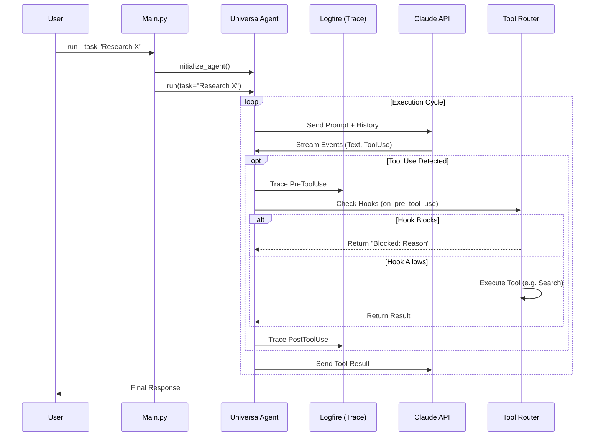

# System Overview

## High-Level Architecture
The Universal Agent runs as a local python process that wraps the Anthropic `ClaudeAgent` SDK. It adds a "Durability Layer" (sqlite) and a "Tool Router" (Composio/Native) to create a robust execution environment.

```mermaid
graph TD
    User[User / Developer] -->|CLI or Telegram| Main[main.py Entry Point]
    Main -->|Init| Agent[UniversalAgent Class]
    
    subgraph "Core Loop"
        Agent -->|Think| Claude[Claude API]
        Claude -->|Tool Call| Router[Tool Router]
        Router -->|Intercept| Hooks[Guardrail Hooks]
        Hooks -->|Execute| Tools[Composio / Native Tools]
        Tools -->|Result| Agent
    end
    
    subgraph "State & Memory"
        Agent -.->|Persist| DB[(SQLite Durability DB)]
        Agent -.->|Recall| Memory[MemoryManager (Letta)]
    end
```

## The Life of a Request (Sequence Diagram)
This diagram illustrates what happens when you run `python main.py --task "Research X"`.



## Core Components
1.  **The Dispatcher (`main.py`)**: Handles CLI arguments, environment setup (`uv`), and initializes the `UniversalAgent`.
2.  **UniversalAgent (`agent_core.py`)**: The wrapper around the SDK. It manages:
    *   **Configuration**: Model selection, tool whitelist/blacklist.
    *   **Event Handling**: Streaming text to stdout/files.
    *   **Durability**: Writing every step to the `run_history` database.
3.  **Hooks**: The agent does not blindly execute tools. Every tool call passes through `malformed_tool_guardrail_hook` to prevent common LLM syntax errors (like invalid XML) from crashing the runtime.
