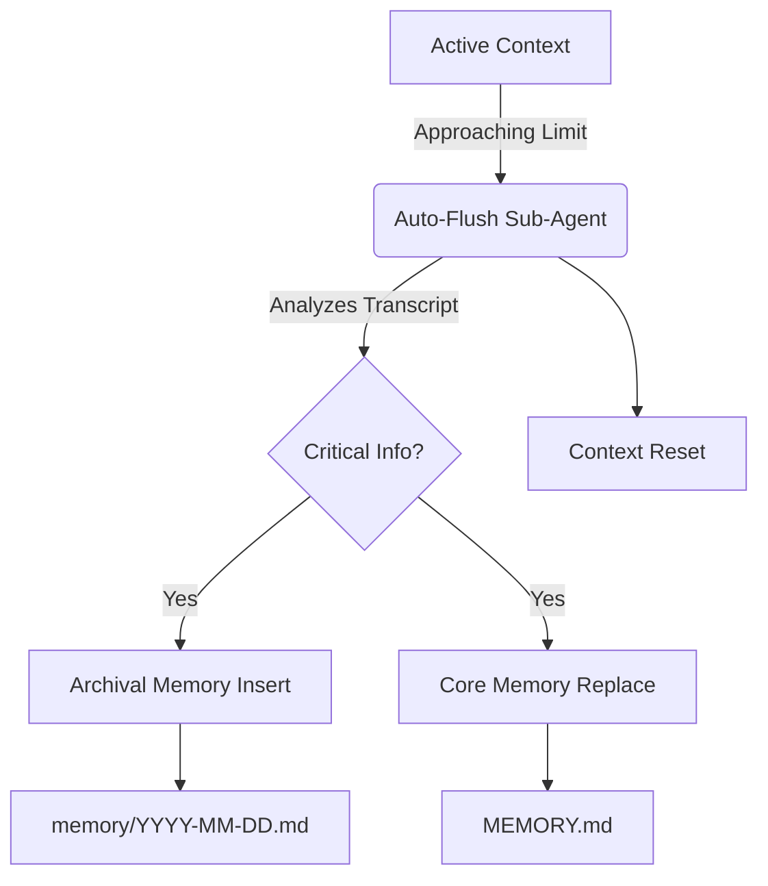

# Hindsight Memory System

**Status:** Implemented (v2.0)
**Architecture:** Hindsight (Clawdbot Parity)

## Overview

Reflecting the architecture of the Clawdbot codebase, the Universal Agent uses a **"Hindsight" Memory System**. This system is characterized by:

1. **File-Based Persistence**: Markdown files (`memory/YYYY-MM-DD.md`) serve as the source of truth.
2. **Episodic & Semantic**:
    - **Archival Memory**: Narrative facts stored in daily logs.
    - **Core Memory**: Persistent instructions and facts about the user/agent stored in `MEMORY.md`.
3. **Auto-Flush Mechanism**: A dedicated sub-agent that wakes up when the context window is full to summarize and persist data before the active context is reset.

## Architecture

## Auto-Flush Mechanism

The **Auto-Flush Sub-Agent** is a specialized loop injected into `main.py`.

- **Trigger**: `UA_TRUNCATION_THRESHOLD` (default 150k tokens).
- **Action**: Spawns a new agent instance with a fresh context.
- **Input**: The full conversation transcript of the dying session.
- **Directive**: "Analyze transcript for facts/decisions. Save them. Do not chat."
- **Tools**: `archival_memory_insert`, `core_memory_replace`.

## Tools

Users and agents can explicitly interact with memory via MCP tools:

- `archival_memory_insert(content, tags)`: Add a fact to the daily log.
- `archival_memory_search(query)`: Semantic search over past logs.
- `core_memory_replace(section, value)`: Update a persistent block in `MEMORY.md`.
- `get_core_memory_blocks()`: Read active core memory.

## Configuration

Control the system via environment variables:

- `UA_MEMORY_ENABLED=1`: Master switch.
- `UA_TRUNCATION_THRESHOLD=150000`: Token count to trigger auto-flush.
- `UA_CONTEXT_WINDOW=200000`: Total window size.

## Legacy Note

Previous documentation referenced "Letta" or "MemGPT". These were experimental directions that have been superseded by this Hindsight implementation to maintain parity with the proven Clawdbot architecture.
