# URW Harness Flow Visualization
## Based on Session: session_20260117_173325_c8d8096d

This document visualizes the **Universal Ralph Wrapper (URW) Harness** execution flow using Mermaid diagrams.

> **View Options**:
> 1.  **IDE Preview**: If this fails to render in VS Code (ServiceWorker error), please use option 2.
> 2.  **Browser View**: Open the companion file **`071_URW_FLOW_EXPLANATION.html`** in your browser for a guaranteed high-quality render.

---

### 1. High-Level Architecture (The "Brain")

The URW Harness acts as a project manager, orchestrating the `UniversalAgent` through distinct phases.

```mermaid
graph TD
    User([User Request]) --> Launch[CLI / Script Launch]
    Launch --> Orch{URW Orchestrator}
    
    subgraph Planning ["🧠 Planning"]
        Orch -->|1. Request Strategy| Planner[Phase Planner]
        Planner -->|2. Return Phased Plan| Orch
    end
    
    subgraph Execution ["⚙️ Execution Loop"]
        Orch -->|3. Start Phase| Agent[Universal Agent]
        Agent -->|Tool Calls| Tools[File System / Internet]
        Tools -->|Results| Agent
        Agent -->|Write| Artifacts[(Workspace Artifacts)]
        Agent -->|Task Complete| Eval[Composite Evaluator]
    end
    
    Eval -->|4. Verification| Orch
    Orch -->|5. Next Phase| Agent

    classDef human fill:#ff9999,stroke:#333,stroke-width:2px;
    classDef brain fill:#99ccff,stroke:#333,stroke-width:2px;
    classDef worker fill:#99ff99,stroke:#333,stroke-width:2px;
    
    class User human;
    class Orch,Planner brain;
    class Agent,Eval worker;
```

---

### 2. The Phase Execution Loop (Zooming In)

Focusing on **Phase 1: Define Scope** from the current session.

```mermaid
sequenceDiagram
    autonumber
    participant Orch as 🧠 Orchestrator
    participant Agent as 🤖 Universal Agent
    participant FS as 📂 File System
    
    Note over Orch, Agent: Phase 1 Starts
    Orch->>Agent: Initialize(Task="Define Scope")
    
    rect rgb(240, 248, 255)
        Note right of Agent: Agent Thinking & Working
        Agent->>Agent: "I need to plan the research."
        Agent->>FS: Write "research_scope.md"
        FS-->>Agent: Success
        
        Agent->>Agent: "Ready for next phase."
        Agent->>FS: Write "handoff.json"
        FS-->>Agent: Success
    end
    
    Agent->>Orch: Task Completed
    Orch->>FS: Verify "research_scope.md" exists?
    FS-->>Orch: Yes
    Orch->>Orch: Mark Phase 1 Complete
```

---

### 3. File & Artifact Structure

The system enforces strict isolation by creating a new directory for every session.

```mermaid
graph LR
    Root[urw_sessions/] --> Session[session_2026...]
    
    subgraph SessionDir ["📁 Session Directory"]
        Session --> Trace[trace.json]
        Session --> Workspace[workspace/]
        
        Workspace --> Artifacts[artifacts/]
        Workspace --> Downloads[downloads/]
    end
    
    subgraph Content ["📄 Key Artifacts"]
        Artifacts --> Scope[research_scope.md]
        Artifacts --> Handoff[handoff.json]
        Artifacts --> Report[final_report.html]
    end
    
    style Trace fill:#ffcccc,stroke:#333
    style Scope fill:#ccffcc,stroke:#333
    style Handoff fill:#ccccff,stroke:#333
```

