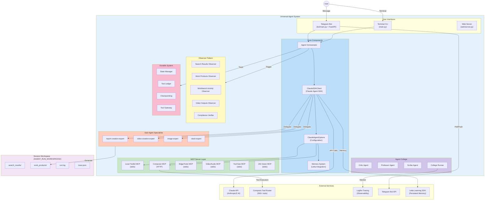

# Overall System Architecture

**Document Version**: 2.0
**Last Updated**: 2026-01-05
**Component**: Universal Agent
**Primary Files**: `src/universal_agent/main.py` (~5,588 lines)

---

## Table of Contents

1. [Executive Summary](#executive-summary)
2. [High-Level System Overview](#high-level-system-overview)
3. [Core Components](#core-components)
4. [Component Relationships](#component-relationships)
5. [New Architecture Modules](#new-architecture-modules)
6. [Data Flow Architecture](#data-flow-architecture)
7. [Deployment Architecture](#deployment-architecture)
8. [Technology Stack](#technology-stack)

---

## Executive Summary

The Universal Agent is a **standalone AI agent system** built on the Claude Agent SDK with Composio Tool Router integration. It implements a dual-path execution model (Fast Path for simple queries, Complex Path for tool-enabled workflows) with comprehensive observability via Logfire distributed tracing. The system is accessible via both a **Terminal Interface** and a **Telegram Bot**.

### Key Characteristics

| Aspect | Description |
|--------|-------------|
| **Architecture Pattern** | Event-driven, Observer pattern, Sub-agent delegation, Durable state |
| **Execution Model** | Dual-path: Simple (direct) vs Complex (tool loop) |
| **Interfaces** | CLI (prompt_toolkit), Telegram (aiogram + FastAPI), Web (FastAPI) |
| **Tool Integration** | MCP (Model Context Protocol) servers - 6 configured |
| **Observability** | Logfire distributed tracing (Dual Trace: Main + Subprocess) |
| **State Management** | Per-session workspace + Durable SQLite state with checkpointing |
| **Communication** | HTTP (remote MCP) + stdio (local MCP) + Telegram Webhook/Polling |
| **Memory System** | Letta Learning SDK integration for persistent sub-agent memory |

---

## High-Level System Overview

### System Context Diagram



---

## Core Components

### 1. ClaudeSDKClient (Main Agent Brain)

**Location**: `src/universal_agent/main.py` (lines 1-5588)

**Purpose**: The primary interface for Claude Agent SDK, managing conversation state, tool execution, and sub-agent delegation.

**Key Responsibilities**:
- Classifying queries (SIMPLE vs COMPLEX) with `_is_memory_intent()` heuristic
- Executing the ReAct loop via `process_turn()`
- Routing tasks to specific Sub-Agents via Task tool
- Managing hooks (SubagentStop, PreToolUse, PostToolUse, UserPromptSubmit)
- Integrating with Letta for persistent memory
- Applying "Just-In-Time" (JIT) guidance via Knowledge Base

**Major Functions**:
| Function | Line | Purpose |
|----------|------|---------|
| `classify_query()` | ~3950 | Determines SIMPLE vs COMPLEX |
| `handle_simple_query()` | ~4005 | Fast path for direct answers |
| `process_turn()` | ~4765 | Main turn orchestrator |
| `run_conversation()` | ~3478 | Tool loop execution |
| `on_subagent_stop()` | ~1689 | Post-subagent verification |
| `main()` | ~4941 | Entry point and event loop |

### 2. Memory System (Letta Integration)

**Location**: `src/universal_agent/main.py` (lines 333-525)

**Purpose**: Provides persistent memory for sub-agents via Letta Learning SDK.

**Memory Blocks**:
- `human` - User preferences and interactions
- `system_rules` - Architectural guidelines
- `project_context` - Project-specific knowledge
- `recent_queries` - Recent requests with timestamps
- `recent_reports` - Latest reports with metadata

### 3. Bot Integration (Modular Architecture)

**Location**: `src/universal_agent/bot/`

**Components**:
- `main.py` - FastAPI application with webhook support
- `agent_adapter.py` - Adapter pattern for agent integration
- `task_manager.py` - Async task execution with status tracking
- `telegram_handlers.py` - Command handlers (/start, /help, /status, /continue, /new)
- `telegram_formatter.py` - MarkdownV2 response formatting
- `execution_logger.py` - Stdout/stderr capture to files

**Key Features**:
- Hybrid webhook + polling mode
- Per-user session management
- Async task queue with configurable concurrency
- Automatic webhook registration with fallback to polling

---

## Component Relationships

### Module Structure

```
src/universal_agent/
├── main.py                  # Main CLI agent (~5588 lines)
├── agent_core.py            # Agent core abstractions
├── worker.py                # Background worker
├── prompt_assets.py         # Prompt template management
├── search_config.py         # Search tool configuration
├── server.py                # Server components
├── transcript_builder.py    # Session transcript generation
│
├── bot/                     # Telegram Bot (modular)
│   ├── main.py             # FastAPI + webhook entry
│   ├── agent_adapter.py    # Agent integration adapter
│   ├── task_manager.py     # Async task management
│   ├── telegram_handlers.py # Command handlers
│   ├── telegram_formatter.py # Response formatting
│   ├── execution_logger.py # Output capture
│   └── config.py           # Bot configuration
│
├── observers/               # Observer Pattern (NEW)
│   ├── __init__.py
│   └── core.py             # 5 observer functions
│
├── durable/                 # State Management (NEW)
│   ├── db.py               # SQLite database operations
│   ├── state.py            # Run lifecycle management
│   ├── ledger.py           # Tool call audit trail
│   ├── checkpointing.py    # State snapshots
│   ├── tool_gateway.py     # Policy-based execution
│   ├── migrations.py       # Database schema
│   ├── normalize.py        # Data normalization
│   └── classification.py   # Content classification
│
├── guardrails/              # Tool Schema Validation (NEW)
│   └── tool_schema.py      # Schema validation
│
├── agent_operator/          # CLI for Agent Operations (NEW)
│   ├── operator_cli.py     # Interactive CLI
│   ├── operator_db.py      # Database queries
│   └── __main__.py         # Entry point
│
├── agent_college/           # Agent College (Self-Improvement)
│   ├── runner.py           # Main event loop
│   ├── critic.py           # Failure analysis
│   ├── professor.py        # Review and skills
│   ├── scribe.py           # Success analysis
│   ├── logfire_reader.py   # Trace queries
│   ├── config.py           # Configuration
│   ├── integration.py      # Setup functions
│   └── common.py           # Shared constants
│
├── identity/                # User Identity (NEW)
│   └── registry.py         # Identity management
│
└── utils/
    └── composio_discovery.py # Tool discovery

AgentCollege/                 # Separate Service
└── logfire_fetch/
    └── main.py              # FastAPI for Logfire webhooks

src/
├── mcp_server.py            # Local Toolkit MCP (10+ tools)
├── tools/
│   └── workbench_bridge.py  # Local-Remote file transfer
└── web/
    └── server.py            # Web interface
```

---

## New Architecture Modules

### 1. Observers Module (`observers/`)

**Purpose**: Async fire-and-forget artifact processing

**Functions**:
- `observe_and_save_search_results()` - SERP artifact cleaning and storage
- `observe_and_save_workbench_activity()` - Code execution logging
- `observe_and_save_work_products()` - Dual-save to persistent storage
- `observe_and_save_video_outputs()` - Media file tracking
- `verify_subagent_compliance()` - Quality assurance verification

**Integration**: Spawned via `asyncio.create_task()` in main.py lines 3807-3838

### 2. Durable System (`durable/`)

**Purpose**: Persistent state management with checkpointing

**Components**:
- **State Manager** - Run lifecycle, session management, lease control
- **Checkpointing** - Full state snapshots for resume capability
- **Tool Ledger** - Audit trail of all tool calls
- **Tool Gateway** - Policy-based execution with idempotency
- **Database** - SQLite with runs, steps, tools, receipts, checkpoints tables

**Status**: Phases 0-3 implemented

### 3. Guardrails (`guardrails/`)

**Purpose**: Tool schema validation and safety

**Features**:
- Required field checking
- Content length validation
- Example hints for invalid calls
- Pre-tool-use and post-tool-use guards

### 4. Agent Operator (`agent_operator/`)

**Purpose**: CLI for administrative operations

**Capabilities**:
- View agent runs and tool calls
- Inspect execution traces
- Manage agent workspace
- Cancel running tasks

### 5. Agent College (`agent_college/`)

**Purpose**: Self-improvement subsystem

**Agents**:
- **Critic** - Analyzes failures and proposes corrections
- **Professor** - Reviews notes and creates skills
- **Scribe** - Records facts from successful traces

**Architecture**: Hybrid - embedded agents + separate LogfireFetch service

---

## Data Flow Architecture

### Query Flow

```
User Input
    ↓
Query Classification (SIMPLE vs COMPLEX)
    ↓
[Complex Path] → Sub-Agent Delegation (report-creation-expert)
    ↓
Claude Agent SDK (Main Brain)
    ├─→ Composio MCP Server (500+ tools)
    ├─→ Local Toolkit MCP (crawl_parallel, write_local_file, etc.)
    ├─→ External MCPs (edgartools, video_audio, youtube, zai_vision)
    └─→ Skills (.claude/skills/)
    ↓
Observer Pattern (async artifact processing)
    ↓
Durable System (state tracking, checkpointing)
    ↓
AGENT_RUN_WORKSPACES/session_*/ (artifacts)
```

### MCP Server Configuration

**Location**: `main.py` lines 4427-4470

| Server | Type | Purpose |
|--------|------|---------|
| `composio` | HTTP | 500+ SaaS integrations |
| `local_toolkit` | stdio | Local file ops, web extraction |
| `edgartools` | stdio | SEC Edgar research |
| `video_audio` | stdio | FFmpeg video/audio editing |
| `youtube` | stdio | yt-dlp downloads |
| `zai_vision` | stdio | GLM-4.6V analysis |

---

## Deployment Architecture

### Local Development

```bash
# Run CLI Agent + Agent College
./local_dev.sh

# Manual: Run CLI Agent only
PYTHONPATH=src uv run python -m universal_agent.main

# Manual: Run Agent College
PYTHONPATH=src uv run uvicorn AgentCollege.logfire_fetch.main:app --port 8001

# Run Telegram Bot
PYTHONPATH=src uv run uvicorn universal_agent.bot.main:app --port 8000
```

### Railway Deployment

**Production**: `https://web-production-3473.up.railway.app`

**Container**: Monolithic (Bot + Agent College)

**Endpoints**:
- Webhook: `/webhook`
- Health: `/health`

**Persistence**: Railway Volume at `/app/data`

---

## Technology Stack

**Languages**: Python 3.12+
**Core Framework**: Claude Agent SDK
**Tooling**:
- Composio Tool Router (500+ tools)
- MCP (Model Context Protocol) - 6 servers
- FastMCP (local MCP framework)

**Interfaces**:
- prompt_toolkit (CLI)
- aiogram + FastAPI (Telegram Bot)
- FastAPI (Web)

**Observability**:
- Pydantic Logfire (distributed tracing)
- SQLite (durable state)

**Memory**:
- Letta Learning SDK (persistent sub-agent memory)

**Dependency Management**: `uv`

---

## Architecture Evolution

### Key Changes from Initial Design

| Previous | Current |
|----------|---------|
| `main.py` ~2600 lines | `main.py` ~5588 lines |
| `src/telegram_bot.py` | `src/universal_agent/bot/` (modular) |
| Observers in main.py | `src/universal_agent/observers/` module |
| No state persistence | `src/universal_agent/durable/` system |
| No validation | `src/universal_agent/guardrails/` |
| 2 MCP servers | 6 MCP servers |
| No self-improvement | Agent College subsystem |
| No persistent memory | Letta Learning SDK integration |

---

**Document Status**: ✅ Active & Updated
**Last System Sync**: 2026-01-05
**Maintainer**: Universal Agent Team
