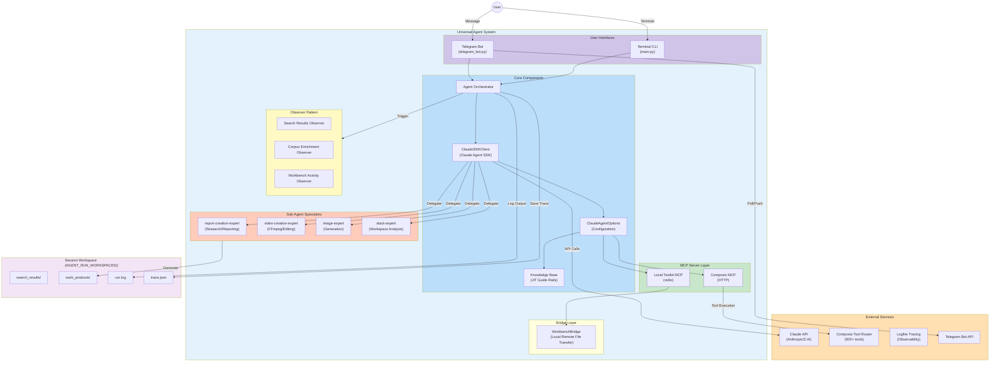
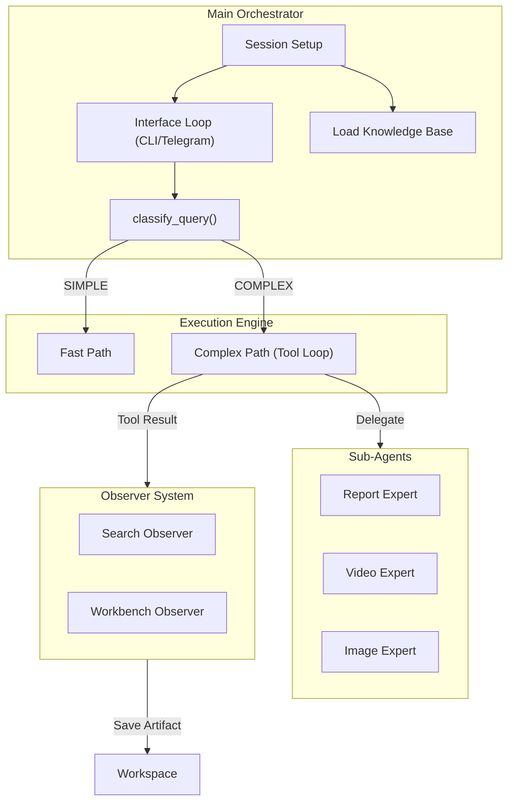
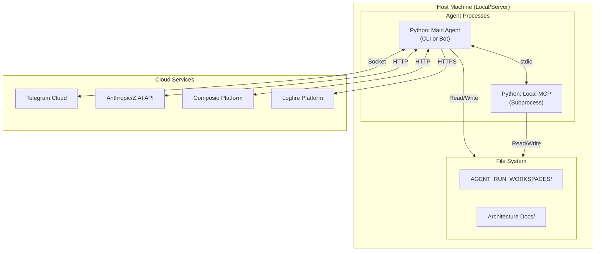

# Overall System Architecture

**Document Version**: 1.1
**Last Updated**: 2025-12-29
**Component**: Universal Agent
**Primary Files**: `src/universal_agent/main.py`, `src/mcp_server.py`, `src/telegram_bot.py`

---

## Table of Contents

1. [Executive Summary](#executive-summary)
2. [High-Level System Overview](#high-level-system-overview)
3. [Core Components](#core-components)
4. [Component Relationships](#component-relationships)
5. [Key Subsystems](#key-subsystems)
6. [Data Flow Architecture](#data-flow-architecture)
7. [Deployment Architecture](#deployment-architecture)
8. [Technology Stack](#technology-stack)

---

## Executive Summary

The Universal Agent is a **standalone AI agent system** built on the Claude Agent SDK with Composio Tool Router integration. It implements a dual-path execution model (Fast Path for simple queries, Complex Path for tool-enabled workflows) with comprehensive observability via Logfire distributed tracing. The system is accessible via both a **Terminal Interface** and a **Telegram Bot**.

### Key Characteristics

| Aspect | Description |
|--------|-------------|
| **Architecture Pattern** | Event-driven, Observer pattern, Sub-agent delegation |
| **Execution Model** | Dual-path: Simple (direct) vs Complex (tool loop) |
| **Interfaces** | CLI (prompt_toolkit) and Telegram (aiogram) |
| **Tool Integration** | MCP (Model Context Protocol) servers |
| **Observability** | Logfire distributed tracing (Dual Trace: Main + Subprocess) |
| **State Management** | Per-session workspace with artifact persistence |
| **Communication** | HTTP (remote MCP) + stdio (local MCP) + Telegram Polling |

---

## High-Level System Overview

### System Context Diagram

### Discussion: System Context

This diagram illustrates the complete system boundaries and external dependencies:

1.  **Dual Interfaces**: The system can be operated via:
    *   **CLI**: Direct terminal interaction.
    *   **Telegram Bot**: Remote messaging interface.

2.  **External Services**:
    *   **Claude API**: LLM inference.
    *   **Composio API**: 500+ integrations.
    *   **Logfire API**: Distributed tracing.
    *   **Telegram API**: Messaging platform.

3.  **Core Components**: Main logic, configuration, and the **Knowledge Base** (JIT Guide Rails) which directs high-level behavior.

4.  **Sub-Agents**: Specialized agents for Reports, Video, Images, and Slack.

5.  **MCP Layer**: Local (stdio) and Remote (HTTP) tool execution.

6.  **Observer Pattern**: Async background processing of tool results.

---

## Core Components

### 1. ClaudeSDKClient (Main Agent Brain)

**Location**: `src/universal_agent/main.py`

**Purpose**: The primary interface for Claude Agent SDK, managing conversation state, tool execution, and sub-agent delegation.

**Key Responsibilities**:
*   Classifying queries (Simple vs Complex).
*   Executing the ReAct loop.
*   Routing tasks to specific Sub-Agents.
*   Applying "Just-In-Time" (JIT) guidance via the Knowledge Base.

### 2. Knowledge Base (JIT Guide Rails)

**Location**: `.claude/knowledge/*.md`

**Purpose**: Provides static, high-priority guidance to the agent to enforce architectural patterns (like mandatory delegation) without complex hooks.

*   `report_workflow.md`: Enforces delegation to `report-creation-expert` after search.
*   Other knowledge files inject context at runtime.

### 3. Telegram Adapter

**Location**: `src/telegram_bot.py`

**Purpose**: Adapts the agent for the Telegram messaging platform.

*   **Session Management**: Maps Telegram User IDs to Agent Sessions.
*   **State Persistence**: Maintains conversation history per user.
*   **Media Handling**: Supports sending/receiving images and files.

---

## Component Relationships

### Component Interaction Diagram

---

## Key Subsystems

### 1. Sub-Agent Delegation System

**Purpose**: Delegate specialized tasks to agents with scoped tools and focused prompts.

**Available Sub-Agents**:
*   **`report-creation-expert`**: Research, crawling, and HTML/PDF report generation.
*   **`video-creation-expert`**: Video downloading (YouTube), editing (FFmpeg), and processing.
*   **`image-expert`**: Image generation and editing via Gemini/ZAI tools.
*   **`slack-expert`**: Slack workspace analysis and messaging.

### 2. Observer Pattern System

**Purpose**: Client-side async processing of tool results. Validates compliance and saves artifacts (SERP JSONs, execution logs) to the workspace in the background.

---

## Observability (Logfire)

The system uses **Pydantic Logfire** for deep observability.

**Dual-Trace Architecture**:
1.  **Main Process Trace**: Captures the agent's logic, reasoning, and high-level tool calls.
2.  **Subprocess Trace**: Captures the internal execution of Local MCP tools (running in a separate stdio process).

Logfire provides:
*   Real-time trace visualization.
*   "Time-travel" debugging of agent reasoning.
*   Performance metrics (latency, tool usage).

---

## Deployment Architecture

### Physical Architecture

---

## Technology Stack

**Languages**: Python 3.12+
**Core Framework**: Claude Agent SDK
**Tooling**: Composio Tool Router, MCP (Model Context Protocol)
**Interfaces**: prompt_toolkit (CLI), aiogram (Telegram)
**Observability**: Pydantic Logfire
**Dependency Management**: `uv`

**Document Status**: ✅ Active & Updated
**Last System Sync**: 2025-12-29
