# Overall System Architecture

**Document Version**: 1.0
**Last Updated**: 2025-12-22
**Component**: Universal Agent
**Primary Files**: `src/universal_agent/main.py`, `src/mcp_server.py`, `src/tools/workbench_bridge.py`

---

## Table of Contents

1. [Executive Summary](#executive-summary)
2. [High-Level System Overview](#high-level-system-overview)
3. [Core Components](#core-components)
4. [Component Relationships](#component-relationships)
5. [Key Subsystems](#key-subsystems)
6. [Data Flow Architecture](#data-flow-architecture)
7. [Deployment Architecture](#deployment-architecture)
8. [Technology Stack](#technology-stack)

---

## Executive Summary

The Universal Agent is a **standalone AI agent system** built on the Claude Agent SDK with Composio Tool Router integration. It implements a dual-path execution model (Fast Path for simple queries, Complex Path for tool-enabled workflows) with comprehensive observability via Logfire distributed tracing.

### Key Characteristics

| Aspect | Description |
|--------|-------------|
| **Architecture Pattern** | Event-driven, Observer pattern, Sub-agent delegation |
| **Execution Model** | Dual-path: Simple (direct) vs Complex (tool loop) |
| **Tool Integration** | MCP (Model Context Protocol) servers |
| **Observability** | Logfire distributed tracing with MCP instrumentation |
| **State Management** | Per-session workspace with artifact persistence |
| **Communication** | HTTP (remote MCP) + stdio (local MCP) |

---

## High-Level System Overview

### System Context Diagram

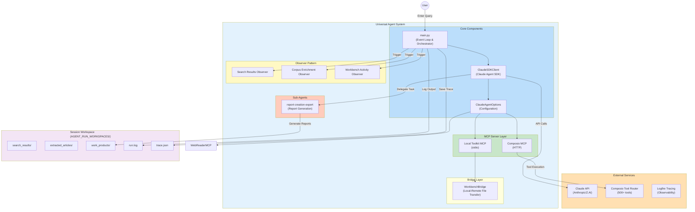

### Discussion: System Context

This diagram illustrates the complete system boundaries and external dependencies:

1. **User Interaction**: The user enters queries via the terminal interface provided by `prompt_toolkit`

2. **External Services**: The system depends on four key external APIs:
   - **Claude API**: For LLM inference (via Z.AI endpoint)
   - **Composio API**: For 500+ tool integrations (Gmail, SERP, Slack, etc.)
   - **Logfire API**: For distributed tracing and observability

3. **Core Components**: The main agent logic, SDK client, and configuration

4. **MCP Server Layer**: Three MCP servers provide different capabilities:
   - Local Toolkit (stdio): Custom local tools
   - Composio (HTTP): Remote tool router

5. **Observer Pattern**: Async observers that save artifacts without blocking the agent loop

6. **Workspace**: Per-session storage for artifacts, logs, and traces

---

## Core Components

### 1. ClaudeSDKClient (Main Agent Brain)

**Location**: `src/universal_agent/main.py:112-122`

**Purpose**: The primary interface for Claude Agent SDK, managing conversation state and tool execution.

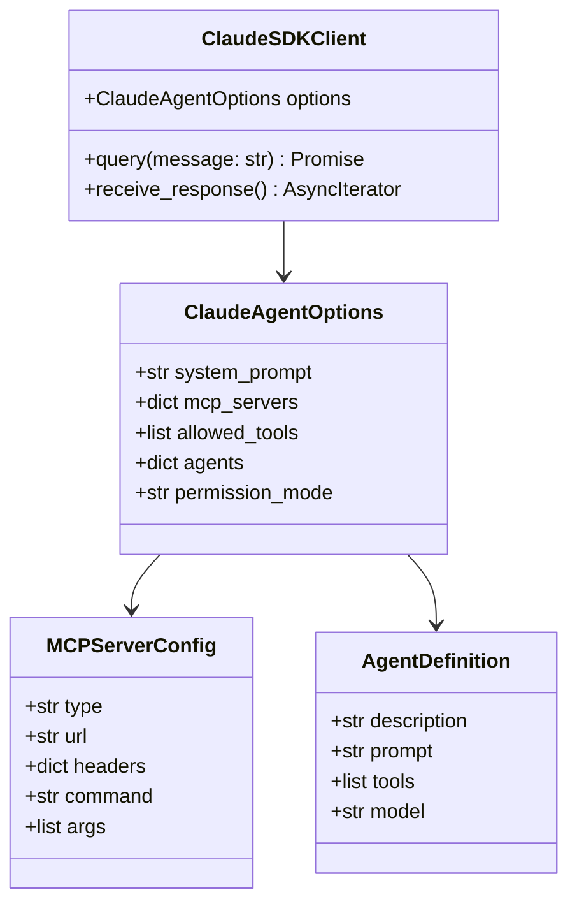

**Configuration Structure** (`main.py:1025-1146`):

```python
options = ClaudeAgentOptions(
    system_prompt=(...),  # Lines 1026-1074
    mcp_servers={
        "composio": {
            "type": "http",
            "url": session.mcp.url,
            "headers": {"x-api-key": os.environ["COMPOSIO_API_KEY"]},
        },
        "local_toolkit": {
            "type": "stdio",
            "command": sys.executable,
            "args": ["src/mcp_server.py"],
        },
        },
    },
    allowed_tools=["Task"],
    agents={
        "report-creation-expert": AgentDefinition(
            description="...",
            prompt="...",
            tools=[
                "mcp__local_toolkit__crawl_parallel",
                "mcp__local_toolkit__save_corpus",
                "mcp__local_toolkit__write_local_file",
                "mcp__local_toolkit__workbench_download",
                "mcp__local_toolkit__workbench_upload",
            ],
            model="inherit",
        ),
    },
    permission_mode="bypassPermissions",
)
```

---

### 2. Query Classifier

**Location**: `src/universal_agent/main.py:917-956`

**Purpose**: Determines whether a query requires tools (COMPLEX) or can be answered directly (SIMPLE).

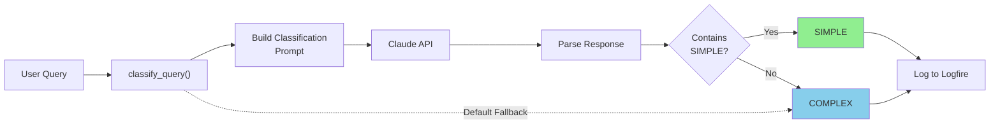

**Classification Criteria**:

| Type | Definition | Examples |
|------|------------|----------|
| **SIMPLE** | Answerable from foundational knowledge, no tools needed | "Capital of France", "Explain recursion" |
| **COMPLEX** | Requires external tools, real-time data, or multi-step workflows | "Search for news", "Send email", "Execute code" |

---

### 3. Dual-Path Execution Router

**Location**: `src/universal_agent/main.py:959-998`, `main.py:691-914`

**Purpose**: Routes queries to either Fast Path (direct answer) or Complex Path (tool loop).

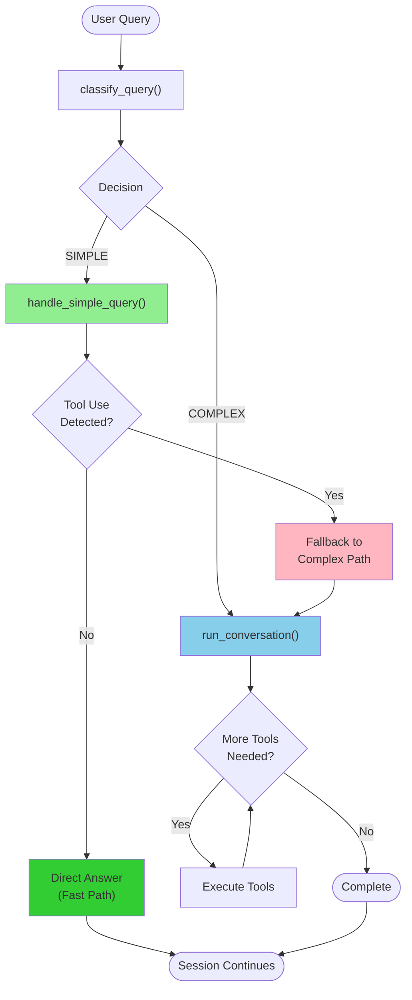

---

## Component Relationships

### Component Interaction Diagram

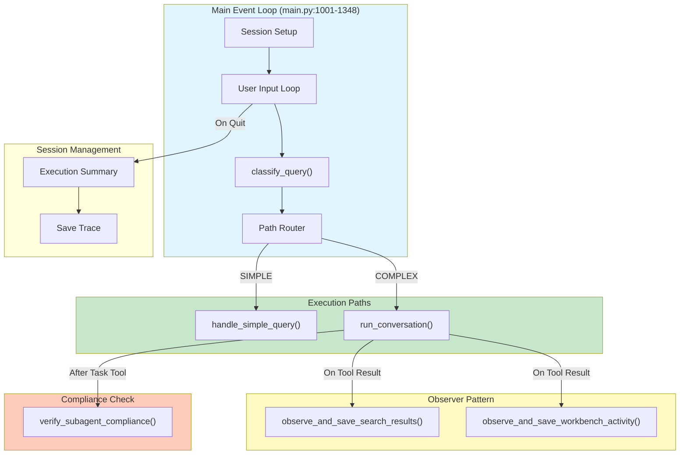

### Detailed Flow: Main Event Loop

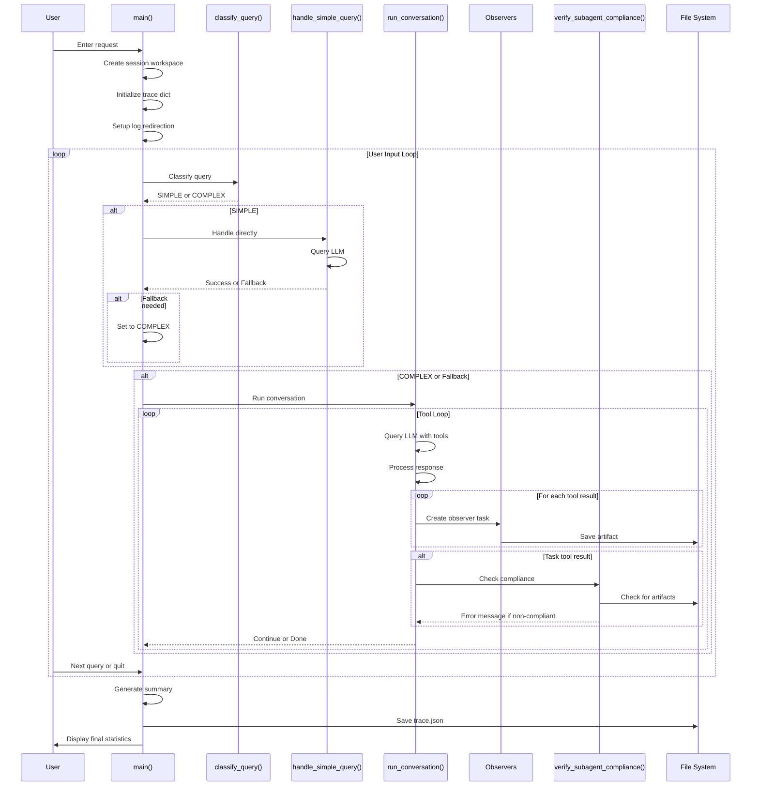

---

## Key Subsystems

### 1. Sub-Agent Delegation System

**Location**: `.claude/agents/report-creation-expert.md`, `main.py:1095-1143`

**Purpose**: Delegate specialized tasks to expert sub-agents with focused tool access.

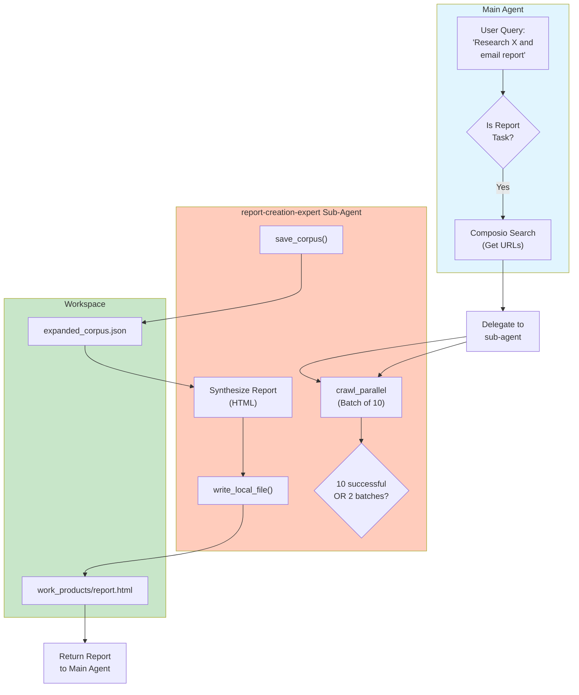

**AgentDefinition Configuration**:

```python
# main.py:1095-1143
"report-creation-expert": AgentDefinition(
    description=(
        "MANDATORY DELEGATION TARGET for ALL report generation tasks. "
        "WHEN TO DELEGATE: User asks for 'report', 'comprehensive', 'detailed', "
        "'in-depth', 'analysis', or 'summary' of search results."
    ),
    prompt=f"""
    Result Date: {datetime.now().strftime('%A, %B %d, %Y')}
    CURRENT_SESSION_WORKSPACE: {workspace_dir}

    You are a **Report Creation Expert**.

    ## WORKFLOW
    ### Step 1: Check Request Type
    - If 'comprehensive', 'detailed', 'in-depth' → Extract articles
    - Otherwise → Skip to Step 4 (use search snippets)

    ### Step 2: Extract Articles (OPTIMIZED)
    - Use crawl_parallel
    - Scrape 10 URLs in parallel

    ### Step 3: Synthesis
    - Read markdown files from search_results/
    - Synthesize content

    ### Step 4: Synthesize Report
    - Structure: Exec Summary → ToC → Thematic Sections → Sources
    - Include: numbers, dates, direct quotes, citations
    - Modern HTML with gradients, info boxes

    ### Step 5: Save Report
    - Save as .html to {workspace_dir}/work_products/
    - Use write_local_file
    """,
    tools=[
        "mcp__local_toolkit__crawl_parallel",
        "mcp__local_toolkit__save_corpus",
        "mcp__local_toolkit__write_local_file",
        "mcp__local_toolkit__workbench_download",
        "mcp__local_toolkit__workbench_upload",
    ],
    model="inherit",
)
```

---

### 2. Observer Pattern System

**Location**: `src/universal_agent/main.py:218-627`

**Purpose**: Asynchronously process and save tool results without blocking the agent loop.

**Why Observer Pattern?**

Composio hooks (`@after_execute`) don't fire in MCP mode because execution happens on the remote server. The observer pattern processes results after they return to the client.

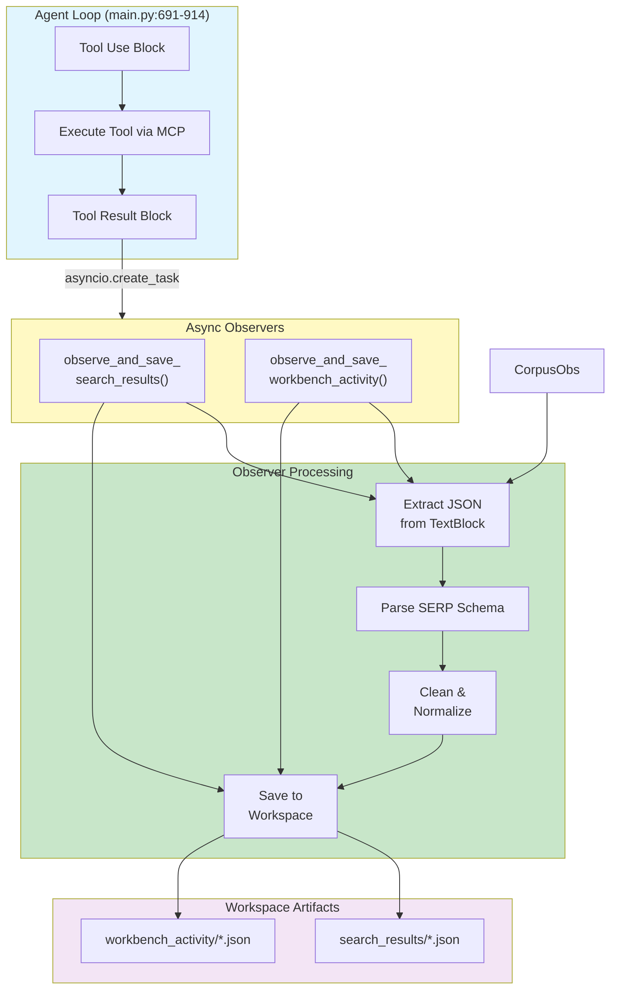

**Observer Functions**:

| Observer | Location | Triggers On | Saves To |
|----------|----------|-------------|----------|
| `observe_and_save_search_results()` | `main.py:218-413` | SERP tools | `search_results/*.json` |

| `observe_and_save_workbench_activity()` | `main.py:416-477` | Workbench tools | `workbench_activity/*.json` |
| `verify_subagent_compliance()` | `main.py:629-673` | Task results | Injects error if non-compliant |

**Fire-and-Forget Pattern**:

```python
# main.py:867-890
if tool_name and OBSERVER_WORKSPACE_DIR:
    # Create tasks that run in background without blocking
    asyncio.create_task(
        observe_and_save_search_results(
            tool_name, block_content, OBSERVER_WORKSPACE_DIR
        )
    )
    asyncio.create_task(
        observe_and_save_workbench_activity(
            tool_name, tool_input or {}, content_str, OBSERVER_WORKSPACE_DIR
        )
    )
```

---

### 3. MCP Server Integration

**Location**: `src/universal_agent/main.py:1075-1093`, `src/mcp_server.py`

**Purpose**: Provide tools through MCP protocol for both local and remote capabilities.

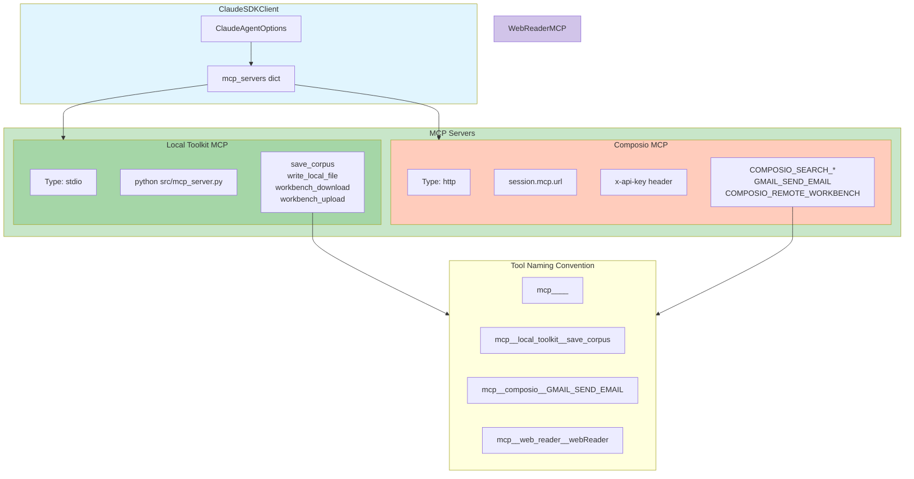

---

### 4. Workspace Management System

**Location**: `src/universal_agent/main.py:1006-1168`

**Purpose**: Create per-session workspaces for artifact isolation and traceability.

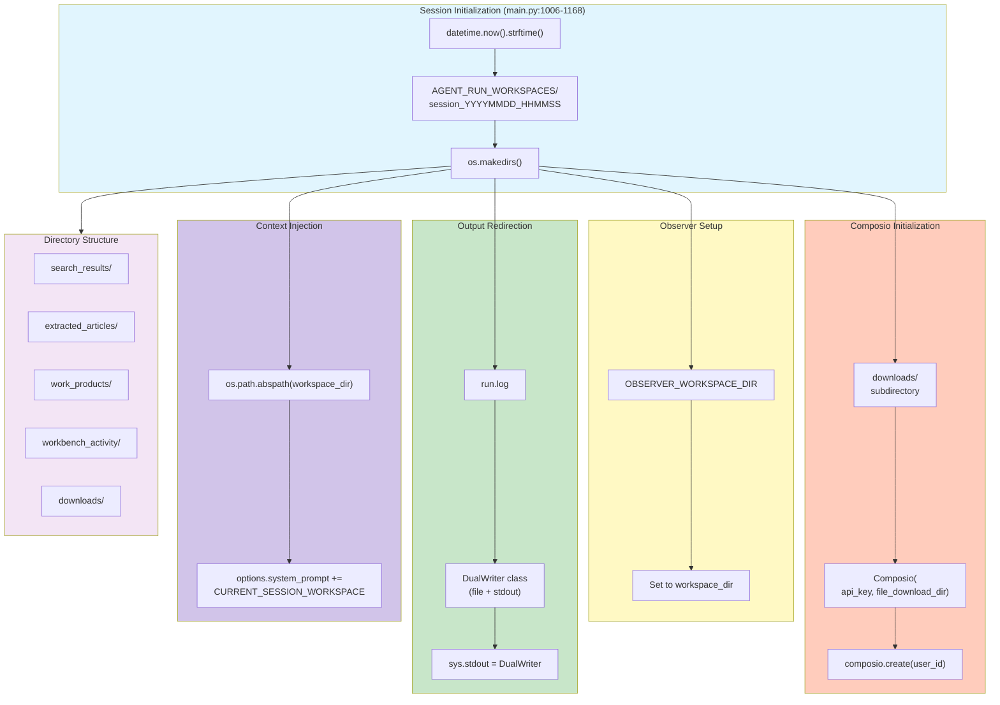

**Workspace Structure**:

```
AGENT_RUN_WORKSPACES/
└── session_20251222_143022/
    ├── run.log                          # Full console output
    ├── summary.txt                      # Brief execution summary
    ├── trace.json                       # Tool call/result trace
    ├── search_results/                  # Cleaned SERP artifacts
    │   ├── COMPOSIO_SEARCH_NEWS_143025.json
    │   └── COMPOSIO_SEARCH_WEB_143027.json
    ├── extracted_articles/              # Individual article extractions
    │   ├── example_com_143030.json
    │   └── news_site_143032.json
    ├── workbench_activity/              # Remote execution logs
    │   └── workbench_143035.json
    ├── work_products/                   # Final outputs
    │   └── ai_research_report.html
    ├── expanded_corpus.json             # Aggregated extraction data
    └── downloads/                       # Composio auto-downloads
        └── [temp files from remote tools]
```

---

### 5. Distributed Tracing System

**Location**: `src/universal_agent/main.py:49-111`

**Purpose**: Comprehensive observability via Logfire with MCP and HTTPX instrumentation.

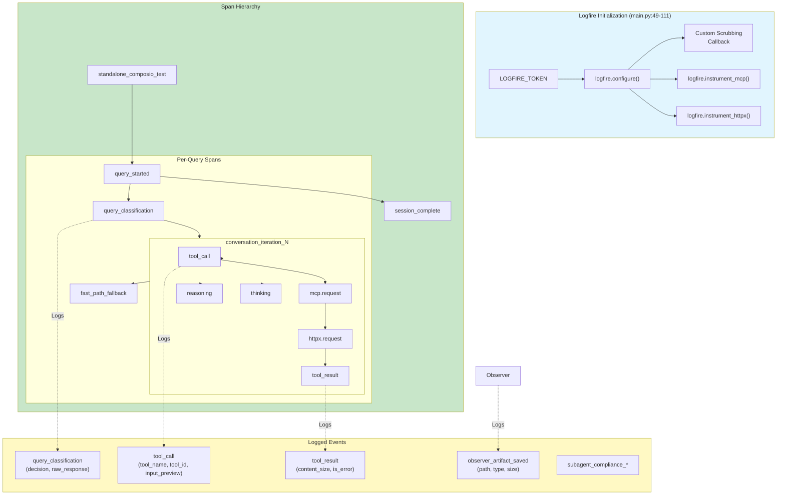

**Trace JSON Structure**:

```python
# main.py:1148-1164
trace = {
    "session_info": {
        "url": session.mcp.url,
        "user_id": user_id,
        "timestamp": datetime.now().isoformat(),
    },
    "query": None,
    "start_time": None,
    "end_time": None,
    "total_duration_seconds": None,
    "tool_calls": [
        {
            "iteration": 1,
            "name": "mcp__composio__COMPOSIO_SEARCH_NEWS",
            "id": "toolu_xxx",
            "time_offset_seconds": 1.234,
            "input_size_bytes": 123,
            "input_preview": "{...}",
        }
    ],
    "tool_results": [
        {
            "tool_use_id": "toolu_xxx",
            "time_offset_seconds": 2.345,
            "is_error": False,
            "content_size_bytes": 4567,
            "content_preview": "{...}",
        }
    ],
    "iterations": [
        {
            "iteration": 1,
            "query": "Search for AI news",
            "duration_seconds": 3.456,
            "tool_calls": 5,
            "needs_user_input": False,
            "auth_link": None,
        }
    ],
    "logfire_enabled": True,
    "trace_id": "1234567890abcdef...",
}
```

---

## Data Flow Architecture

### Request-Response Flow

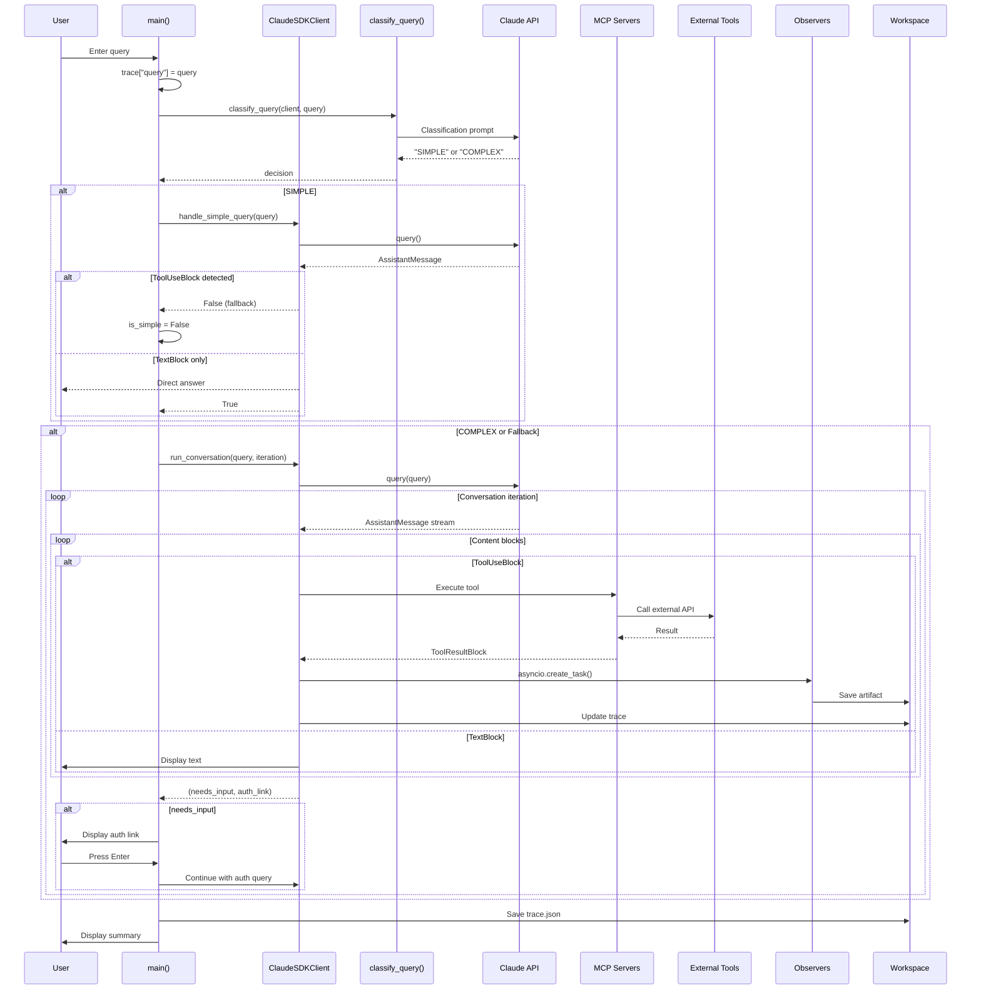

### Local-First Data Flow

Per the **Local-First Architecture** (`012_LOCAL_VS_WORKBENCH_ARCHITECTURE.md`):

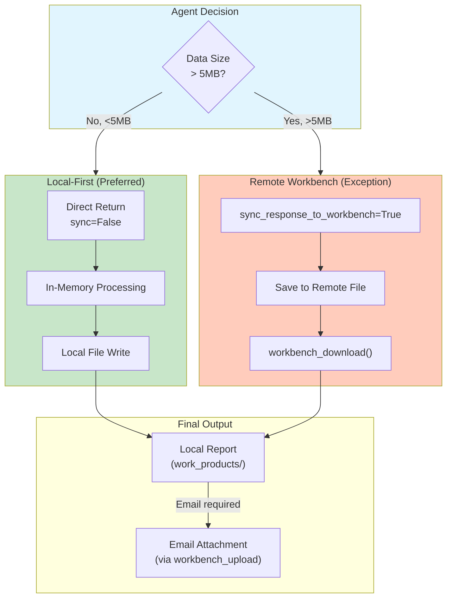

---

## Deployment Architecture

### Physical Architecture

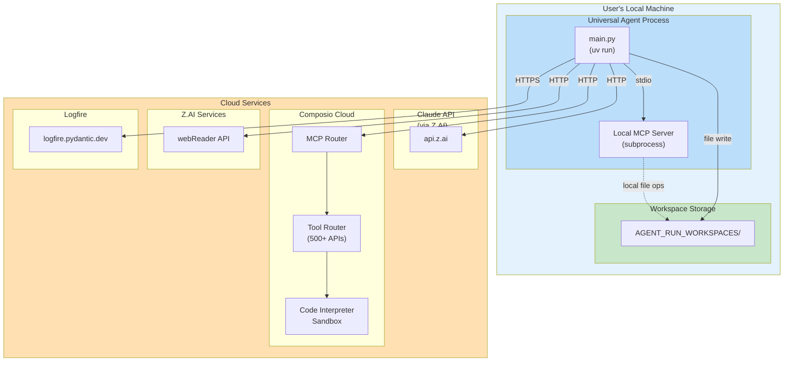

### Process Architecture

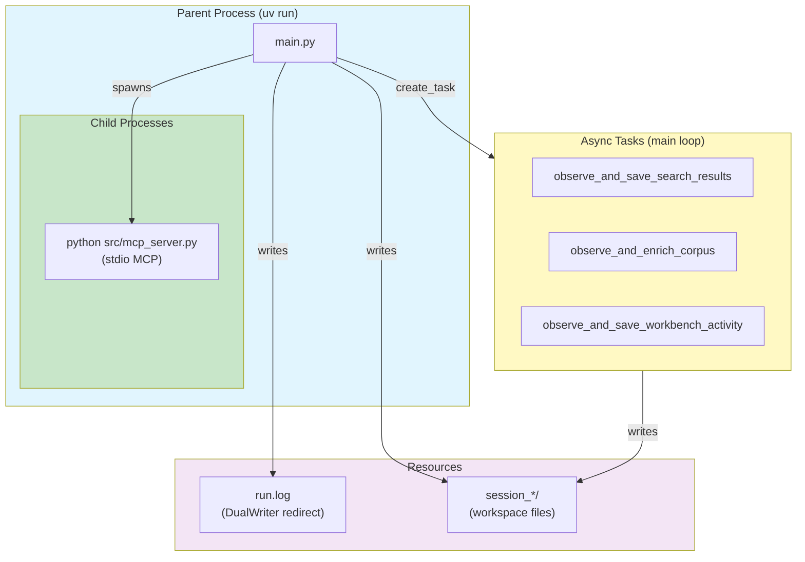

---

## Technology Stack

### Core Technologies

| Component | Technology | Purpose |
|-----------|-----------|---------|
| **Agent Framework** | Claude Agent SDK | Agentic workflows, tool orchestration |
| **Language** | Python 3.12+ | Core implementation |
| **Package Manager** | uv | Fast dependency management |
| **Async Runtime** | asyncio | Concurrent execution |
| **Terminal UI** | prompt_toolkit | Enhanced terminal input |
| **Protocol** | MCP (Model Context Protocol) | Tool integration |

### Dependencies

**Key Libraries** (`pyproject.toml`):

```python
# Agent SDK
claude-agent-sdk      # Claude agentic framework

# Tool Router
composio              # Composio tool router SDK

# Observability
logfire               # Distributed tracing
httpx                 # HTTP client (instrumented)

# Terminal/CLI
prompt-toolkit        # Better terminal input
readline              # Input history/editing

# Utilities
python-dotenv         # Environment variables
```

### MCP Servers

| Server | Type | URL | Purpose |
|--------|------|-----|---------|
| **local_toolkit** | stdio | `python src/mcp_server.py` | Local file operations, corpus saving |
| **composio** | http | Dynamic from session | 500+ external tools |
| **web_reader** | http | `api.z.ai/api/mcp/web_reader/mcp` | Article extraction |

---

## References

### Related Documentation

1. **[02_query_classification_flow.md](./02_query_classification_flow.md)** - Detailed query routing
2. **[03_subagent_delegation.md](./03_subagent_delegation.md)** - Sub-agent system
3. **[05_mcp_servers.md](./05_mcp_servers.md)** - MCP server details
4. **[07_workspace_data_flow.md](./07_workspace_data_flow.md)** - Workspace management
5. **[012_LOCAL_VS_WORKBENCH_ARCHITECTURE.md](../012_LOCAL_VS_WORKBENCH_ARCHITECTURE.md)** - Local-first strategy

### Code References

| File | Lines | Component |
|------|-------|-----------|
| `src/universal_agent/main.py` | 1-1379 | Main agent implementation |
| `src/mcp_server.py` | 1-140 | Local MCP server tools |
| `src/tools/workbench_bridge.py` | 1-185 | Workbench file transfer |
| `.claude/agents/report-creation-expert.md` | 1-137 | Sub-agent definition |

---

**Document Status**: ✅ Complete
**Next Review**: After major architecture changes
**Maintainer**: Universal Agent Team
