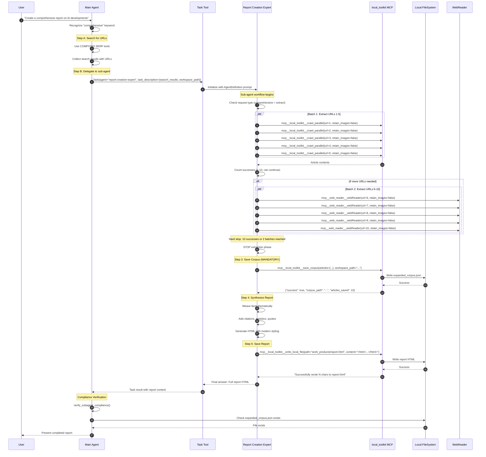
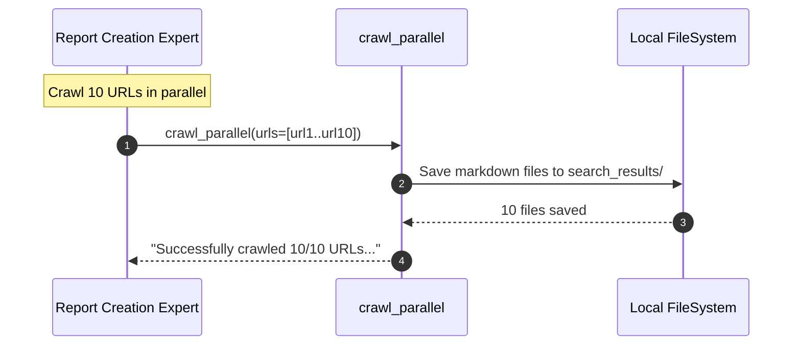
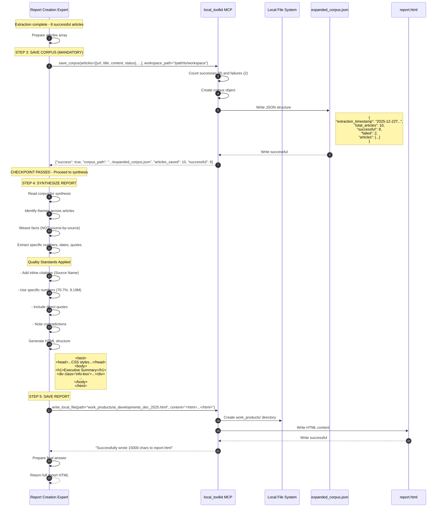
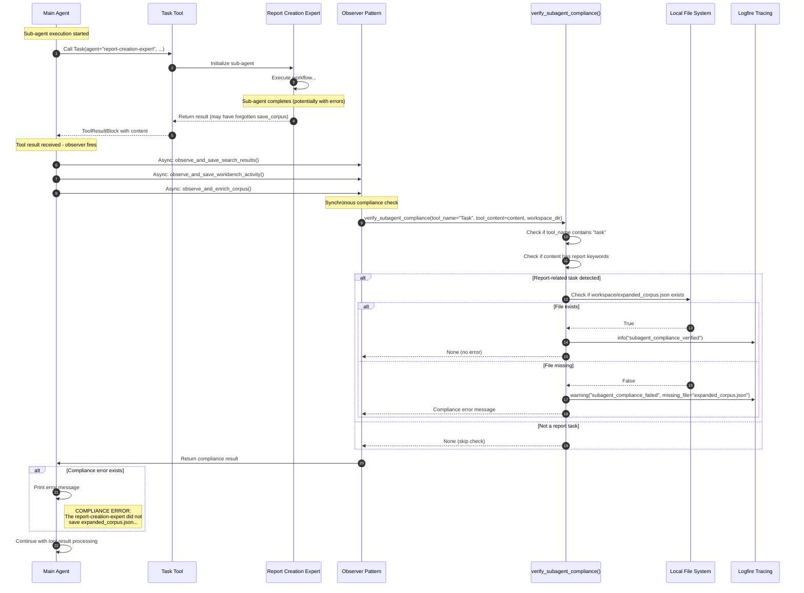

# Sub-Agent Delegation Architecture

**Universal Agent Project** | Architecture Documentation
**Document Version**: 1.0
**Last Updated**: 2025-12-22

---

## Table of Contents

1. [Overview](#overview)
2. [AgentDefinition Class](#agentdefinition-class)
3. [Report Creation Expert](#report-creation-expert)
4. [Delegation Flow](#delegation-flow)
5. [Sub-Agent Tools](#sub-agent-tools)
6. [Hard Stop Rules](#hard-stop-rules)
7. [Compliance Verification](#compliance-verification)
8. [Sequence Diagrams](#sequence-diagrams)
9. [Error Handling](#error-handling)

---

## Overview

The Universal Agent implements a **sub-agent delegation system** using the Claude Agent SDK's `AgentDefinition` class. This architecture allows the main agent to delegate specialized tasks to purpose-built sub-agents with scoped tool access and custom prompts.

### Key Components

| Component | Location | Purpose |
|-----------|----------|---------|
| `AgentDefinition` | `claude_agent_sdk/types.py:42-49` | Sub-agent configuration class |
| `report-creation-expert` | `main.py:1095-1143` | Report generation sub-agent |
| Sub-agent prompt | `.claude/agents/report-creation-expert.md` | Standalone prompt file (reference) |
| `allowed_tools=["Task"]` | `main.py:1094` | Enables delegation via Task tool |
| `verify_subagent_compliance()` | `main.py:629-672` | Post-sub-agent verification |

### Architecture Benefits

1. **Separation of Concerns**: Main agent handles orchestration, sub-agents handle specialized tasks
2. **Tool Scoping**: Sub-agents only have access to tools needed for their specific function
3. **Prompt Specialization**: Each sub-agent has detailed, domain-specific instructions
4. **Compliance Verification**: Main agent can verify sub-agent behavior after completion

---

## AgentDefinition Class

The `AgentDefinition` class is a dataclass defined in the Claude Agent SDK that configures sub-agents.

### Source: `claude_agent_sdk/types.py:42-49`

```python
@dataclass
class AgentDefinition:
    """Agent definition configuration."""

    description: str           # When to use this sub-agent
    prompt: str                # System prompt for the sub-agent
    tools: list[str] | None = None   # Tools available to sub-agent
    model: Literal["sonnet", "opus", "haiku", "inherit"] | None = None
```

### Field Descriptions

| Field | Type | Required | Description |
|-------|------|----------|-------------|
| `description` | `str` | Yes | Instructions for the main agent on when to delegate |
| `prompt` | `str` | Yes | System prompt given to the sub-agent |
| `tools` | `list[str]` | No | Whitelist of tools the sub-agent can use |
| `model` | `Literal` | No | Which Claude model to use; `"inherit"` uses same as main |

### Usage in Main Agent

```python
# main.py:1025-1146
options = ClaudeAgentOptions(
    # ... other config ...
    allowed_tools=["Task"],  # Required for sub-agent delegation
    agents={
        "report-creation-expert": AgentDefinition(
            description="...",
            prompt="...",
            tools=["mcp__local_toolkit__crawl_parallel", ...],
            model="inherit",
        ),
    },
)
```

---

## Report Creation Expert

The `report-creation-expert` is the primary sub-agent for comprehensive report generation.

### Registration: `main.py:1095-1143`

```python
agents={
    "report-creation-expert": AgentDefinition(
        description=(
            "MANDATORY DELEGATION TARGET for ALL report generation tasks. "
            "WHEN TO DELEGATE (REQUIRED): User asks for 'report', 'comprehensive', "
            "'detailed', 'in-depth', 'analysis', or 'summary' of search results."
        ),
        prompt=f"Result Date: {datetime.now().strftime('%A, %B %d, %Y')}\n"
               f"CURRENT_SESSION_WORKSPACE: {workspace_dir}\n\n"
               "You are a **Report Creation Expert**.\n\n"
               # ... detailed workflow instructions ...
        tools=[
                "mcp__local_toolkit__crawl_parallel",
            "mcp__local_toolkit__save_corpus",
            "mcp__local_toolkit__write_local_file",
            "mcp__local_toolkit__workbench_download",
            "mcp__local_toolkit__workbench_upload",
        ],
        model="inherit",
    ),
}
```

### Main Agent Delegation Instructions: `main.py:1053-1074`

The main agent's system prompt includes explicit delegation instructions:

```
4. MANDATORY DELEGATION FOR REPORTS:
   - When user requests 'comprehensive', 'detailed', 'in-depth', 'analysis', or any report:
   - Step A: Search for URLs using COMPOSIO tools
   - Step B: Delegate to 'report-creation-expert' sub-agent
            The sub-agent will extract articles, save corpus, and synthesize report
   - Pass: search results, URLs, and CURRENT_SESSION_WORKSPACE in task description
```

---

## Delegation Flow

The sub-agent delegation follows this sequence:

1. **User Request** - User asks for a "comprehensive report on X"
2. **Main Agent Search** - Main agent uses SERP tools to gather URLs
3. **Delegation Decision** - Main agent recognizes keywords and delegates
4. **Task Tool Call** - Main agent calls `Task(agent="report-creation-expert", ...)`
5. **Sub-Agent Execution** - Sub-agent runs with its scoped tools
6. **Result Return** - Sub-agent returns synthesized report
7. **Compliance Check** - Main agent verifies required artifacts were saved

### Trigger Keywords

The main agent delegates on these keyword patterns:
- `report`
- `comprehensive`
- `detailed`
- `in-depth`
- `analysis`
- `summary` (of search results)

---

## Sub-Agent Tools

The `report-creation-expert` has access to a curated set of tools:

### Tool List

| Tool | MCP Server | Purpose |
|------|------------|---------|
| `mcp__local_toolkit__crawl_parallel` | `local_toolkit` | Parallel web scraping using crawl4ai |
| `mcp__local_toolkit__save_corpus` | `local_toolkit` | Save extraction data to `expanded_corpus.json` |
| `mcp__local_toolkit__write_local_file` | `local_toolkit` | Write HTML report to filesystem |
| `mcp__local_toolkit__workbench_download` | `local_toolkit` | Bridge: Remote to Local file transfer |
| `mcp__local_toolkit__workbench_upload` | `local_toolkit` | Bridge: Local to Remote file transfer |

### Tool Implementations

#### save_corpus: `src/mcp_server.py:69-136`

```python
@mcp.tool()
def save_corpus(articles: list, workspace_path: str) -> str:
    """
    Save extracted article data to expanded_corpus.json.

    Args:
        articles: List of article objects with url, title, content, status
        workspace_path: Absolute path to session workspace

    Returns:
        JSON with corpus_path and summary
    """
    corpus = {
        "extraction_timestamp": datetime.utcnow().isoformat() + "Z",
        "total_articles": len(articles),
        "successful": success_count,
        "failed": failed_count,
        "articles": articles,
    }
    corpus_path = os.path.join(workspace_path, "expanded_corpus.json")
    # ... write to file ...
```

#### workbench_upload/download: `src/tools/workbench_bridge.py`

These tools bridge the local filesystem and remote Composio workbench:

```python
class WorkbenchBridge:
    """Handles transfer of files between Local Agent Environment and Remote Workbench."""

    def download(self, remote_path: str, local_path: str, session_id: str = None):
        """Download from remote workbench to local filesystem."""

    def upload(self, local_path: str, remote_path: str, session_id: str = None):
        """Upload from local filesystem to remote workbench via base64 encoding."""
```

---

## Hard Stop Rules

The `report-creation-expert` has mandatory limits to prevent runaway execution:

### Rules: `.claude/agents/report-creation-expert.md:26-37`

| Rule | Condition | Action |
|------|-----------|--------|
| **10 successful extractions** | After 10 successes | STOP immediately, proceed to save_corpus |
| **2 batches completed** | After 2 batches (5 calls each) | STOP, even if <10 successes |
| **Parallel crawl** | Per batch | MAX 5 concurrent calls |

### Batched Execution Pattern

```
BATCH 1: Call for URLs 1-5 (issue all 5 calls together)
- Proceed after 20 seconds OR when all return (whichever first)

BATCH 2: Call for URLs 6-10 (if needed)
- Same strategy

COUNT SUCCESSES after each batch
- If 10 successes → STOP → call save_corpus
```

### Error Handling: `.claude/agents/report-creation-expert.md:64-70`

| Error Code | Bytes | Meaning | Action |
|------------|-------|---------|--------|
| `1234` | 171 | Network timeout | Queue for retry (max 1 retry, 2 at a time) |
| `1214` | 90 | 404 Not found | Mark as failed, NO retry |

---

## Compliance Verification

After a sub-agent completes, the main agent verifies that required artifacts were saved.

### Function: `main.py:629-672`

```python
def verify_subagent_compliance(
    tool_name: str, tool_content: str, workspace_dir: str
) -> str | None:
    """
    Verify that report-creation-expert sub-agent saved required artifacts.
    Returns an error message to inject if compliance failed, None if OK.
    """
    # Only check for Task (sub-agent) tool results
    if "task" not in tool_name.lower():
        return None

    # Check if this looks like a report sub-agent completion
    is_report_task = any(
        keyword in content_lower
        for keyword in ["report", "comprehensive", "html", "work_products"]
    )
    if not is_report_task:
        return None

    # Check if expanded_corpus.json was saved
    corpus_path = os.path.join(workspace_dir, "expanded_corpus.json")
    if not os.path.exists(corpus_path):
        return (
            "\n\nCOMPLIANCE ERROR: The report-creation-expert did not save "
            "`expanded_corpus.json` before writing the report. This is a MANDATORY "
            "step per the agent's instructions."
        )

    return None
```

### Integration: `main.py:892-902`

The verification is called in the observer pattern after tool results:

```python
# Post-subagent compliance verification (for Task results)
compliance_error = verify_subagent_compliance(
    tool_name, content_str, OBSERVER_WORKSPACE_DIR
)
if compliance_error:
    # Log the compliance failure prominently
    print(compliance_error)
    logfire.warning(
        "subagent_compliance_message_injected",
        error=compliance_error[:200],
    )
```

---

## Sequence Diagrams

### 1. Main Agent Delegates to Report Creation Expert



### 2. Sub-Agent Parallel Crawl Workflow


### 3. Sub-Agent Save Corpus and Report Synthesis



### 4. Compliance Verification After Sub-Agent Completion



---

## Error Handling

### Sub-Agent Timeout

The sub-agent execution is subject to the main agent's timeout constraints. If a sub-agent hangs:

1. The main agent's `receive_response()` loop will timeout
2. The `Task` tool result will indicate an error
3. The compliance verifier will detect missing artifacts
4. An error message is injected into the conversation

### webReader Error Handling

The sub-agent implements sophisticated error handling for webReader calls:

| Error Type | Detection | Handling |
|------------|-----------|----------|
| Network timeout (1234) | 171 bytes, code "1234" | Retry once after all batches (2 at a time) |
| Not found (1214) | 90 bytes, code "1214" | Mark failed, no retry |
| MCP error | "MCP error" in response | Log to Logfire, skip URL |
| JSON parse error | Exception parsing JSON | Log debug, skip URL |

### Domain Blacklist Learning

Repeated failures from the same domain are tracked: `main.py:167-206`

```python
def _update_domain_blacklist(workspace_dir: str, domain: str, error_code: str):
    """
    Track domain failures for blacklist learning.
    After 3 failures from same domain with error 1214, consider blacklisted.
    """
    # Only track 1214 (permanent failures, not 1234 timeouts)
    if error_code == "1214":
        blacklist["domains"][domain]["failures"] += 1
        if failures >= 3:
            logfire.warning("domain_blacklisted", domain=domain)
```

### Compliance Failure Injection

When compliance verification fails, an error message is injected:

```
COMPLIANCE ERROR: The report-creation-expert did not save `expanded_corpus.json`
before writing the report. This is a MANDATORY step per the agent's instructions.
```

This ensures the user is aware of the failure and the agent can potentially retry.

---

## Appendix: Code References

| Component | File | Lines | Description |
|-----------|------|-------|-------------|
| `AgentDefinition` | `.venv/lib/python3.13/site-packages/claude_agent_sdk/types.py` | 42-49 | SDK dataclass for sub-agent config |
| `ClaudeAgentOptions.agents` | `.venv/lib/python3.13/site-packages/claude_agent_sdk/types.py` | 663 | Dict of agent name to AgentDefinition |
| Sub-agent registration | `src/universal_agent/main.py` | 1095-1143 | report-creation-expert definition |
| Main agent delegation prompt | `src/universal_agent/main.py` | 1053-1074 | Instructions for when to delegate |
| `allowed_tools` | `src/universal_agent/main.py` | 1094 | ["Task"] enables delegation |
| `verify_subagent_compliance()` | `src/universal_agent/main.py` | 629-672 | Post-sub-agent verification |
| Compliance check call | `src/universal_agent/main.py` | 892-902 | Integration in observer pattern |
| `save_corpus` tool | `src/mcp_server.py` | 69-136 | Save extraction corpus |
| `write_local_file` tool | `src/mcp_server.py` | 54-66 | Write files to local filesystem |
| `workbench_upload` tool | `src/mcp_server.py` | 42-50 | Upload to remote workbench |
| `workbench_download` tool | `src/mcp_server.py` | 28-38 | Download from remote workbench |
| `WorkbenchBridge.download()` | `src/tools/workbench_bridge.py` | 47-129 | Download implementation |
| `WorkbenchBridge.upload()` | `src/tools/workbench_bridge.py` | 131-184 | Upload implementation |
| Domain blacklist | `src/universal_agent/main.py` | 167-206 | Track failed domains |
| WebReader observer | `src/universal_agent/main.py` | 479-626 | Enrich corpus with extractions |
| Sub-agent prompt file | `.claude/agents/report-creation-expert.md` | All | Standalone prompt reference |
