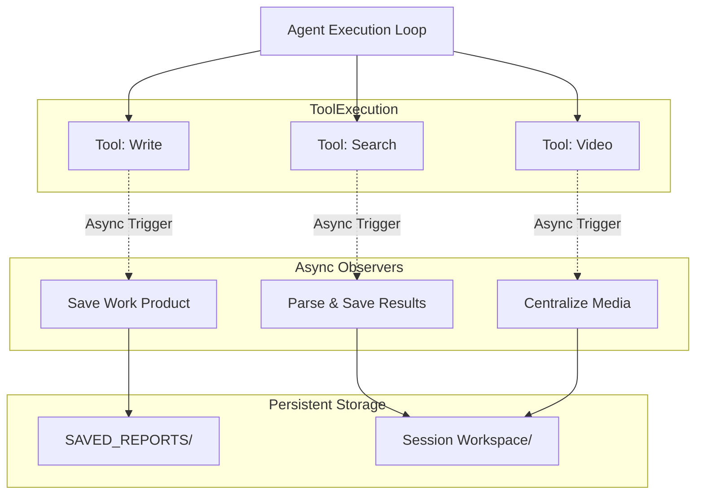

# Observer Pattern Architecture

**Document Version**: 2.0
**Last Updated**: 2026-01-06
**Status**: ACTIVE
**Related Files:**
- `src/universal_agent/observers/core.py`
- `src/universal_agent/main.py` (Integration)

---

## Overview

The Observer Pattern allows the agent to perform **async, non-blocking side effects** in response to tool executions. It decouples the core execution loop from auxiliary tasks like artifact saving, compliance verification, and activity logging.

## Core Mechanism

Observers are triggered in `main.py` immediately after a tool execution and before the next agent turn. They run as background `asyncio` tasks.

```python
# main.py pseudocode
result = await execute_tool(tool_name, tool_input)

# Fire-and-forget observers
if tool_name in ["composio_search_web", "google_search"]:
    asyncio.create_task(observe_and_save_search_results(...))

if tool_name == "write":
    asyncio.create_task(observe_and_save_work_products(...))
```

## Active Observers

Defined in `src/universal_agent/observers/core.py`:

### 1. Work Product Observer
- **Function**: `observe_and_save_work_products`
- **Trigger**: `write` (with "work_products" in path) or legacy `write_local_file`
- **Action**: Copies the written file to a persistent `SAVED_REPORTS` directory outside the ephemeral workspace.
- **Purpose**: Ensures critical deliverables (reports, code) survive workspace cleanup.

### 2. Search Results Observer
- **Function**: `observe_and_save_search_results`
- **Trigger**: `composio_search_web`, `google_search`
- **Action**: Parses raw JSON search results, extracts key links/snippets, and saves a human-readable Markdown summary (`search_results/summary_*.md`).
- **Purpose**: debugging and audit trail of what the agent "saw".

### 3. Workbench Activity Observer
- **Function**: `observe_and_save_workbench_activity`
- **Trigger**: `COMPOSIO_REMOTE_WORKBENCH` (exec, write)
- **Action**: Logs commands, code, and outputs to `workbench_activity/` logs.
- **Purpose**: Reconstruct coding sessions and debug failures.

### 4. Video Output Observer
- **Function**: `observe_and_save_video_outputs`
- **Trigger**: `youtube` (download), `video_audio` (edit)
- **Action**: Detects output filenames in tool results and copies them to `work_products/media/`.
- **Purpose**: Centralizes media assets.

### 5. Compliance Verifier
- **Function**: `verify_subagent_compliance`
- **Trigger**: Sub-agent completion (via `SubagentStop` hook)
- **Action**: Checks if required artifacts (based on sub-agent role) were actually created.
- **Purpose**: Quality Assurance. If verification fails, the sub-agent is forced to retry.

## Data Flow



## Integration Points

Observers have implicit dependencies on:
1. **Tool Names**: They hardcode triggers like "write", "composio_search_web".
2. **Path Conventions**: They look for "work_products/" or "search_results/" in paths.
3. **Workspace Structure**: They assume a standard `AGENT_RUN_WORKSPACES/<session_id>/` layout.
