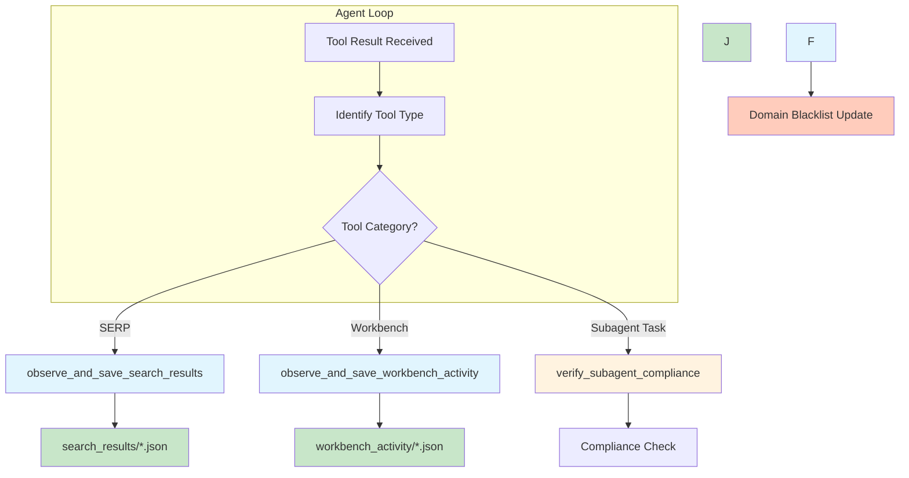
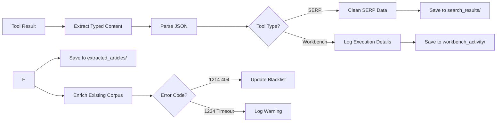
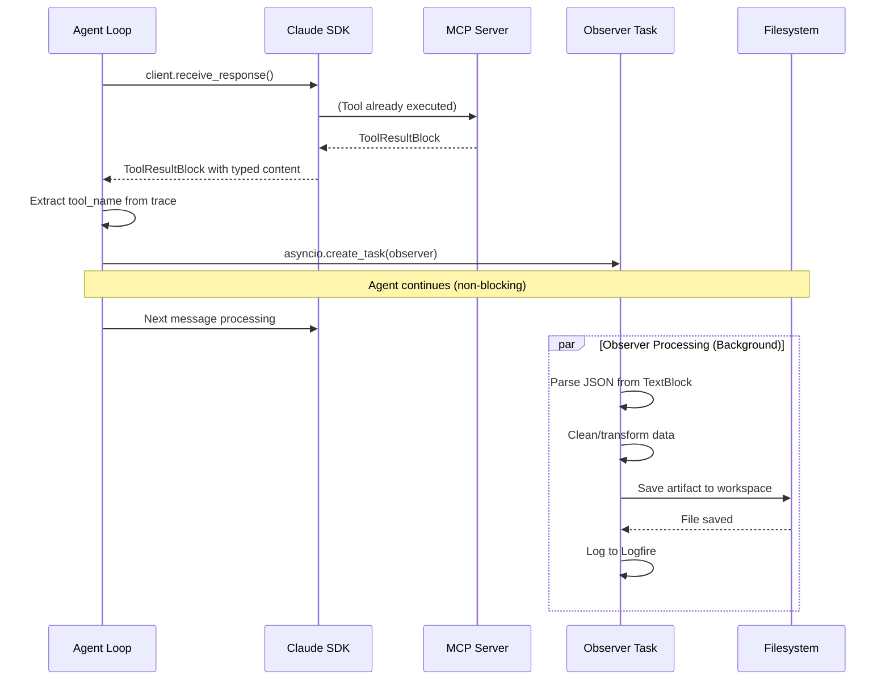
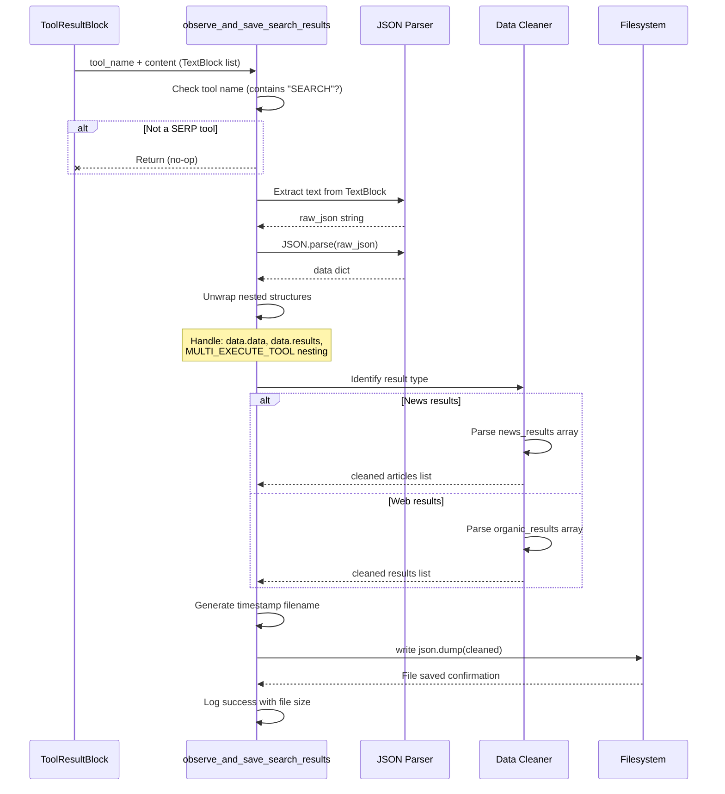

# Observer Pattern Implementation

**Project**: Universal Agent
**Component**: Async Artifact Processing System
**Location**: `src/universal_agent/main.py:129-673`

---

## Table of Contents

1. [Overview](#overview)
2. [Why Composio Hooks Don't Work in MCP Mode](#why-composio-hooks-dont-work-in-mcp-mode)
3. [Observer Pattern Architecture](#observer-pattern-architecture)
4. [Observer Functions](#observer-functions)
5. [Error Code Handling](#error-code-handling)
6. [Sequence Diagrams](#sequence-diagrams)
7. [Fire-and-Forget Execution](#fire-and-forget-execution)
8. [Artifact Storage Structure](#artifact-storage-structure)

---

## Overview

The Observer Pattern is a **client-side async artifact processing system** designed to overcome MCP (Model Context Protocol) mode limitations where traditional Composio hooks (`@before_execute`, `@after_execute`) cannot execute.

### Key Characteristics

- **Fire-and-forget execution**: Uses `asyncio.create_task()` for non-blocking artifact processing
- **Typed content handling**: Processes Claude SDK `TextBlock` objects, not raw strings
- **Zero agent loop disruption**: Observers run in background without affecting response flow
- **Workspace-aware**: Saves artifacts to session-specific directories
- **Comprehensive coverage**: Handles SERP results, workbench activity, and subagent compliance

---

## Why Composio Hooks Don't Work in MCP Mode

### The Problem

In traditional Composio SDK usage, developers can register hooks:

```python
# Traditional Composio SDK (non-MCP)
from composio import Composio

composio = Composio(api_key="...")

@composio.after_execute
def process_tool_result(context):
    """This hook runs after tool execution completes."""
    save_artifact(context.result)
```

**This doesn't work in MCP mode** because:

```
┌─────────────┐                    ┌──────────────────────┐
│   Client    │                    │  Composio MCP Server │
│  (Your App) │                    │  (Remote Execution)  │
└─────────────┘                    └──────────────────────┘
       │                                    │
       │  1. Execute Tool (MCP Request)     │
       │ ──────────────────────────────────>│
       │                                    │
       │                                    │  2. Tool executes
       │                                    │     @after_execute hook
       │                                    │     would fire HERE
       │                                    │     (but client can't see it!)
       │                                    │
       │  3. Return Result (MCP Response)   │
       │ <──────────────────────────────────│
       │                                    │
       │  4. Hook already fired,           │
       │     client-side code can't        │
       │     intercept the result          │
```

### Technical Explanation

| Aspect | Traditional SDK | MCP Mode |
|--------|-----------------|----------|
| Execution location | Client process | Remote server |
| Hook visibility | Direct access | Executed remotely, invisible to client |
| Result interception | Can wrap execution | Only receives final JSON-RPC response |
| Decorator support | `@before_execute`, `@after_execute` work | Hooks fire on server, not client |

### The Observer Solution

Since hooks fire on the remote MCP server where we can't intercept them, we instead:

1. **Observe results after they return** to the client
2. **Parse and process asynchronously** in the background
3. **Save artifacts without blocking** the agent loop

```python
# In run_conversation() - main.py:857-903
async for msg in client.receive_response():
    if isinstance(msg, (UserMessage, ToolResultBlock)):
        for block in msg.content:
            if isinstance(block, ToolResultBlock):
                # Observer Pattern: Fire-and-forget async save
                asyncio.create_task(
                    observe_and_save_search_results(
                        tool_name, block_content, OBSERVER_WORKSPACE_DIR
                    )
                )
```

---

## Observer Pattern Architecture

### Component Diagram



### Data Flow



---

## Observer Functions

### 1. SERP Results Observer

**Function**: `observe_and_save_search_results()`
**Location**: `main.py:218-413`
**Trigger**: Tool names containing `SEARCH_NEWS`, `SEARCH_WEB`, `COMPOSIO_SEARCH`, `MULTI_EXECUTE`

#### Purpose
Parses raw SERP (Search Engine Results Page) JSON responses and saves cleaned, structured artifacts.

#### Supported Result Types

| Type | Schema Key | Output Structure |
|------|------------|------------------|
| News Results | `news_results` | Articles with title, URL, source, date, snippet |
| Web Results | `organic_results` | Results with position, title, URL, snippet |

#### Data Structure

```python
# News result artifact
{
    "type": "news",
    "timestamp": "2025-12-22T14:30:45.123456",
    "tool": "composio_search_news_v2",
    "articles": [
        {
            "position": 1,  # API position or array order
            "title": "Article Title",
            "url": "https://example.com/article",
            "source": "Source Name",
            "date": "2025-12-22",  # Parsed from relative date
            "snippet": "Article summary..."
        }
    ]
}

# Web result artifact
{
    "type": "web",
    "timestamp": "2025-12-22T14:30:45.123456",
    "tool": "composio_search_web",
    "results": [
        {
            "position": 1,
            "title": "Page Title",
            "url": "https://example.com",
            "snippet": "Page description..."
        }
    ]
}
```

#### Relative Date Parsing

```python
# main.py:137-159
def parse_relative_date(relative_str: str) -> str:
    """
    Converts '2 hours ago' to YYYY-MM-DD format.
    Supports: minutes, hours, days, weeks, months
    """
    # "2 hours ago" → "2025-12-22"
    # "3 days ago" → "2025-12-19"
```

---

### 2. Workbench Activity Observer

**Function**: `observe_and_save_workbench_activity()`
**Location**: `main.py:416-476`
**Trigger**: Tool names containing `REMOTE_WORKBENCH`

#### Purpose
Captures remote code execution details for audit and debugging.

#### Artifact Structure

```python
{
    "timestamp": "2025-12-22T14:30:45.123456",
    "tool": "composio_remote_workbench_execute_code",
    "input": {
        "code": "print('hello')",  # Truncated to 1000 chars
        "session_id": "sess_abc123",
        "current_step": 1,
        "thought": "Debug step 1"
    },
    "output": {
        "stdout": "hello\n",
        "stderr": "",
        "results": "",
        "successful": true
    }
}
```

---


---

### 4. Subagent Compliance Verifier

**Function**: `verify_subagent_compliance()`
**Location**: `main.py:629-672`
**Trigger**: Tool names containing `task`

#### Purpose
Verifies that `report-creation-expert` sub-agent saved `expanded_corpus.json` before generating reports.

#### Compliance Check

```python
# Only checks report-related tasks
if "report" in content_lower or "comprehensive" in content_lower:
    corpus_path = os.path.join(workspace_dir, "expanded_corpus.json")
    if not os.path.exists(corpus_path):
        return error_message  # Injects error into conversation
```

#### Error Injection

When compliance fails, the observer injects an error message into the conversation:

```
❌ **COMPLIANCE ERROR**: The report-creation-expert did not save
`expanded_corpus.json` before writing the report. This is a MANDATORY
step per the agent's instructions.
```

---

## Error Code Handling


---

## Sequence Diagrams

### 1. Overall Observer Flow



### 2. SERP Result Parsing and Saving




---

## Fire-and-Forget Execution

### Why Fire-and-Forget?

The observer pattern uses **asyncio.create_task()** to run artifact processing in the background without blocking the agent loop.

```python
# main.py:867-890
if tool_name and OBSERVER_WORKSPACE_DIR:
    # All three observers run concurrently
    asyncio.create_task(
        observe_and_save_search_results(
            tool_name, block_content, OBSERVER_WORKSPACE_DIR
        )
    )
    asyncio.create_task(
        observe_and_save_workbench_activity(
            tool_name, tool_input or {}, content_str, OBSERVER_WORKSPACE_DIR
        )
    )
    asyncio.create_task(
        observe_and_enrich_corpus(
            tool_name, tool_input or {}, block_content, OBSERVER_WORKSPACE_DIR
        )
    )
```

### Benefits

| Aspect | Blocking Execution | Fire-and-Forget |
|--------|-------------------|-----------------|
| Agent responsiveness | Pauses until artifact saved | Continues immediately |
| User experience | Delay between tool result and response | Seamless flow |
| Multiple observers | Sequential processing | Parallel processing |
| Error handling | Can halt agent loop | Isolated failures |

### Error Isolation

Observer errors are logged but **do not crash the agent**:

```python
# main.py:411-413
except Exception as e:
    print(f"\n❌ [OBSERVER] Parse error: {e}")
    logfire.warning("observer_error", tool=tool_name, error=str(e))
```

### Task Lifecycle

```
Tool Result Received
    │
    ├─> asyncio.create_task(observer_1)
    │       │
    │       ├─> Background processing
    │       ├─> Save artifact
    │       └─> Log completion
    │
    ├─> asyncio.create_task(observer_2)
    │       │
    │       └─> (parallel with observer_1)
    │
    └─> Agent continues to next message
            │
            └─> User sees result immediately
```

---

## Artifact Storage Structure

### Workspace Directory Layout

```
AGENT_RUN_WORKSPACES/
├── session_20241222_143045/              # Timestamp-based session
│   ├── search_results/                    # SERP artifacts
│   │   ├── composio_search_news_v2_143045.json
│   │   ├── composio_search_web_143105.json
│   │   └── multi_execute_tool_0_143200.json
│   │

│   ├── work_products/                     # Subagent outputs
│   │   └── report.html
│   │
│   ├── downloads/                         # Composio file downloads
│   │

│   ├── trace.json                         # Execution trace
│   ├── run.log                            # Session log
│   └── summary.txt                        # Session summary
│
└── (session files)
```

### Naming Conventions

| Artifact Type | Pattern | Example |
|---------------|---------|---------|
| SERP News | `{tool_slug}_{timestamp}.json` | `composio_search_news_v2_143045.json` |
| SERP Web | `{tool_slug}_{timestamp}.json` | `composio_search_web_143105.json` |
| Multi-Execute | `{tool_slug}_{index}_{timestamp}.json` | `multi_execute_tool_0_143200.json` |
| Article | `{safe_url}_{timestamp}.json` | `example.com_article_1_143150.json` |
| Workbench | `workbench_{timestamp}.json` | `workbench_143210.json` |

### Timestamp Format

```python
# main.py:378, 430, 564
timestamp_str = datetime.now().strftime("%H%M%S")
# Example: "143045" = 2:30:45 PM
```

### Safe URL Filenames

```python
# main.py:567-569
safe_name = (
    url.replace("https://", "")
        .replace("http://", "")
        .replace("/", "_")[:50]
)
# "https://example.com/article/2024/12/22"
# → "example.com_article_2024_12"
```

---

## Integration Points

### Where Observers Are Triggered

**Location**: `run_conversation()` function, `main.py:857-903`

```python
async for msg in client.receive_response():
    if isinstance(msg, (UserMessage, ToolResultBlock)):
        blocks = msg.content if isinstance(msg, UserMessage) else [msg]

        for block in blocks:
            if isinstance(block, ToolResultBlock):
                tool_use_id = block.tool_use_id

                # Look up tool details from trace
                for tc in tool_calls_this_iter:
                    if tc.get("id") == tool_use_id:
                        tool_name = tc.get("name")
                        tool_input = tc.get("input", {})
                        break

                if tool_name and OBSERVER_WORKSPACE_DIR:
                    # Trigger all observers
                    asyncio.create_task(...)
```

### Observer Dependencies

```
Observer Pattern requires:
├── Claude SDK (for typed content handling)
├── asyncio (for fire-and-forget execution)
├── Logfire (for structured logging)
└── Filesystem (workspace directory access)
```

---

## Best Practices

### 1. Typed Content Handling

Always pass the **original block_content** (TextBlock list) to observers, not stringified version:

```python
# CORRECT - Pass typed content
asyncio.create_task(
    observe_and_save_search_results(
        tool_name,
        block_content,  # TextBlock list
        OBSERVER_WORKSPACE_DIR
    )
)

# WRONG - Stringified content loses type info
asyncio.create_task(
    observe_and_save_search_results(
        tool_name,
        str(block_content),  # Loses TextBlock structure
        OBSERVER_WORKSPACE_DIR
    )
)
```

### 2. Observer Naming Convention

Observer functions should follow the pattern:

```python
async def observe_and_{action}_{target}(
    tool_name: str,
    tool_content,  # Keep generic type
    workspace_dir: str
) -> None:
```

### 3. Error Handling

Observers should **never raise exceptions** that propagate to the agent loop:

```python
try:
    # Observer logic
    ...
except Exception as e:
    logfire.warning("observer_error", tool=tool_name, error=str(e))
    # Do NOT re-raise
```

### 4. Idempotency

Observers should be safe to run multiple times:

```python
# Use os.path.exists() before creating directories
os.makedirs(directory, exist_ok=True)

# Use unique filenames to avoid collisions
filename = f"{tool_slug}_{timestamp}_{index}.json"
```

---

## Troubleshooting

### Issue: Artifacts Not Saving

**Check**:
1. `OBSERVER_WORKSPACE_DIR` is set (main.py:1168)
2. Tool name matches observer trigger condition
3. No exceptions in observer (check logs)

### Issue: Corpus Enrichment Not Working

**Check**:
1. `search_results/` directory exists with matching JSON files
2. URL in crawl result matches URL in search result
3. File permissions allow read/write

### Issue: Domain Blacklist Not Updating

**Check**:
1. Error code is exactly "1214" (string comparison)
2. Parent workspace directory is writable
3. JSON parsing succeeds

---

## Future Enhancements

### Potential Improvements

1. **Configurable retry logic** for error 1234 (timeout)
2. **Parallel execution** (non-blocking)
3. **Observer metrics** (success rate, processing time)
4. **Deduplication** (avoid saving duplicate articles)
5. **Compression** for large artifacts
6. **Cross-session corpus** (persistent knowledge base)

---

## References

- **Code**: `src/universal_agent/main.py:129-673`
- **Related Docs**:
  - `01_architecture_overview.md` - System architecture
  - `02_mcp_integration.md` - MCP server setup
  - `03_agent_execution_loop.md` - Conversation flow

---

**Last Updated**: 2025-12-22
**Author**: Universal Agent Documentation
