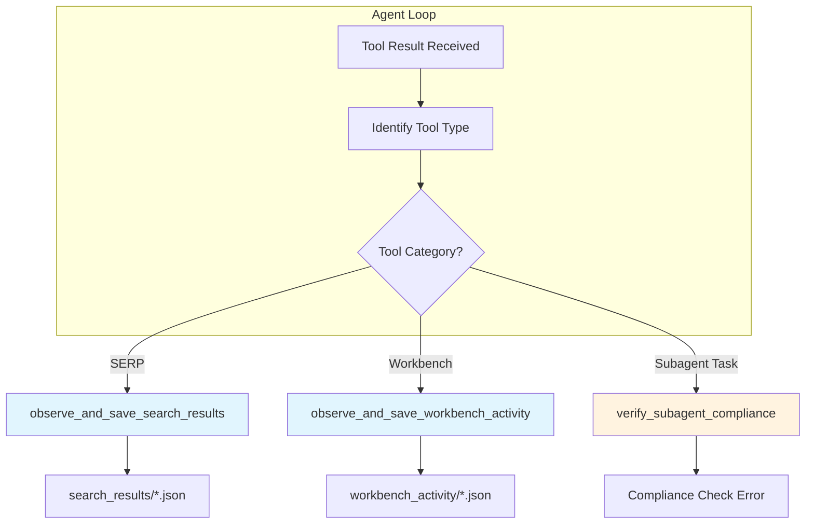

# Observer Pattern & Observability Architecture

**Document Version**: 1.1
**Last Updated**: 2025-12-29
**Component**: Universal Agent
**Primary Files**: `src/universal_agent/main.py`

---

## Table of Contents

1. [Overview](#overview)
2. [Why Composio Hooks Don't Work in MCP Mode](#why-composio-hooks-dont-work-in-mcp-mode)
3. [Observer Pattern Architecture](#observer-pattern-architecture)
4. [Logfire Observability (Dual Trace)](#logfire-observability-dual-trace)
5. [Observer Functions](#observer-functions)
6. [Fire-and-Forget Execution](#fire-and-forget-execution)
7. [Artifact Storage Structure](#artifact-storage-structure)

---

## Overview

The Universal Agent employs two complementary systems for visibility and persistence:

1.  **Observer Pattern**: A client-side, async system that processes tool results to save artifacts (JSONs, reports) without blocking the agent loop.
2.  **Logfire Observability**: A distributed tracing system that captures the execution flow, reasoning, and performance metrics across process boundaries.

---

## Why Composio Hooks Don't Work in MCP Mode

In traditional Composio SDK usage, `@after_execute` hooks run on the client. In **MCP Mode**, execution happens on a remote server or subprocess. The client only receives the final `ToolResultBlock`.

### Solution: The Observer
We "observe" the `ToolResultBlock` as it arrives in the client's `receive_response()` loop and spawn async tasks to process it.

---

## Observer Pattern Architecture

### Component Diagram



---

## Logfire Observability (Dual Trace)

The system is instrumented with **Pydantic Logfire** using a "Dual Trace" architecture to handle the separation between the Main Agent (Orchestrator) and the Local MCP Server (Tool Execution).

### 1. Main Process Trace
*   **Scope**: `main.py` (CLI/Telegram process)
*   **Captures**:
    *   `query_classification`: Simple vs Complex decision.
    *   `conversation_iteration`: The ReAct loop steps.
    *   `tool_call` / `tool_result`: High-level tool usage.
    *   `reasoning`: Claude's internal thought process (if available).

### 2. Subprocess Trace (Local MCP)
*   **Scope**: `src/mcp_server.py` (Running as a subprocess via stdio)
*   **Captures**:
    *   Internal execution of local tools (e.g., `crawl_parallel` internals).
    *   Detailed function timing and errors within the tool.

### Visualizing the Split
Because `stdio` communication doesn't automatically propagate HTTP headers for trace context, these appear as **two distinct traces** in Logfire, linked logically by the **session ID** and timestamp.

*   **Trace A (Orchestrator)**: "User asked for X" → "Call crawl_parallel"
*   **Trace B (MCP Server)**: "Executing crawl_parallel" → "Scraping URLs"

This isolation ensures that a crash in the subprocess doesn't obscure the main agent's logs, and vice versa.

---

## Observer Functions

### 1. SERP Results Observer
**Function**: `observe_and_save_search_results`
**Trigger**: Tools like `COMPOSIO_SEARCH_NEWS`, `COMPOSIO_SEARCH_WEB`
**Action**:
*   Parses raw JSON from tool output.
*   Cleans and structures data (unwraps nesting).
*   Saves to `search_results/{tool}_{timestamp}.json`.
*   **Anti-Redundancy**: Warns agent "Do not save this again" to save tokens.

### 2. Workbench Observer
**Function**: `observe_and_save_workbench_activity`
**Trigger**: `COMPOSIO_REMOTE_WORKBENCH`
**Action**:
*   Logs code inputs and stdout/stderr outputs.
*   Saves to `workbench_activity/`.

### 3. Compliance Verifier
**Function**: `verify_subagent_compliance`
**Trigger**: `Task` tool results (containing "report")
**Action**:
*   Checks if `expanded_corpus.json` exists in workspace.
*   If missing, **INJECTS** a compliance error message into the next user turn, forcing the agent to retry or fix.

---

## Fire-and-Forget Execution

Observers run as background tasks:

```python
asyncio.create_task(
    observe_and_save_search_results(...)
)
```

**Benefits**:
*   **Non-blocking**: Agent continues thinking while file I/O happens.
*   **Error Isolation**: If an observer crashes (e.g., bad JSON), the agent continues.

---

## Artifact Storage Structure

All observed artifacts are saved to the **Session Workspace** (`AGENT_RUN_WORKSPACES/session_.../`).

| Directory | Content |
|-----------|---------|
| `search_results/` | Cleaned JSONs from SERP tools. |
| `workbench_activity/` | Logs of remote code execution. |
| `run.log` | Full console output (DualWriter). |
| `trace.json` | Final structured trace of the session. |
