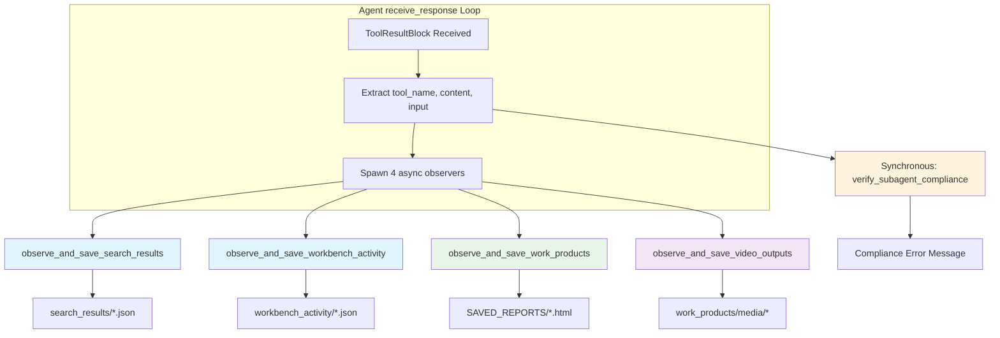

# Observer Pattern & Observability Architecture

**Document Version**: 2.0
**Last Updated**: 2026-01-05
**Component**: Universal Agent
**Primary Files**: 
- `src/universal_agent/observers/core.py` (Observer implementations)
- `src/universal_agent/main.py` (Integration points at lines 3806-3844)

---

## Table of Contents

1. [Overview](#overview)
2. [Why Composio Hooks Don't Work in MCP Mode](#why-composio-hooks-dont-work-in-mcp-mode)
3. [Observer Pattern Architecture](#observer-pattern-architecture)
4. [Relationship with Durable System](#relationship-with-durable-system)
5. [Observer Functions](#observer-functions)
6. [Fire-and-Forget Execution](#fire-and-forget-execution)
7. [Integration in main.py](#integration-in-mainpy)
8. [Artifact Storage Structure](#artifact-storage-structure)

---

## Overview

The Universal Agent employs a multi-layered observability architecture:

1. **Observer Pattern** (async fire-and-forget): Client-side system that processes tool results to save artifacts without blocking the agent loop
2. **Durable Ledger System** (synchronous hooks): Tool call tracking for idempotency, resume capability, and audit trails  
3. **Logfire Observability** (distributed tracing): Cross-process execution flow and performance metrics

---

## Why Composio Hooks Don't Work in MCP Mode

In traditional Composio SDK usage, `@after_execute` hooks run on the client. In **MCP Mode**, execution happens on a remote server or subprocess. The client only receives the final `ToolResultBlock`.

### Solution: The Observer
We "observe" the `ToolResultBlock` as it arrives in the client's `receive_response()` loop and spawn async tasks to process it.

**Key difference from hooks**:
- Hooks (durable system): Synchronous, can block/modify execution, critical for idempotency
- Observers (this document): Async fire-and-forget, purely for artifact persistence, non-blocking

---

## Observer Pattern Architecture

### Module Structure

```
src/universal_agent/observers/
├── __init__.py          # Exports all observer functions
└── core.py              # Implementation of 5 observer functions + search_config
```

### Component Diagram



---

## Relationship with Durable System

The observers complement (not replace) the durable ledger system:

| Aspect | Observers | Durable Ledger (Hooks) |
|--------|-----------|------------------------|
| **Timing** | Async fire-and-forget (after result) | Synchronous (before/after tool) |
| **Purpose** | Artifact persistence for user audit | Idempotency, resume, state tracking |
| **Blocking** | Non-blocking (agent continues) | Blocking (can modify flow) |
| **Files** | `observers/core.py` | `durable/ledger.py`, hooks in `main.py` |
| **Integration** | `receive_response` loop | `PreToolUse`, `PostToolUse` hooks |
| **Error Handling** | Errors isolated (logged, agent continues) | Errors can halt execution |

Both systems work together:
- **Durable ledger** tracks tool calls for resume capability and idempotency
- **Observers** save cleaned artifacts to session workspace for human review

---

## Observer Functions

### 1. Search Results Observer
**Function**: `observe_and_save_search_results(tool_name, content, workspace_dir)`
**Location**: `observers/core.py`
**Triggers**: Search tools matching keywords (COMPOSIO_SEARCH, SERPAPI, TAVILY, etc.)

**Processing Pipeline**:
1. Extract JSON from Claude SDK `TextBlock` objects
2. Handle multiple formats (Claude WebSearch, MULTI_EXECUTE, SERP responses)
3. Dynamic schema parsing (4-priority system)
4. Save to `search_results/{tool_slug}_{timestamp}.json`

### 2. Workbench Activity Observer
**Function**: `observe_and_save_workbench_activity(tool_name, tool_input, tool_result, workspace_dir)`
**Location**: `observers/core.py`
**Trigger**: `COMPOSIO_REMOTE_WORKBENCH`

**Processing**:
- Parses MCP string representation using `ast.literal_eval()`
- Extracts code input (first 1000 chars)
- Captures stdout/stderr output
- Logs session_id, current_step, thought

**Output**: `workbench_activity/workbench_{timestamp}.json`

### 3. Work Products Observer
**Function**: `observe_and_save_work_products(tool_name, tool_input, tool_result, workspace_dir)`
**Location**: `observers/core.py`
**Trigger**: `write_local_file` with "work_products" in path

**Dual Save Strategy**:
1. **Session Workspace**: Agent's normal save (in-session)
2. **Persistent Directory**: `/SAVED_REPORTS/` (cross-session)

**Output**: `SAVED_REPORTS/{original_name}_{timestamp}.ext`

### 4. Video/Audio Outputs Observer
**Function**: `observe_and_save_video_outputs(tool_name, tool_input, tool_result, workspace_dir)`
**Location**: `observers/core.py`
**Triggers**: video_audio and youtube MCP tools

**Filtering**:
- Processes only final outputs (excludes intermediate files like `last_`, `temp_`, `tmp_`)
- Multiple fallback path extraction strategies

**Output**: `work_products/media/{filename}`

### 5. Subagent Compliance Verifier
**Function**: `verify_subagent_compliance(tool_name, tool_content, workspace_dir)`
**Location**: `observers/core.py`
**Trigger**: `Task` tool results with "report" keywords
**Returns**: Error message (str) or None

**Compliance Check Logic**:
- Only checks Task results (sub-agent delegation)
- Conditional enforcement based on report type
- Checks for data in `search_results/` for comprehensive reports

---

## Fire-and-Forget Execution

Observers run as background tasks using `asyncio.create_task()`:

```python
# From main.py lines 3807-3838
if tool_name and OBSERVER_WORKSPACE_DIR:
    # Search results observer
    asyncio.create_task(
        observe_and_save_search_results(
            tool_name, block_content, OBSERVER_WORKSPACE_DIR
        )
    )
    # Workbench activity observer
    asyncio.create_task(
        observe_and_save_workbench_activity(
            tool_name, tool_input or {}, content_str, OBSERVER_WORKSPACE_DIR
        )
    )
    # Work products observer
    asyncio.create_task(
        observe_and_save_work_products(
            tool_name, tool_input or {}, content_str, OBSERVER_WORKSPACE_DIR
        )
    )
    # Video/audio output observer
    asyncio.create_task(
        observe_and_save_video_outputs(
            tool_name, tool_input or {}, content_str, OBSERVER_WORKSPACE_DIR
        )
    )
```

**Benefits**:
- **Non-blocking**: Agent continues thinking while file I/O happens
- **Error Isolation**: If an observer crashes, the agent continues
- **Parallelism**: All 4 observers run concurrently

---

## Integration in main.py

### Import Statement (line 96)

```python
from universal_agent.observers import (
    observe_and_save_search_results,
    observe_and_save_workbench_activity,
    observe_and_save_work_products,
    observe_and_save_video_outputs,
    verify_subagent_compliance,
)
```

### Observer Spawning (lines 3805-3838)

Located in `receive_response()` loop within the conversation iteration.

### Compliance Verification (lines 3841-3844)

**Synchronous** (not async) - runs immediately after observer spawn:

```python
# Post-subagent compliance verification (for Task results)
compliance_error = verify_subagent_compliance(
    tool_name, content_str, OBSERVER_WORKSPACE_DIR
)
if compliance_error:
    print(compliance_error)
    logfire.warning("subagent_compliance_message_injected", error=compliance_error[:200])
```

---

## Artifact Storage Structure

All observed artifacts are saved to the **Session Workspace** (`AGENT_RUN_WORKSPACES/session_YYYYMMDD_HHMMSS/`).

| Directory | Content | Observer |
|-----------|---------|----------|
| `search_results/` | Cleaned JSONs from SERP tools | `observe_and_save_search_results` |
| `workbench_activity/` | Remote code execution logs | `observe_and_save_workbench_activity` |
| `work_products/` | Final reports, documents | Agent (via `write_local_file`) |
| `work_products/media/` | Video/audio outputs | `observe_and_save_video_outputs` |
| `/SAVED_REPORTS/` | Persistent copy of work_products | `observe_and_save_work_products` |
| `run.log` | Full console output | Main logging system |
| `trace.json` | Final structured trace | Main logging system |

---

**Document Status**: ✅ Active & Updated
**Last System Sync**: 2026-01-05
