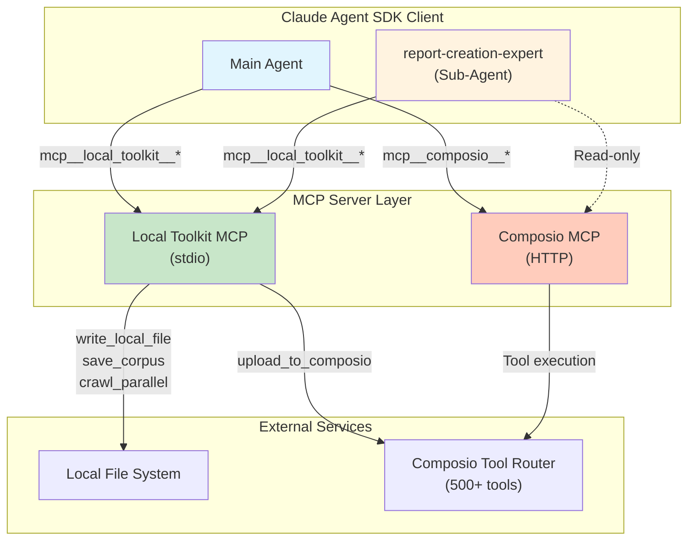
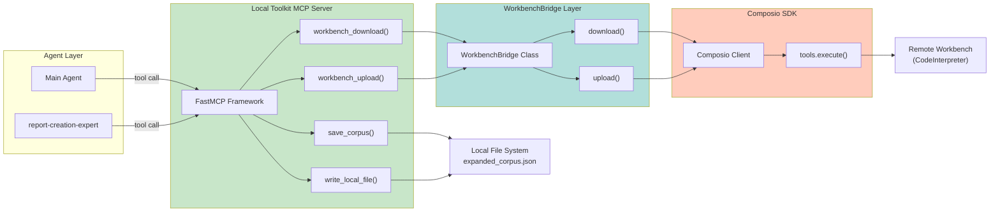
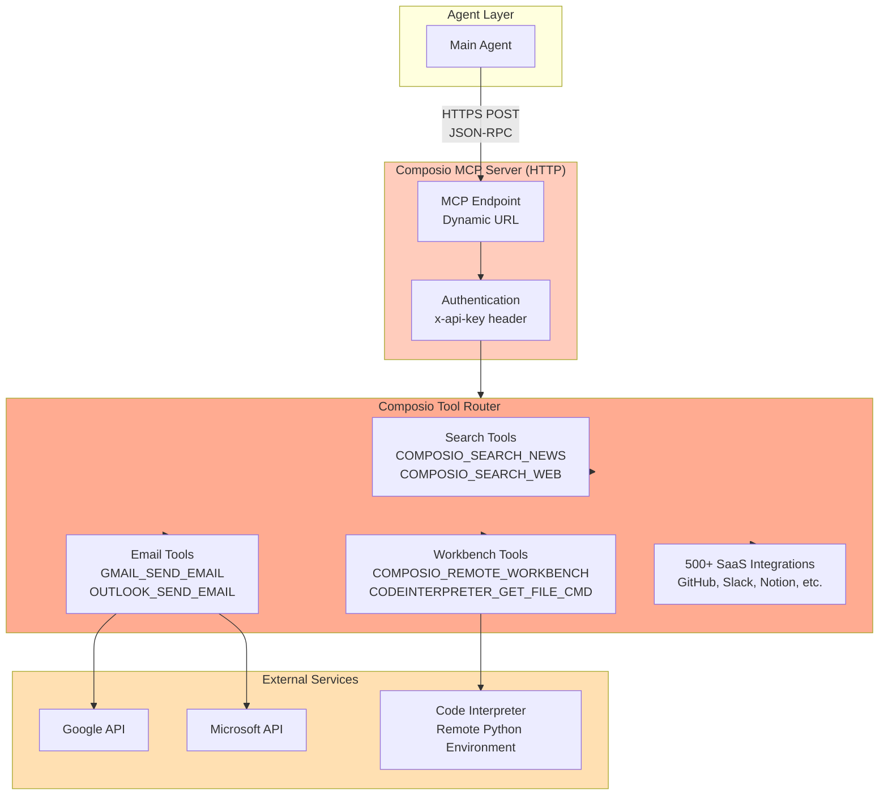
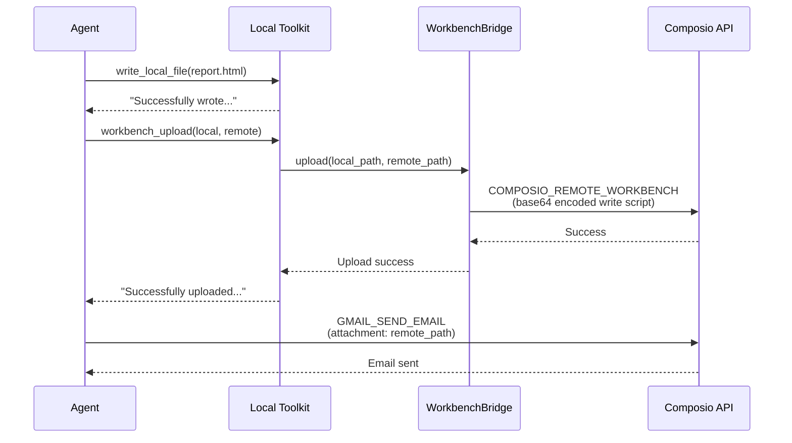
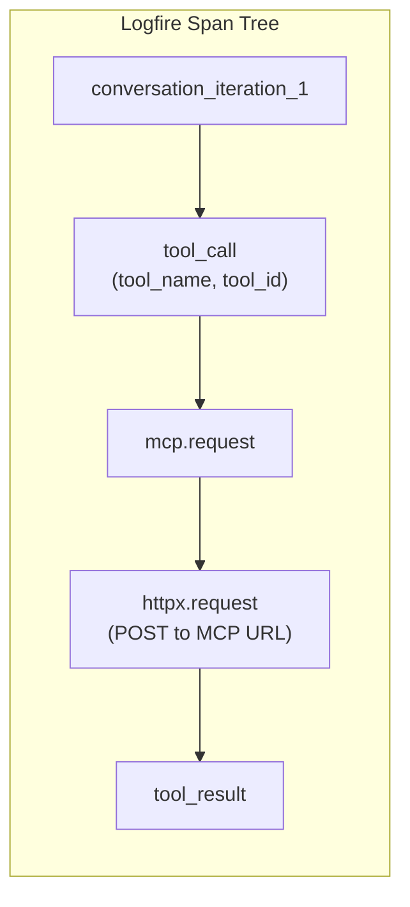

# MCP Servers Architecture

**Date:** December 22, 2025
**Status:** ACTIVE
**Related Files:**
- `src/mcp_server.py` - Local Toolkit MCP server implementation
- `src/tools/workbench_bridge.py` - WorkbenchBridge for file transfer
- `src/universal_agent/main.py:1075-1093` - MCP server configuration

---

## Overview

The Universal Agent integrates **multiple MCP (Model Context Protocol) servers** to provide a comprehensive toolset for local operations, external actions, web content extraction, and multimodal analysis. Each server serves a distinct purpose in the "Local Brain, Remote Hands" architecture.

| Server | Type | Purpose |
|--------|------|--------|
| `local_toolkit` | stdio | Local file ops, web extraction (crawl4ai) |
| `composio` | HTTP | 500+ SaaS integrations (Gmail, Slack, etc.) |
| `edgartools` | stdio | SEC Edgar financial research |
| `video_audio` | stdio | FFmpeg video/audio editing |
| `youtube` | stdio | yt-dlp video downloads |
| `zai_vision` | stdio | GLM-4.6V image/video analysis |



---

## 1. Local Toolkit MCP Server (Custom)

### Connection Details

| Property | Value |
|----------|-------|
| **Type** | stdio |
| **Command** | `python src/mcp_server.py` |
| **Server Name** | `local_toolkit` |
| **Code Reference** | `src/mcp_server.py:1-140` |

### Architecture



### Tool Catalog

#### 1.1 save_corpus()

**Purpose:** Save extracted article data to `expanded_corpus.json` for audit and report generation.

**Location:** `src/mcp_server.py:69-136`

**Schema:**
```python
def save_corpus(
    articles: list,          # List of article objects
    workspace_path: str      # Absolute path to session workspace
) -> str:                    # JSON response with status
```

**Article Object Structure:**
| Field | Type | Description |
|-------|------|-------------|
| `url` | str | Source URL of the article |
| `title` | str | Article title |
| `content` | str | FULL markdown content (NOT summarized) |
| `status` | str | `"success"` or `"failed"` |

**Response Schema:**
```json
{
  "success": true,
  "corpus_path": "/path/to/expanded_corpus.json",
  "articles_saved": 25,
  "successful": 22,
  "failed": 3,
  "total_content_bytes": 150000
}
```

**Usage Pattern (report-creation-expert):**
1. Call `webReader` for each URL (parallel batches of 5)
2. Collect results into list of article objects
3. Call `save_corpus(articles, workspace_path)`
4. Wait for success response before proceeding

---

#### 1.2 write_local_file()

**Purpose:** Write content to a file in the local workspace for reports, summaries, or generated code.

**Location:** `src/mcp_server.py:53-67`

**Schema:**
```python
def write_local_file(
    path: str,      # File path (relative or absolute)
    content: str    # Content to write
) -> str:          # Success/error message
```

**Response:**
```
"Successfully wrote 12345 chars to /path/to/file.md"
```

**Typical Use Cases:**
- Saving HTML reports (`work_products/report.html`)
- Persisting analysis summaries
- Writing generated code/scripts

---

#### 1.3 workbench_download()

**Purpose:** Download files from the Remote Composio Workbench to the local filesystem.

**Location:** `src/mcp_server.py:27-39`, `src/tools/workbench_bridge.py:47-130`

**Schema:**
```python
def workbench_download(
    remote_path: str,     # Absolute path on remote workbench
    local_path: str,      # Destination path locally
    session_id: str = None  # Optional Composio session ID
) -> str:
```

**Response:**
```
"Successfully downloaded /home/user/output.csv to /local/path/output.csv. Local path: /local/path/output.csv"
```

**Implementation Details:**

The download uses Composio's `CODEINTERPRETER_GET_FILE_CMD` tool with two response formats:

| Format | Response Structure | Handling |
|--------|-------------------|----------|
| **Direct Content** | `{data: {content: "file content..."}}` | Writes directly to local_path |
| **SDK Auto-Download** | `{data: {file: {uri: "/tmp/downloaded", file_downloaded: true}}}` | Copies from temp to local_path |

**Code Reference:** `src/tools/workbench_bridge.py:61-125`

---

#### 1.4 workbench_upload()

**Purpose:** Upload local files to the Remote Composio Workbench using remote Python execution.

**Location:** `src/mcp_server.py:41-51`, `src/tools/workbench_bridge.py:131-185`

**Schema:**
```python
def workbench_upload(
    local_path: str,      # Source file path locally
    remote_path: str,     # Destination path on remote workbench
    session_id: str = None  # Optional Composio session ID
) -> str:
```

**Response:**
```
"Successfully uploaded /local/file.txt to /home/user/file.txt."
```

**Implementation Method:**

Since Composio lacks a direct file upload tool, upload is implemented via remote Python execution:

```python
# Process at src/tools/workbench_bridge.py:131-184
1. Read local file content as bytes
2. Base64 encode the content
3. Generate Python script to decode and write:
   import os, base64
   path = '/remote/path'
   os.makedirs(os.path.dirname(path), exist_ok=True)
   with open(path, 'wb') as f:
       f.write(base64.b64decode('<encoded_content>'))
4. Execute via COMPOSIO_REMOTE_WORKBENCH tool
```

---

#### 1.5 upload_to_composio()

**Purpose:** One-step solution to upload a file to Composio and get S3 keys for email attachments.

**Location:** `src/mcp_server.py`

**Schema:**
```python
def upload_to_composio(
    path: str,          # Absolute local path to file
    mime_type: str = None  # Optional MIME type
) -> str:
```

**Response JSON:**
```json
{
  "s3_key": "user/uploads/file.pdf",
  "s3_url": "https://s3.amazonaws.com/...",
  "local_path": "/local/path/file.pdf"
}
```

**Usage:**
Pass the `s3_key` directly to `GMAIL_SEND_EMAIL` attachments.

---

#### 1.6 crawl_parallel()

**Purpose:** High-performance parallel web extraction using crawl4ai.

**Location:** `src/mcp_server.py`

**Features:**
- Parallel browser contexts
- Smart content cleaning (removes nav, ads)
- Markdown conversion
- Auto-saving to `search_results/`

**Schema:**
```python
def crawl_parallel(
    urls: list,         # List of URLs to scrape
    session_dir: str    # Current session workspace path
) -> str:
```

---

### WorkbenchBridge Class

**Location:** `src/tools/workbench_bridge.py:7-185`

**Purpose:** Abstracts the complexity of file transfer between local and remote environments.

**Constructor:**
```python
def __init__(self, composio_client, user_id=None):
    self.client = composio_client
    self.user_id = user_id
    self.sandbox_id = None  # Lazy-initialized
```

**Key Methods:**

| Method | Purpose | Composio Tool Used |
|--------|---------|-------------------|
| `_ensure_sandbox()` | Ensures sandbox session is active | (Internal) |
| `download()` | Downloads remote file to local | `CODEINTERPRETER_GET_FILE_CMD` |
| `upload()` | Uploads local file to remote | `COMPOSIO_REMOTE_WORKBENCH` |

---

## 2. Composio MCP Server (Remote Tool Router)

### Connection Details

| Property | Value |
|----------|-------|
| **Type** | HTTP |
| **URL** | Dynamic from `session.mcp.url` |
| **Headers** | `{"x-api-key": "<COMPOSIO_API_KEY>"}` |
| **Server Name** | `composio` |
| **Code Reference** | `src/universal_agent/main.py:1076-1080` |

### Architecture



### Tool Categories

The Composio MCP server exposes **500+ tools** through a unified HTTP interface. Tools are invoked using the naming pattern:

```
mcp__composio__<TOOL_SLUG>
```

#### 2.1 Search & Research Tools

| Tool Slug | Description | Common Parameters |
|-----------|-------------|-------------------|
| `COMPOSIO_SEARCH_NEWS` | Search news articles | `query`, `num_results` |
| `COMPOSIO_SEARCH_WEB` | General web search | `query`, `num_results` |
| `COMPOSIO_MULTI_EXECUTE_TOOL` | Execute multiple tools in parallel | `tools: [{slug, params}]` |

**Agent-First Discovery Protocol:**

Per the RUBE Agent-First Discovery Protocol, the agent **MUST** discover tools dynamically rather than hardcoding slugs:

```python
# 1. Agent discovers tools
RUBE_SEARCH_TOOLS(intent="search news") -> Returns tool slugs

# 2. Agent learns schema
Get input schema for discovered tools -> Learns parameters

# 3. Agent constructs parameters dynamically
Build params based on schema + user intent

# 4. Agent executes
RUBE_MULTI_EXECUTE_TOOL(params)
```

**Reference:** `/home/kjdragan/lrepos/claudemultiagent/001_OFFICIAL_PROJECT_DOCUMENTATION/RUBE_AGENT_FIRST_PROTOCOL.md`

---

#### 2.2 Workbench & Code Execution Tools

| Tool Slug | Description | Parameters |
|-----------|-------------|------------|
| `COMPOSIO_REMOTE_WORKBENCH` | Execute Python code remotely | `code_to_execute`, `session_id` |
| `CODEINTERPRETER_GET_FILE_CMD` | Download file from workbench | `file_path` |
| `CODEINTERPRETER_WRITE_FILE_CMD` | Write file to workbench | `file_path`, `content` |

---

#### 2.3 Email & Communication Tools

| Tool Slug | Description | Parameters |
|-----------|-------------|------------|
| `GMAIL_SEND_EMAIL` | Send via Gmail | `to`, `subject`, `body`, `attachments` |
| `OUTLOOK_SEND_EMAIL` | Send via Outlook | `to`, `subject`, `body`, `attachments` |
| `SLACK_SEND_MESSAGE` | Send Slack message | `channel`, `text` |

---

#### 2.4 File Handling Pattern

For email attachments, files must be accessible to the remote workbench:



---


---

## 4. MCP Communication Flow

### Tool Invocation Pattern

All MCP tools follow a standardized naming convention:

```
mcp__<server_name>__<tool_name>
```

**Examples:**
| Server | Tool Call |
|--------|-----------|
| `local_toolkit` | `mcp__local_toolkit__save_corpus` |
| `local_toolkit` | `mcp__local_toolkit__write_local_file` |
| `composio` | `mcp__composio__COMPOSIO_SEARCH_NEWS` |
| `composio` | `mcp__composio__GMAIL_SEND_EMAIL` |


---

### Configuration (main.py)

**Location:** `src/universal_agent/main.py:1025-1093`

```python
options = ClaudeAgentOptions(
    system_prompt=system_prompt,
    mcp_servers={
        "composio": {
            "type": "http",
            "url": session.mcp.url,  # Dynamic from Composio SDK
            "headers": {
                "x-api-key": os.environ["COMPOSIO_API_KEY"]
            },
        },
        "local_toolkit": {
            "type": "stdio",
            "command": sys.executable,
            "args": ["src/mcp_server.py"],
        },
    "local_toolkit": {
            "type": "stdio",
            "command": sys.executable,
            "args": ["src/mcp_server.py"],
        },
    },
    allowed_tools=["Task"],  # For sub-agent delegation
    agents={
        "report-creation-expert": AgentDefinition(
            tools=[
                "mcp__local_toolkit__crawl_parallel",
                "mcp__local_toolkit__save_corpus",
                "mcp__local_toolkit__write_local_file",
                "mcp__local_toolkit__upload_to_composio",
            ],
            # ...
        ),
    },
)
```

---

### Distributed Tracing (Logfire)

All MCP calls are traced via Logfire's MCP instrumentation:

**Location:** `src/universal_agent/main.py:94-99`

```python
logfire.instrument_mcp()  # Automatic span creation
```

**Trace Structure:**


**View Traces:**
```
https://logfire.pydantic.dev/Kjdragan/composio-claudemultiagent?q=trace_id='<trace_id>'
```

---

## 5. Tool Access Matrix

| Tool | Main Agent | report-creation-expert | Purpose |
|------|------------|------------------------|---------|
| `mcp__local_toolkit__save_corpus` | No | **Yes** | Save extraction corpus |
| `mcp__local_toolkit__write_local_file` | Yes | **Yes** | Write reports locally |
| `mcp__local_toolkit__workbench_download` | Yes | **Yes** | Download from remote |
| `mcp__local_toolkit__workbench_upload` | Yes | **Yes** | Upload to remote |
| `mcp__composio__COMPOSIO_SEARCH_*` | **Yes** | Read-only | Search operations |
| `mcp__composio__GMAIL_SEND_EMAIL` | **Yes** | No | Send emails |
| `mcp__composio__COMPOSIO_REMOTE_WORKBENCH` | **Yes** | No | Remote code execution |
| `mcp__local_toolkit__crawl_parallel` | Yes | **Yes** | Parallel web scraping |

---

## 6. Error Handling & Retry Logic


---

### Composio Error Handling

Composio tools return structured errors:

```json
{
  "error": "Error message",
  "successful": false
}
```

**Agent Response:** The agent interprets errors and adjusts its approach (e.g., retrying with different parameters).

---

## 7. Security Considerations

### API Key Management

| Key | Environment Variable | Used By |
|-----|---------------------|---------|
| Composio API Key | `COMPOSIO_API_KEY` | Composio MCP header |


**File:** `.env` (not committed to git)

---

### File System Boundaries

| Context | Access Pattern |
|---------|----------------|
| **Local** | Direct file access via local_toolkit |
| **Remote Workbench** | Via workbench_upload/workbench_download bridge |

**Important:** Paths are NOT interchangeable:
- Local: `/home/kjdragan/...` or relative paths
- Remote: `/home/user/...` (inside workbench sandbox)

---

## 8. Performance Optimizations

### crawl_parallel Batching

The `report-creation-expert` processes URLs in batches of 10:

```
Batch 1: [URL1..URL10]
  -> Single crawl_parallel call
  -> Count successes
  -> If <10 total successes, proceed to Batch 2
  -> Else STOP (HARD STOP at 10 extractions)
```

**Rationale:** Minimizes timeout impact while collecting sufficient data.

---

### Local-First Data Flow

Per the Local-First Architecture (`012_LOCAL_VS_WORKBENCH_ARCHITECTURE.md`):

**Default:** `sync_response_to_workbench=False`
- Returns JSON directly to agent
- No file download overhead
- Atomic transaction

**Exception:** For >5MB responses, use `sync_response_to_workbench=True`

---

## 9. Environment Variables

| Variable | Required | Description |
|----------|----------|-------------|
| `COMPOSIO_API_KEY` | Yes | Composio authentication |
| `LOGFIRE_TOKEN` | Optional | Distributed tracing |
| `DEFAULT_USER_ID` | Yes | Composio user identifier |
| `Z_AI_API_KEY` | For Vision | Z.AI API key for Vision MCP |
| `Z_AI_MODE` | For Vision | Service platform (`ZAI`) |

---

## 10. References

- **Local MCP Server:** `src/mcp_server.py`
- **WorkbenchBridge:** `src/tools/workbench_bridge.py`
- **MCP Configuration:** `src/universal_agent/main.py:1288-1327`
- **Vision MCP Integration:** `Project_Documentation/027_VISION_MCP_INTEGRATION.md`
- **Local-First Architecture:** `Project_Documentation/012_LOCAL_VS_WORKBENCH_ARCHITECTURE.md`

---

*Document Version: 1.0*
*Last Updated: December 22, 2025*
