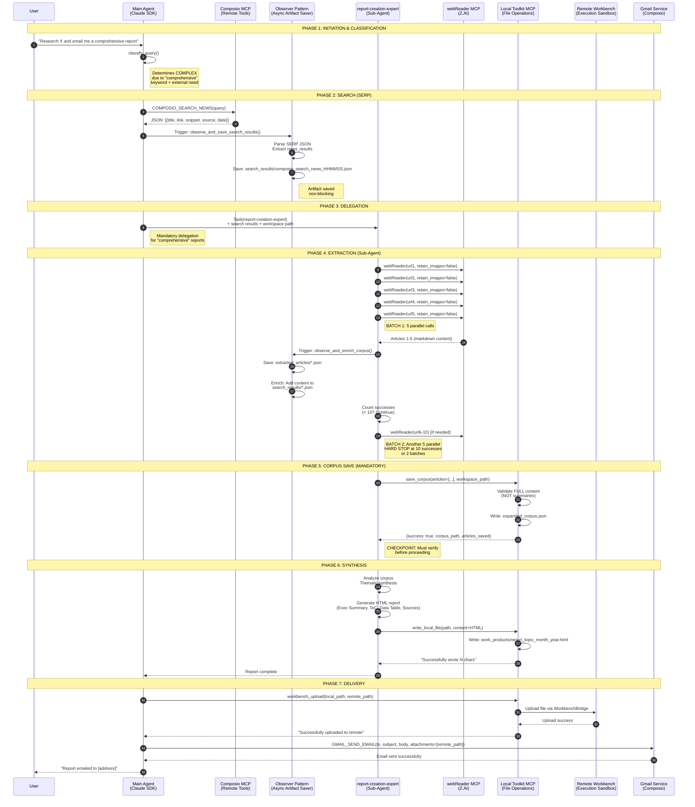
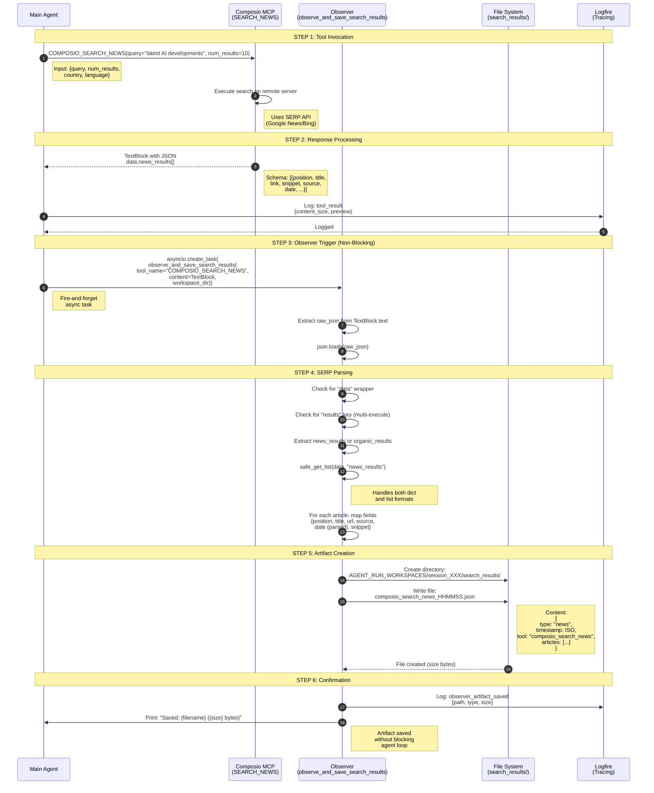
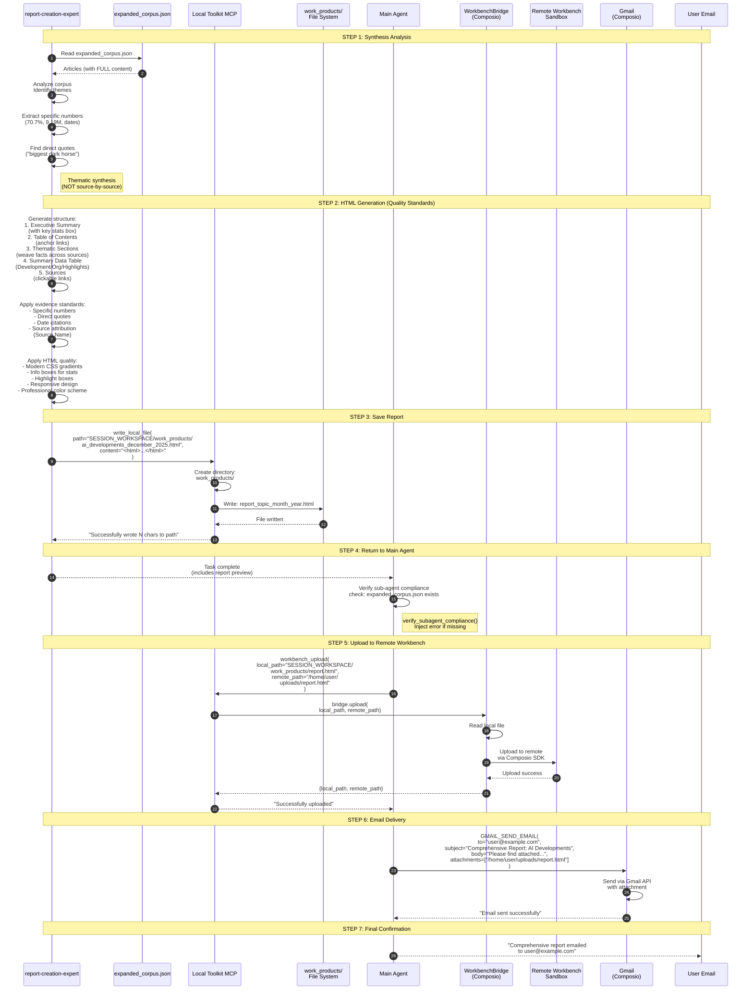
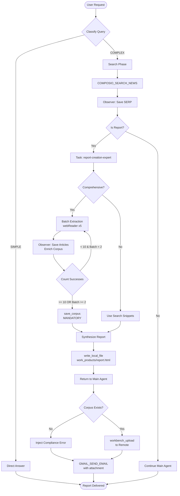

# End-to-End Research & Report Workflow

**Version**: 1.0
**Last Updated**: 2025-12-22
**Status**: Active

## Overview

This document details the complete end-to-end workflow for research and report generation in the Universal Agent system. The workflow spans from user request initiation through search, extraction, synthesis, and final email delivery.

### High-Level Flow

```
User Request
    ↓
Query Classification (SIMPLE vs COMPLEX)
    ↓
[COMPLEX PATH] Search Phase (SERP via Composio)
    ↓
Observer Pattern: Save search_results/*.json
    ↓
Delegation: Main Agent → report-creation-expert Sub-Agent
    ↓
Sub-Agent: Parallel Article Extraction (webReader, 5 at a time)
    ↓
Observer Pattern: Save extracted_articles/*.json, Enrich Corpus
    ↓
Sub-Agent: save_corpus → expanded_corpus.json (MANDATORY CHECKPOINT)
    ↓
Sub-Agent: Synthesize HTML Report (Quality Standards)
    ↓
Sub-Agent: write_local_file → work_products/report.html
    ↓
Main Agent: Receives Report, workbench_upload to Remote
    ↓
Main Agent: GMAIL_SEND_EMAIL with Remote Attachment
    ↓
Final: Report Delivered to User
```

---

## 1. End-to-End Workflow Overview



---

## 2. Detailed Phase: Search & SERP Processing



### Search Results Schema

**File**: `search_results/composio_search_news_HHMMSS.json`

```json
{
  "type": "news",
  "timestamp": "2025-12-22T14:30:45.123456",
  "tool": "composio_search_news",
  "articles": [
    {
      "position": 1,
      "title": "OpenAI Announces GPT-5.2 with 70.7% GDPval Score",
      "url": "https://example.com/openai-gpt52",
      "source": "TechCrunch",
      "date": "2025-12-20",
      "snippet": "OpenAI released GPT-5.2 achieving 70.7% on GDPval..."
    }
  ]
}
```

**Code References**:
- Observer function: `main.py:218-413` (`observe_and_save_search_results`)
- Date parsing: `main.py:137-159` (`parse_relative_date`)
- SERP parsing: `main.py:323-368`

---

## 3. Detailed Phase: Article Extraction & Corpus Enrichment

```mermaid
sequenceDiagram
    autonumber
    participant SubAgent as report-creation-expert<br/>(Sub-Agent)
    participant WebReaderMCP as webReader MCP<br/>(Z.AI)
    participant Observer as Observer<br/>(observe_and_enrich_corpus)
    participant ArticlesDir as extracted_articles/<br/>File System
    participant SearchResults as search_results/<br/>Existing SERP Files
    participant CorpusFile as expanded_corpus.json<br/>(Final Corpus)
    participant LocalToolkit as Local Toolkit MCP
    participant Logfire as Logfire

    Note over SubAgent,Logfire: BATCH 1: First 5 URLs (Parallel)
    SubAgent->>SubAgent: Parse search results<br/>Extract URLs 1-5

    par Parallel Extraction
        SubAgent->>WebReaderMCP: webReader(url1, retain_images=false)
    and
        SubAgent->>WebReaderMCP: webReader(url2, retain_images=false)
    and
        SubAgent->>WebReaderMCP: webReader(url3, retain_images=false)
    and
        SubAgent->>WebReaderMCP: webReader(url4, retain_images=false)
    and
        SubAgent->>WebReaderMCP: webReader(url5, retain_images=false)
    end

    Note right of SubAgent: Optimization: retain_images=false<br/>reduces payload size

    Note over SubAgent,Logfire: Response Processing (Per Article)
    WebReaderMCP-->>SubAgent: TextBlock (Success or Error)
    SubAgent->>Observer: Trigger: observe_and_enrich_corpus()<br/>for each result

    Observer->>Observer: Extract raw_json from TextBlock
    Observer->>Observer: Check for MCP error codes

    alt Error Code 1234 (Network Timeout)
        Observer->>Logfire: Warning: webreader_timeout_error<br/>{url, error_code}
        Observer->>Observer: Queue for retry<br/>(after all batches)
        Note right of Observer: Retryable error

    alt Error Code 1214 (Not Found)
        Observer->>Logfire: Warning: webreader_not_found<br/>{url, error_code}
        Observer->>Observer: _update_domain_blacklist()<br/>Track 3+ failures
        Observer->>Observer: Mark as failed, NO retry
        Note right of Observer: Permanent failure

    alt Success
        Observer->>Observer: Parse JSON: data.reader_result
        Observer->>Observer: Extract: {title, content,<br/>description, url}

        Note over SubAgent,Logfire: Save Individual Article
        Observer->>ArticlesDir: Create: extracted_articles/
        Observer->>ArticlesDir: Write: {safe_name}_{timestamp}.json
        Note right of ArticlesDir: {<br/>timestamp, source_url,<br/>title, description,<br/>content (markdown),<br/>extraction_success<br/>}

        Observer->>Logfire: Info: article_extracted<br/>{url, title, content_length}

        Note over SubAgent,Logfire: Enrich Existing Corpus
        Observer->>SearchResults: Find matching SERP file<br/>by URL
        Observer->>SearchResults: Add "content" field<br/>Add "extraction_timestamp"
        Observer->>SearchResults: Update: search_results/*.json
        Observer->>Logfire: Info: corpus_enriched<br/>{file, url}

    end

    Note over SubAgent,Logfire: BATCH 1 Complete
    SubAgent->>SubAgent: Count successes
    SubAgent->>SubAgent: if successes < 10: Continue to BATCH 2

    Note over SubAgent,Logfire: BATCH 2: URLs 6-10 (if needed)
    SubAgent->>WebReaderMCP: webReader(url6-10)
    Note right of SubAgent: Same parallel pattern<br/>HARD STOP after this batch

    Note over SubAgent,Logfire: Retry Failed 1234 Errors
    SubAgent->>SubAgent: Identify queued 1234 errors
    SubAgent->>WebReaderMCP: Retry 2 at a time<br/>(lower concurrency)
    Note right of SubAgent: Max 1 retry per URL

    Note over SubAgent,Logfire: CHECKPOINT: Save Corpus (MANDATORY)
    SubAgent->>SubAgent: Compile articles list<br/>[{url, title, content, status}]
    Note right of SubAgent: Must pass FULL content<br/>NOT summaries

    SubAgent->>LocalToolkit: save_corpus(<br/>articles=[...],<br/>workspace_path="SESSION_WORKSPACE"<br/>)

    LocalToolkit->>LocalToolkit: Count successes/failures
    LocalToolkit->>LocalToolkit: Build corpus JSON:<br/>{<br/>extraction_timestamp,<br/>total_articles,<br/>successful, failed,<br/>articles[...]<br/>}

    LocalToolkit->>CorpusFile: Write: expanded_corpus.json
    CorpusFile-->>LocalToolkit: File written

    LocalToolkit-->>SubAgent: {<br/>success: true,<br/>corpus_path, articles_saved,<br/>successful, failed,<br/>total_content_bytes<br/>}

    SubAgent->>SubAgent: Verify success == true
    Note right of SubAgent: DO NOT PROCEED without<br/>successful save_corpus
```

### Hard Stop Rules

| Rule | Condition | Action |
|------|-----------|--------|
| **10 successes** | `success_count >= 10` | STOP immediately, call save_corpus |
| **2 batches** | `batch_count >= 2` | STOP even if < 10 successes |
| **Error 1234** | Network timeout | Queue for retry (1 max) |
| **Error 1214** | 404 Not found | Skip, no retry |

### expanded_corpus.json Schema

**File**: `AGENT_RUN_WORKSPACES/session_XXX/expanded_corpus.json`

```json
{
  "extraction_timestamp": "2025-12-22T14:35:12.123456Z",
  "total_articles": 12,
  "successful": 10,
  "failed": 2,
  "articles": [
    {
      "url": "https://example.com/article1",
      "title": "Article Title Here",
      "content": "# Full Markdown Content\n\nThis is the complete article...",
      "status": "success"
    },
    {
      "url": "https://blocked.com/article2",
      "title": "",
      "content": "MCP error code 1214",
      "status": "failed"
    }
  ]
}
```

**Code References**:
- Sub-agent instructions: `.claude/agents/report-creation-expert.md:26-38` (Hard stop rules)
- Extraction workflow: `.claude/agents/report-creation-expert.md:48-76` (Batching strategy)
- Corpus save: `mcp_server.py:69-135` (`save_corpus` tool)
- Observer: `main.py:479-626` (`observe_and_enrich_corpus`)
- Blacklist: `main.py:167-205` (`_update_domain_blacklist`)

---

## 4. Detailed Phase: Report Synthesis & Delivery



### Report Structure Requirements

**Mandatory Sections**:

```html
<!DOCTYPE html>
<html>
<head>
  <style>
    /* Modern CSS with gradients and shadows */
    .executive-summary {
      background: linear-gradient(135deg, #667eea 0%, #764ba2 100%);
      color: white;
      padding: 2rem;
      border-radius: 8px;
    }
    .info-box {
      background: #f3f4f6;
      border-left: 4px solid #667eea;
      padding: 1rem;
      margin: 1rem 0;
    }
    .data-table {
      border-collapse: collapse;
      width: 100%;
    }
    .data-table th, .data-table td {
      border: 1px solid #e5e7eb;
      padding: 0.75rem;
    }
  </style>
</head>
<body>
  <!-- 1. Executive Summary with highlight box -->
  <section class="executive-summary">
    <h2>Executive Summary</h2>
    <div class="info-box">
      <strong>Key Stat:</strong> GPT-5.2 achieved 70.7% on GDPval (OpenAI)
    </div>
  </section>

  <!-- 2. Table of Contents with anchors -->
  <nav>
    <h2>Table of Contents</h2>
    <ul>
      <li><a href="#performance">Performance Breakthroughs</a></li>
      <li><a href="#efficiency">Efficiency Gains</a></li>
    </ul>
  </nav>

  <!-- 3. Thematic sections (weave facts across sources) -->
  <section id="performance">
    <h2>Performance Breakthroughs</h2>
    <p>OpenAI's GPT-5.2 achieved <strong>70.7% on GDPval</strong> (TechCrunch), representing a significant jump from previous models. Meanwhile, DeepSeek-V3 has emerged as the "biggest dark horse in the open-source LLM arena" (VentureBeat), with competitive performance on benchmarks.</p>
  </section>

  <!-- 4. Summary Data Table -->
  <table class="data-table">
    <thead>
      <tr>
        <th>Development</th>
        <th>Organization</th>
        <th>Key Highlights</th>
      </tr>
    </thead>
    <tbody>
      <tr>
        <td>GPT-5.2</td>
        <td>OpenAI</td>
        <td>70.7% GDPval, December 11, 2025</td>
      </tr>
      <tr>
        <td>DeepSeek-V3</td>
        <td>DeepSeek</td>
        <td>Biggest dark horse in OSS arena</td>
      </tr>
    </tbody>
  </table>

  <!-- 5. Sources -->
  <section>
    <h2>Sources</h2>
    <ul>
      <li><a href="https://...">TechCrunch - OpenAI Announces GPT-5.2</a></li>
      <li><a href="https://...">VentureBeat - DeepSeek-V3 Release</a></li>
    </ul>
  </section>
</body>
</html>
```

### Quality Standards

| Evidence Type | Do This | Don't Do This |
|---------------|---------|---------------|
| Numbers | "70.7% on GDPval" | "Performed well" |
| Dates | "December 11, 2025" | "Recently released" |
| Quotes | "biggest dark horse in open-source LLM arena" | "DeepSeek is competitive" |
| Comparisons | "38% fewer hallucinations than GPT-5.1" | "Fewer hallucinations" |
| Attribution | "(TechCrunch)" after claim | No source attribution |

**Code References**:
- Quality standards: `.claude/agents/report-creation-expert.md:88-120`
- HTML template: `.claude/agents/report-creation-expert.md:114-120`
- File write: `mcp_server.py:53-66` (`write_local_file`)
- Workbench upload: `mcp_server.py:41-50` (`workbench_upload`)
- Compliance check: `main.py:629-672` (`verify_subagent_compliance`)

---

## 5. Workspace Artifacts

### Directory Structure

```
AGENT_RUN_WORKSPACES/
└── session_20251222_143045/
    ├── search_results/
    │   ├── composio_search_news_143046.json       # SERP results
    │   └── composio_search_news_143047_0.json     # Additional searches
    ├── extracted_articles/
    │   ├── example_com_article1_143100.json       # Individual articles
    │   └── techcrunch_com_gpt52_143105.json
    ├── expanded_corpus.json                        # MANDATORY CHECKPOINT
    ├── work_products/
    │   └── ai_developments_december_2025.html     # Final report
    ├── workbench_activity/
    │   └── workbench_143200.json                  # Code execution logs
    ├── run.log                                    # Full session log
    ├── trace.json                                 # Execution trace
    └── summary.txt                                # Session summary
```

### Artifact Lifecycles

| Artifact | Created By | Phase | Purpose |
|----------|------------|-------|---------|
| `search_results/*.json` | Observer | Search | SERP storage for sub-agent |
| `extracted_articles/*.json` | Observer | Extraction | Individual article storage |
| `expanded_corpus.json` | Sub-Agent | Extraction | MANDATORY checkpoint for audit |
| `work_products/*.html` | Sub-Agent | Synthesis | Final report output |
| `trace.json` | Main Agent | All phases | Execution observability |

---

## 6. Error Handling & Retry Logic

### Network Errors (Code 1234)

```
Error: "MCP error: Network error" (171 bytes)
Action: Queue for retry (max 1 retry per URL)
Retry Strategy: 2 at a time (lower concurrency than initial batch)
```

### Not Found Errors (Code 1214)

```
Error: "MCP error: Not found" (90 bytes)
Action: Mark as failed, NO retry
Side Effect: Update domain blacklist (3 strikes = blacklisted)
```

### Blacklist Tracking

**File**: `AGENT_RUN_WORKSPACES/webReader_blacklist.json` (persistent)

```json
{
  "domains": {
    "paywall.example.com": {
      "failures": 3,
      "last_failure": "2025-12-22T14:30:00"
    }
  },
  "threshold": 3
}
```

**Code References**:
- Error handling: `.claude/agents/report-creation-expert.md:63-70`
- Blacklist logic: `main.py:167-205`
- Observer error detection: `main.py:508-540`

---

## 7. Observability & Tracing

### Logfire Spans

```
standalone_composio_test (root span)
├── conversation_iteration_1
│   ├── tool_call (COMPOSIO_SEARCH_NEWS)
│   ├── tool_result
│   ├── observer_artifact_saved
│   ├── conversation_iteration_2
│   │   ├── tool_call (Task / report-creation-expert)
│   │   └── tool_result
│   └── ...
└── session_complete
```

### Key Logfire Events

| Event | Level | Context |
|-------|-------|---------|
| `query_classification` | Info | SIMPLE vs COMPLEX decision |
| `tool_call` | Info | Tool name, input_size, is_subagent_call |
| `tool_result` | Info | Content size, is_error |
| `observer_artifact_saved` | Info | Path, type, size |
| `article_extracted` | Info | URL, title, content_length |
| `corpus_enriched` | Info | File, URL |
| `webreader_timeout_error` | Warning | URL, error_code 1234 |
| `webreader_not_found` | Warning | URL, error_code 1214 |
| `domain_blacklisted` | Warning | Domain, failures |
| `subagent_compliance_failed` | Warning | Missing expanded_corpus.json |

**Code References**:
- Logfire config: `main.py:49-111`
- Span creation: `main.py:696-704` (conversation iteration)
- Event logging: Throughout `main.py` (see `logfire.info`, `logfire.warning`)

---

## 8. Temporal Consistency

### Date Handling

```
System Prompt Injection:
"Result Date: Monday, December 22, 2025"
"TEMPORAL CONSISTENCY WARNING: You are operating in a timeline where it is December 2025."
```

### Relative Date Parsing

**Input**: "2 hours ago"
**Output**: "2025-12-22" (via `parse_relative_date()`)

**Code References**:
- Date parsing: `main.py:137-159`
- System prompt injection: `main.py:1027-1030`

---

## 9. Configuration & Environment Variables

### Required Environment Variables

| Variable | Purpose | Example |
|----------|---------|---------|
| `COMPOSIO_API_KEY` | Composio MCP authentication | `key_...` |
| `ZAI_API_KEY` | webReader MCP authentication | `Bearer token` |
| `LOGFIRE_TOKEN` | Tracing backend | `logfire_...` |
| `LOGFIRE_PROJECT_SLUG` | Logfire project | `Kjdragan/composio-claudemultiagent` |

### MCP Server Configuration

**Code Reference**: `main.py:1075-1093`

```python
mcp_servers={
    "composio": {
        "type": "http",
        "url": session.mcp.url,
        "headers": {"x-api-key": COMPOSIO_API_KEY}
    },
    "local_toolkit": {
        "type": "stdio",
        "command": sys.executable,
        "args": ["src/mcp_server.py"]
    },
    "web_reader": {
        "type": "http",
        "url": "https://api.z.ai/api/mcp/web_reader/mcp",
        "headers": {"Authorization": f"Bearer {ZAI_API_KEY}"}
    }
}
```

---

## 10. Performance Considerations

### Concurrency Limits

| Phase | Concurrency | Rationale |
|-------|-------------|-----------|
| webReader extraction | 5 parallel | Balance speed vs. reliability |
| Retry 1234 errors | 2 parallel | Lower concurrency for unstable URLs |
| Observer saves | Async non-blocking | Don't block agent loop |

### Hard Stop Limits

| Limit | Value | Reason |
|-------|-------|--------|
| Max successful extractions | 10 | Sufficient for comprehensive report |
| Max batches | 2 | Prevent infinite extraction loops |
| Max retries per URL | 1 | Avoid wasting time on failed domains |

### Data Flow Optimization

```python
# Default: Data returns directly to context (fast)
sync_response_to_workbench=False

# Only use True for massive data (>5MB)
if expected_size > 5_000_000:
    sync_response_to_workbench=True
    # Then: workbench_download to fetch full file
```

**Code Reference**: `main.py:1043-1047` (DATA FLOW POLICY)

---

## 11. Compliance & Verification

### Sub-Agent Compliance Check

**Trigger**: After Task (sub-agent) completion

**Check**: Does `expanded_corpus.json` exist in workspace?

**Failure Action**: Inject error message into response

```python
def verify_subagent_compliance(tool_name, tool_content, workspace_dir):
    if "task" not in tool_name.lower():
        return None

    corpus_path = os.path.join(workspace_dir, "expanded_corpus.json")
    if not os.path.exists(corpus_path):
        logfire.warning("subagent_compliance_failed", ...)
        return "❌ COMPLIANCE ERROR: The report-creation-expert did not save expanded_corpus.json..."
```

**Code Reference**: `main.py:629-672`

---

## 12. Troubleshooting Guide

### Issue: No articles extracted

**Symptoms**: `expanded_corpus.json` shows `successful: 0`

**Possible Causes**:
1. All URLs returned error 1214 (404)
2. Network timeout (1234) on all URLs
3. webReader MCP unavailable

**Debug Steps**:
1. Check `extracted_articles/` for error patterns
2. Check `webReader_blacklist.json` for blacklisted domains
3. Review Logfire traces for `webreader_mcp_error` events

### Issue: Report not emailed

**Symptoms**: Report exists in `work_products/` but no email sent

**Possible Causes**:
1. `workbench_upload` failed
2. Gmail authentication required
3. Remote path incorrect in GMAIL_SEND_EMAIL

**Debug Steps**:
1. Check trace for `workbench_upload` result
2. Check for auth link in trace
3. Verify remote path matches upload destination

### Issue: Sub-agent didn't save corpus

**Symptoms**: Compliance error injected, `expanded_corpus.json` missing

**Possible Causes**:
1. Sub-agent bypassed save_corpus step
2. File write permission error
3. Workspace path incorrect

**Debug Steps**:
1. Check sub-agent instructions in `.claude/agents/report-creation-expert.md`
2. Verify `CURRENT_SESSION_WORKSPACE` was injected
3. Check `run.log` for save_corpus call

---

## 13. Key Files Reference

| File | Lines | Purpose |
|------|-------|---------|
| `src/universal_agent/main.py` | 1-1379 | Main agent with observer pattern |
| `.claude/agents/report-creation-expert.md` | 1-137 | Sub-agent instructions |
| `src/mcp_server.py` | 1-140 | Local toolkit MCP tools |
| `src/tools/workbench_bridge.py` | - | Workbench file transfer |

### Key Functions

| Function | Location | Purpose |
|----------|----------|---------|
| `classify_query()` | main.py:917-956 | SIMPLE vs COMPLEX routing |
| `run_conversation()` | main.py:691-914 | Main agent loop |
| `observe_and_save_search_results()` | main.py:218-413 | SERP artifact saver |
| `observe_and_enrich_corpus()` | main.py:479-626 | Article extraction observer |
| `verify_subagent_compliance()` | main.py:629-672 | Corpus checkpoint verification |
| `save_corpus()` | mcp_server.py:69-135 | MCP tool for corpus save |
| `workbench_upload()` | mcp_server.py:41-50 | MCP tool for remote upload |
| `write_local_file()` | mcp_server.py:53-66 | MCP tool for local file write |

---

## 14. Summary Flowchart



---

## Appendix A: Tool Call Examples

### Example 1: Search

```json
{
  "name": "mcp__composio__SEARCH_NEWS",
  "input": {
    "query": "latest AI developments December 2025",
    "num_results": 10
  }
}
```

### Example 2: Article Extraction

```json
{
  "name": "mcp__web_reader__webReader",
  "input": {
    "url": "https://techcrunch.com/2025/12/11/openai-gpt52",
    "retain_images": false
  }
}
```

### Example 3: Corpus Save

```json
{
  "name": "mcp__local_toolkit__save_corpus",
  "input": {
    "articles": [
      {
        "url": "https://...",
        "title": "...",
        "content": "# Full markdown...",
        "status": "success"
      }
    ],
    "workspace_path": "/path/to/AGENT_RUN_WORKSPACES/session_XXX"
  }
}
```

### Example 4: Email

```json
{
  "name": "mcp__composio__GMAIL_SEND_EMAIL",
  "input": {
    "to": "user@example.com",
    "subject": "Comprehensive Report: AI Developments",
    "body": "Please find attached the comprehensive report...",
    "attachments": ["/home/user/uploads/report.html"]
  }
}
```

---

**Document Version**: 1.0
**Maintained By**: Universal Agent Team
**Related Docs**:
- `/docs/000_CURRENT_CONTEXT.md` - Current project status
- `/docs/012_LOCAL_VS_WORKBENCH_ARCHITECTURE.md` - Local vs remote architecture
- `/docs/004_HOOKS_ARCHITECTURE.md` - Observer pattern details
