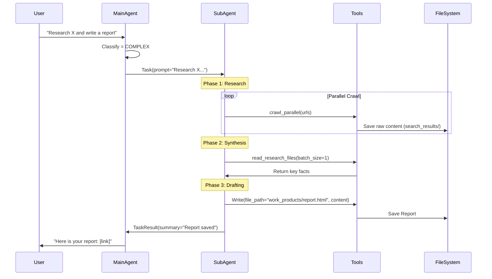

# Research Report Workflow

**Document Version**: 2.0
**Last Updated**: 2026-01-06
**Status**: ACTIVE
**Related Files:**
- `src/universal_agent/main.py`
- `src/mcp_server.py` (Research tools)

---

## Overview

The Research Report Workflow is a specialized **Complex Path** execution where the main agent delegates a deep research task to a `report-creation-expert` sub-agent. This ensures high-quality, comprehensive output without polluting the main agent's context.

## Workflow Phases

## detailed Steps

### 1. Delegation
The main agent recognizes the intent (e.g., "research", "report", "analysis") and calls the `Task` tool.
- **Tool**: `Task`
- **Agent**: `report-creation-expert`
- **Prompt**: Includes instructions to use `crawl_parallel` and `finalize_research`.

### 2. Research Execution
The sub-agent executes a loop:
1. **Search**: Uses `composio_search_web` to find sources.
2. **Crawl**: Uses `crawl_parallel` to fetch content.
   - Saves content to `search_results/` directory as JSON/Markdown.
   - **Crucial**: Does NOT put full text in context window.
3. **Read**: Uses `read_research_files` or `read_local_file` (native Read) to ingest specific content chunks.

### 3. Report Generation
The sub-agent synthesizes findings and writes the final artifact.
- **Tool**: `Write` (Native Claude SDK tool)
- **Path**: `work_products/<topic>_report.html` (or .md)
- **Constraint**: Must use `work_products/` directory to trigger preservation observers.

### 4. Handoff & Verification
When the sub-agent calls `TaskResult`:
1. **SubagentStop Hook** triggers.
2. `verify_subagent_compliance` checks if a report file exists in `work_products/`.
3. If missing: The hook rejects the stop and forces the sub-agent to write the file.
4. If present: Main agent resumes.

## Tool Chain

| Stage | Primary Tool | Replacement for Legacy |
|-------|--------------|------------------------|
| Research | `crawl_parallel` | `WEB_READER` |
| Reading | `Read` (native) | `read_local_file` |
| Writing | `Write` (native) | `write_local_file` |
| Context | `finalize_research` | (Manual context management) |

## Artifacts

All artifacts are scoped to a session ID:
- `AGENT_RUN_WORKSPACES/<session_id>/search_results/` (Raw data)
- `AGENT_RUN_WORKSPACES/<session_id>/work_products/` (Final reports)

The **Observer Pattern** supplements this by copying final reports to a global `SAVED_REPORTS/` directory for easier access.
