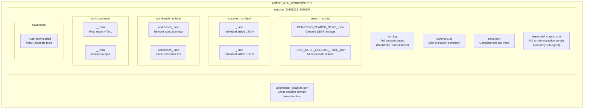
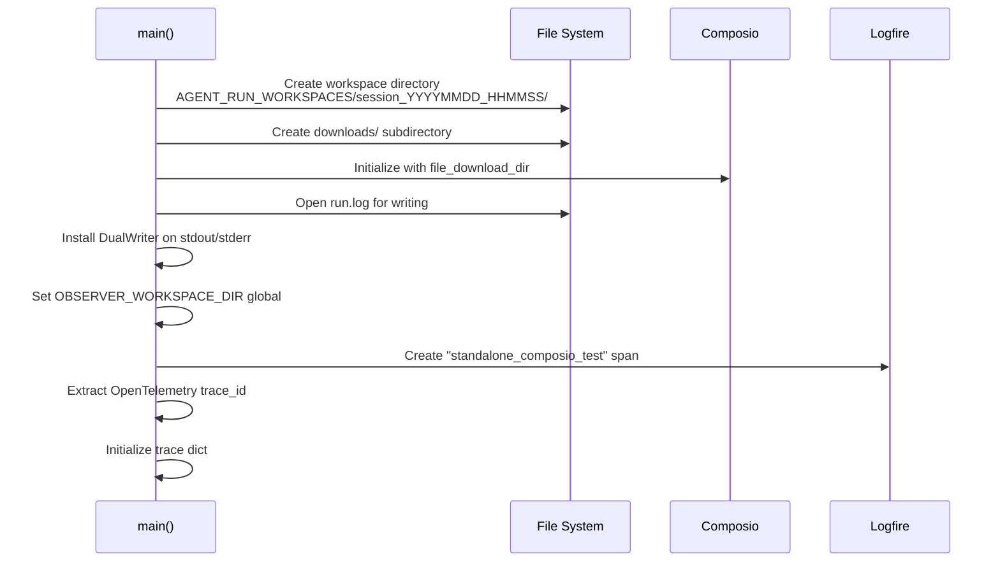
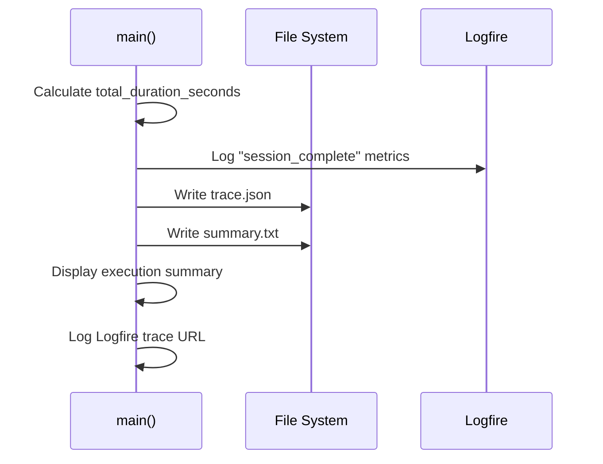
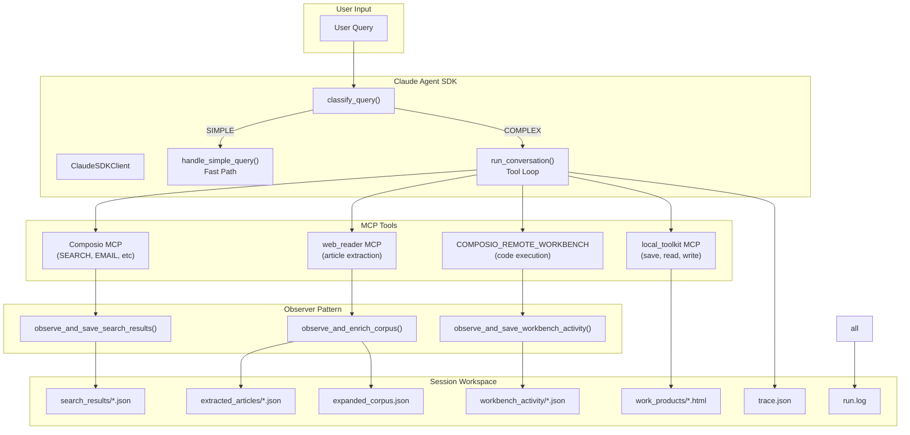
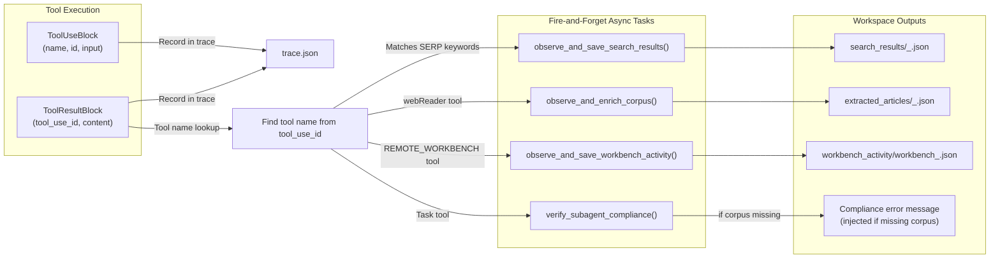
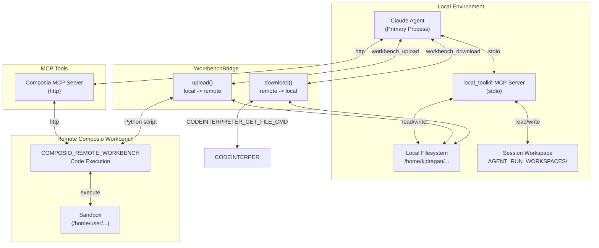
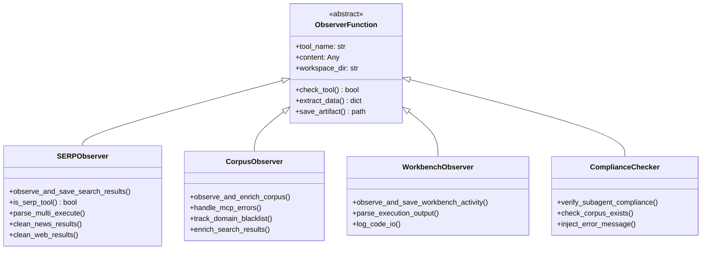
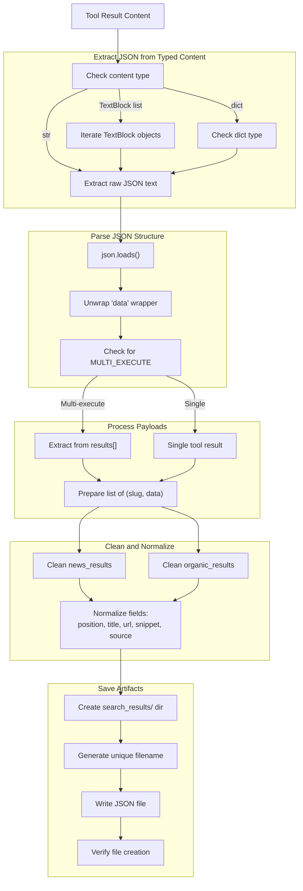
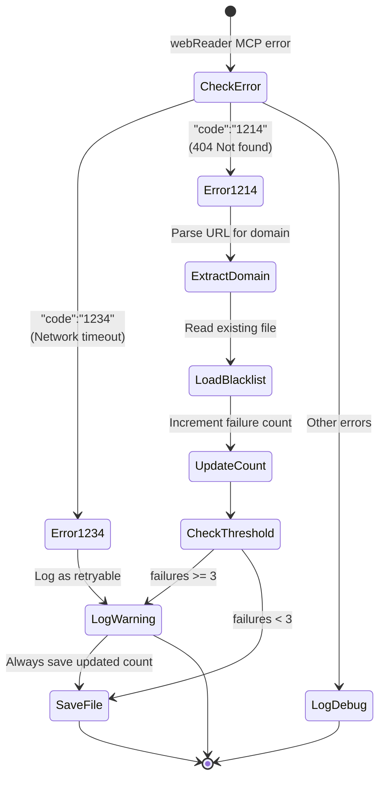
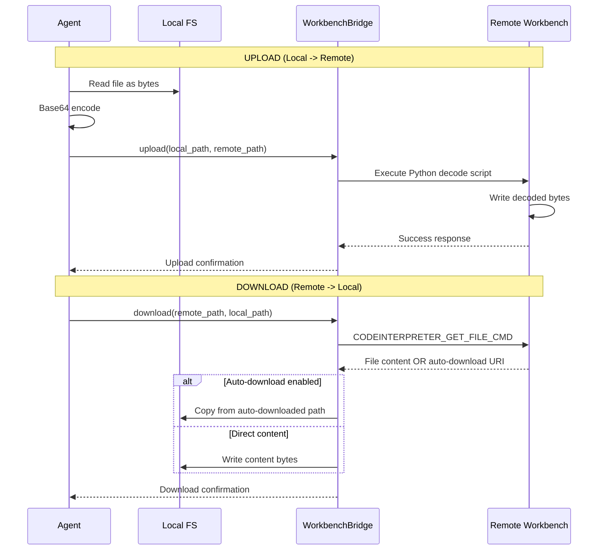

# Workspace Structure and Data Flow

This document describes the session workspace architecture, directory structure, data flow patterns, and artifact lifecycle for the Universal Agent.

---

## Table of Contents

1. [Overview](#overview)
2. [Directory Structure](#directory-structure)
3. [Session Lifecycle](#session-lifecycle)
4. [Data Flow Diagrams](#data-flow-diagrams)
5. [Observer Pattern Architecture](#observer-pattern-architecture)
6. [Artifact Specifications](#artifact-specifications)
7. [Local vs Remote Data Flow](#local-vs-remote-data-flow)

---

## Overview

The Universal Agent uses a **session-based workspace architecture** where each agent execution creates an isolated workspace directory. This provides:

- **Temporal isolation** - Each session has its own artifact storage
- **Auditability** - Complete trace of all operations, tool calls, and outputs
- **Reproducibility** - Full preservation of intermediate data
- **Observability** - Rich tracing via Logfire with local artifact persistence

### Workspace Root

```
AGENT_RUN_WORKSPACES/
```

The base workspace directory contains:
- **Session workspaces** (`session_YYYYMMDD_HHMMSS/`) - Per-execution isolated environments
- **Persistent artifacts** (`webReader_blacklist.json`) - Cross-session domain failure tracking

---

## Directory Structure

### Complete Session Workspace



### File Purpose Reference

| File/Directory | Purpose | Written By | Format |
|----------------|---------|------------|--------|
| `run.log` | Complete console output with timestamps | `DualWriter` (main.py:23-46) | Text |
| `summary.txt` | Quick execution metrics summary | `main()` (main.py:1344-1347) | Text |
| `trace.json` | Full tool call trace with timing | `run_conversation()` (main.py:1149-1164) | JSON |
| `search_results/*.json` | Cleaned SERP artifacts | `observe_and_save_search_results()` (main.py:218-414) | JSON |
| `expanded_corpus.json` | Article extraction corpus | `save_corpus()` tool (mcp_server.py:70-135) | JSON |
| `extracted_articles/*.json` | Individual article records | `observe_and_enrich_corpus()` (main.py:479-627) | JSON |
| `workbench_activity/*.json` | Remote execution logs | `observe_and_save_workbench_activity()` (main.py:416-476) | JSON |
| `work_products/*` | Final outputs (reports, etc) | Sub-agents via `write_local_file()` | Various |
| `downloads/*` | Composio auto-downloaded files | Composio SDK | Binary |
| `webReader_blacklist.json` | Domain failure tracking (persistent) | `_update_domain_blacklist()` (main.py:167-205) | JSON |

---

## Session Lifecycle

### Session Initialization



**Code Reference**: `main.py:1006-1169`

### Session Completion



**Code Reference**: `main.py:1276-1357`

---

## Data Flow Diagrams

### 1. User Query to Artifacts Flow



### 2. Observer Pattern Data Writes



**Code Reference**: `main.py:857-903` (observer dispatch in `run_conversation`)

### 3. Local vs Remote Data Flow



**Key Principle**: **LOCAL-FIRST** data flow. Only use remote workbench for:
- External action execution (APIs, browsing)
- Heavy operations requiring specific binaries
- Untrusted code execution

---

## Observer Pattern Architecture

### Design Rationale

The Observer Pattern enables **non-blocking artifact preservation** while the agent continues execution. Since Composio hooks (`@after_execute`) don't fire in MCP mode (execution happens on remote server), observers process results **after** they return to the client.

### Observer Functions



### SERP Result Processing



**Code Reference**: `main.py:218-414`

### Domain Blacklist Tracking



**Code Reference**: `main.py:167-205`

---

## Artifact Specifications

### trace.json Structure

```json
{
  "session_info": {
    "url": "https://mcp.composio.dev/...",
    "user_id": "user_123",
    "timestamp": "2025-12-22T14:30:52.123456"
  },
  "trace_id": "0123456789abcdef0123456789abcdef",
  "query": "User's original query text",
  "start_time": "2025-12-22T14:30:52.123456",
  "end_time": "2025-12-22T14:35:23.654321",
  "total_duration_seconds": 271.531,
  "tool_calls": [
    {
      "iteration": 1,
      "name": "mcp__composio__COMPOSIO_SEARCH_NEWS",
      "id": "toolu_01ABC...",
      "time_offset_seconds": 2.345,
      "input": { "query": "example", "num_results": 10 },
      "input_size_bytes": 45
    }
  ],
  "tool_results": [
    {
      "tool_use_id": "toolu_01ABC...",
      "time_offset_seconds": 3.789,
      "is_error": false,
      "content_size_bytes": 15234,
      "content_preview": "First 1000 chars..."
    }
  ],
  "iterations": [
    {
      "iteration": 1,
      "query": "First 200 chars...",
      "duration_seconds": 45.234,
      "tool_calls": 3,
      "needs_user_input": false,
      "auth_link": null
    }
  ],
  "logfire_enabled": true
}
```

### search_results/*.json Structure (News)

```json
{
  "type": "news",
  "timestamp": "2025-12-22T14:31:15.123456",
  "tool": "COMPOSIO_SEARCH_NEWS",
  "articles": [
    {
      "position": 1,
      "title": "Article Title",
      "url": "https://example.com/article",
      "source": "Example News",
      "date": "2025-12-22",
      "snippet": "Article snippet text..."
    }
  ]
}
```

### search_results/*.json Structure (Web)

```json
{
  "type": "web",
  "timestamp": "2025-12-22T14:31:15.123456",
  "tool": "COMPOSIO_SEARCH_WEB",
  "results": [
    {
      "position": 1,
      "title": "Page Title",
      "url": "https://example.com/page",
      "snippet": "Page description..."
    }
  ]
}
```

### expanded_corpus.json Structure

```json
{
  "extraction_timestamp": "2025-12-22T14:35:00.000000Z",
  "total_articles": 25,
  "successful": 22,
  "failed": 3,
  "articles": [
    {
      "url": "https://example.com/article",
      "title": "Article Title",
      "content": "Full markdown content from webReader...",
      "status": "success"
    }
  ]
}
```

### extracted_articles/*.json Structure

```json
{
  "timestamp": "2025-12-22T14:32:10.123456",
  "source_url": "https://example.com/article",
  "title": "Article Title",
  "description": "Meta description...",
  "content": "Truncated content (first 10k chars)...",
  "extraction_success": true
}
```

### workbench_activity/*.json Structure

```json
{
  "timestamp": "2025-12-22T14:33:20.123456",
  "tool": "COMPOSIO_REMOTE_WORKBENCH",
  "input": {
    "code": "import os\nprint('hello')...",
    "session_id": "sess_abc123",
    "current_step": "Step 1",
    "thought": "Running analysis script..."
  },
  "output": {
    "stdout": "hello\n",
    "stderr": "",
    "results": "",
    "successful": true
  }
}
```

### webReader_blacklist.json Structure (Persistent)

```json
{
  "domains": {
    "example-failing-domain.com": {
      "failures": 4,
      "last_failure": "2025-12-22T14:30:00.000000"
    }
  },
  "threshold": 3
}
```

---

## Local vs Remote Data Flow

### Data Flow Policy

**LOCAL-FIRST**: Prefer receiving data directly into agent context.

1. **Default Behavior** (`sync=False` or no `sync_response_to_workbench`):
   - Faster - no unnecessary download steps
   - Data returned directly in tool response
   - Suitable for < 5MB responses

2. **Workbench Sync** (`sync_response_to_workbench=True`):
   - Only for massive data (> 5MB)
   - Results saved to remote file
   - Requires explicit `workbench_download` to retrieve

### File Transfer



**Code Reference**: `workbench_bridge.py:47-184`

### Path Conventions

| Type | Format | Accessible By |
|------|--------|---------------|
| Local path | `/home/kjdragan/...` or `relative/path` | `local_toolkit` tools |
| Remote path | `/home/user/...` | `COMPOSIO_REMOTE_WORKBENCH` only |
| Workspace path | `AGENT_RUN_WORKSPACES/session_XXX/` | Agent knows via `CURRENT_SESSION_WORKSPACE` |

**Important**: After `workbench_upload`, use the **REMOTE path** in workbench code, NOT the local path.

---

## Appendix: Code References

| Component | File | Lines | Description |
|-----------|------|-------|-------------|
| `DualWriter` | `main.py` | 23-46 | Dual stdout/stderr to file |
| `parse_relative_date()` | `main.py` | 137-159 | Convert "2 hours ago" to YYYY-MM-DD |
| `_update_domain_blacklist()` | `main.py` | 167-205 | Domain failure tracking |
| `observe_and_save_search_results()` | `main.py` | 218-414 | SERP artifact observer |
| `observe_and_save_workbench_activity()` | `main.py` | 416-476 | Workbench activity observer |
| `observe_and_enrich_corpus()` | `main.py` | 479-627 | Article extraction observer |
| `verify_subagent_compliance()` | `main.py` | 629-672 | Sub-agent compliance checker |
| `run_conversation()` | `main.py` | 691-914 | Main agent loop with tracing |
| Workspace initialization | `main.py` | 1006-1169 | Session setup |
| `WorkbenchBridge.download()` | `workbench_bridge.py` | 47-129 | Remote file download |
| `WorkbenchBridge.upload()` | `workbench_bridge.py` | 131-184 | Remote file upload |
| `save_corpus()` | `mcp_server.py` | 70-135 | Corpus saving tool |
| `write_local_file()` | `mcp_server.py` | 54-66 | Local file write tool |

---

*Document Version: 1.0*
*Last Updated: 2025-12-22*
*Universal Agent Architecture Documentation*
