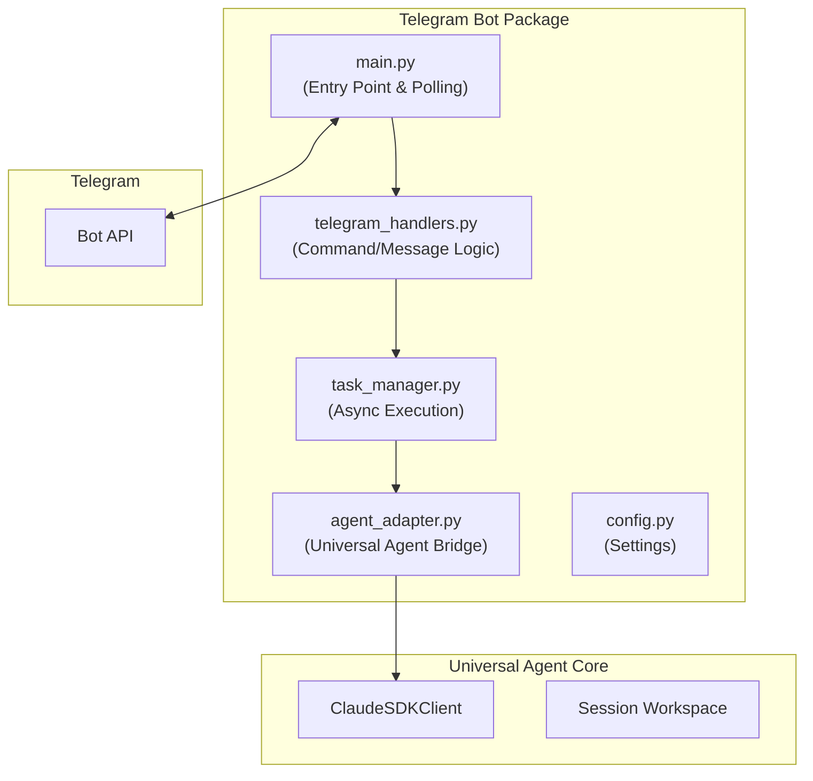
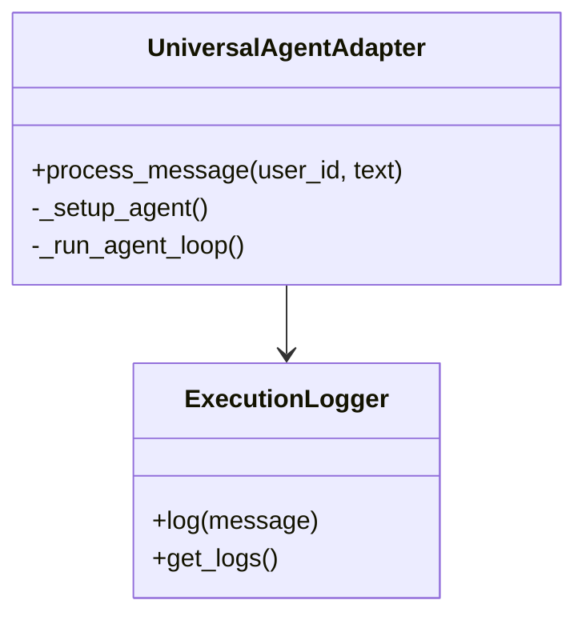
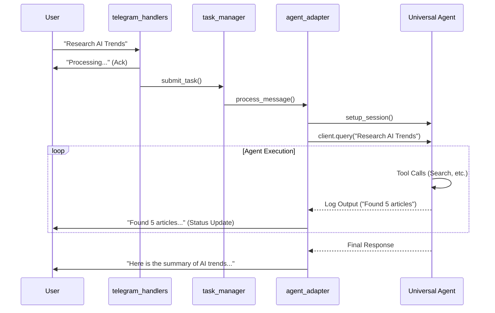

# Telegram Bot Integration Architecture

**Document Version**: 1.0
**Last Updated**: 2025-12-29
**Component**: Universal Agent
**Primary Files**: `src/universal_agent/bot/`

---

## Table of Contents

1. [Overview](#overview)
2. [Component Architecture](#component-architecture)
3. [Agent Adapter Pattern](#agent-adapter-pattern)
4. [Async Task Management](#async-task-management)
5. [User & Session Management](#user--session-management)
6. [Data Flow](#data-flow)

---

## Overview

The Telegram integration transforms the CLI-based Universal Agent into an **always-on conversational bot**. It adapts the synchronous/streaming nature of the CLI agent into an async, event-driven architecture suitable for messaging platforms.

### Key Features
*   **Asynchronous Messaging**: Handles multiple users concurrently.
*   **Persistent Sessions**: Maintains agent state across messages.
*   **Rich Media Support**: Can receive images and send reports/files.
*   **Long-Running Task Handling**: Manages agent execution without blocking the bot loop.

---

## Component Architecture

The bot implementation is modularized in `src/universal_agent/bot/`:

| Component | Purpose |
|-----------|---------|
| `main.py` | Initializes `aiogram.Bot` and `Dispatcher`, starts polling loop. |
| `telegram_handlers.py` | Defines handlers for `/start`, `/help`, and text messages. |
| `agent_adapter.py` | Wraps `ClaudeSDKClient` to capture stdout/logs and return them as messages. |
| `task_manager.py` | Manages background `asyncio` tasks for agent execution to prevent blocking the bot. |
| `execution_logger.py` | Captures agent output for real-time status updates to the user. |

---

## Agent Adapter Pattern

The `UniversalAgentAdapter` class (`agent_adapter.py`) bridges the gap between the CLI-focused core and the Telegram bot.

### Challenges Solved
1.  **Output Capture**: The CLI agent prints to `stdout`. The adapter captures these streams to send as Telegram messages.
2.  **Session Isolation**: Each Telegram chat ID maps to a unique `AGENT_RUN_WORKSPACE`.
3.  **Dependency Injection**: Injects the `TelegramSessionManager` context into the agent options.

---

## Async Task Management

Large Language Model (LLM) queries and tool executions can take seconds or minutes. A standard Telegram bot handler must reply quickly.

### TaskManager Concept
`task_manager.py` offloads the heavy lifting to background tasks.

1.  **User sends message**: Handler acknowledges receipt ("Thinking...").
2.  **Task Spawned**: `TaskManager.create_task(adapter.process_message(...))`.
3.  **Background Execution**:
    *   Adapter runs the agent loop.
    *   Agent executes tools (Search, Workbench).
    *   Adapter captures incremental thinking steps.
4.  **Completion/Updates**:
    *   Adapter sends intermediate "Status Updates" (e.g., "Searching web...", "Writing code...").
    *   Adapter sends Final Answer.

---

## User & Session Management

The bot enables multi-tenancy by mapping Telegram Metadata to Agent Sessions.

*   **Mapping**: `Telegram Chat ID` → `Agent Session Directory`
*   **Persistence**: Sessions are stored in `AGENT_RUN_WORKSPACES/telegram_{chat_id}/`.
*   **Context**: Conversation history is maintained within the `ClaudeSDKClient` instance for that session.

---

## Data Flow

