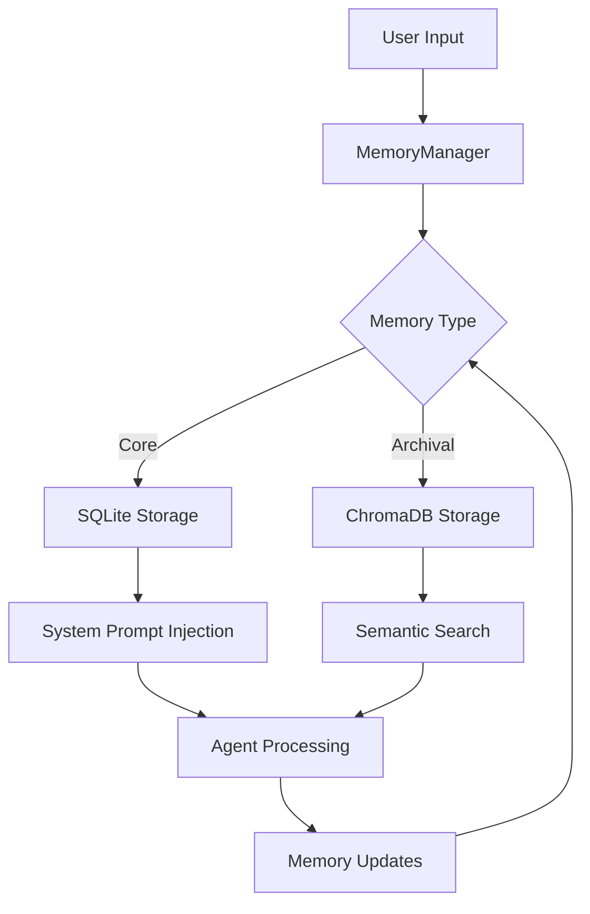
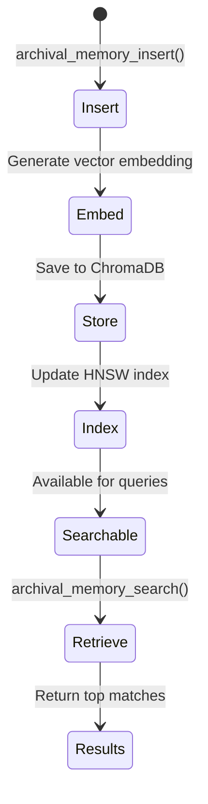

# Memory System Architecture Deep Dive

## System Design Philosophy

The Universal Agent Memory System is designed with a **local-first** philosophy, prioritizing fast, reliable memory access while maintaining the ability to scale to long-term storage. The architecture follows these principles:

1. **Hybrid Storage**: Combine the speed of SQLite for immediate context with the semantic power of ChromaDB for long-term memory
2. **Separation of Concerns**: Clear separation between core (in-context) and archival (out-of-context) memory
3. **Persistence by Default**: All operations are immediately persisted to disk
4. **Agent-Centric Design**: Memory tools are exposed directly to the agent for runtime manipulation

## Detailed Architecture

### Component Interaction Diagram

```
┌─────────────────────────────────────────────────────────────────┐
│                    Universal Agent                           │
│                     (main.py)                                 │
├─────────────────────────────────────────────────────────────────┤
│  MemoryManager                                                 │
│  ├── get_system_prompt_addition()                              │
│  ├── core_memory_replace()                                     │
│  ├── archival_memory_insert()                                  │
│  └── ...                                                      │
│                                                                  │
│  StorageManager (Hybrid Backend)                               │
│  ├── SQLite Core Memory                                       │
│  │   ├── core_blocks (Table)                                  │
│  │   └── processed_traces (Table)                             │
│  │                                                              │
│  └── ChromaDB Archival Memory                                  │
│      ├── archival_memory (Collection)                           │
│      └── Automatic Embeddings                                 │
└─────────────────────────────────────────────────────────────────┘
```

### Memory Flow Architecture



## Core Memory (SQLite) Design

### Schema Design

```sql
CREATE TABLE core_blocks (
    label TEXT PRIMARY KEY,           -- Unique identifier
    value TEXT,                       -- Memory content
    description TEXT,                -- Human-readable description
    is_editable BOOLEAN,             -- Editable flag
    last_updated TEXT                 -- ISO timestamp
);

CREATE TABLE processed_traces (
    trace_id TEXT PRIMARY KEY,        -- Unique trace identifier
    timestamp TEXT                    -- ISO timestamp
);
```

### Access Patterns

1. **Sequential Read**: All blocks loaded at startup for system prompt
2. **Random Access**: Individual blocks accessed by label
3. **Range Queries**: Blocks by last_updated timestamp
4. **Write Operations**: Immediate UPSERT with transaction safety

### Performance Characteristics

- **Read Latency**: <1ms (SQLite in-memory index)
- **Write Latency**: <5ms (with WAL mode enabled)
- **Concurrent Access**: SQLite PRNG for read/write concurrency
- **Storage Size**: ~50KB per typical installation

### Optimization Techniques

1. **WAL Mode**: Write-Ahead Logging for concurrent reads
2. **Indexing**: Primary key on label for fast lookups
3. **Connection Pooling**: Single connection per thread
4. **Bulk Operations**: Batch inserts for multiple blocks

## Archival Memory (ChromaDB) Design

### Vector Embeddings

- **Model**: Sentence-transformers (default, automatic)
- **Dimensions**: 768 (standard for sentence-transformers)
- **Normalization**: L2 normalization
- **Distance**: Cosine similarity

### Metadata Schema

```json
{
  "timestamp": "2025-12-29T22:03:00",
  "tags": "preference,tech_stack,project_specific"
}
```

### ChromaDB Internals

ChromaDB uses SQLite as its backend, storing:
- **Vectors**: BLOB data with 768 floats per vector
- **Documents**: Raw text content
- **Metadata**: JSON-formatted metadata
- **IDs**: UUID strings for each document

### Search Optimization

1. **Indexing**: HNSW (Hierarchical Navigable Small World) index
2. **Batch Queries**: Multiple query texts supported
3. **Metadata Filtering**: Tag-based filtering pre-search
4. **Result Limiting**: Configurable result limits for performance

## Memory Block Lifecycle

### Core Memory Block Lifecycle

```mermaid
stateDiagram-v2
    [*] --> Initialize: Empty DB
    Initialize --> Default: Create default blocks
    Default --> Ready: Memory loaded
    Ready --> Edit: Agent calls replace/append
    Edit --> Validate: Check permissions
    Validate --> Persist: Save to SQLite
    Persist --> Ready: Update complete
```

### Archival Item Lifecycle



## Memory Synchronization Strategy

### Multi-Agent Considerations

The memory system supports multiple concurrent agents through:

1. **Trace Tracking**: Agent College integration tracks processed work
2. **File Locking**: SQLite file-level locking prevents corruption
3. **Atomic Operations**: All writes are atomic transactions
4. **Conflict Resolution**: Last-write-wins for concurrent edits

### Session Management

1. **Session Isolation**: Each agent session has its own memory context
2. **Persistent Storage**: Shared storage across sessions
3. **Context Injection**: Core memory injected per session
4. **State Recovery**: Automatic restoration from storage

## Error Handling and Resilience

### SQLite Error Handling

1. **Connection Errors**: Retry with exponential backoff
2. **Lock Contention**: Wait and retry strategy
3. **Disk Full**: Graceful degradation with error reporting
4. **Corruption**: Recovery with fresh initialization

### ChromaDB Error Handling

1. **Index Corruption**: Reinitialize collection
2. **Memory Pressure**: Automatic garbage collection
3. **Network Issues**: Local fallback mode
4. **Version Conflicts**: Migrate to latest schema

### Data Recovery Strategies

1. **SQLite Backup**: Regular snapshots of core.db
2. **ChromaDB Backup**: Complete chroma_db directory
3. **Memory Export**: JSON export of core memory blocks
4. **Point-in-Time Recovery**: Based on timestamps

## Scaling Considerations

### Horizontal Scaling

1. **Read Replicas**: SQLite read replicas for high read throughput
2. **Sharding**: Tag-based sharding for archival memory
3. **Caching**: Redis caching for frequent memory access
4. **Load Balancing**: Multiple agent instances with shared storage

### Vertical Scaling

1. **Memory Limits**: Configurable ChromaDB memory limits
2. **Storage Growth**: Automatic compaction for SQLite
3. **Performance Tuning**: Configurable HNSW parameters
4. **Resource Monitoring**: Memory and storage usage tracking

## Security Considerations

### Data Protection

1. **Encryption**: Optional encryption for storage files
2. **Access Control**: File system permissions
3. **Audit Logging**: Write operation logging
4. **Data Sanitization**: Input validation for memory content

### Privacy Preservation

1. **Data Minimization**: Store only necessary information
2. **Consent Management**: User control over memory retention
3. **Right to Forget**: Memory deletion capabilities
4. **Anonymization**: Pseudonymization for archival data

This architecture provides a solid foundation for building sophisticated memory-enabled AI agents while maintaining performance, reliability, and scalability.