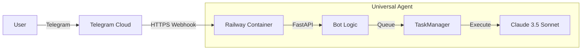

# Telegram Bot Integration

> [!IMPORTANT]
> **Last Updated**: 2025-12-31  
> **Status**: ✅ Production (Railway)

This directory documents the Universal Agent's Telegram integration, a FastAPI-based bot that bridges Telegram messages to the Claude Agent SDK.

---

## Architecture

---

## Documentation Index

| Doc | Description |
|-----|-------------|
| **[01_SETUP_AND_CONFIG.md](./01_SETUP_AND_CONFIG.md)** | Start here. Generate keys, secrets, and user IDs. |
| **[02_LOCAL_DEVELOPMENT.md](./02_LOCAL_DEVELOPMENT.md)** | Run the bot on your laptop with ngrok for testing. |
| **[03_RAILWAY_DEPLOYMENT.md](./03_RAILWAY_DEPLOYMENT.md)** | Deploying to production on Railway (Docker). |
| **[04_USER_GUIDE.md](./04_USER_GUIDE.md)** | Commands (`/agent`, `/status`) and usage tips. |
| **[05_ARCHITECTURE_DEEPDIVE.md](./05_ARCHITECTURE_DEEPDIVE.md)** | Technical details on Lifecycle, Queues, and Auth. |

---

## Key Files

-   `src/universal_agent/bot/main.py`: FastAPI entry point.
-   `src/universal_agent/bot/telegram_handlers.py`: Command logic.
-   `src/universal_agent/bot/task_manager.py`: Async execution queue.
