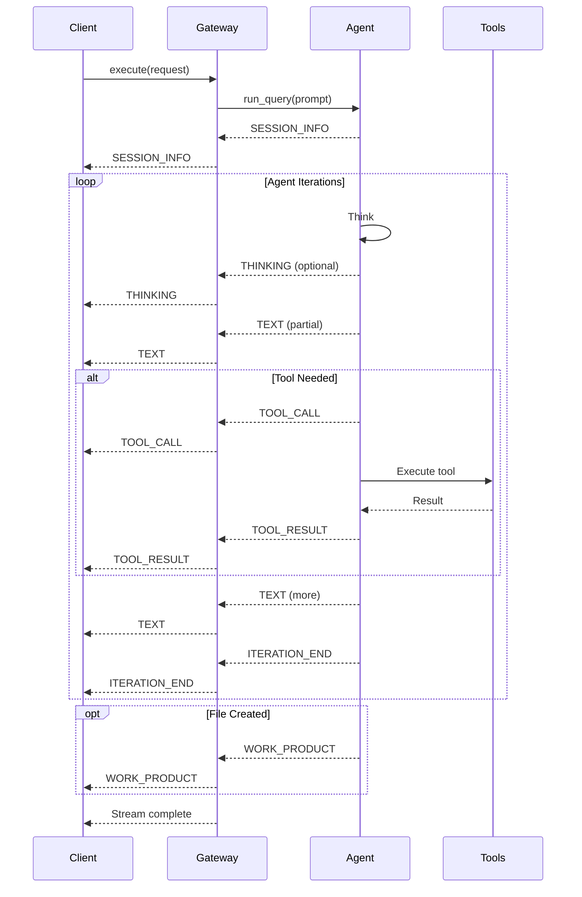

# Event Stream Protocol

## Overview

The UA Gateway uses a typed event stream to communicate all agent output. This provides a consistent protocol for both in-process and remote execution, enabling real-time streaming and audit logging.

---

## Event Type Enumeration

```python
class EventType(str, Enum):
    """Types of events emitted by the agent."""
    
    # Core Events
    TEXT = "text"                    # LLM text output
    TOOL_CALL = "tool_call"          # Tool invocation
    TOOL_RESULT = "tool_result"      # Tool response
    THINKING = "thinking"            # Model reasoning (if enabled)
    STATUS = "status"                # Progress updates
    ERROR = "error"                  # Error occurred
    
    # Session Events
    SESSION_INFO = "session_info"    # Session metadata
    ITERATION_END = "iteration_end"  # Turn complete
    
    # Output Events
    WORK_PRODUCT = "work_product"    # File/artifact created
    AUTH_REQUIRED = "auth_required"  # Authentication needed
    
    # URW Phase Events (Stage 5)
    URW_PHASE_START = "urw_phase_start"
    URW_PHASE_COMPLETE = "urw_phase_complete"
    URW_PHASE_FAILED = "urw_phase_failed"
    URW_EVALUATION = "urw_evaluation"
```

---

## Event Data Schemas

### TEXT Event

Incremental text output from the LLM.

```json
{
  "type": "text",
  "data": {
    "text": "Here's a list of files in the directory:\n"
  }
}
```

### TOOL_CALL Event

Tool invocation request.

```json
{
  "type": "tool_call",
  "data": {
    "id": "call_abc123",
    "name": "ListDir",
    "input": {
      "DirectoryPath": "/home/user/project"
    }
  }
}
```

### TOOL_RESULT Event

Tool execution result.

```json
{
  "type": "tool_result",
  "data": {
    "tool_call_id": "call_abc123",
    "result": "file1.py\nfile2.py\nREADME.md",
    "is_error": false
  }
}
```

### THINKING Event

Model's reasoning process (when extended thinking enabled).

```json
{
  "type": "thinking",
  "data": {
    "text": "I should list the directory first to see what files exist..."
  }
}
```

### STATUS Event

Progress or status updates.

```json
{
  "type": "status",
  "data": {
    "message": "Processing file 3 of 10",
    "progress": 0.3
  }
}
```

### ERROR Event

Error during execution.

```json
{
  "type": "error",
  "data": {
    "error": "Permission denied accessing /etc/passwd",
    "code": "PERMISSION_DENIED",
    "recoverable": true
  }
}
```

### SESSION_INFO Event

Session metadata (emitted at start of execution).

```json
{
  "type": "session_info",
  "data": {
    "session_id": "sess_abc123",
    "workspace_dir": "/home/user/project",
    "trace_id": "trace_xyz789"
  }
}
```

### ITERATION_END Event

Marks the end of an agent turn.

```json
{
  "type": "iteration_end",
  "data": {
    "iteration": 3,
    "tool_calls_count": 5,
    "tokens_used": 1500
  }
}
```

### WORK_PRODUCT Event

Artifact or file created.

```json
{
  "type": "work_product",
  "data": {
    "path": "/home/user/project/report.html",
    "type": "html_report",
    "size_bytes": 15234
  }
}
```

### URW Phase Events

```json
// URW_PHASE_START
{
  "type": "urw_phase_start",
  "data": {
    "phase_id": "phase_001",
    "phase_name": "Data Collection",
    "task_count": 5
  }
}

// URW_PHASE_COMPLETE
{
  "type": "urw_phase_complete",
  "data": {
    "phase_id": "phase_001",
    "phase_name": "Data Collection",
    "success": true,
    "artifacts": ["data.csv", "summary.json"]
  }
}

// URW_PHASE_FAILED
{
  "type": "urw_phase_failed",
  "data": {
    "phase_id": "phase_001",
    "phase_name": "Data Collection",
    "error": "API rate limit exceeded",
    "retry_count": 3
  }
}

// URW_EVALUATION
{
  "type": "urw_evaluation",
  "data": {
    "phase_id": "phase_001",
    "is_complete": true,
    "missing_elements": [],
    "suggested_actions": []
  }
}
```

---

## Event Flow Diagram



---

## Wire Format (WebSocket)

Events are transmitted as JSON over WebSocket:

```
{"type": "session_info", "data": {"session_id": "sess_abc"}, "timestamp": "2026-01-24T08:00:00Z"}
{"type": "text", "data": {"text": "I'll list the files"}, "timestamp": "2026-01-24T08:00:01Z"}
{"type": "tool_call", "data": {"id": "call_1", "name": "ListDir"}, "timestamp": "2026-01-24T08:00:02Z"}
...
```

### Client Request Format

```json
{
  "action": "execute",
  "user_input": "List files in current directory",
  "context": {},
  "max_iterations": 25
}
```

---

## Event Rendering

### CLI Rendering

The CLI renders events to the terminal:

```python
async for event in gateway.execute(session, request):
    match event.type:
        case EventType.TEXT:
            sys.stdout.write(event.data["text"])
            sys.stdout.flush()
        
        case EventType.TOOL_CALL:
            name = event.data["name"]
            print(f"\n{COLOR_YELLOW}[Tool: {name}]{COLOR_RESET}")
        
        case EventType.TOOL_RESULT:
            result = event.data.get("result", "")
            if len(result) > 200:
                result = result[:200] + "..."
            print(f"{COLOR_DIM}{result}{COLOR_RESET}")
        
        case EventType.ERROR:
            print(f"{COLOR_RED}Error: {event.data['error']}{COLOR_RESET}")
```

### Parity Guarantee

The gateway rendering produces output identical to direct CLI execution (except for expected deltas like session IDs and timestamps).

Accepted deltas:
- Session/trace ID differences
- Timestamps
- Gateway session banner
- Minor model output variance

---

## Event Filtering

### By Type

```python
# Only text events
text_events = [e for e in events if e.type == EventType.TEXT]

# Tool-related events
tool_events = [e for e in events if e.type in (EventType.TOOL_CALL, EventType.TOOL_RESULT)]
```

### By Time Range

```python
from datetime import datetime, timedelta

cutoff = datetime.now() - timedelta(minutes=5)
recent_events = [e for e in events if e.timestamp > cutoff]
```

---

## Buffering and Backpressure

### Client-Side Buffering

```python
buffer = []
async for event in gateway.execute(session, request):
    buffer.append(event)
    
    # Process in batches
    if len(buffer) >= 100:
        process_batch(buffer)
        buffer.clear()

# Process remaining
if buffer:
    process_batch(buffer)
```

### Handling Slow Consumers

The gateway buffers events server-side. For very long-running queries, consider:

1. Processing events immediately (don't buffer)
2. Using `run_query()` for simple use cases
3. Setting appropriate timeouts
