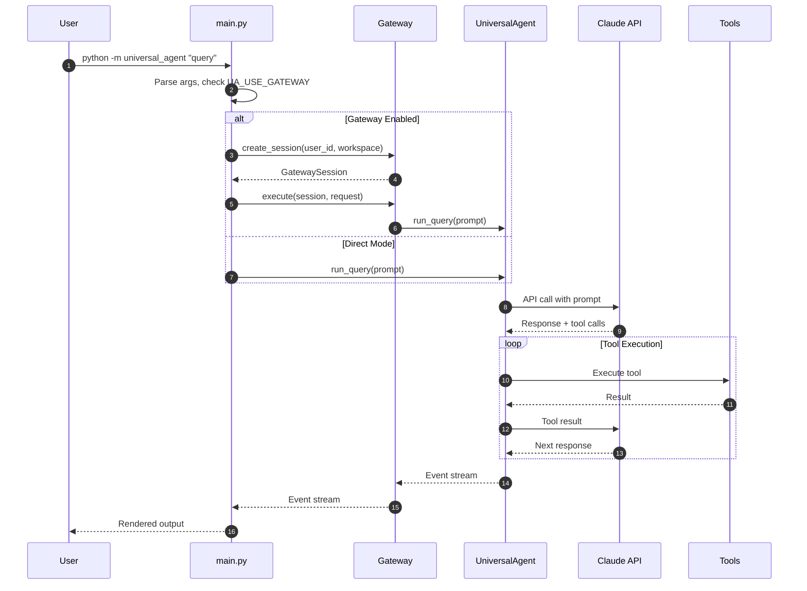
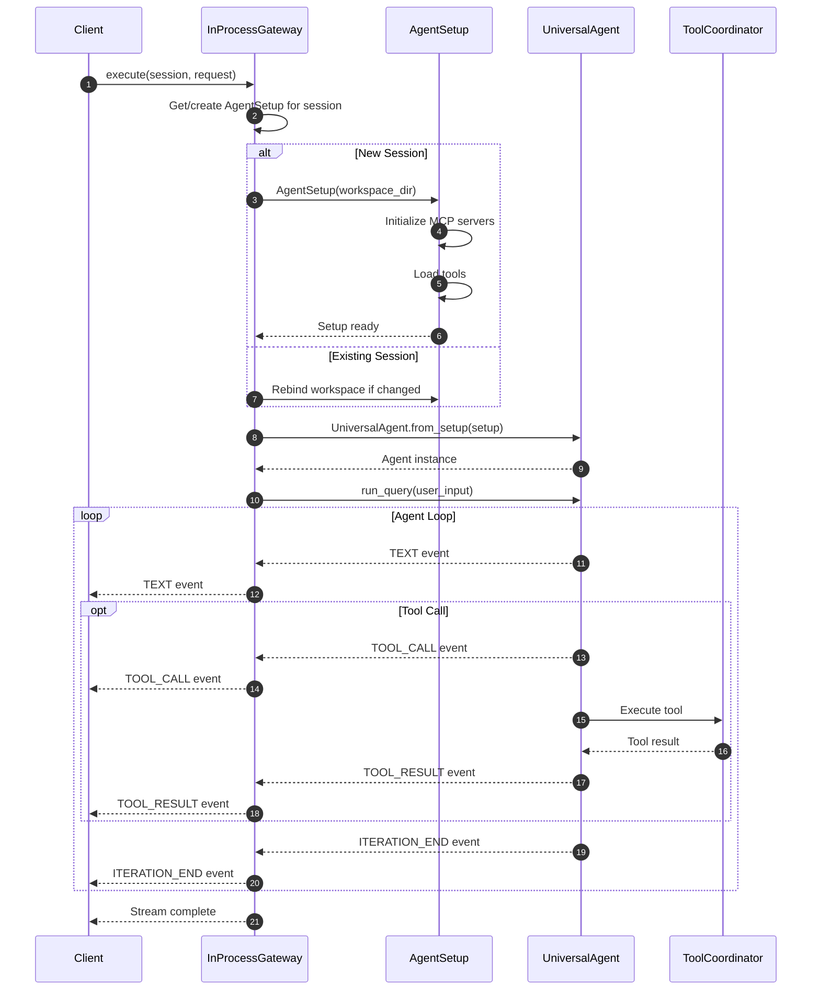
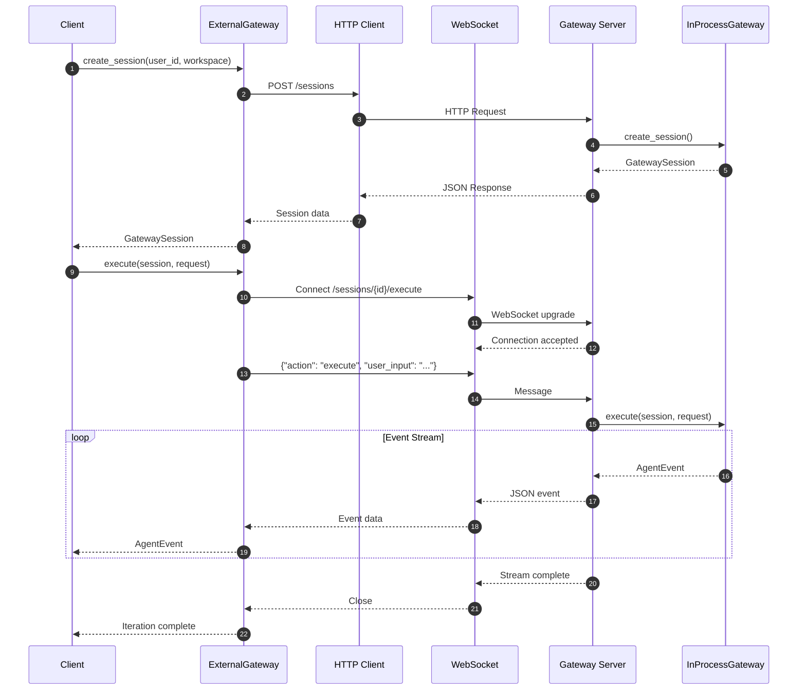
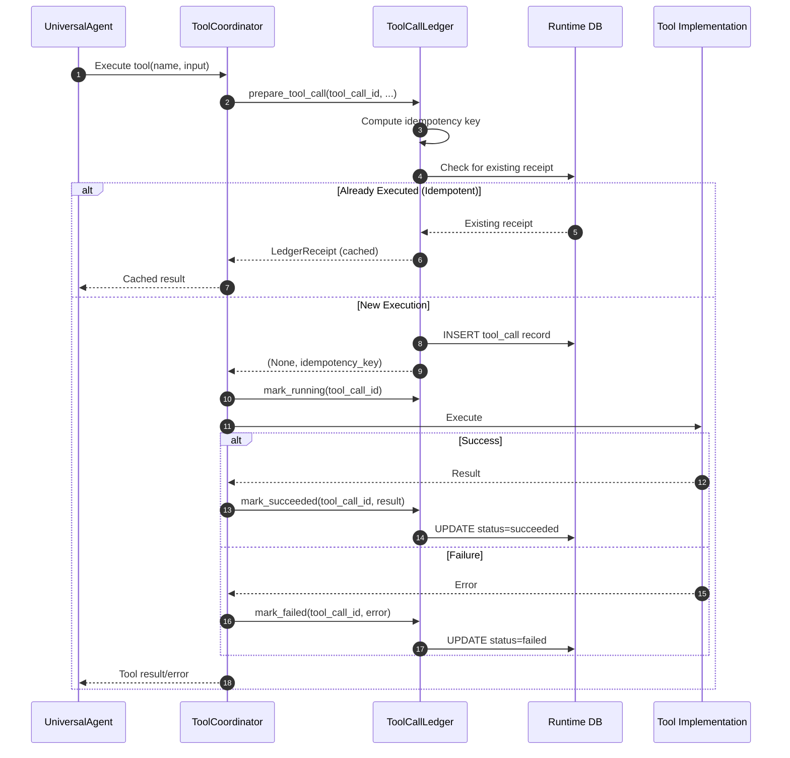
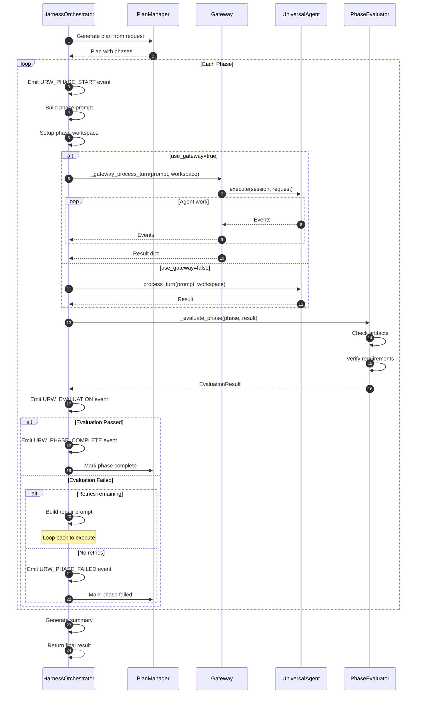
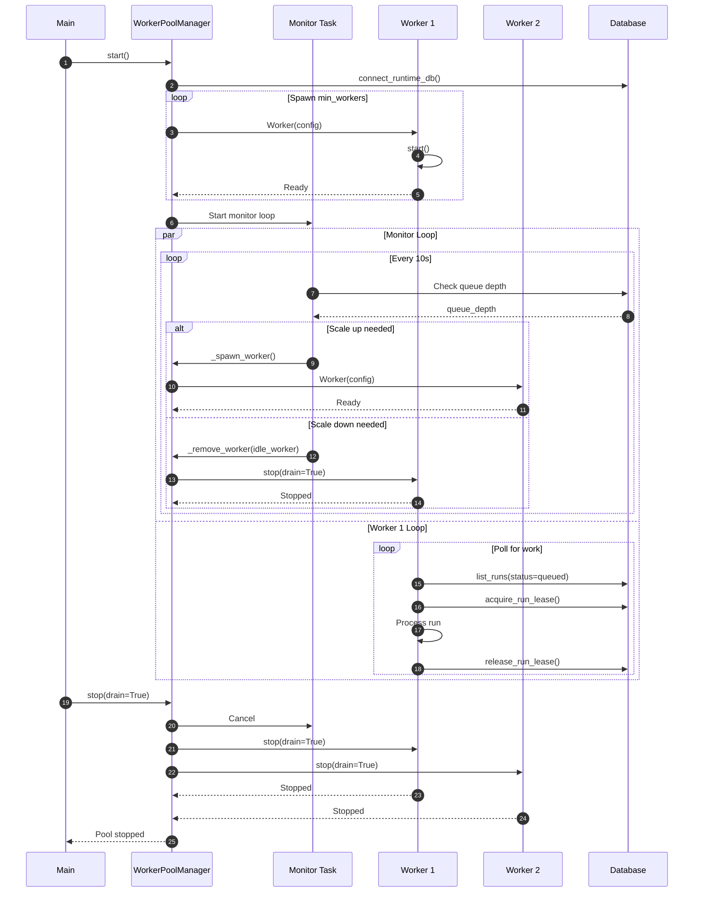
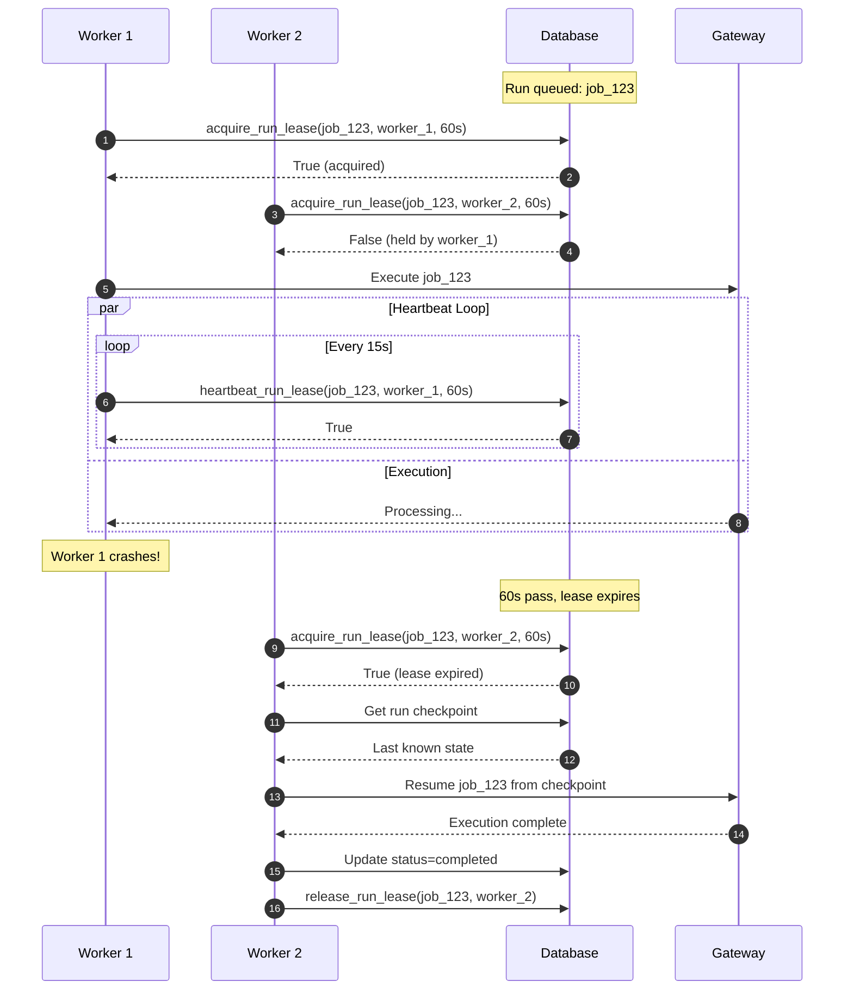
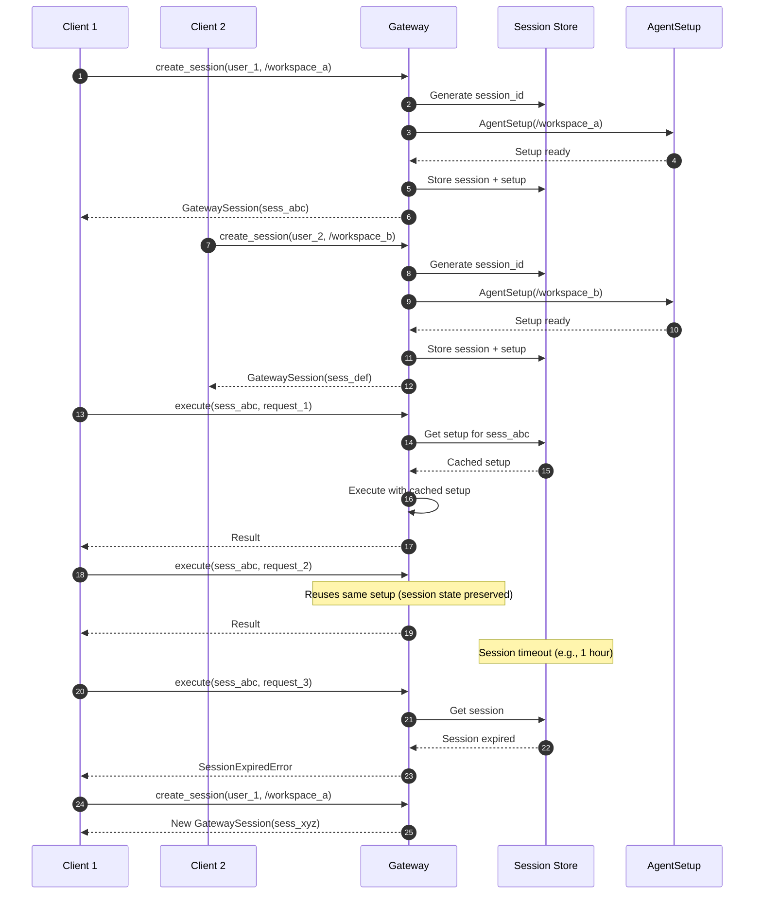
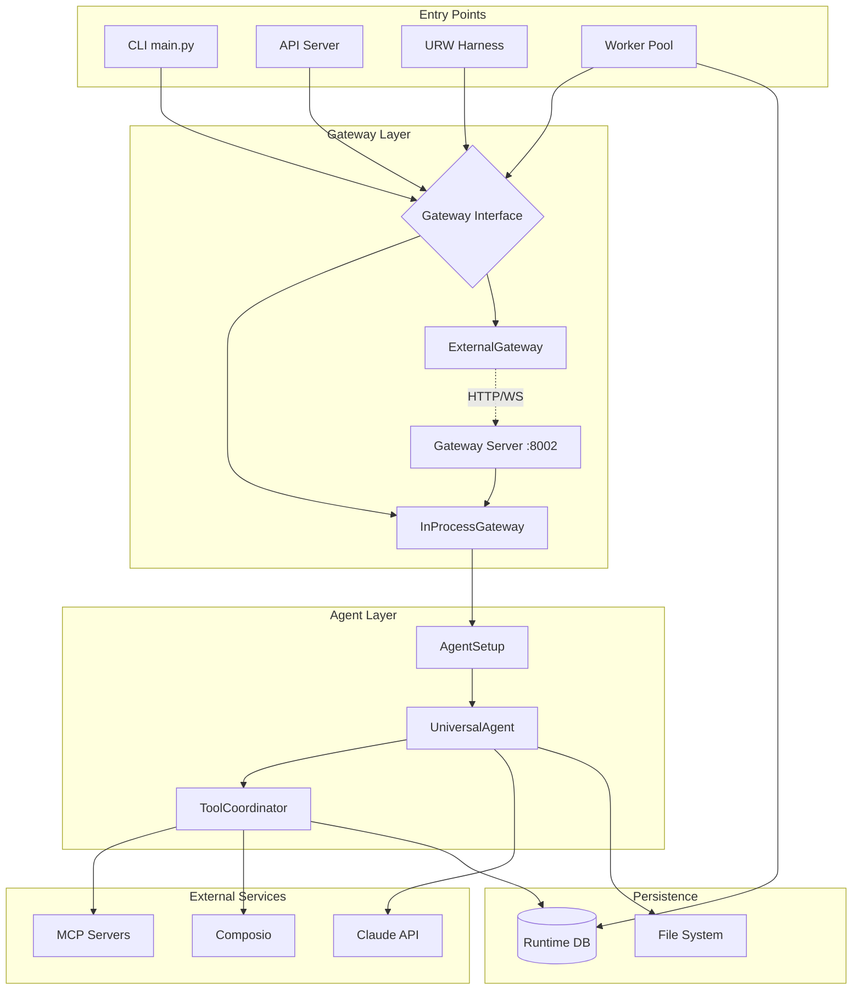

# Sequence Diagrams

This document contains comprehensive Mermaid sequence diagrams for all major flows in the UA Gateway system.

---

## Table of Contents

1. [CLI Query Flow](#1-cli-query-flow)
2. [In-Process Gateway Execution](#2-in-process-gateway-execution)
3. [External Gateway Execution](#3-external-gateway-execution)
4. [Tool Execution Chain](#4-tool-execution-chain)
5. [URW Phase Execution](#5-urw-phase-execution)
6. [Worker Pool Lifecycle](#6-worker-pool-lifecycle)
7. [Lease Acquisition and Failover](#7-lease-acquisition-and-failover)
8. [Session Management](#8-session-management)

---

## 1. CLI Query Flow

How a query flows from CLI through the gateway to execution.

---

## 2. In-Process Gateway Execution

Detailed flow for `InProcessGateway.execute()`.

---

## 3. External Gateway Execution

Flow for `ExternalGateway` connecting to remote server.

---

## 4. Tool Execution Chain

Detailed tool execution with ledger recording.

---

## 5. URW Phase Execution

URW harness executing phases through gateway.

---

## 6. Worker Pool Lifecycle

Worker pool startup, scaling, and shutdown.

---

## 7. Lease Acquisition and Failover

How leases enable work to transfer between workers.

---

## 8. Session Management

Session creation, reuse, and cleanup.

---

## Component Interaction Overview

High-level component relationships.

