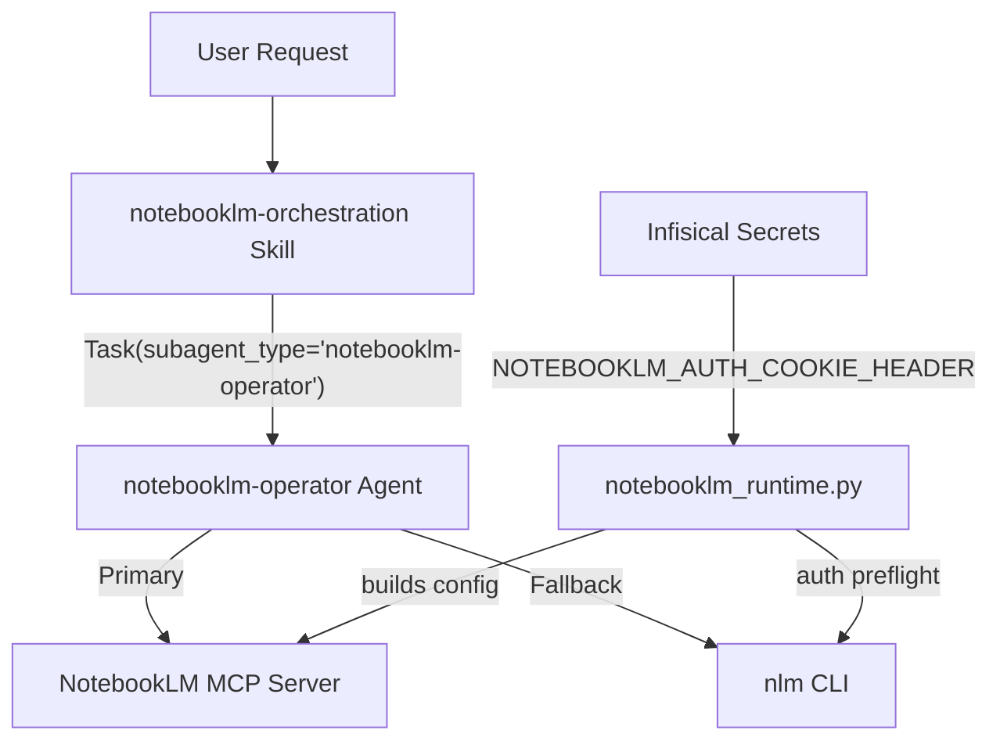
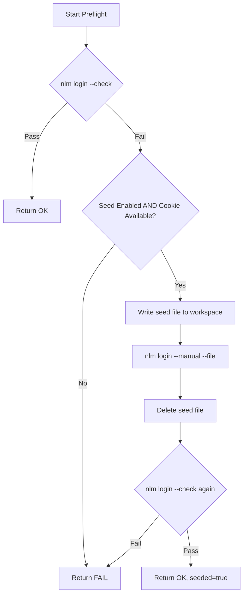

# 012 — NotebookLM Integration

> Programmatic NotebookLM access for UA via a dedicated sub-agent, orchestration skill, and runtime bootstrap layer.

## Overview

The NotebookLM integration enables Simone to create notebooks, ingest sources, run research, generate audio/video/report artifacts, manage sharing, and download results — all through natural language requests. It is implemented as a **three-layer stack**:

| Layer | Asset | Purpose |
|-------|-------|---------|
| **Skill** | `.claude/skills/notebooklm-orchestration/SKILL.md` | Intent detection & routing contract |
| **Agent** | `.claude/agents/notebooklm-operator.md` | Execution sub-agent with 30+ MCP tools |
| **Runtime** | `src/universal_agent/notebooklm_runtime.py` | Auth preflight, MCP server config builder |



---

## 1. Orchestration Skill

**File**: `.claude/skills/notebooklm-orchestration/SKILL.md`

### Trigger Phrases

The skill activates on any mention of: `NotebookLM`, `notebooklm`, `nlm`, notebooks, source ingestion, NotebookLM research, podcast/audio overview, report/quiz creation, flashcards, slide decks, infographics, downloads, sharing, or NotebookLM automation workflows.

### Routing Contract

The skill's primary role is thin orchestration:

1. **Detect** NotebookLM intent from user message.
2. **Delegate** to the sub-agent: `Task(subagent_type='notebooklm-operator', ...)`.
3. **Relay** the structured output contract back to the user.

### Hybrid Execution Model

The skill prescribes a priority order:

1. **MCP first** — use NotebookLM MCP tools when available.
2. **CLI fallback** (`nlm`) — when MCP is unavailable, for recovery, or when user explicitly requests CLI.
3. Auth/profile setup always uses CLI even when MCP is active.

### Confirmation Guardrails

Explicit user confirmation is **required** before:

- Notebook / source / studio artifact **deletion**
- Drive sync with mutations
- Public sharing toggles
- Share invite actions

### Operation Coverage

| Phase | Operations |
|-------|-----------|
| **Core (P1)** | Auth check/recovery, notebooks CRUD, sources add/list/sync/delete/describe, querying, research start/status/import, studio create/status/delete, artifact downloads |
| **Advanced (P2)** | Studio revise, notes CRUD, artifact exports, sharing (status/public/invite) |

### CLI Fallback Patterns

```bash
nlm login --check --profile "$UA_NOTEBOOKLM_PROFILE"
nlm notebook list --json --profile "$UA_NOTEBOOKLM_PROFILE"
nlm source add <notebook> --url "https://..." --wait --profile "$UA_NOTEBOOKLM_PROFILE"
nlm studio status <notebook> --profile "$UA_NOTEBOOKLM_PROFILE"
```

---

## 2. Operator Agent (Sub-Agent)

**File**: `.claude/agents/notebooklm-operator.md`

This is a dedicated Claude sub-agent (`model: opus`) that executes NotebookLM operations. It is **never invoked directly** by users — only via `Task()` delegation from the primary agent when the skill triggers.

### Registered MCP Tools (30+)

The agent has access to the full NotebookLM MCP tool surface:

| Domain | Tools |
|--------|-------|
| **Auth** | `refresh_auth`, `save_auth_tokens` |
| **Notebooks** | `notebook_list`, `notebook_create`, `notebook_get`, `notebook_describe`, `notebook_rename`, `notebook_delete` |
| **Sources** | `source_add`, `source_list_drive`, `source_sync_drive`, `source_delete`, `source_describe`, `source_get_content`, `source_rename` |
| **Query & Chat** | `notebook_query`, `chat_configure` |
| **Research** | `research_start`, `research_status`, `research_import` |
| **Studio** | `studio_create`, `studio_status`, `studio_delete`, `studio_revise` |
| **Artifacts** | `download_artifact`, `export_artifact` |
| **Notes** | `note` (unified CRUD) |
| **Sharing** | `notebook_share_status`, `notebook_share_public`, `notebook_share_invite` |
| **System** | `server_info` |

### Auth Preflight Protocol

Before any NotebookLM operation, the agent runs:

```
uv run python scripts/notebooklm_auth_preflight.py --workspace "$CURRENT_SESSION_WORKSPACE"
```

This checks → seeds (if needed) → re-checks authentication.

### Output Contract

Every response from the operator is a structured handoff payload:

```json
{
  "status": "success | blocked | failed | needs_confirmation",
  "path_used": "mcp | cli | hybrid",
  "operation_summary": "Created notebook 'Q2 Strategy' with 2 sources",
  "artifacts": ["notebook_id:abc123", "source_id:def456"],
  "warnings": [],
  "next_step_if_blocked": null
}
```

### Security Constraints

- Never print raw cookie/header values
- Never persist auth artifacts to repository paths
- Temporary seed files written only under `CURRENT_SESSION_WORKSPACE`
- Seed files deleted immediately after use

---

## 3. Runtime Module

**File**: `src/universal_agent/notebooklm_runtime.py` (232 lines)

### Configuration Functions

| Function | Purpose |
|----------|---------|
| `notebooklm_profile()` | Resolves profile: `UA_NOTEBOOKLM_PROFILE` → `NOTEBOOKLM_PROFILE` → `"vps"` |
| `notebooklm_cli_command()` | CLI binary name (default: `nlm`) |
| `notebooklm_mcp_command()` | MCP binary name (default: `notebooklm-mcp`) |
| `notebooklm_mcp_enabled()` | Feature gate via `UA_ENABLE_NOTEBOOKLM_MCP` (default off) |
| `notebooklm_auth_seed_enabled()` | Auth seeding (default on for VPS profile) |

### Auth Preflight Flow

`run_auth_preflight(workspace_dir)` implements a multi-step recovery protocol:



### MCP Server Config Builder

`build_notebooklm_mcp_server_config()` produces the MCP server registration dict consumed by `agent_setup.py`:

```python
{
    "type": "stdio",
    "command": "notebooklm-mcp",  # or custom via UA_NOTEBOOKLM_MCP_COMMAND
    "args": [],
    "env": {
        "NOTEBOOKLM_PROFILE": "vps",
        "NOTEBOOKLM_MCP_TRANSPORT": "stdio",
        # ... other forwarded env vars
    }
}
```

This config is **feature-gated** — returns `None` when `UA_ENABLE_NOTEBOOKLM_MCP` is not set, keeping the MCP server out of the context budget by default.

### Integration Point

In `agent_setup.py` → `_build_mcp_servers()`:

```python
notebooklm_config = build_notebooklm_mcp_server_config()
if notebooklm_config is not None:
    servers["notebooklm-mcp"] = notebooklm_config
```

---

## 4. Supporting Files

### Auth Preflight Script

**File**: `scripts/notebooklm_auth_preflight.py`

Standalone CLI wrapper around `run_auth_preflight()` that outputs JSON:

```bash
uv run python scripts/notebooklm_auth_preflight.py --workspace /path/to/session
# → {"ok": true, "profile": "vps", "seeded": false, ...}
```

### VPS Runbook

**File**: `docs/notebooklm_vps_infisical_runbook.md`

Operational runbook for VPS deployments covering:

- Required Infisical secrets (`NOTEBOOKLM_AUTH_COOKIE_HEADER`)
- Required runtime flags (`UA_ENABLE_NOTEBOOKLM_MCP`, `UA_NOTEBOOKLM_AUTH_SEED_ENABLED`, etc.)
- Bootstrap flow (Infisical → preflight → seed → re-check)
- Cookie rotation procedure
- Failure modes and recovery

---

## 5. Environment Variables Reference

| Variable | Default | Description |
|----------|---------|-------------|
| `UA_ENABLE_NOTEBOOKLM_MCP` | `0` | Master feature gate for MCP server |
| `UA_NOTEBOOKLM_PROFILE` | `vps` | NotebookLM profile name |
| `UA_NOTEBOOKLM_CLI_COMMAND` | `nlm` | CLI binary path |
| `UA_NOTEBOOKLM_MCP_COMMAND` | `notebooklm-mcp` | MCP binary path |
| `UA_NOTEBOOKLM_AUTH_SEED_ENABLED` | `1` (VPS) / `0` (local) | Enable cookie seeding |
| `NOTEBOOKLM_AUTH_COOKIE_HEADER` | — | Infisical-injected cookie for seeding |
| `NOTEBOOKLM_MCP_TRANSPORT` | — | MCP transport mode (stdio/http) |
| `NOTEBOOKLM_MCP_HOST` | — | MCP HTTP host |
| `NOTEBOOKLM_MCP_PORT` | — | MCP HTTP port |

---

## 6. Test Coverage

Three test modules validate the integration:

| Test File | What It Validates |
|-----------|-------------------|
| `tests/unit/test_notebooklm_runtime.py` | MCP config builder (enabled/disabled), auth seed defaults, preflight pass/fail/seed/secret-leak scenarios |
| `tests/unit/test_notebooklm_mcp_registration.py` | `AgentSetup._build_mcp_servers()` includes/excludes NotebookLM based on feature gate |
| `tests/unit/test_notebooklm_assets.py` | Skill/agent file existence, frontmatter contracts, skill discoverability, capabilities snapshot |

### Skill Benchmark Results (Iteration 1)

| Metric | With Skill | Without Skill | Delta |
|--------|------------|---------------|-------|
| Pass Rate | 100% ± 0% | 83% ± 14% | +17% |
| Tokens | 2000 ± 602 | 5551 ± 7365 | −3551 |

The skill provides 100% structured output compliance and significantly reduces token usage by enforcing a concise output contract.

---

## 7. Quick Start

### Enable for a session

```bash
export UA_ENABLE_NOTEBOOKLM_MCP=1
export UA_NOTEBOOKLM_PROFILE=vps
```

### Manual auth check

```bash
nlm login --check --profile vps
```

### Trigger via Simone

> _"Create a NotebookLM notebook called 'Project Alpha Research', add this article as a source: https://example.com/article, and generate an audio overview."_

Simone will: detect NotebookLM intent → delegate to `notebooklm-operator` → run auth preflight → create notebook → add source → generate audio → return structured results.
