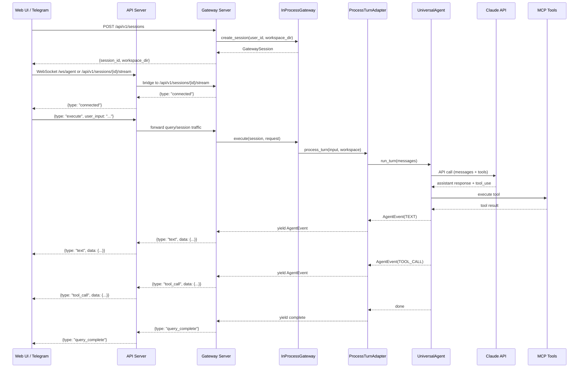
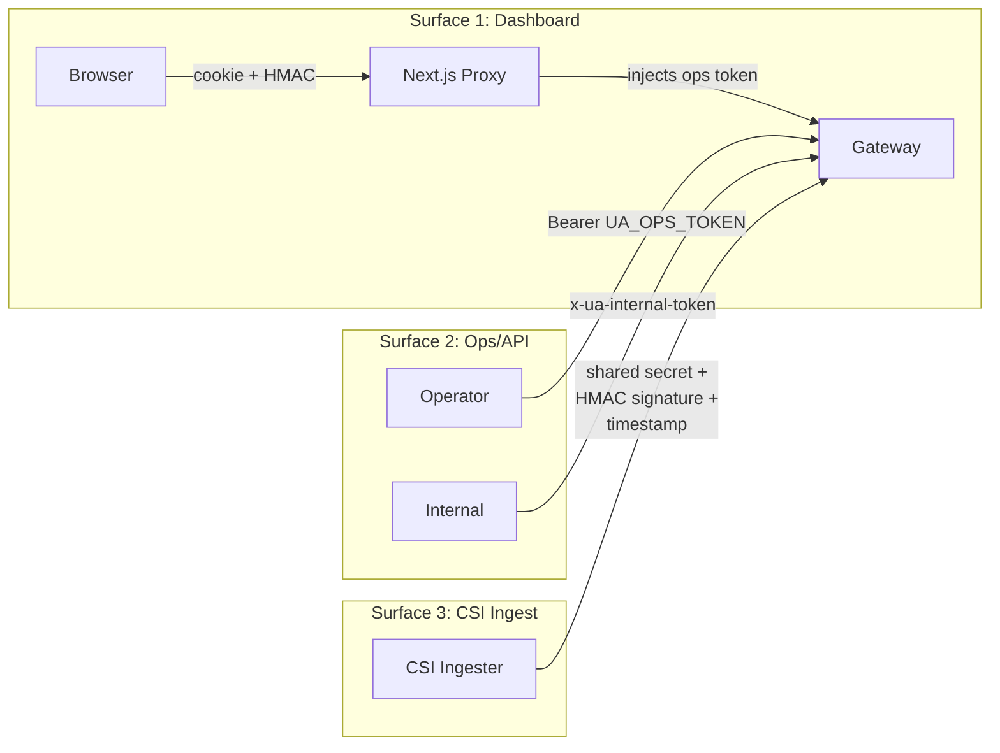
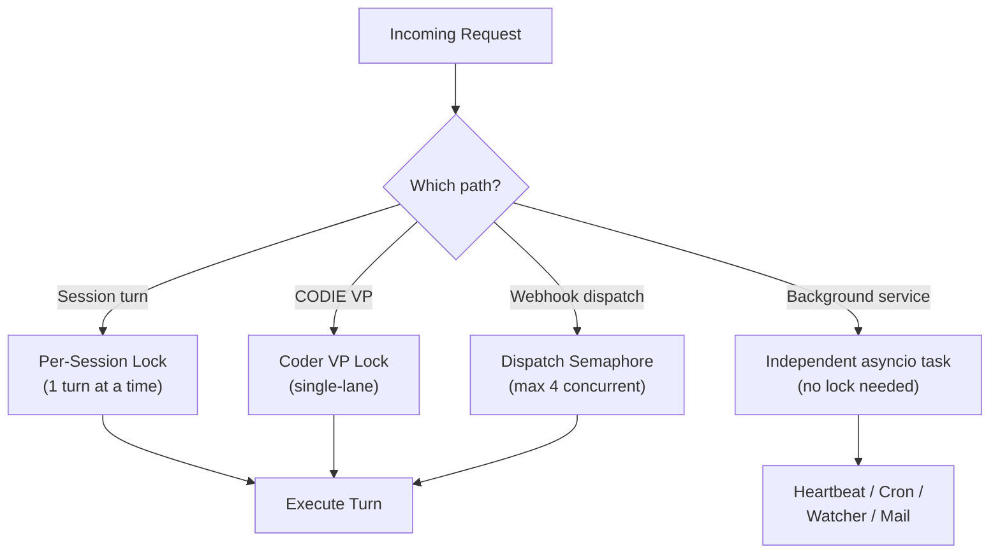

# 02. Gateway, Sessions, and Execution Architecture

**Last verified against source code:** 2026-03-06

## Overview

The gateway is the central hub of Universal Agent. All agent execution — whether triggered by the web UI, Telegram, webhooks, cron jobs, or VP delegation — flows through the gateway's live execution-session model and the durable run/attempt model.

## Gateway Server

**Primary implementation:** `src/universal_agent/gateway_server.py`

The gateway server is a FastAPI application running on port 8002. It is the largest single file in the codebase (~17K lines) because it serves as the integration point for every subsystem. The core `uvicorn` entrypoint uses a bounded 10-second retry loop specifically implemented to absorb TCP `TIME_WAIT` races when rapidly redeploying or restarting the service locally or during automated pipeline tests (`Errno 98 Address currently in use`).

### What the gateway owns:

- **Session lifecycle** — creation, execution, streaming, resume, deletion
- **Durable run catalog** — run listing, attempt metadata, workspace linkage
- **WebSocket streaming** — real-time event delivery to connected clients
- **Ops API** — factory fleet management, delegation controls, health endpoints
- **Webhook ingress** — `HooksService` for external event processing
- **Background services** — heartbeat, cron, YouTube playlist watcher, AgentMail, GWS events
- **Delegation bus** — Redis mission publishing for cross-machine work distribution
- **Factory registry** — SQLite-backed presence tracking for remote factories
- **Activity events** — CSI signal ingestion and notification storage

### Key API Surface

| Endpoint | Method | Purpose |
|----------|--------|---------|
| `/api/v1/sessions` | POST | Create a new session |
| `/api/v1/sessions/{id}/stream` | WS | WebSocket streaming for session execution |
| `/api/v1/sessions/{id}` | GET | Retrieve session info |
| `/api/v1/sessions` | GET | List sessions |
| `/api/v1/ops/runs` | GET | List durable runs |
| `/api/v1/ops/runs/{id}` | GET | Retrieve durable run info |
| `/api/v1/health` | GET | Health check |
| `/api/v1/factory/capabilities` | GET | Factory capabilities + delegation metrics |
| `/api/v1/factory/registrations` | GET/POST | Factory fleet presence |
| `/api/v1/ops/factory/update` | POST | Trigger factory self-update |
| `/api/v1/ops/factory/control` | POST | Pause/resume factory |
| `/api/v1/ops/delegation/history` | GET | Recent VP mission history |
| `/api/v1/ops/timers` | GET | Systemd timer fleet status |
| `/api/v1/signals/ingest` | POST | CSI analytics event ingestion |
| `/api/v1/hooks/{path}` | POST | Webhook ingress |

## Execution Session Model

**Primary implementation:** `src/universal_agent/gateway.py`

### Session Types

Live execution sessions are created through `InProcessGateway.create_session()` and stored in the runtime SQLite DB. Durable work is tracked separately as runs and attempts.

| Source | Session ID Pattern | Durable Workspace Pattern |
|--------|-------------------|--------------------------|
| Web UI | UUID-based | `AGENT_RUN_WORKSPACES/run_<run_id>/` or legacy workspace during migration |
| Telegram | `tg_<user_id>_<short_uuid>` | Sticky run workspace linked to the chat lane |
| Hooks/Cron | Session-key based | Explicit hook/cron run workspace |
| CSI Analytics | `csi_<route_lane>` | CSI-linked run workspace when UA follow-up work is created |

Each session has:
- `session_id` — unique identifier
- `user_id` — owner identity (for ownership enforcement)
- `workspace_dir` — isolated filesystem directory for the current execution context
- `metadata` — arbitrary key-value store (includes `source`, policy snapshots, etc.)

Separately, each durable run has:
- `run_id` — the durable logical workflow identifier
- `attempts` — one or more execution tries under that run
- `workspace_dir` — the durable run workspace
- optional linked `provider_session_id` for the live execution session

### Session Execution Flow

Step-by-step:
1. Client creates session via `POST /api/v1/sessions` or connects to existing session
2. Browser clients open the WebSocket on the API server via `/ws/agent` or `/api/v1/sessions/{id}/stream`
3. The API server validates dashboard auth and bridges the socket into the gateway session stream
4. Client sends `{"type": "execute", "data": {"user_input": "..."}}` over WebSocket
5. Gateway calls `InProcessGateway.execute()` which delegates to `ProcessTurnAdapter`
6. `ProcessTurnAdapter` wraps the CLI's `process_turn()` to emit `AgentEvent` objects
7. Events stream back over the gateway and API bridge as JSON messages
8. `query_complete` event signals the end of execution
9. **Trace Reconstruction**: Post-execution, `transcript_builder.py` consumes the `trace.json` file to rebuild a human-readable `transcript.md` file containing every event and interaction in order. It relies strictly on globally unique identifiers (`step_id`) rather than local counters (`iteration`) when compiling events, correctly distributing complex multi-turn logic into a sequential output history.

### Session Ownership and Auth

Three auth surfaces protect different access patterns:

1. **Dashboard auth** — cookie + HMAC session token, owner resolution from authenticated user
2. **Ops/API auth** — `UA_OPS_TOKEN` / `UA_INTERNAL_API_TOKEN` bearer headers
3. **CSI ingest auth** — shared secret + HMAC signature + timestamp validation

The dashboard Next.js proxy injects ops tokens on behalf of authenticated dashboard users.

## Execution Engine

**Primary implementation:** `src/universal_agent/execution_engine.py`

The `ProcessTurnAdapter` is the bridge between the event-driven gateway and the synchronous CLI execution engine:

1. Receives a `GatewayRequest` (user input + metadata)
2. Calls `process_turn()` from `main.py` in a background thread
3. Captures events (text, tool calls, thinking, work products) via callback hooks
4. Yields `AgentEvent` objects to the WebSocket streaming layer
5. Manages workspace isolation, session state, and turn timeouts

### Agent Core

**Primary implementation:** `src/universal_agent/agent_core.py`

`UniversalAgent` wraps the Claude Agent SDK client:
- Initializes Claude SDK with configured hooks and guardrails
- Manages MCP tool servers (local research bridge, Composio, GWS, Telegram)
- Handles conversation turns with streaming event emission
- Routes tool calls through the SDK's tool execution pipeline

### Agent Setup

**Primary implementation:** `src/universal_agent/agent_setup.py`

`AgentSetup` is the unified initialization class for all entry points:
- Discovers and loads skills from `.claude/skills/`
- Registers MCP servers (research tools, local toolkit, Composio, GWS bridge)
- Builds the system prompt from persona assets, skill descriptions, and tool knowledge
- Configures Claude SDK options (model, max tokens, thinking budget)

## Concurrency Model

The gateway manages concurrency at multiple levels:

1. **Per-session execution lock** — only one turn executes per session at a time
2. **CODIE VP lock** — single-lane execution for the coder VP
3. **Webhook dispatch semaphore** — bounded concurrency for hook-triggered agent work
4. **Background task isolation** — heartbeat, cron, and watchers run as independent asyncio tasks

## Background Services (started in gateway lifespan)

| Service | Implementation | Purpose |
|---------|---------------|---------|
| `HeartbeatService` | `heartbeat_service.py` | Autonomous agent loop — proactive monitoring and actions |
| `CronService` | `cron_service.py` | Scheduled task execution (briefings, daily reports) |
| `HooksService` | `hooks_service.py` | Webhook ingress, transform, and dispatch |
| `AgentMailService` | `services/agentmail_service.py` | Email inbox (WebSocket inbound listener) |
| `YouTubePlaylistWatcher` | `services/youtube_playlist_watcher.py` | Playlist polling and event dispatch |
| `GwsEventListener` | `services/gws_event_listener.py` | Gmail event polling |
| Factory staleness loop | `gateway_server.py` | 60s loop enforcing stale/offline factory status |
| HQ self-heartbeat loop | `gateway_server.py` | 60s loop keeping HQ's own registration fresh |
| VP event bridge loop | `gateway_server.py` | Bridges VP mission events to activity store |
