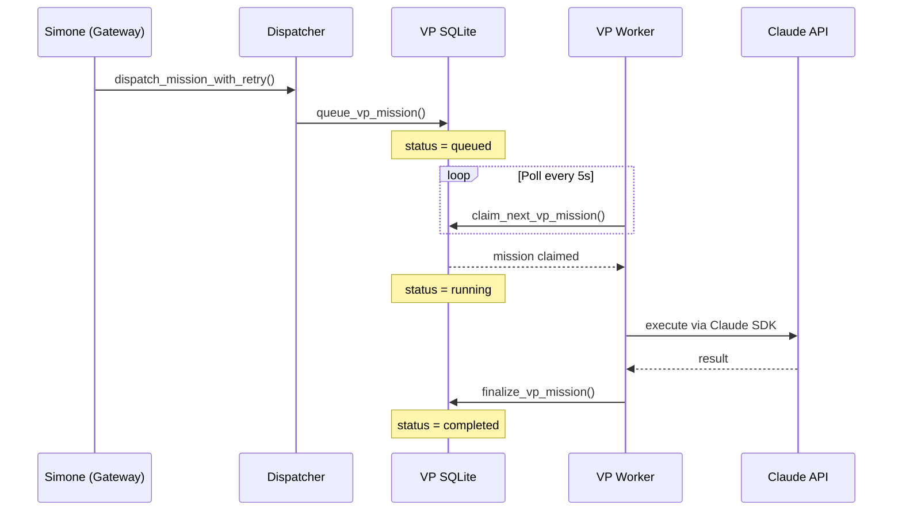
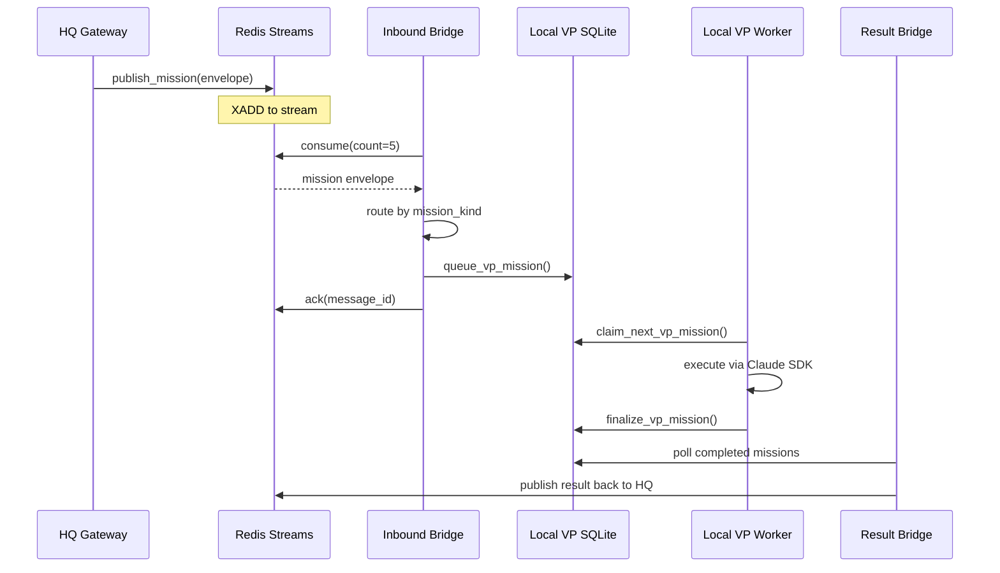
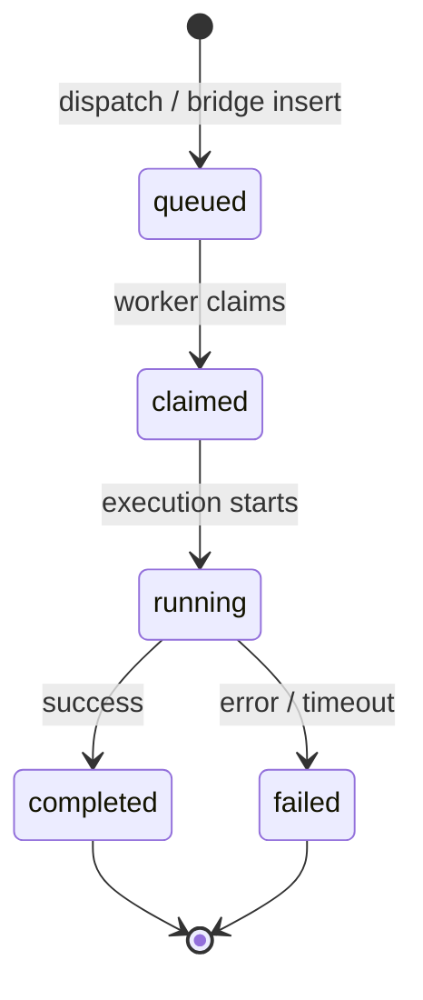
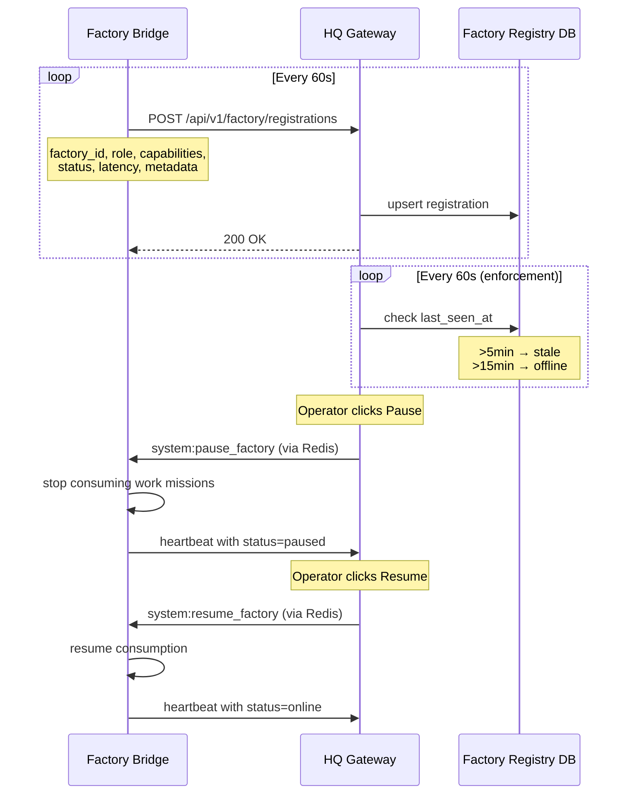

# 03. VP Workers and Delegation Architecture

**Last verified against source code:** 2026-04-27

## Overview

VP (Virtual Primary) workers are external agent processes that execute delegated work on behalf of Simone (the primary agent). This architecture separates the control plane (Simone decides what to delegate) from the execution plane (VP workers do the work).

Each VP worker has its own **identity (soul)**, **streamlined system prompt**, and **mission briefing** injection. For VP identity, prompt architecture, and soul details, see [VP Agent Identity & Prompt Architecture](../03_Operations/101_VP_Agent_Identity_And_Prompt_Architecture_2026-03-21.md).

## Two VP Lanes

| VP ID | Agent Name | Service | Purpose |
|-------|-----------|---------|----------|
| `vp.coder.primary` | **CODIE** | `universal-agent-vp-worker@vp.coder.primary` | Code implementation, refactoring, doc maintenance |
| `vp.general.primary` | **ATLAS** | `universal-agent-vp-worker@vp.general.primary` | Research, analysis, content creation, system ops |

Each VP worker runs as a separate systemd service with its own Claude Agent SDK session.

### Shared VP Email Identity

| Property | Value |
|----------|-------|
| Inbox Address | `vp.agents@agentmail.to` |
| Display Name | `Codie/Atlas` |
| Monitored By | AgentMail WebSocket (multi-inbox subscription) |

Both VPs share a single AgentMail inbox. Inbound emails to this address are routed to the correct VP by **name detection** (scanning the subject and body for "Cody"/"Codie" or "Atlas" keywords). When a VP sends a reply, it CC's Simone's inbox with a `[VP Status]` subject prefix so Simone maintains situational awareness. See [Email Architecture §VP Email Routing](../03_Operations/82_Email_Architecture_And_AgentMail_Source_Of_Truth_2026-03-06.md#vp-email-routing--hybrid-orchestration) for the full protocol.

## Delegation Flow

### Local Delegation (single machine)

Simone delegates via tool calls → mission inserted into VP SQLite → VP worker claims and executes.



### Cross-Machine Delegation (factory model)

HQ publishes to Redis → factory bridge consumes → inserts into local VP SQLite → local VP worker executes.



## Key Implementation Files

### VP Worker

| File | Purpose |
|------|---------|
| `vp/worker_loop.py` | Main claim-execute-finalize loop |
| `vp/worker_main.py` | Standalone entry point for systemd service |
| `vp/dispatcher.py` | Mission dispatch from Simone to VP SQLite |
| `vp/coder_runtime.py` | CODIE coder VP — session/lease management, telemetry |
| `vp/profiles.py` | VP identity profiles (display name, model config) |
| `vp/clients/` | VP client SDK adapters |

### Delegation Infrastructure

| File | Purpose |
|------|---------|
| `delegation/redis_bus.py` | Redis Streams transport (publish, consume, ack, DLQ) |
| `delegation/redis_vp_bridge.py` | Inbound bridge: Redis → VP SQLite |
| `delegation/redis_vp_result_bridge.py` | Outbound bridge: VP results → Redis |
| `delegation/bridge_main.py` | Standalone bridge entry point with Infisical self-load |
| `delegation/heartbeat.py` | Factory→HQ registration heartbeat (60s interval) |
| `delegation/factory_registry.py` | SQLite-backed factory presence on HQ |
| `delegation/system_handlers.py` | System missions: update, pause, resume |
| `delegation/schema.py` | `MissionEnvelope` / `MissionPayload` Pydantic models |

## Mission Lifecycle



### Mission Schema (VP SQLite)

Key columns in `vp_missions`:
- `mission_id` — unique identifier (prefixed `bridge-` for cross-machine)
- `vp_id` — target VP lane (`vp.general.primary` or `vp.coder.primary`)
- `mission_type` — kind of work (`coding_task`, `general_task`, etc.)
- `status` — lifecycle state
- `objective` — what the VP should accomplish
- `payload` — JSON with task context, source info, reply mode
- `result` — JSON output from VP execution
- `source` — origin (`gateway`, `redis_bridge`)

## Mission Routing

The inbound bridge routes missions by `mission_kind`:

| Mission Kind | VP Target |
|-------------|-----------|
| `coding_task` | `vp.coder.primary` |
| `general_task` | `vp.general.primary` |
| `research_task` | `vp.general.primary` |
| `tutorial_bootstrap_repo` | Skipped (handled by tutorial worker) |
| `system:update_factory` | Handled inline by bridge (not queued) |
| `system:pause_factory` | Handled inline — pauses bridge consumption |
| `system:resume_factory` | Handled inline — resumes bridge consumption |
| Unknown kinds | Default to `vp.general.primary` |

## CODIE (Coder VP — `vp.coder.primary`)

**Primary implementation:** `vp/coder_runtime.py` | **Soul:** `prompt_assets/CODIE_SOUL.md`

CODIE is the autonomous coding VP agent with additional runtime management:

- **Session isolation** — dedicated SQLite DB (`coder_vp_state.db`) separate from Simone's runtime
- **Lease management** — lease heartbeat and release to prevent stale locks
- **Single-lane execution** — dedicated `_coder_vp_lock` in the gateway
- **Lifecycle events** — emits session created/resumed/degraded events to VP event tables

### Canonical Output Directory

By architectural convention, CODIE saves generated projects and code outputs to a dedicated external workspace directory. This strictly separates agent-generated code from the `universal_agent` infrastructure repository:

- **Canonical Path:** `/home/ua/vpsrepos/` (which may be symlinked to `/opt/vpsrepos/`)
- When dispatching missions to CODIE, explicitly specify this path using the `target_path` constraint in the `vp_dispatch_mission` payload.

### Execution Observability

Because VP missions execute autonomously as headless background jobs via the worker daemon, they **do not stream live UI events** back to the web dashboard. The UI will simply show Simone polling for completion via `vp_wait_mission`. 

To observe CODIE's progress in real-time, connect to the VPS and use these three methods:

1. **Watch the Output Log (Live Stream):**
   Tail the VP worker log to see every prompt, tool execution, and response as it happens:
   ```bash
   ssh ua@uaonvps 'tail -f /opt/universal_agent/logs/vp-worker-vp.coder.primary.log'
   ```

2. **Watch the Output Directory:**
   Monitor the file system to see files materialize as CODIE creates them:
   ```bash
   ssh ua@uaonvps 'watch -n 2 ls -la /home/ua/vpsrepos/<project-name>/'
   ```

3. **Check the Mission Status Database:**
   Query the VP state database to check the exact lifecycle status (`queued`, `running`, `completed`, `failed`):
   ```bash
   ssh ua@uaonvps 'sqlite3 /opt/universal_agent/AGENT_RUN_WORKSPACES/vp_state.db "SELECT status, started_at FROM vp_missions WHERE mission_id = '\''<mission-id>'\''"'
   ```

## Factory Heartbeat and Registry



### Heartbeat (factory → HQ)

Every 60 seconds, each factory bridge sends a `POST /api/v1/factory/registrations` to HQ with:
- Factory ID, role, capabilities
- Registration status (`online`, `paused`)
- Heartbeat latency measurement
- Metadata (hostname, PID, uptime, platform)

Exponential backoff on failure (cap at 5 min).

### Registry (HQ side)

HQ maintains a SQLite-backed factory registry (`factory_registry.py`):
- Upsert on heartbeat → status reverts to `online`
- Background enforcement loop (60s): >5min → `stale`, >15min → `offline`
- HQ self-heartbeat keeps its own registration fresh

### Operator Controls

| Endpoint | Action |
|----------|--------|
| `POST /api/v1/ops/factory/update` | Publish `system:update_factory` mission |
| `POST /api/v1/ops/factory/control` | Publish `system:pause_factory` or `system:resume_factory` |

Pause/resume: bridge stops consuming work missions but stays running (heartbeat continues, reports `paused` status). System missions are always processed even when paused.

## VP Orchestration Tools

Simone dispatches and monitors VP missions through six internal tools defined in `src/universal_agent/tools/vp_orchestration.py`:

| Tool | Purpose | Key Parameters |
|------|---------|----------------|
| `vp_dispatch_mission` | Queue a new mission for a VP worker | `vp_id`, `objective`, `mission_type`, `constraints`, `idempotency_key` |
| `vp_get_mission` | Get state and lifecycle details for one mission | `mission_id` |
| `vp_list_missions` | List missions by VP ID or status | `vp_id`, `status`, `limit` |
| `vp_wait_mission` | Block until mission reaches terminal state | `mission_id`, `timeout_seconds` (default 1200, max 3600), `poll_seconds` (default 3, max 30) |
| `vp_cancel_mission` | Request cancellation of a queued/running mission | `mission_id`, `reason` |
| `vp_read_result_artifacts` | Summarize output artifacts from mission workspace | `mission_id`, `max_files`, `max_bytes` |

### Timeout Guidance

The `vp_wait_mission` default timeout is 1200 seconds (20 minutes). For `code_generation` missions, use `timeout_seconds=1200` or higher — complex coding tasks routinely exceed 10 minutes. The maximum allowed timeout is 3600 seconds (1 hour). Short timeouts risk missing completion of complex coding tasks, leading to false-negative "failed" states.

## Cross-Health Surface

The factory capabilities endpoint (`GET /api/v1/factory/capabilities`) includes:
- Factory capabilities (role, delegation mode, features)
- Delegation bus metrics (connected, published/consumed counts)
- CSI delivery health canary status (when CSI DB is accessible)

This provides a single ops surface for "is everything alive?" across both factory heartbeats and CSI delivery health.
