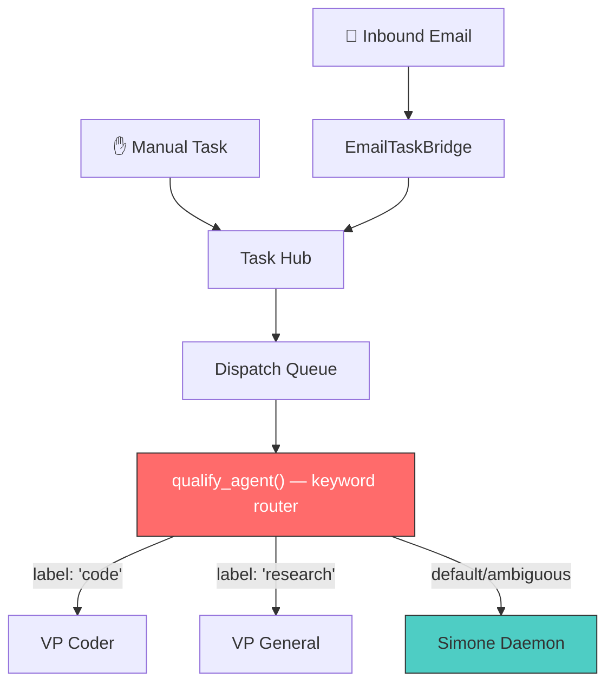
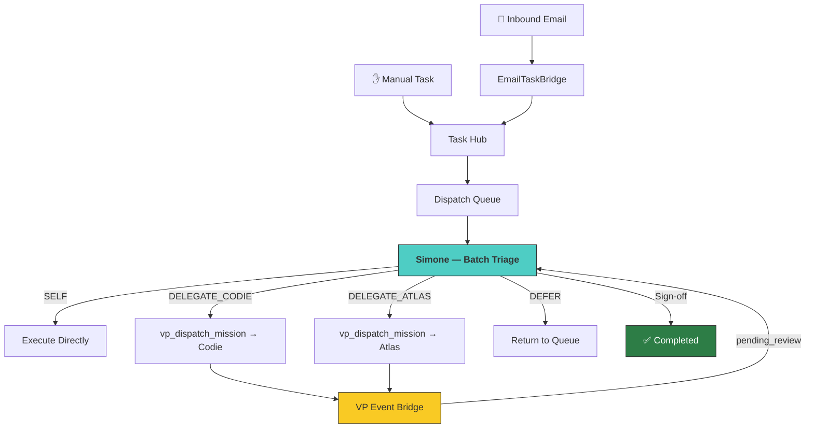
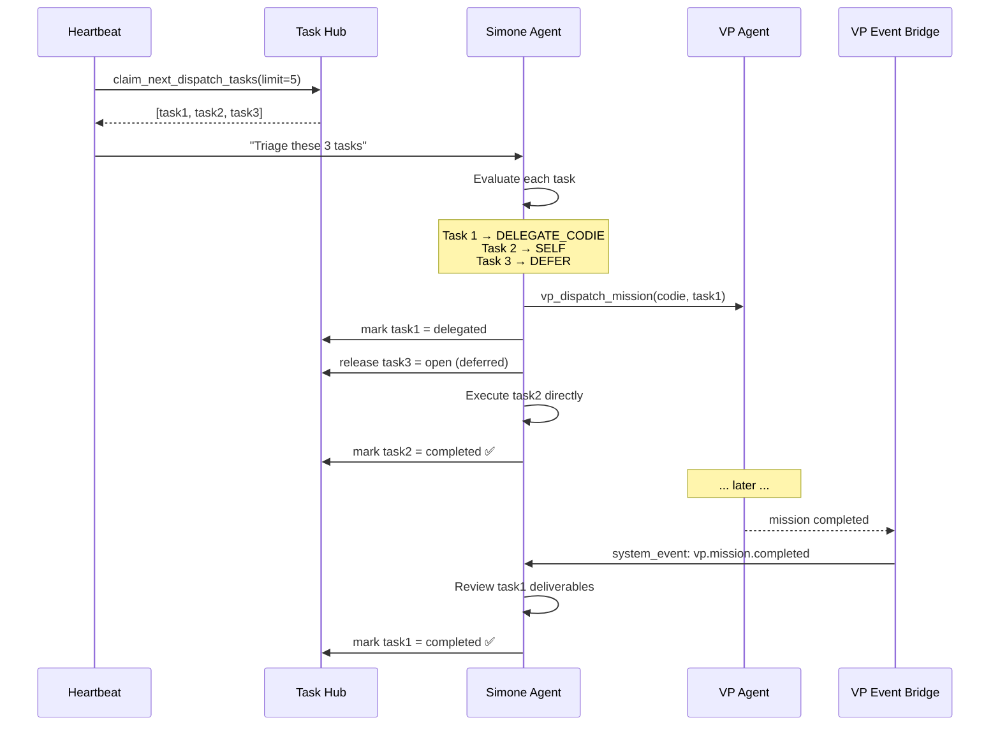
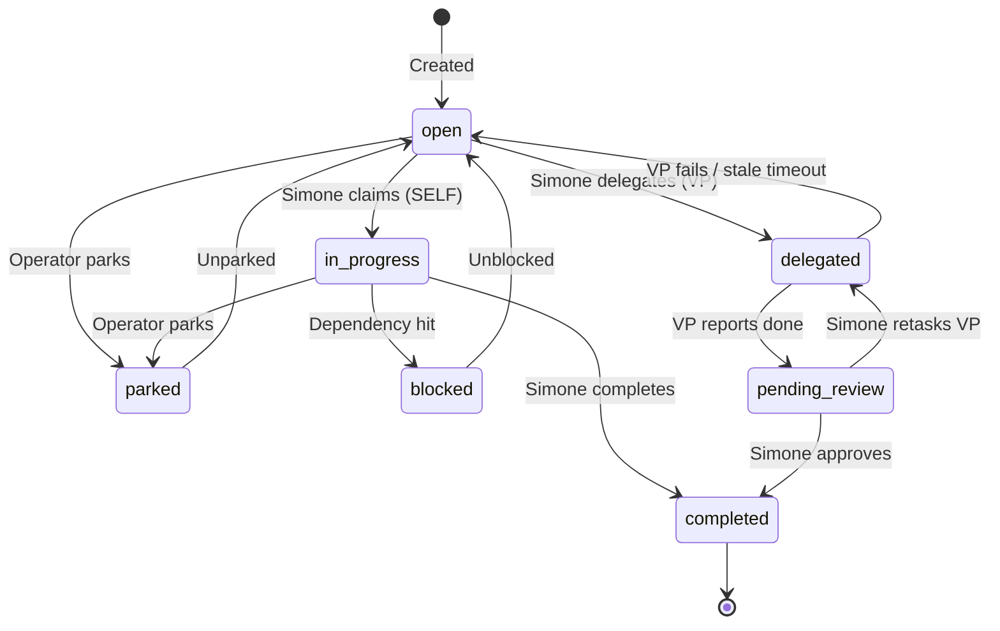

# Simone-First Orchestration Architecture

> [!IMPORTANT]
> **This document is the canonical reference** for the Simone-First orchestration model —
> the architectural principle that Simone is the primary executor, triage decision-maker,
> and quality gate for all task execution in the Universal Agent system.
>
> **Established:** 2026-03-27 — Replaces the legacy `qualify_agent()` keyword router.

---

## 1. Core Principles

### 1.1 Simone is the Primary Executor

Simone is not a triage shuffler or dispatch router. She is the **most capable agent**
in the system, with full access to:

- `capabilities.md` — dynamically generated catalog of all agent capabilities
- All skills registered in `.agents/skills/`
- All MCP servers (AgentMail, GitHub, NotebookLM, etc.)
- All sub-agents for specialized sub-tasks
- The complete UA toolbox

Atlas and Codie are powerful VP agents, but they run in isolated factory sandboxes
with narrower scope. Simone should be the **first choice** for complex tasks.

### 1.2 VPs are Overflow Capacity

Atlas (VP General) and Codie (VP Coder) handle work when Simone is already busy.
They are **not** the default destination for coding or research tasks — Simone handles
those herself unless she decides to delegate.

### 1.3 Simone Decides Delegation

No deterministic router classifies tasks. Simone evaluates the full task queue using
her reasoning capabilities and decides:
- **SELF** — she works this task directly
- **DELEGATE_ATLAS** — hand to Atlas (research, content, analysis)
- **DELEGATE_CODIE** — hand to Codie (large coding projects)
- **DEFER** — task waits for her to become free

### 1.4 No Task Completes Without Sign-Off

VP agents report completion, but the task remains in `pending_review` until Simone
reviews deliverables and approves. She is the quality gate — just like a team lead
who assigns work to developers but reviews their output before closing the ticket.

### 1.5 Single Execution Context

Centralizing through Simone means one agent profile to configure correctly:
- One set of tool permissions
- One session context to debug
- One heartbeat loop to manage

This eliminates the class of bugs where different routing paths have different
permission sets, and hook sessions get blocked by security guards.

---

## 2. Architecture

### 2.1 Before (Legacy Router)



**Problems:**
- Keyword heuristics misrouted tasks
- Simone only got tasks the router couldn't classify
- No ability to decompose, coordinate, or contextualize delegated work
- Multiple execution contexts to debug permissions for

### 2.2 After (Simone-First)



---

## 3. Batch Triage Protocol

Every heartbeat cycle where the queue has work, Simone receives the **full eligible queue**
(up to 5 tasks) in her prompt. She triages before executing:

### 3.1 Triage Flow



### 3.2 Triage Decision Factors

Simone considers:
- **Task complexity** — does this need her full orchestration capabilities?
- **Task type** — large coding project → Codie; research/content → Atlas
- **Current context** — does she have relevant context from recent sessions?
- **Queue depth** — if many tasks are waiting, delegate more aggressively
- **Task dependencies** — if task B depends on task A, don't delegate both to different VPs

### 3.3 Triage Logging

Every triage decision is recorded in Task Hub metadata for observability:

```json
{
  "triage_decision": "delegate_codie",
  "triage_reason": "Large coding refactor — ideal for Codie VP",
  "triage_cycle": "2026-03-27T05:00:00Z",
  "triage_alternatives_considered": ["self", "defer"]
}
```

---

## 4. Task Lifecycle (Updated)



### New Statuses

| Status | Meaning | Dashboard Display |
|--------|---------|-------------------|
| `delegated` | VP working on it, Simone dispatched | "In Flight" with VP badge |
| `pending_review` | VP done, awaiting Simone sign-off | "Needs Review" with VP completion indicator |

---

## 5. Two-Layer Email Response

Email responsiveness is critical. The system uses a two-layer model:

### Layer 1: Immediate (0-10 seconds)

The `agentmail_inbound_hook` fires instantly on email receipt:
1. Parses the email
2. Sends immediate reply: "Got your message, I'm looking into this"
3. Creates Task Hub entry via `email_task_bridge.materialize()`
4. Signals the idle dispatch loop via nudge event

### Layer 2: Fast (30-90 seconds)

The nudge event wakes the idle dispatch loop immediately:
1. Loop detects: Simone is free + task waiting → wakes heartbeat
2. Simone runs batch triage on the new task + any others
3. Simone starts working within 1-2 minutes of email arrival

### Layer 3: Scheduled (30-minute cycle)

Background maintenance:
- VP completion review and sign-off
- Stale task cleanup
- Queue health check

---

## 6. `/btw` Sidebar Sessions

Lightweight scratch conversations that don't pollute running session context.

### 6.1 Purpose

When Simone is in the middle of a complex task, the user can ask unrelated
questions without:
- Injecting into the current run's context window
- Stopping the current run
- Waiting for the current run to complete

### 6.2 Usage

```
/btw what was the API rate limit?     → opens sidebar
(conversation continues in sidebar)
/return                                → closes sidebar, returns to main
```

### 6.3 Session Properties

| Property | Main Session | Sidebar Session |
|----------|-------------|-----------------|
| System prompt | Full capabilities | Personality only |
| Tools | Full (VP, Task Hub, Skills) | Minimal (search, file read) |
| Heartbeat tracking | Yes | No |
| Auto-expiry | No | 10 min inactivity |
| Context | Persistent | Ephemeral |

---

## 7. Implementation Map

### Modified Files

| File | Change |
|------|--------|
| `services/agent_router.py` | Replace `qualify_agent()` with `route_all_to_simone()` |
| `task_hub.py` | Add `delegated`, `pending_review` statuses |
| `heartbeat_service.py` | Batch claim (5 tasks), triage prompt, VP completion review |
| `hooks_service.py` | Simplify email hook to ack + materialize |
| `hooks.py` | Whitelist hook tools, remove excessive guards |
| `idle_dispatch_loop.py` | Add nudge event mechanism |
| `gateway_server.py` | Dashboard API updates, sidebar session endpoints |
| `HEARTBEAT.md` | Triage protocol + VP completion review instructions |
| `web-ui/` chat component | `/btw` and `/return` command handling |

### Deleted Code

| Code | Reason |
|------|--------|
| `qualify_agent()` | Replaced by Simone's reasoning |
| `qualify_agent_llm()` | Replaced by Simone's reasoning |
| `route_claimed_tasks()` | Replaced by `route_all_to_simone()` |
| `_get_enabled_agents()` | VP availability is Simone's concern |
| `UA_AGENT_ROUTING_ENABLED` flag | Simone-first is permanent |

---

## 8. Observability

### Metrics to Monitor

| Metric | What It Shows | Concern Threshold |
|--------|--------------|-------------------|
| Delegation rate | % tasks Simone delegates | >80% → Simone hogging; <10% → not leveraging VPs |
| Delegation success rate | VP tasks approved on first review | <70% → VP quality issue |
| Email ack latency | Time from receipt to ack reply | >30s → hook performance issue |
| Triage-to-start latency | Time from receipt to Simone working | >5 min → nudge mechanism failing |
| VP stale timeout rate | Tasks reopened due to VP timeout | >5% → VP reliability issue |
