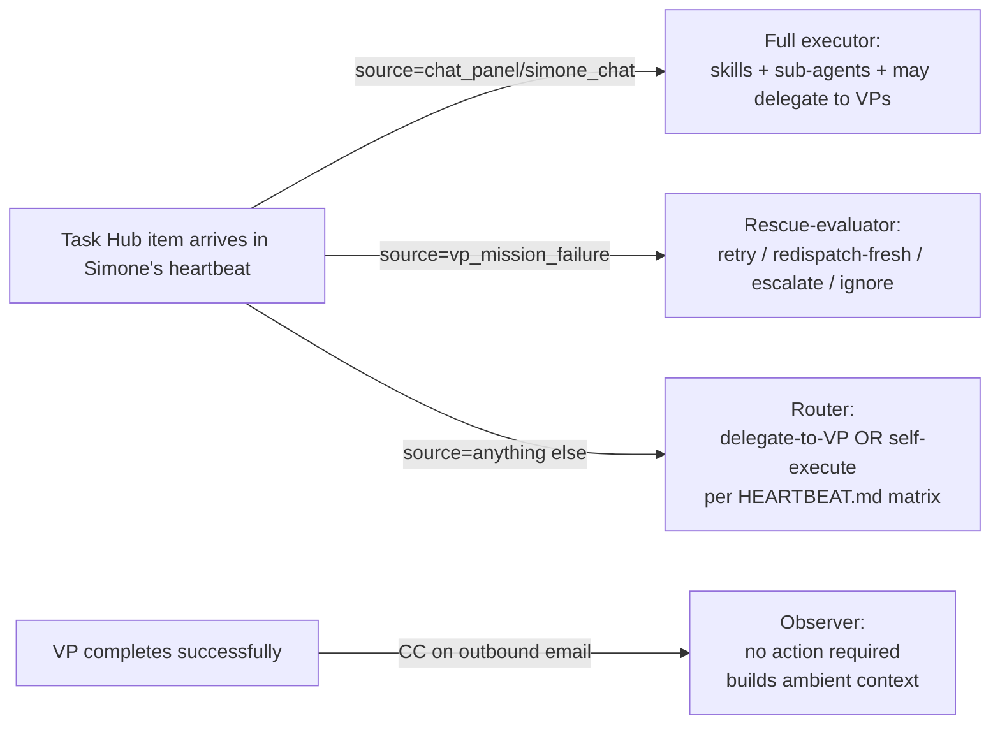

# PRD — VP `/goal` Integration, Self-Briefing, and Failure-Rescue

**Status:** Draft for operator approval
**Author:** Claude (session: "Build out vp flows")
**Date:** 2026-05-25
**Implements:** Architectural decisions from the 2026-05-25 grilling session covering Cody self-driving completion loops via `/goal`, universal VP self-briefing, and Simone-mediated failure rescue
**Sequenced as:** 5 PRs (1 docs + 4 code + 1 cleanup)
**Replaces:** Implicit assumptions in [`03_VP_Workers_And_Delegation.md`](03_VP_Workers_And_Delegation.md) about how VP completions surface back to Simone (the current code does not match the documented intent)

---

## 1. Executive summary

Today, autonomous VP (Cody + Atlas) work runs as a one-shot prompt-driven subprocess. Success is "subprocess exited cleanly and the VP called `finalize(completed)`" — a thin signal that has produced silent failures. Simone's `HEARTBEAT.md` promises she will see VP outputs in `needs_review` for sign-off, but no code path creates those rows; the promise is fiction and a contradiction with `TODO_DISPATCH_PROMPT`'s close discipline.

This PRD replaces that situation with:

1. **`/goal` adoption for tightly-scoped Cody work** — Anthropic's built-in self-driving loop (Claude Code v2.1.139+) drives Cody to evaluator-confirmed completion. UA composes the goal condition from the VP's own self-briefing; UA does not wrap or interfere with the loop.
2. **Mandatory self-briefing for all autonomous VP work** — Every Cody and Atlas mission begins by interrogating its task against the codebase/docs and producing a `BRIEF.md` (`/goal`-Cody also produces `ACCEPTANCE.md` + `goal_condition.txt`). Makes the VP's interpretation explicit and audit-able.
3. **Mandatory completion attestation** — Before calling `finalize(completed)`, every VP writes a `COMPLETION.md` and self-attests against its own `BRIEF.md`. If attestation fails, the VP calls `finalize(failed)` instead, routing the work into the failure-rescue lane.
4. **Failure-rescue via Simone** — Every VP failure (all modes) creates an informational task hub item routed to Simone with `failure_count`. Simone has three new tools — retry-with-guidance, redispatch-fresh, escalate-to-operator — and may choose to ignore (the failure stays in her queue as ambient context).
5. **Centralized CC-Simone-on-success directive** — The pattern currently duplicated in `proactive_codie.py` and `TODO_DISPATCH_PROMPT` becomes a single helper applied across all autonomous VP task producers, including Atlas.
6. **HEARTBEAT/PROMPT reconciliation** — Delete the false `needs_review` promise; align close discipline on `task_redirect_to` (the architecture this PRD builds requires source tasks to stay open until the VP closes them).

Simone's posture clarifies into four context-dependent roles: **observer** of VP successes, **rescue-evaluator** of VP failures, **full executor** of direct user chats (with all skills/sub-agents/VP delegation tools available), and **router** for Task Hub intake.

## 2. Non-goals (explicitly NOT building)

- `needs_review` task hub items for VP completions of any kind
- Generalized `cody-work-evaluator` pattern for non-demo work (Phase 4 evaluator stays scoped to `cody_demo_task`)
- Any approval gate between VP completion and the VP's outbound email to Kevin
- Any sampled audit by Simone of VP outputs
- Any UA wrapper around `/goal` (no shim, no intercept of the evaluator)
- Any `/goal` adoption for Atlas (Atlas remains on the self-briefing + self-attestation pattern without a completion loop)
- Any `/goal` adoption for `proactive_codie` (cleanup is a search, not a goal task)

## 3. Architectural decisions (the seven locks)

| # | Decision | Rationale (one line) |
|---|---|---|
| 1 | `/goal` adoption scope: `cody_demo_task`, `cody_scaffold_request`, `tutorial_build`, operator-dispatched Cody | Each has a crisp verifiable end state; `proactive_codie` doesn't |
| 2 | Self-briefing scope: universal `BRIEF.md`; `ACCEPTANCE.md` + `goal_condition.txt` only for `/goal`-eligible Cody work | BRIEF makes failure-rescue legible to Simone for any VP; ACCEPTANCE only has a downstream consumer (`/goal`) for some Cody paths |
| 3 | Failure notification: every failure mode notifies Simone; payload carries `failure_count` | Simone is the routing layer for everything, including failures she can't fix (she escalates) |
| 4 | Rescue toolset: three tools — `vp_dispatch_mission_retry`, `vp_dispatch_mission_redispatch_fresh`, `escalate_vp_failure_to_operator` | Crashes and self-reported failures need different rescue shapes; explicit escalation verb gives telemetry on rescue-vs-escalate ratio |
| 5 | `/goal` condition derivation: co-authored by VP during self-briefing (three artifacts in one pass) | Single brain authors all three; no translation step; consistency enforced at write time |
| 6 | Non-`/goal` success/failure signaling: required `COMPLETION.md` + self-attestation before `finalize(completed)` | Cheap version of an evaluator; catches the common "VP drifted from brief" failure without rebuilding what we said not to build |
| 7 | Naming: "Cody" for human-facing references; `vp.coder.primary` stays as agent_id; no churn on `codie/<task>` branch convention or `proactive_codie.py` filename | Direction of travel is "Cody"; cosmetic renames cause noisy diffs with no functional benefit |

## 4. Architecture

### 4.1 Cody success path with `/goal` (autonomous)

```mermaid
sequenceDiagram
    autonumber
    participant TH as Task Hub
    participant W as Cody VP worker_loop
    participant CC as Claude Code CLI (-p)
    participant E as /goal Haiku evaluator
    participant AM as AgentMail (vp.agents@)

    TH->>W: claim_next_dispatch_tasks(limit=1)
    W->>W: allocate fresh workspace
    W->>CC: claude -p "<self-briefing prompt>"
    Note over CC: VP invokes self-briefing skill;<br/>writes BRIEF.md, ACCEPTANCE.md,<br/>goal_condition.txt to workspace
    CC-->>W: subprocess exits (briefing turn done)
    W->>W: read workspace/goal_condition.txt
    W->>CC: claude -p "/goal <condition>"
    loop until evaluator says done
        CC->>CC: work turn
        CC->>E: turn finished — does condition hold?
        E-->>CC: yes / no + reason
    end
    Note over CC: VP writes COMPLETION.md and self-attests
    CC->>AM: send email to kevin@, CC Simone (vp.agents@)
    CC-->>W: subprocess exits clean
    W->>TH: finalize_vp_mission(completed)
```

### 4.2 VP failure path (any VP, any failure mode)

```mermaid
sequenceDiagram
    autonumber
    participant W as VP worker_loop
    participant FH as finalize_vp_mission hook
    participant TH as Task Hub
    participant S as Simone heartbeat
    participant T as 3 rescue tools

    W->>FH: finalize_vp_mission(failed, mission_id, failure_mode)
    FH->>TH: upsert_item(source_kind="vp_mission_failure",<br/>metadata={mission_id, vp_id, failure_mode,<br/>failure_count, brief_path, transcript_tail,<br/>workspace_path, original_objective})
    Note over TH: task agent_ready=True, routes to Simone
    S->>TH: claim (next heartbeat, cap-of-1)
    S->>S: read BRIEF.md + transcript_tail + failure_count
    alt rescuable — same workspace
        S->>T: vp_dispatch_mission_retry(mission_id, additional_guidance, max_additional_turns)
    else rescuable — fresh workspace
        S->>T: vp_dispatch_mission_redispatch_fresh(mission_id, additional_context)
    else not rescuable / above threshold
        S->>T: escalate_vp_failure_to_operator(mission_id, summary, why_escalating)
        Note over T: creates chat_panel task to Kevin
    else not actioning this cycle
        S->>TH: task_hub_task_action(complete, note="ambient — failure_count=1")
        Note over S: failure stays in queue context;<br/>next occurrence carries failure_count=2
    end
```

### 4.3 Simone's four-posture role



## 5. Component specs

### 5.1 Self-briefing skill (`self-brief-and-attest`)

**Status:** new skill, `.claude/skills/self-brief-and-attest/SKILL.md`
**Invoked by:** every autonomous VP mission as its first turn (mandatory)
**Outputs (in mission workspace root):**
- `BRIEF.md` — VP's interpretation of the task (free prose, ~1 paragraph minimum)
- `ACCEPTANCE.md` *(only if `/goal`-eligible)* — structured criteria with rationale and must-not-change constraints
- `goal_condition.txt` *(only if `/goal`-eligible)* — single ≤4000-char condition phrased for transcript-reading evaluator, derived from but not identical to ACCEPTANCE.md

**Skill body (key behaviors):**
- Reads the task hub item's metadata + objective + any linked artifacts
- Runs the equivalent of `grill-with-docs` against codebase/docs/prior similar artifacts (NOT against Kevin)
- For `/goal`-eligible work: composes `goal_condition.txt` using Anthropic's guidance: *"one measurable end state, a stated check, constraints that matter"* + a self-bounding clause like `"or stop after N turns"`
- Writes a short completion-attestation prompt fragment to `_attest.md` that the VP runs before `finalize`

**Code citation (target invocation path):**
- VP CLI prompt construction at [`src/universal_agent/vp/clients/claude_cli_client.py:797`](file:///home/kjdragan/lrepos/universal_agent/src/universal_agent/vp/clients/claude_cli_client.py#L797) (`_build_cli_prompt`) — extend to prepend a self-briefing directive that invokes this skill

### 5.2 `/goal` integration for Cody

**Status:** new code path inside `_execute_cli_session`
**Trigger:** mission's `source_kind` is in `{cody_demo_task, cody_scaffold_request, tutorial_build}` OR the mission has explicit `cody_mode_use_goal=True` flag (for operator-dispatched Cody)
**Behavior:**

```python
# In claude_cli_client.py near _execute_cli_session
async def _execute_cli_session_with_goal(
    *,
    workspace_dir: Path,
    timeout_seconds: int,
    cody_mode: str,
    task_id: str,
) -> MissionOutcome:
    # Phase 1 — self-briefing turn (writes BRIEF.md, ACCEPTANCE.md, goal_condition.txt)
    briefing_prompt = _build_self_briefing_prompt(
        workspace_dir=workspace_dir,
        require_acceptance=True,  # /goal-eligible
    )
    briefing_outcome = await _run_cli_subprocess(
        prompt=briefing_prompt,
        workspace_dir=workspace_dir,
        timeout_seconds=300,  # briefing should be fast
        env=_build_cli_env(...),
    )
    if briefing_outcome.status != "completed":
        return briefing_outcome  # propagate failure

    goal_condition_path = workspace_dir / "goal_condition.txt"
    if not goal_condition_path.exists():
        return MissionOutcome(
            status="failed",
            message="self-briefing did not produce goal_condition.txt",
        )
    goal_condition = goal_condition_path.read_text().strip()
    if len(goal_condition) > 4000:
        return MissionOutcome(
            status="failed",
            message=f"goal_condition.txt exceeds 4000 chars ({len(goal_condition)})",
        )

    # Phase 2 — /goal loop (Anthropic's built-in evaluator drives to completion)
    goal_prompt = f"/goal {goal_condition}"
    return await _run_cli_subprocess(
        prompt=goal_prompt,
        workspace_dir=workspace_dir,
        timeout_seconds=timeout_seconds,  # full mission budget
        env=_build_cli_env(...),
    )
```

**Code citations:**
- Current invocation: [`claude_cli_client.py:290-297`](file:///home/kjdragan/lrepos/universal_agent/src/universal_agent/vp/clients/claude_cli_client.py#L290) (the `claude --print --output-format stream-json` spawn)
- CLI env builder: [`claude_cli_client.py:759`](file:///home/kjdragan/lrepos/universal_agent/src/universal_agent/vp/clients/claude_cli_client.py#L759) (`_build_cli_env`)

**Timeout policy:**
- Briefing turn: 5 min cap (short, focused work)
- `/goal` loop turn: total `MAX_CLI_TIMEOUT_SECONDS` (currently 14400 = 4h) is the wall clock; the `/goal` condition MUST include a self-bounding clause (`"or stop after N turns"`) to prevent runaway loops within budget

### 5.3 Failure-rescue wiring

**Status:** new code in `durable/state.py`, `task_hub.py`, `tools/vp_orchestration.py`, `memory/HEARTBEAT.md`

**Source-of-truth event:** `finalize_vp_mission(failed | cancelled)` at [`durable/state.py:1201`](file:///home/kjdragan/lrepos/universal_agent/src/universal_agent/durable/state.py#L1201) is the choke point. Hook it.

```python
# In durable/state.py — extend finalize_vp_mission
def finalize_vp_mission(
    conn: sqlite3.Connection,
    mission_id: str,
    final_status: str,
    *,
    result_ref: Optional[str] = None,
    clear_claim: bool = True,
    failure_mode: Optional[str] = None,  # NEW
    transcript_tail: Optional[str] = None,  # NEW
) -> bool:
    # ... existing UPDATE on vp_missions ...

    if status in {"failed", "cancelled"} and failure_mode != "operator_cancel":
        # Surface to Simone via Task Hub informational item
        from universal_agent.services.vp_failure_rescue import surface_failure_to_simone
        surface_failure_to_simone(
            mission_id=mission_id,
            failure_mode=failure_mode or "unspecified",
            transcript_tail=transcript_tail,
        )
    return result.rowcount == 1
```

**New service `services/vp_failure_rescue.py`:**

```python
def surface_failure_to_simone(
    *, mission_id: str, failure_mode: str, transcript_tail: Optional[str]
) -> None:
    """Create a vp_mission_failure task_hub_item routed to Simone."""
    # Look up mission + count prior failures for same mission_id
    failure_count = _count_prior_failures(mission_id) + 1
    mission = _load_mission(mission_id)
    task_hub.upsert_item(conn, {
        "task_id": f"vp_failure:{mission_id}",
        "source_kind": "vp_mission_failure",
        "status": task_hub.TASK_STATUS_OPEN,
        "agent_ready": True,
        "trigger_type": "immediate",
        "metadata": {
            "mission_id": mission_id,
            "vp_id": mission["vp_id"],
            "failure_mode": failure_mode,
            "failure_count": failure_count,
            "brief_path": str(_workspace_path(mission) / "BRIEF.md"),
            "transcript_tail": (transcript_tail or "")[-2000:],
            "workspace_path": str(_workspace_path(mission)),
            "original_objective": mission["objective"],
        },
    })
```

**Three new tools in `tools/vp_orchestration.py`:**

| Tool | Signature | Behavior |
|---|---|---|
| `vp_dispatch_mission_retry` | `(mission_id, additional_guidance, max_additional_turns=None)` | Re-dispatches same mission_id, same workspace, augments prompt with `additional_guidance`. Bounds re-run via `max_additional_turns`. |
| `vp_dispatch_mission_redispatch_fresh` | `(mission_id, additional_context)` | Allocates new workspace, copies BRIEF.md only (not partial outputs), starts fresh /goal or non-/goal run with `additional_context` prepended to the brief. |
| `escalate_vp_failure_to_operator` | `(mission_id, summary, why_escalating, recommended_action=None)` | Creates `chat_panel` task with `metadata.escalation_source="vp_failure"`. Closes the vp_mission_failure task as `complete` with note "escalated to operator". |

**HEARTBEAT.md addition (Simone directive for failure rescue):**

```markdown
### Handling vp_mission_failure items (rescue-evaluator posture)

When you claim a task with `source_kind="vp_mission_failure"`:

1. Read `metadata.brief_path` (the VP's own BRIEF.md) and `metadata.transcript_tail`.
2. Note `metadata.failure_count` — high counts mean prior rescue attempts didn't stick.
3. Choose ONE of four actions:
   - `vp_dispatch_mission_retry(mission_id, additional_guidance, max_additional_turns)` — when failure was self-reported or /goal cap-hit AND your guidance addresses the gap
   - `vp_dispatch_mission_redispatch_fresh(mission_id, additional_context)` — when the failure was a crash, env corruption, or workspace contamination
   - `escalate_vp_failure_to_operator(mission_id, summary, why_escalating, recommended_action)` — when failure is auth/workspace-guard/config OR failure_count ≥ 3 OR rescue attempts already failed
   - `task_hub_task_action(complete, note="ambient — failure_count=N, no action this cycle")` — when you're choosing not to act; the failure becomes context for next occurrence

Do NOT attempt to fix the VP's underlying work yourself. You are an evaluator and dispatcher, not a fallback executor.
```

### 5.4 CC-Simone-on-success centralization

**Status:** refactor; partial wiring exists today

**Today (verified):**
- [`proactive_codie.py:226-232`](file:///home/kjdragan/lrepos/universal_agent/src/universal_agent/services/proactive_codie.py#L226) — 16-step directive with CC-Simone built in
- [`todo_dispatch_service.py:432-444`](file:///home/kjdragan/lrepos/universal_agent/src/universal_agent/services/todo_dispatch_service.py#L432) — `target_agent` case has CC-Simone directive

**Missing:** other autonomous VP task producers (`proactive_convergence`, `proactive_signal`, `claude_code_intel`, `cody_scaffold`, `tutorial_build`, `insight_brief_task`, `convergence_brief_task`, Atlas autonomous) do not consistently embed the directive.

**Proposed:** new helper `services/vp_email_directive.py`:

```python
def build_vp_outbound_email_directive(
    *, vp_id: str, source_kind: str, kevin_email: str = "kevinjdragan@gmail.com"
) -> str:
    """Returns prompt text instructing the VP to email Kevin and CC Simone.

    Single source of truth for the [VP Status] email pattern. Replaces the
    duplicated 16-step blocks in proactive_codie.py and TODO_DISPATCH_PROMPT.
    """
    vp_name = {"vp.coder.primary": "Cody", "vp.general.primary": "Atlas"}.get(vp_id, vp_id)
    return f"""
After completing the work AND writing COMPLETION.md, send an email to {kevin_email}
from the shared VP mailbox vp.agents@agentmail.to.

- Subject prefix: "[VP Status] " followed by a concise summary
- CC: oddcity216@agentmail.to (Simone — situational awareness only, no action needed)
- Email body MUST begin with:
    ── VP Status Update (FYI — no action required) ──
    This reply was sent by {vp_name} ({vp_id}) directly to Kevin.
    Simone is CC'd for situational awareness only. No action is needed from her.
    ────────────────────────────────────────────────
- Then a natural-language summary of what was produced, where artifacts live,
  and a pointer to the COMPLETION.md attestation if relevant.

Use the prepare_agentmail_attachment or agentmail_send_with_local_attachments helpers
per the attachment routing rules in your context.
""".strip()
```

**Failure path email policy:** VPs do NOT email Kevin on failure. Failure flows to Simone via `vp_mission_failure` task hub item; Simone uses `escalate_vp_failure_to_operator` if she wants Kevin involved. This avoids duplicate failure notifications.

### 5.5 Completion attestation (Step 4 sub-component)

Every autonomous VP mission, before calling `finalize_vp_mission(completed)`, MUST:

1. Read its own `BRIEF.md` (and `ACCEPTANCE.md` if present)
2. Write `COMPLETION.md` to workspace root with:
   - One-paragraph description of what was produced
   - Bulleted mapping: each BRIEF/ACCEPTANCE item → satisfied/not satisfied/partial + evidence
   - List of artifact paths
3. Self-attest: if ANY item is "not satisfied" or attestation is uncertain, call `finalize(failed)` instead of `finalize(completed)` (which routes to failure-rescue)

**Enforcement:** prompt-level directive in the self-briefing skill's `_attest.md` fragment + code-level guard in `worker_loop.py:497-498` that rejects `finalize(completed)` if `COMPLETION.md` is absent from the workspace.

```python
# In worker_loop.py — near the existing finalize call
if outcome.status == "completed":
    completion_path = workspace_path / "COMPLETION.md"
    if not completion_path.exists():
        # Demote to failed; rescue path will pick it up
        finalize_vp_mission(
            self.conn, mission_id, "failed",
            result_ref=outcome.result_ref,
            failure_mode="missing_completion_attestation",
            transcript_tail=outcome.payload.get("final_text", ""),
        )
        return  # surfaces to Simone for rescue
    finalize_vp_mission(self.conn, mission_id, "completed", result_ref=outcome.result_ref)
```

### 5.6 HEARTBEAT/PROMPT close-discipline reconciliation

**Current contradiction:**
- [`memory/HEARTBEAT.md:51`](file:///home/kjdragan/lrepos/universal_agent/memory/HEARTBEAT.md#L51): *"Do not call `complete` on the source task — the work isn't done yet; the VP will close it"* → use `task_redirect_to`
- [`todo_dispatch_service.py:404`](file:///home/kjdragan/lrepos/universal_agent/src/universal_agent/services/todo_dispatch_service.py#L404): *"**Immediately** call `task_hub_task_action(action="complete")`"* → close at dispatch time

**Resolution:** align both on **`task_redirect_to`**. Reasons:
- The failure-rescue architecture requires the source task to stay open until VP closes it (so retry/redispatch-fresh have a target row)
- The `task_redirect_to` verb already stamps `metadata.preferred_vp` for lifecycle audit ([`task_hub.py:4830`](file:///home/kjdragan/lrepos/universal_agent/src/universal_agent/task_hub.py#L4830))
- `complete`-at-dispatch creates an audit-trail lie ("Simone completed this" when in fact the VP did)

**Also delete:** the false promise *"you'll see it in `needs_review` on a future heartbeat for sign-off"* from both HEARTBEAT.md:52 and `TODO_DISPATCH_PROMPT:405`. The needs_review pause is explicitly NOT being built.

**Preserve:** Simone's full-executor capability for `chat_panel`/`simone_chat` direct work — the "Orchestrator, Not Solo IC" framing applies to VP-delegable work, NOT to direct user interaction where Simone is still a Claude Code orchestrator with skills, sub-agents, and the ability to dispatch VPs as her own team.

## 6. Implementation sequencing

| # | Step | Deliverable | Approx LOC | Blocks |
|---|---|---|---|---|
| 0 | This PRD (you are here) | Doc + index updates | ~600 lines doc | All steps |
| 1 | VPS `/goal` smoke test | Shell session result + writeup | 0 (empirical) | Step 4 |
| 2 | Failure-rescue wiring | `surface_failure_to_simone` + 3 tools + HEARTBEAT directive | ~250 LOC | Step 4 |
| 3 | CC-Simone centralization | `vp_email_directive.py` helper + audit & wire-up | ~150 LOC | None |
| 4 | Self-briefing skill + `/goal` integration | New skill + Cody two-phase invocation + completion-attestation guard | ~400 LOC | Steps 1–3 |
| 5 | HEARTBEAT/PROMPT reconciliation | Targeted edits to two prompt files | ~30 LOC | Step 2 done |

Steps 2 and 3 are independent and can land in either order. Step 4 builds on 2+3. Step 5 is cleanup once 2 has landed and the failure-rescue pattern is the new reality.

## 7. Open risks (to verify or accept)

| Risk | Mitigation |
|---|---|
| `/goal` requires workspace trust dialog; Cody spawns fresh workspaces per mission | **Step 1 smoke test resolves.** If blocked, options: (a) per-user trust toggle in `~/.claude/settings.json`, (b) accept workspaces under a trusted parent path, (c) abort `/goal` adoption and stick with self-briefing+attestation only |
| `/goal` in `-p` mode runs the loop in a single subprocess invocation, potentially long | `goal_condition.txt` MUST include `"or stop after N turns"` self-bounding clause. Default cap in self-briefing skill: 30 turns. Worst case still bounded by `MAX_CLI_TIMEOUT_SECONDS` (4h) wall clock |
| `/goal` evaluator runs on session's provider's small-fast-model; Cody on ZAI post-June 15 may not have an equivalent | **Defer.** Document the gap; verify before the migration; for now Cody on Anthropic Max uses Haiku natively |
| Simone's cap-of-1 + failure-rescue items in queue could displace new-work intake during failure storms | `failure_count` lets Simone self-throttle (high count → escalate to operator instead of retrying); informational `vp_mission_failure` items can be processed in batch when count is high. Monitor in production after rollout |
| Code-enforced `COMPLETION.md` guard could create false-failed items for legitimate completions | Self-briefing skill's directive is explicit; failure mode tag `missing_completion_attestation` is distinct so Simone can recognize it as a process issue not a work issue |
| Centralized `vp_email_directive.py` helper changes the prompt text VPs see — could change VP behavior | Roll out behind feature flag `UA_VP_EMAIL_DIRECTIVE_CENTRAL=1`; compare email patterns before/after for one week |

## 8. Success criteria

- [ ] **Step 1** — `claude -p "/goal echo done"` runs cleanly on VPS as `ua` user in a fresh workspace; documents the actual setup requirements
- [ ] **Step 2** — A test VP failure (any mode) produces a `vp_mission_failure` task hub item visible in Simone's queue with all metadata fields populated; Simone can call any of the three rescue tools successfully
- [ ] **Step 3** — All autonomous VP task producers surveyed; the `vp_email_directive.py` helper produces identical-or-better email directives than the current duplicated text; Atlas-targeted autonomous work CCs Simone (today it does not)
- [ ] **Step 4** — A `cody_demo_task` mission produces `BRIEF.md`, `ACCEPTANCE.md`, `goal_condition.txt`, `COMPLETION.md` in workspace; `/goal` evaluator confirms completion; email lands in Kevin's inbox with Simone CC'd
- [ ] **Step 5** — `grep -n "needs_review on a future heartbeat" memory/HEARTBEAT.md src/universal_agent/services/todo_dispatch_service.py` returns no matches; close discipline aligned on `task_redirect_to`; Simone's HEARTBEAT preserves the four-posture role
- [ ] **End-to-end** — One real `cody_demo_task` runs the full path: claim → self-brief → /goal → COMPLETION → email Kevin → Simone CC'd. Audit trail shows no `needs_review` surface, no Simone gate.
- [ ] **Failure path** — One synthetic VP failure runs the full rescue path: failure → Simone-notified → rescue tool invoked → outcome recorded.

## 9. Out-of-scope (defer to later PRDs)

- `/loop` for Cody (separate primitive, different use case)
- Atlas's own self-driving completion loop (no `/goal` for Atlas; if completion-driving is needed for Atlas, that's a separate design)
- Goal-level decomposition for operator `/goal` commands (Path A in earlier discussion) — operator-initiated `/goal` use is unchanged and remains operator-driven
- Generalized `cody-work-evaluator` for non-demo Cody work (explicitly NOT building)
- ZAI-side small-fast-model resolution for `/goal` post-June 15 (separate migration ticket)
- Telemetry/dashboard surfaces for `vp_mission_failure` and escalation rate (will follow naturally once the source data exists)

## 10. References

**Code (verified):**
- VP completion path: [`worker_loop.py:464-498`](file:///home/kjdragan/lrepos/universal_agent/src/universal_agent/vp/worker_loop.py#L464)
- finalize_vp_mission: [`durable/state.py:1201`](file:///home/kjdragan/lrepos/universal_agent/src/universal_agent/durable/state.py#L1201)
- CLI subprocess invocation: [`claude_cli_client.py:271-310`](file:///home/kjdragan/lrepos/universal_agent/src/universal_agent/vp/clients/claude_cli_client.py#L271)
- CLI prompt builder: [`claude_cli_client.py:797`](file:///home/kjdragan/lrepos/universal_agent/src/universal_agent/vp/clients/claude_cli_client.py#L797)
- Simone-first router: [`agent_router.py:34`](file:///home/kjdragan/lrepos/universal_agent/src/universal_agent/services/agent_router.py#L34)
- HEARTBEAT close discipline: [`memory/HEARTBEAT.md:51-52`](file:///home/kjdragan/lrepos/universal_agent/memory/HEARTBEAT.md#L51)
- TODO_DISPATCH_PROMPT close discipline: [`todo_dispatch_service.py:404-405`](file:///home/kjdragan/lrepos/universal_agent/src/universal_agent/services/todo_dispatch_service.py#L404)
- proactive_codie email directive (existing CC pattern): [`proactive_codie.py:226-232`](file:///home/kjdragan/lrepos/universal_agent/src/universal_agent/services/proactive_codie.py#L226)
- TODO_DISPATCH_PROMPT VP-targeted email directive: [`todo_dispatch_service.py:432-444`](file:///home/kjdragan/lrepos/universal_agent/src/universal_agent/services/todo_dispatch_service.py#L432)
- TODO_DISPATCH_MAX_PER_SWEEP (cap-of-1): [`todo_dispatch_service.py:21-24`](file:///home/kjdragan/lrepos/universal_agent/src/universal_agent/services/todo_dispatch_service.py#L21)

**Anthropic docs:**
- [Keep Claude working toward a goal](https://code.claude.com/docs/en/goal)
- [Slash commands](https://code.claude.com/docs/en/slash-commands)
- [Prompt-based hooks](https://code.claude.com/docs/en/hooks)

**UA docs (canonical references):**
- [`03_VP_Workers_And_Delegation.md`](03_VP_Workers_And_Delegation.md) — VP delegation architecture (will be updated post-implementation)
- [`05_Simone_First_Orchestration.md`](05_Simone_First_Orchestration.md) — Simone's orchestrator role
- [`10_Interactive_Coding_Environment.md`](../06_Deployment_And_Environments/10_Interactive_Coding_Environment.md) — three Claude execution profiles
- [`129_Task_Hub_Observability_Protocol.md`](../03_Operations/129_Task_Hub_Observability_Protocol.md) — task hub lifecycle protocol that vp_mission_failure must conform to
- [`130_Production_Verification_Rules.md`](../03_Operations/130_Production_Verification_Rules.md) — Rules A–D for ship-then-verify
- [`131_Implementation_Plan_Quality_Standards.md`](../03_Operations/131_Implementation_Plan_Quality_Standards.md) — quality standards this PRD targets
