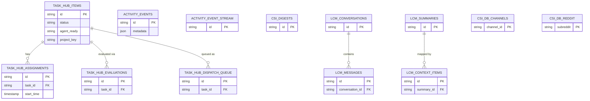

# Universal Agent Database Architecture

**Last updated:** 2026-04-29

This document serves as the absolute source of truth for the database paradigms, table schemas, and pruning logic across the Universal Agent architecture.

## Overview

Universal Agent handles thousands of execution steps, high-throughput telemetry streams, and vector graph operations. Instead of a naive monolith, the database strategy relies on **domain-segregated SQLite files** combined with `WAL` journaling and `autocommit` to eradicate lock contention entirely.

If you are modifying, adding, or debugging any data state in Universal Agent, consult this architecture first to ensure you are respecting isolation paradigms.

## 1. Concurrency Paradigms

All database connection factories throughout the system (e.g. `src/universal_agent/durable/db.py`) inject the following configuration:

```sql
PRAGMA journal_mode=WAL;
PRAGMA auto_vacuum=INCREMENTAL;
```

> [!IMPORTANT]
> Because SQLite allows asynchronous read/write through WAL, the connections utilize `isolation_level=None` (autocommit). This commits directly at the statement boundary. Background `pruning` loops also utilize `PRAGMA incremental_vacuum;` rather than a full blocking `VACUUM` scan to prevent locking the application.

---

## 2. Segregated Database Files

> [!TIP]
> The Entity-Relationship (ER) Diagram below represents the physical and logical boundaries of the isolated databases across the architecture. Notice that `csi.db` is also listed here as part of the overall topology, connecting to the Gateway.



Databases are strictly segregated to avoid "cross battles" (lock contention) between high-priority agent execution states and background tasks.

### `runtime_state.db`

**Purpose**: Primary hot-path database. Stores queue dispatches, unassigned tasks, execution claims, assignments, and results.

- **Module Source**: `src/universal_agent/task_hub.py`
- **Schema Lifecycle**: Handled via `ensure_schema()`
- **Pruning**: Settled/terminal tasks (`completed`, `parked`) are hard-deleted automatically via `prune_settled_tasks()` after 21 days by the heartbeat background worker.

**Core Tables**:

- `task_hub_items`: Primary queue. Tracks metadata and routing intents (`agent_ready`, `project_key`).
- `task_hub_assignments`: Tracks session leases by agent processes (start/end boundaries).
- `task_hub_evaluations`: Judging or routing scores.
- `task_hub_dispatch_queue`: Snapshots ranked priority queries.

### `activity_state.db`

**Purpose**: Dedicated telemetry. Stores streaming dashboards, CSI metrics, debug events, and background agent diagnostics.

- **Module Source**: `src/universal_agent/gateway_server.py`
- **Schema Lifecycle**: `_ensure_activity_schema()`
- **Pruning and lifecycle**: Actively runs `_activity_prune_old()` during activity writes. Expiration length is configured dynamically. Non-actionable `info`/`success` notification rows older than `UA_ACTIVITY_NOTIFICATION_AUTO_READ_HOURS` (default 24) are marked `read`, not left as unread operator work. Uses `PRAGMA incremental_vacuum()` after lifecycle maintenance.

**Core Tables**:

- `activity_events`: Long-form string/json data. `event_class='notification'` is reserved for dashboard/operator lifecycle rows; routine non-actionable telemetry is auto-read so health checks measure real unconsumed work.
- `activity_event_stream`: High-velocity firehose cache.
- `csi_digests`: Compressed metrics over rolling windows.

### `lossless_memory/db.py`

**Purpose**: Long-term memory logic for Semantic RAG (Directed Acyclic Graph compression mapping).

- **Module Source**: `src/universal_agent/lossless_memory/db.py`
- **Pruning**: Decays over a prolonged period (Default = 180 days) via `prune_decayed_nodes()`. Evaluates and clears `lcm_messages` and corresponding `lcm_context_items`.

**Core Tables**:

- `lcm_conversations`: Tracking UUIDs to interaction boundaries.
- `lcm_messages`: Raw textual ingestion tokens.
- `lcm_summaries`: Compressed branches representing historical roll-ups.
- `lcm_context_items`: Edges in the directed graph mapping summaries back to their origination.

### VP Workspace DBs

There are two dynamically provisioned DBs:

- `coder_vp_state.db`
- `vp_state.db`

**Purpose**: External VP subagents use these files to coordinate. This isolates primary Gateway processes from misbehaving subagents that might lock up a database thread running deeply recursive AST evaluations or planning routines.

---

## 3. General Requirements for Database Modifications

When adding new tables, columns, or querying strategies:

1. **Beware the JSON blob**: Queries deserializing high-volume JSON text in Python (`metadata_json`) degrade significantly when rows scale. If filtering against a JSON field becomes necessary, promote that field to a SQL column and index it.
2. **Never query unbounded states in an open loop**: Tables like `task_hub_items` and `activity_events` process millions of rows. Ensure terminal states (e.g. `status = 'completed'`) either filter explicitly, or are included in the rolling background expiration loops.
3. **Connection Handlers**: Always employ `with lock:` and rely on `sqlite_busy_timeout_ms = 15000`. Fast, localized retries outperform slow centralized queue layers. Do not artificially throttle SQL connections.
