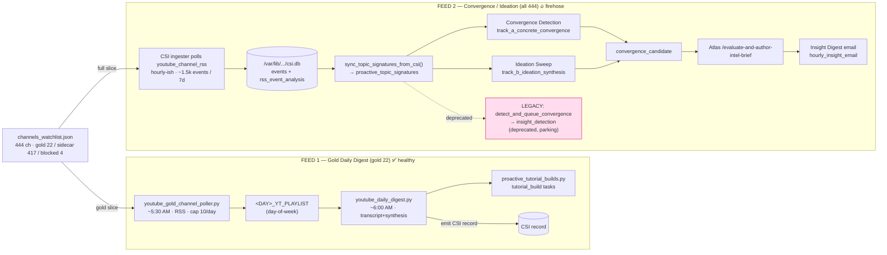
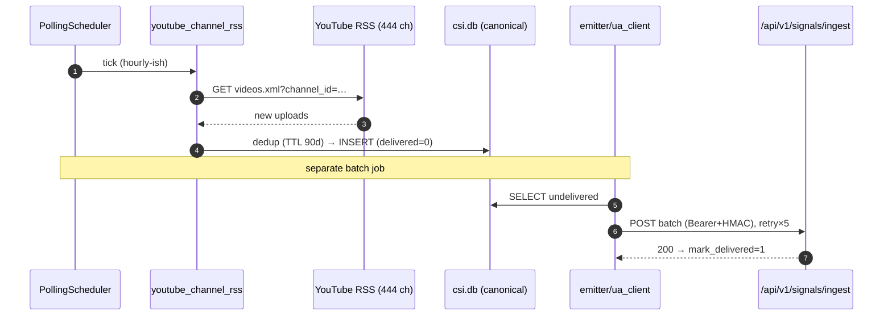

# CSI YouTube Processes — Code-Verified Flow Map (v2, corrected)

**Last updated:** 2026-05-29 (v2 — supersedes v1)
**Author:** Claude Code (code-verified investigation)
**Companion doc:** `docs/proactive_signals/youtube_feed_topology_handoff_2026-05-29.md` (PR #564) — the
two-feed/tiered model originated there; this doc integrates it and adds CSI-ingester source-side
internals + egress mechanics + corrected live-state.

---

## ⚠️ Correction notice (why this is v2)

**v1 of this doc claimed the CSI YouTube pipeline was "dark for 9 days / a silent zombie since May 20." That was wrong.** The error: v1 (and an earlier session) queried `CSI_Ingester/development/var/csi.db`, a **stale dev copy** frozen at 2026-05-20. The **canonical production DB is `/var/lib/universal-agent/csi/csi.db`**, resolved by `gateway_server._csi_default_db_path()` (`gateway_server.py:17450-17451`, default path; `CSI_DB_PATH` env override, not set in prod). Queried correctly, the production feed is **alive and current**:

- `csi.db` mtime **today 17:13**; **82,258** total events
- `youtube_channel_rss` last event **2026-05-29T17:08 UTC** (minutes before this query)
- `convergence_candidate` tasks: **71 completed (last created today 17:00), 11 delegated, 17 parked** — producing and completing work this afternoon.

This is the DB split-brain hazard the companion handoff flags in its §7/§8. **Lesson (do not repeat): resolve `csi.db` via `_csi_default_db_path()`, never hard-code `CSI_Ingester/development/var/csi.db`.**

---

## 0. TL;DR

- **One tiered config, two feeds.** `channels_watchlist.json` (444 channels; **gold=22 · sidecar=417 · blocked=4**) is sliced two ways into two independent pipelines:
  - **Feed 1 — Gold Daily Digest** (gold-22 slice): bounded, curated, **healthy**. 5:30 AM poll → day-of-week playlists (cap 10/day) → 6:00 AM transcript+synthesis → one digest → CSI record → **tutorial dispatch** → self-cleaning. This is the proven model.
  - **Feed 2 — Watchlist Convergence/Ideation** (full 444 slice): broad firehose. CSI ingester polls every channel → signature corpus → **Convergence Detection** + **Ideation Sweep** → `convergence_candidate` → Atlas authors brief → **Insight Digest** email.
- **YouTube is the dominant *live* CSI source.** Over the last 7 days `youtube_channel_rss` produced **1,536 events (~65% of live intake)**, ahead of HackerNews (781). (All-time the DB is dominated by `reddit_discovery` at 72.8k — but that source is itself dead since May 12, so it's a stale tail, not live volume.)
- **`youtube_ingest.py` is NOT the poller.** It's a shared transcript/metadata extractor. The polling lives in the CSI ingester adapters and the gold poller.
- **The real pain point is the *legacy* firehose**, not a dead pipeline: `detect_and_queue_convergence` → `insight_detection` is a deprecated per-insight emitter with **698 cancelled / 1 completed / 30 parked** (0.14% completion), bleeding out into the parked backlog. Cleanup is tracked as "PR E" in the handoff.

---

## 1. Two-system topology

| | **CSI Ingester (source side)** | **UA main app (consumer side)** |
|---|---|---|
| Process | `csi-ingester.service` — uvicorn FastAPI `127.0.0.1:8091` | `universal-agent-gateway` |
| Codebase | `CSI_Ingester/development/csi_ingester/` | `src/universal_agent/` |
| Role | poll YouTube → dedup → store → batch-emit | receive → signatures → convergence → briefs/tutorials |
| Canonical event DB | `/var/lib/universal-agent/csi/csi.db` (`_csi_default_db_path()`) | `activity_state.db` (`get_activity_db_path()`) for tasks |
| Link | HTTP POST (push, HMAC-signed) → | `POST /api/v1/signals/ingest` |

---

## 2. The shared tiered config

- Production: `/var/lib/universal-agent/csi/channels_watchlist.json`; resolver `api/routers/csi_watchlist.py:16` (`_DEFAULT_WATCHLIST_FILE`), local fallback `CSI_Ingester/development/channels_watchlist.json`.
- Mirror table: `csi.db → youtube_channels` (444 rows; columns include `tier, quality_score, active, demoted_at`).
- **Tiers (verified):** `gold=22 · sidecar=417 · blocked=4`.
  - **gold** → feeds **Feed 1** (Daily Digest). **sidecar** → feeds **Feed 2** only. **blocked** → excluded.
- RSS URL pattern: `https://www.youtube.com/feeds/videos.xml?channel_id={channel_id}` (`csi_watchlist.py:331`).
- Watchlist CRUD + 10-category LLM classifier + sidecar→gold promotion metrics via `api/routers/csi_watchlist.py`.

---

## 3. Feed 1 — Gold Daily Digest (curated, bounded) ✅

The **22 gold channels** only. The model that works: bounded source → hard cap → single synthesis → clean inbox.

1. `services/youtube_gold_channel_poller.py` — **~5:30 AM America/Chicago**. For each gold channel, fetch RSS, route each new video into a **day-of-week playlist** (`MONDAY_YT_PLAYLIST`…`SUNDAY_YT_PLAYLIST`, IDs in Infisical) by published weekday. Daily cap `UA_YOUTUBE_GOLD_DAILY_CAP` (default **10**), newest-first. Dedup vs target playlist + local `processed_videos` sqlite.
2. `scripts/youtube_daily_digest.py` — **~6:00 AM** via UA Cron: select today's playlist → extract transcripts (residential proxies) → synthesize digest (ZAI path) → save markdown → **emit as CSI record** → save tutorial-candidate decision → **dispatch top code prospects to the tutorial pipeline** (`services/proactive_tutorial_builds.py` → `tutorial_build` tasks) → delete processed videos from playlist.
3. `services/youtube_playlist_manager.py` — YouTube Data API v3 wrapper; OAuth2 (`YOUTUBE_OAUTH_CLIENT_ID/_SECRET/_REFRESH_TOKEN`).

> **This — not `youtube_playlist` CSI events — is the live tutorial-creation path.** The `youtube_playlist` CSI adapter is **disabled** (`config.yaml enabled:false`, 0 events ever), so the `signals_ingest.to_manual_youtube_payload()` branch (which fires only for `source=="youtube_playlist"`, `signals_ingest.py:106`) is dormant in production. v1 of this doc mis-attributed tutorial creation to that dormant branch.

---

## 4. Feed 2 — Watchlist Convergence / Ideation (firehose) 🔥

The **entire 444-channel watchlist**. `services/invariants/csi_source_liveness.py:42`: `"youtube_channel_rss": 12.0  # 444-channel watchlist, hourly-ish per channel` (critical alert if no event in 12h).

1. **CSI ingester** polls `youtube_channel_rss` for every channel → CSI `events` (`source='youtube_channel_rss'`) + `rss_event_analysis` rows (transcript + summary). *(Internals in §6.)*
2. `services/proactive_convergence.py:204` **`sync_topic_signatures_from_csi`** (active entrypoint) — reads CSI events JOIN `rss_event_analysis`, `upsert_topic_signature()` into the **`proactive_topic_signatures`** corpus (one row/video, deduped by video_id).
3. **Two detectors over that corpus, same stage:**
   - **Convergence Detection** (`track_a_concrete_convergence`, `:1173`) — same story across ≥2 channels. *Signal-reinforcement / salience confirmation* (Kevin's 2026-05-29 reframing — NOT "low-value news saturation"; the `:613` comment to that effect is superseded).
   - **Ideation Sweep** (`track_b_ideation_synthesis`, `:1264`) — non-obvious cross-cutting synthesis (more revelatory). Batches of 20. Restored 2026-05-29 (`UA_IDEATION_SWEEP_ENABLED`=1, `UA_IDEATION_MIN_CONFIDENCE`=0.7).
4. Both write `convergence_candidate` rows (`write_convergence_candidate`; ideation tagged `candidate_kind='ideation'`), deduped/write-once → **Atlas** via `/evaluate-and-author-intel-brief` → consolidated **Insight Digest** (`hourly_insight_email` cron; `gateway_server.py:19267`).
5. Cron: `gateway_server.py:19596 _ensure_csi_convergence_cron_job` → calls `sync_topic_signatures_from_csi` (cadence governor).

**Health (canonical `activity_state.db`, today):** `convergence_candidate` = 71 completed / 11 delegated / 17 parked, last created **today 17:00**. The active path works.

---

## 5. The LEGACY firehose (the parked-backlog source) ⚠️

- `detect_and_queue_convergence[_llm]` (`proactive_convergence.py:1015/1047`) — OLD **per-signature** path; in its Track-B loop calls `create_insight_brief_task` (`:1416`) emitting **one Task Hub item per insight** (`source_kind='insight_detection'`, `:1497`) for `vp.general.primary`.
- **Deprecated** (`:221-224`: not invoked by the active pipeline; still reachable from two hand-trigger endpoints `gateway_server.py:~21084 / ~21133` until "PR E").
- **Consequence (`activity_state.db`, `insight_detection`):** **698 cancelled · 1 completed · 30 parked** (≈0.14% completion), created ~142–220/day declining through 5/28 as it bleeds out. No dedup/cap/backpressure vs one consumer → overflow stale-reaped to cancelled/parked.
- **Net:** the parking is the overflow drain of a deprecated producer — an *incomplete migration*, not a broken live pipeline.

---

## 6. CSI ingester internals (source-side mechanics)

The ingester is a **poller**, not a passive receiver. A single `csi-ingester.service` uvicorn process runs an internal `PollingScheduler` (`scheduler.py:12`); on startup `app.py:49-59` → `_service.start()` registers each adapter as a timed job (`service.py:50-55`). **All YouTube polling runs inside that one process** — there is no separate `csi-youtube-*` unit (`deployment/systemd/csi-ingester.service:1-21`).

| Adapter | Status | Discovery | Emits |
|---|---|---|---|
| `youtube_channel_rss` | **ENABLED** | RSS `videos.xml?channel_id=` for 444 ch (`youtube_channel_rss.py:324`) | `channel_new_upload`, `pipeline=creator_watchlist_handler`, dedupe `youtube:video:{id}` (`:398-410`) |
| `youtube_playlist` | **DISABLED** | YouTube Data API v3 `playlistItems` (`youtube_playlist.py:123`) | `video_added_to_playlist`, `pipeline=youtube_tutorial_explainer` (`:170-175`) |

- **Dedup:** `store/dedupe.py` — `youtube:` keys get **90-day TTL** (`:25`); hourly `purge_expired()`.
- **Storage:** `events` table in canonical `csi.db` (`store/events.py:11-38`), `delivered` flag flips 0→1 after emit.
- **Egress (push):** `emitter/ua_client.py:68-102` batches undelivered events → POST to `delivery.ua_endpoint` / `CSI_UA_ENDPOINT` (`config.py:50-51`) = UA `/api/v1/signals/ingest`. Auth: `Authorization: Bearer` + `X-CSI-Signature: sha256=…` HMAC (`:78-82`). `emit_with_retries()` up to 5× backoff on 502/503/504 (`:104-151`).

---

## 7. Live operational state (canonical DBs, 2026-05-29 ~17:13 UTC)

**`/var/lib/universal-agent/csi/csi.db` — events by source:**

| Source | All-time | Last event | Last 7d | Note |
|---|---:|---|---:|---|
| `reddit_discovery` | 72,851 | 2026-05-12 | 0 | ⚠️ dead since May 12 (stale all-time tail) |
| `csi_analytics` | 4,345 | today | 46 | internal analytics |
| **`youtube_channel_rss`** | **2,715** | **today 17:08** | **1,536** | ✅ dominant live source (~65%) |
| `hackernews` | 1,909 | today | 781 | ✅ live |
| `threads_*` | <300 | mid-May | 0 | mostly stale |

**`activity_state.db` — downstream tasks:** `convergence_candidate` 71✓/11→/17⏸ (live today); `insight_detection` 698✗/1✓/30⏸ (legacy bleed-out, last 5/28); `proactive_signal` 4 needs_review/29 parked (last 5/27).

**Takeaway:** the YouTube intelligence pipeline is **healthy and current**. The genuine issues are (a) the deprecated `insight_detection` legacy emitter generating parked overflow, (b) `reddit_discovery` being dead since May 12, and (c) the open question of whether anyone consumes Feed 2's full-watchlist output (handoff §8 Q1).

---

## 8. "Unwieldy" — where complexity actually lives

1. **Two same-named feeds off one config** (gold Daily Digest vs full-watchlist Convergence) with very different volume/health.
2. **DB split-brain** — multiple `csi.db` copies (canonical `/var/lib/...` vs dev `CSI_Ingester/development/var/...`) and task DBs (`activity_state.db` vs `task_hub.db` vs `runtime_state.db`); querying the wrong one produces false "dead pipeline" conclusions (this doc's v1 error).
3. **`youtube_ingest.py` mis-suggestive name** — it's a transcript extractor, not the poller.
4. **Incomplete legacy migration** — `insight_detection` emitter still reachable, generating uncatchable parked work.
5. **Source/consumer split across two codebases** joined by one HMAC HTTP hop — failures easy to misattribute to the wrong side (and the wrong DB).

---

## 9. Code citation index

| File | Symbol / line | Role |
|---|---|---|
| `gateway_server.py` | `:17450 _csi_default_db_path` | **canonical** csi.db resolver (`/var/lib/universal-agent/csi/csi.db`) |
| `channels_watchlist.json` + `csi.db:youtube_channels` | tiers | shared tiered config (gold 22/sidecar 417/blocked 4) |
| `services/youtube_gold_channel_poller.py` | module | Feed 1 gold poll (5:30 AM, cap 10) |
| `scripts/youtube_daily_digest.py` | module | Feed 1 daily digest (6:00 AM) + tutorial dispatch |
| `services/youtube_playlist_manager.py` | module | YouTube Data API v3 / OAuth2 |
| `services/proactive_tutorial_builds.py` | module | `tutorial_build` tasks (Feed 1 step) |
| `api/routers/csi_watchlist.py` | `:16,331` | watchlist resolution + RSS URL |
| `services/invariants/csi_source_liveness.py` | `:42` | youtube_channel_rss 12h staleness guard |
| `services/proactive_convergence.py` | `:204 sync_topic_signatures_from_csi` | Feed 2 signature sync (active) |
| `services/proactive_convergence.py` | `:1173 / :1264` | Convergence Detection / Ideation Sweep |
| `services/proactive_convergence.py` | `:1015/1047 → :1416 → :1497` | LEGACY insight_detection firehose |
| `gateway_server.py` | `:19596 / :19267` | Feed 2 convergence cron / Insight Digest cron |
| `signals_ingest.py` | `:106 to_manual_youtube_payload` | youtube_playlist→tutorial branch (dormant) |
| `youtube_ingest.py` | `:765 ingest_youtube_transcript` | transcript/metadata extractor (shared) |
| CSI Ingester | `adapters/youtube_channel_rss.py`, `scheduler.py`, `emitter/ua_client.py`, `store/dedupe.py` | source-side polling/dedup/egress |

> Cross-reference: `docs/proactive_signals/youtube_feed_topology_handoff_2026-05-29.md` (the two-feed model + proposed terminology, pending Kevin's ratification).
