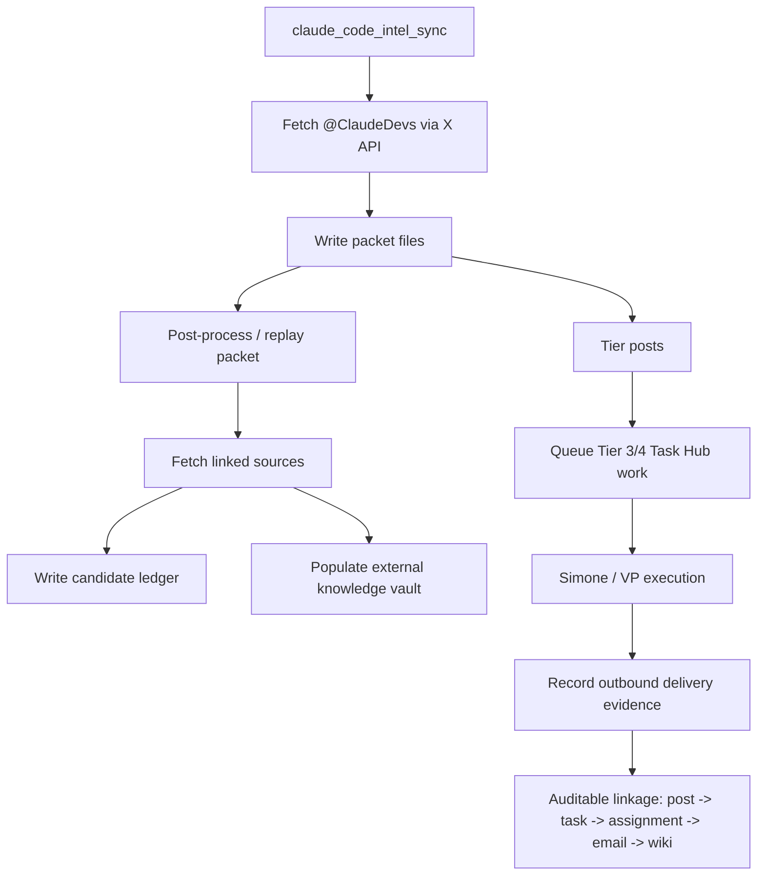

# ClaudeDevs X Intelligence System

## Purpose

This subsystem turns multiple Claude Code–related X accounts (currently `@ClaudeDevs` and `@bcherny`) into a durable intelligence lane for Universal Agent.

It exists to keep the project current on Claude Code changes that are newer than model training cutoffs, then convert those changes into:

- durable packet artifacts
- a Claude Code external knowledge vault
- candidate ledgers tying posts to work and outcomes
- Task Hub follow-up for higher-value updates
- reviewable analyses, migration notes, and implementation plans

## Current Capability

The system can now:

1. Poll multiple configured X handles (`@ClaudeDevs`, `@bcherny`) via the official X API, with per-handle state tracking.
2. Write durable packets under `artifacts/proactive/claude_code_intel/packets/`.
3. Deduplicate by stable X post ID.
4. Classify posts into `digest`, `kb_update`, `demo_task`, or `strategic_follow_up`.
5. Use an LLM-assisted classifier with deterministic fallback.
6. Replay packets idempotently.
7. Fetch direct linked sources in a bounded way and preserve snapshots.
8. Classify linked sources by source type (GitHub repo/file/tree, docs page, vendor docs, event page, X page, non-HTML, generic web).
9. Populate an external Claude Code knowledge vault.
10. Write per-post candidate ledgers with Task Hub, assignment, email, and wiki linkage.
11. Record attachment-based AgentMail delivery evidence so real deliveries can satisfy Task Hub completion verification.
12. Keep new ClaudeDevs cron sessions heartbeat-exempt to avoid reusing the packet workspace as a heartbeat workspace.
13. Clean up historically polluted ClaudeDevs cron workspaces with a dedicated archive utility.
14. Use an LLM-assisted classifier with deterministic fallback and fetched-source summary context.
15. Expose an operator skill surface (`$claudedevs-x-intel`) backed by a deterministic report script that writes `operator_report.md` / `operator_report.json` into each packet and can email artifact links.
16. Route the built-in production ClaudeDevs cron through the report entry point so actionable polling runs automatically send a professional artifact email.
17. Reject browser-gated social shells during linked-source expansion so `t.co -> x.com/twitter.com` redirects do not poison the Claude Code knowledge vault with JavaScript error pages.
18. Expose a dedicated dashboard review surface at `/dashboard/claude-code-intel` backed by a read-only dashboard endpoint for packet history, report links, and vault-page search.
19. Regenerate a rolling 14-day builder brief plus first-class capability bundles after successful runs, then materialize reusable derivatives into a versioned repo library.
20. Track `synthesis_method` (`llm` | `fallback`) in rolling JSON output and display it on the dashboard so operators can see bundle quality at a glance.
21. Log warnings when LLM synthesis fails or is unavailable, instead of silently falling back.
22. Enrich fallback bundles with linked source titles, URLs, and excerpts instead of generic placeholder text.
23. Provide operator trigger controls (`Run Pipeline`, `Rollup Only`) on the dashboard via `POST /api/v1/dashboard/claude-code-intel/trigger`.
24. Support multiple intelligence handles via `UA_CLAUDE_CODE_INTEL_X_HANDLES` env var (default: `ClaudeDevs,bcherny`), with per-handle state files (`state__{handle}.json`) and automatic migration from legacy single `state.json`.
25. Filter Tier 1 digest posts from rolling synthesis (`MIN_SYNTHESIS_TIER = 2`) so personal/community chatter never becomes capability bundles while remaining in packet history.

## Canonical Paths

| Surface | Path |
| --- | --- |
| Packet root | `UA_ARTIFACTS_DIR/proactive/claude_code_intel/packets/` |
| State files (per-handle) | `UA_ARTIFACTS_DIR/proactive/claude_code_intel/state__{handle}.json` |
| Lane ledger root | `UA_ARTIFACTS_DIR/proactive/claude_code_intel/ledger/` |
| OAuth state | `UA_ARTIFACTS_DIR/proactive/claude_code_intel/oauth2/` |
| Lightweight source index | `UA_ARTIFACTS_DIR/knowledge-bases/claude-code-intelligence/source_index.md` |
| External vault | `UA_ARTIFACTS_DIR/knowledge-vaults/claude-code-intelligence/` |
| Rolling current artifacts | `UA_ARTIFACTS_DIR/proactive/claude_code_intel/rolling/current/` |
| Rolling history | `UA_ARTIFACTS_DIR/proactive/claude_code_intel/rolling/history/` |
| Repo capability library | `agent_capability_library/claude_code_intel/current/` |
| Operator skill | `.claude/skills/claudedevs-x-intel/` |
| Operator report script | `src/universal_agent/scripts/claude_code_intel_run_report.py` |
| Dashboard route | `web-ui/app/dashboard/claude-code-intel/page.tsx` |
| Dashboard API (read) | `GET /api/v1/dashboard/claude-code-intel` |
| Dashboard API (trigger) | `POST /api/v1/dashboard/claude-code-intel/trigger` |

## Runtime Flow



## Packet Contract

Each run writes:

- `manifest.json`
- `raw_user.json`
- `raw_posts.json`
- `new_posts.json`
- `actions.json`
- `triage.md`
- `digest.md`
- `source_links.md`

Replay/post-processing adds:

- `linked_sources.json`
- `linked_sources/<hash>/metadata.json`
- `linked_sources/<hash>/source.md`
- `linked_sources/<hash>/analysis.md`
- `implementation_opportunities.md`
- `candidate_ledger.json`
- `replay_summary.json`

## Classification Contract

The system uses four outcome types:

| Tier | Action type | Meaning |
| --- | --- | --- |
| 1 | `digest` | Informational update, low direct implementation value |
| 2 | `kb_update` | Reference/docs/usage/release note update |
| 3 | `demo_task` | Code-worthy or implementation opportunity |
| 4 | `strategic_follow_up` | Migration risk, bug, breakage, or strategic operational issue |

### LLM-Assisted Classification

The classifier now runs in two layers:

1. deterministic fallback
2. optional LLM override

The fallback explicitly downshifts generic community/event posts such as hackathons and application announcements when they lack stronger engineering implications. The LLM layer can further refine this judgment.

## Linked Source Expansion

The system no longer treats the X post alone as the whole source of truth.

For each direct linked source, the replay path now:

- classifies the source type
- fetches the source in a bounded way
- stores fetch metadata
- stores a normalized source snapshot
- writes a first-pass analysis
- ingests the fetched content into the external vault

Guardrail:

- direct `x.com` / `twitter.com` links are skipped up front
- redirects that land on browser-gated `x.com` / `twitter.com` shells are also skipped after fetch classification
- JavaScript-blocked social shells are preserved only as fetch metadata / analysis, not ingested as knowledge pages

Recognized source types include:

- `github_repo`
- `github_file`
- `github_tree`
- `docs_page`
- `vendor_docs`
- `event_page`
- `x_page`
- `non_html`
- `generic_web`

The classifier also uses fetched-source summary/context to refine post classification after fetch/replay, so event/community links can be down-weighted while stronger GitHub/docs evidence can support implementation-oriented routing.

## Candidate Ledger

The per-post ledger is the main audit surface for the subsystem.

Each ledger row can now include:

- post ID and post URL
- tier and action type
- intended source kind and intended task ID
- current Task Hub row and status
- assignment IDs, states, result summaries, and workspaces
- outbound-delivery markers
- email evidence ids from assignment workspaces
- packet artifact id and candidate artifact id
- post source pages
- linked source pages
- work product pages
- combined wiki pages

This is the durable answer to "what happened to this ClaudeDevs post?"

## Delivery Verification

Task Hub completion for email/report-style work is still guarded by outbound-delivery verification.

The key improvement here is that `agentmail_send_with_local_attachments` now records task-scoped delivery evidence during `todo_execution`, so attachment-heavy Claude Code work can complete normally when a real AgentMail send occurred.

## Cleanup Utility

New ClaudeDevs cron sessions are now heartbeat-exempt, so future packet workspaces should stay clean.

Older polluted workspaces can be cleaned with:

```bash
PYTHONPATH=src uv run python -m universal_agent.scripts.claude_code_intel_cleanup_workspace \
  --workspace-dir <AGENT_RUN_WORKSPACES>/cron_claude_code_intel_sync
```

Apply mode:

```bash
PYTHONPATH=src uv run python -m universal_agent.scripts.claude_code_intel_cleanup_workspace \
  --workspace-dir <AGENT_RUN_WORKSPACES>/cron_claude_code_intel_sync \
  --apply
```

The cleanup is conservative. It archives only clearly heartbeat-specific artifacts and leaves mixed transcript/trace/log files in place for forensic integrity.

Status update (2026-04-22): the production `cron_claude_code_intel_sync` workspace has already been cleaned once with this utility. Archived cleanup manifests live under the workspace `archive/claude_code_intel_cleanup_*` directories on the VPS.

## Operator Skill And Report Surface

The operator-facing entry point is:

```bash
PYTHONPATH=src uv run python -m universal_agent.scripts.claude_code_intel_run_report \
  --profile vps \
  --email-to kevinjdragan@gmail.com
```

That command still uses the same underlying sync + replay pipeline, but it additionally writes:

```text
operator_report.md
operator_report.json
```

into the newest packet and can send an email containing HTTPS links to the key packet artifacts.

The built-in production cron now uses the same report entry point instead of the bare sync script. Default behavior:

- if `action_count == 0`, no automatic email is sent
- if `action_count > 0`, the report email is sent automatically
- recipient resolution:
  - `UA_CLAUDE_CODE_INTEL_REPORT_EMAIL_TO` if set
  - otherwise `kevinjdragan@gmail.com` on `UA_DEPLOYMENT_PROFILE=vps`
  - otherwise no automatic email target

## Manual Operator Surface

The new skill is intentionally a manual/on-demand operator surface, not a second autonomous scheduler.

Recommended manual invocation:

```text
$claudedevs-x-intel Run the production ClaudeDevs X intelligence sync, write the operator report summary, and email the results to kevinjdragan@gmail.com.
```

The canonical autonomous scheduler remains the built-in system job `claude_code_intel_sync`.

## Dashboard Review Surface

The dashboard now includes a dedicated Claude Code intelligence page instead of forcing operators to browse raw artifact folders manually.

Current page goals:

- show the latest operator report in a readable panel
- keep recent packet history visible in one place
- expose direct links to packet sub-artifacts
- make the external Claude Code vault searchable by title, summary, and tags

Current route:

```text
/dashboard/claude-code-intel
```

Current read endpoint:

```text
GET /api/v1/dashboard/claude-code-intel
```

That endpoint returns:

- current ClaudeDevs lane checkpoint state
- latest packet summary
- recent packet history
- rolling 14-day narrative brief
- synthesized capability bundles and variants
- vault index/overview links
- knowledge-page records for the external Claude Code vault

## Rolling Builder Brief And Capability Bundles

Successful report runs now also synthesize a rolling 14-day builder brief and capability bundles.

The rolling brief serves two audiences in one artifact:

- `For Kevin` — explanatory teaching layer
- `For UA` — dense adoption package for agent reuse

Capability bundles are generated from recent packet history and linked canonical sources, then materialized into:

- current artifact snapshots under `artifacts/proactive/claude_code_intel/rolling/current/`
- historical snapshots under `artifacts/proactive/claude_code_intel/rolling/history/`
- a versioned repo library under `agent_capability_library/claude_code_intel/current/`

Each bundle preserves:

- bundle-level summary and “why now”
- canonical linked sources
- Kevin-facing explanation
- UA-facing adoption package
- multiple variants when the implementation path is uncertain
- machine-usable primitives such as workflow recipes, prompt patterns, adaptation patterns, and other low-risk derivative assets

## Key Files

| File | Role |
| --- | --- |
| [`claude_code_intel.py`](../../src/universal_agent/services/claude_code_intel.py) | Live X polling, post classification, packet creation, Task Hub queueing |
| [`claude_code_intel_replay.py`](../../src/universal_agent/services/claude_code_intel_replay.py) | Replay, source expansion, ledger writing, vault population |
| [`claude_code_intel_sync.py`](../../src/universal_agent/scripts/claude_code_intel_sync.py) | Cron/script entry point |
| [`claude_code_intel_replay_packet.py`](../../src/universal_agent/scripts/claude_code_intel_replay_packet.py) | Replay/backfill entry point |
| [`claude_code_intel_run_report.py`](../../src/universal_agent/scripts/claude_code_intel_run_report.py) | Operator run + summary + email entry point |
| [`x_oauth2_bootstrap.py`](../../src/universal_agent/scripts/x_oauth2_bootstrap.py) | OAuth2 bootstrap and token refresh |
| [`claude_code_intel_cleanup_workspace.py`](../../src/universal_agent/scripts/claude_code_intel_cleanup_workspace.py) | Historical workspace cleanup utility |

## What Is Still Incomplete

The subsystem is now functionally real, but a few refinements remain:

- richer repo/docs-specific extraction beyond current typed guidance and summary excerpts
- broader end-to-end production validation over more real packets
- optional future promotion of Claude Code knowledge into NotebookLM-backed KB flows if desired

## Related Docs

- [X API And Claude Code Intel Source Of Truth](../03_Operations/118_X_API_And_Claude_Code_Intel_Source_Of_Truth_2026-04-19.md)
- [ClaudeDevs X Intel VPS Runtime Audit](../03_Operations/120_ClaudeDevs_X_Intel_VPS_Runtime_Audit_2026-04-20.md)
- [ClaudeDevs X Intel Implementation Plan](../03_Operations/122_ClaudeDevs_X_Intel_Implementation_Plan_2026-04-21.md)
- [LLM Wiki System](LLM_Wiki_System.md)
- [Proactive Pipeline](Proactive_Pipeline.md)
